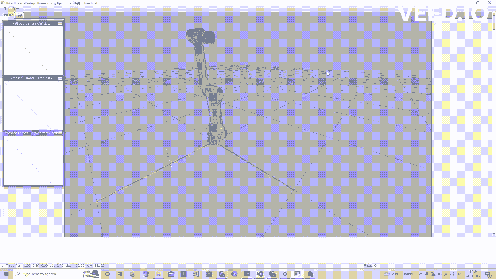
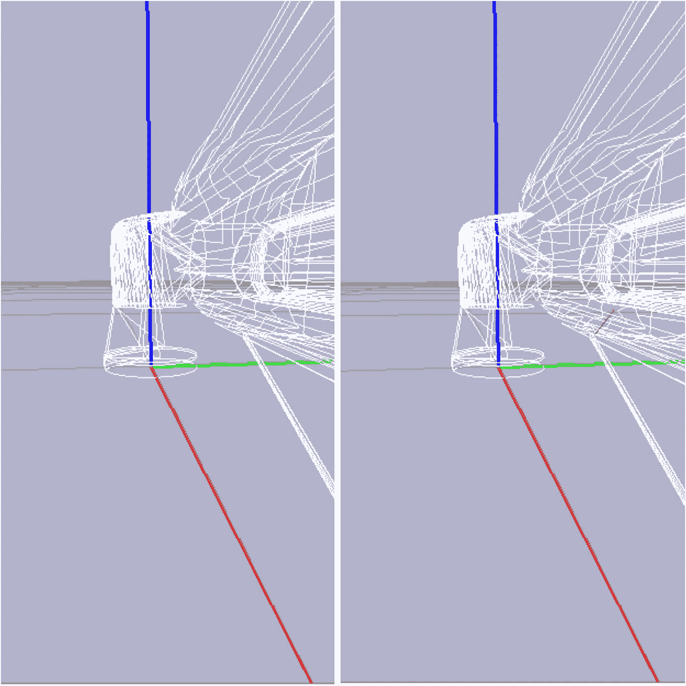

# 在 PyBullet 中工作时必须知道快捷键

> 原文：<https://medium.com/geekculture/must-know-shortcut-keys-while-working-in-pybullet-ff614267fc69?source=collection_archive---------7----------------------->

PyBullet 是一个易于使用的物理模拟引擎，被机器人社区广泛用于进行各种查询，包括碰撞检测、光线相交、正向和反向运动学以及动力学计算。因为它是 Bullet physics SDK 之上的一个包装器，所以它已经成为各种开发活动的一个便利工具。除此之外，它还与 Blender 集成(Kubric ),用于真实模拟，还与 Oculus Rift 和 HTC Vive 等 VR 设备集成，用于实时物理呼叫。这也成为机器人强化学习的主要工具。

作为一个初学者，通过 GUI 界面导航对我来说真的很难，这在开发过程中是至关重要的。慢慢地，我开始了解快捷键，这些快捷键对于从 GUI 界面中导航和检索有用且有见地的数据非常有帮助。在官方文档或许多其他资源中没有一个部分可以帮助我做到这一点。因此，我编写了一个代码来加载 UR5e 机械臂的 URDF 模型，以演示 PyBullet 中各种快捷键的功能。以下是 PyBullet 中有用的快捷键:

**W 键**:-W 键将机器人环境中的所有物体显示为线框模型。这是所有其他键中最重要的，因为大多数其他有用的键只有在线框显示模式中出现或工作。



Toggling between the normal mode and wireframe visualization. (Photo by author)

**一个键:-** 这个键用于可视化包围环境中加载的视觉模型的碰撞框。PyBullet 在红色线框中显示轴对齐的边界框，如下所示:-


Displaying Collision bounding boxes in PyBullet. (Photo by author)

**J :-** 用于显示附着在关节框上的坐标轴。这对于检查关节之间的放置和连接非常有用。


The coordinate axis is displayed whenever the J key is pressed. (Photo by author)

**C 键:-** 按下 C 键将有助于可视化两个或更多碰撞物体之间的接触点。这对于验证碰撞建模是否正确非常有帮助。您甚至可以避免单独绘制接触点来可视化基本碰撞验证。



The Blackline indicates the occurrence of collision between two bodies. (Photo by author)

这四个键是我个人认为对调试各种冲突相关的调用非常有用的。还有许多其他键有助于各种其他模拟和可视化相关的查询。以下代码可用于将 URDF 机器人模型加载到 Pybullet 引擎中，并带有另一个碰撞对象，以进行与碰撞相关的调用。您可以在环境中尝试各种快捷键来检查和感受它是什么样子的。

```
import pybullet as p
import pybullet_data
import numpy as np

p.connect(p.GUI)
p.setAdditionalSearchPath(pybullet_data.getDataPath())
# p.loadURDF("plane.urdf", [0, 0, 0], useFixedBase=True)
Robot = p.loadURDF("add/your/path_to/UR.urdf", [0, 0, 0], useFixedBase=True)
p.resetBasePositionAndOrientation(Robot, [0, 0, 0], [0, 0, 0, 1])

CollisionList_init = [[0.570,0.05,0,1.5,3.5,1,0]] #,[0.600,0,0,1.5,3.5,1,0],[0.700,0,0,1.5,3.5,1,0]]

ConstraintLoadList = []
CollisionLoadList = []

p.setRealTimeSimulation(1)

# for i in range(p.getNumJoints(Robot)):
#     jointInfo = p.getJointInfo(Robot, i)
#     # print(jointInfo,list(range(1,7,1)))

def init_collision(CollisionList):
    for count in range(0,len(CollisionList),1):
        temp_CollisionList = CollisionList[count]
        pos = temp_CollisionList[0:3]
        orient = temp_CollisionList[3:7]

        CollisionLoadList.append(p.loadURDF("add/your/path_to/UR/Collision1.urdf",pos,orient))
        ConstraintLoadList.append(p.createConstraint(CollisionLoadList[count], -1, -1, -1, p.JOINT_FIXED, [0, 0, 0],parentFramePosition=[0,0,0],childFramePosition=pos,childFrameOrientation=orient))

init_collision(CollisionList_init)

while 1:
    Pose = [0,np.deg2rad(0),0,0,0,0] #Change these values to change robot pose

    p.setJointMotorControlArray(bodyIndex=Robot,
                                            controlMode=p.POSITION_CONTROL,
                                            targetPositions=Pose,
                                            jointIndices= list(range(1,7,1)),positionGains=[0.1,.1,.1,.1,.1,.1])

    for count in range(0,len(CollisionLoadList),1):
       cont_pts =p.getContactPoints(Robot,CollisionLoadList[count])

       if(len(cont_pts) > 0):
           print("Collision")
       else:
           print("no collision")
```

这里有几个其他键，您可以在环境中试用，尝试按 F1 连续获得 PyBullet 界面的截图，然后继续按 P 转储当前 PyBullet 引擎的配置文件日志。

# 参考资料:-

1.  项目符号源代码中的热键模块:-[https://github . com/bullet physics/bullet 3/blob/5a e9 a 15 ecac 7 BC 7 e 71 f1 EC 1b 544 a 55135d 7 D7 e 32/examples/example browser/openglexamplebrowser . CPP](https://github.com/bulletphysics/bullet3/blob/5ae9a15ecac7bc7e71f1ec1b544a55135d7d7e32/examples/ExampleBrowser/OpenGLExampleBrowser.cpp)
2.  PyBullet 快速入门:-[https://docs . Google . com/document/d/10sxehzfrsnvfcl 3 xxngnd 4 N2 sed qwdavk 3 dsihxvua/edit #](https://docs.google.com/document/d/10sXEhzFRSnvFcl3XxNGhnD4N2SedqwdAvK3dsihxVUA/edit#)