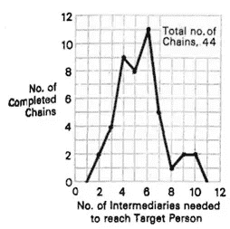
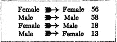
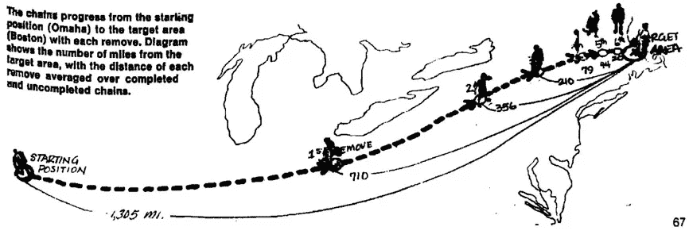

# 必读网络论文:小世界问题

> 原文：<https://medium.com/geekculture/must-read-networks-paper-the-small-world-problem-dc0f843aa4a7?source=collection_archive---------27----------------------->

“天哪，这世界真小，不是吗？”

[http://www.quickmeme.com/meme/3qbsx0](http://www.quickmeme.com/meme/3qbsx0)

# 背景

几乎我们所有人都有过这样的经历:在远离家乡的地方遇到一个陌生人，而这个陌生人恰好和我们是熟人。这种现象被称为小世界问题，首先由美国心理学家斯坦利·米尔格拉姆(1933-1984)研究。随意跳转原文[这里](http://snap.stanford.edu/class/cs224w-readings/milgram67smallworld.pdf)。

这篇论文引起了我的兴趣，因为它的实验背景是发现“社会中的数学结构”,这种结构在历史、社会学和其他学科的许多讨论中起着重要作用。如今，每个人都只需点击几次鼠标，或者互相点赞(这要感谢社交平台)，但持有不同观点的社区比以往任何时候都更加分裂。我们可能需要一点旧的方式来应对新的挑战。

# 实验设置

在这里，我们进入细节。我们把美国人的社交网络抽象为顶点(人)和边(友谊)。重述小世界问题的一种方式是:给定任意两个顶点 A 和 B，从 2 亿个顶点中随机选择，有多少个中间顶点位于 A 和 B 之间的最短路径上？

实现是这样进行的:来自各行各业的人的样本被交给一个作为人 a 的跟踪卡文件夹。每个人应该想到一个更有可能认识目标人 B 的朋友(给出他的位置、工作等)。).他应该在其中一张追踪卡上写字并寄回给作者，然后将剩余的追踪卡连同文件夹一起邮寄到下一个链接。为了让实验更难，作者从两个小镇选择了起始组:堪萨斯州的威奇托和内布拉斯加州的奥马哈，目标人是住在剑桥的学生的妻子。

# 结果

似乎很遥远而且无关紧要，对吧？原来，**只用了两个**中间人就走完了最短路径。最终，中间顶点的数量从 2 到 10 不等，如下所示。

[http://snap.stanford.edu/class/cs224w-readings/milgram67smallworld.pdf](http://snap.stanford.edu/class/cs224w-readings/milgram67smallworld.pdf)

链条上一些有趣的发现:1 .某些类型的交流受到性别角色的强烈制约；2.大多数人倾向于选择熟人和朋友作为下一个联系，而不是亲戚(123 人选择前者，22 人选择后者)；3.170 人中有 44 人完成了，这可能会让人们对最短路径过于乐观(因为其他人可能会因为不认识任何人而放弃)。4.在某些情况下，chains 死在离目标人的房子只有几百英尺的地方。(社交距离比物理距离更重要！)

[http://snap.stanford.edu/class/cs224w-readings/milgram67smallworld.pdf](http://snap.stanford.edu/class/cs224w-readings/milgram67smallworld.pdf)

该论文还陈述了一个有趣的定理:如果两个群体中的两个人不能联系，那么每个人所嵌入的整个群体中的任何人都不能与另一个群体中的任何人联系。这描述了在现代社会中几乎不可能出现的孤立子种群现象。

考虑到我们现在面临的分裂社会，必须有更强有力的证据来塑造当今世界亚人群之间的栅栏。一个快速发现的想法是:属于被强烈排斥的群体的人一定在亚群体中支持相同的叙事，这可以通过在 Twitter 上的某些标签下建立主题模型来分析。

**从 RL 角度的其他想法:**

*   每个中间节点充当一个代理，其目标是:缩短路径的其余部分。
*   中间节点的决策可以通过分析他们最近看的帖子或新闻来研究。
*   链接可能会更短，因为现在代理只知道关于他们网络的有限信息。
*   代理可以在其一级网络中广播，以便在下一个链路上做出更好的选择。

Patterns of a normal chain will be different if introducing the broadcasting method.

— — — — — — — — — — — — — — — — — — — — —

**参考:**

米尔格拉姆，S. (1967)小世界问题。今日心理学，2，60–67 页。摘要:小世界现象存在于许多自组织系统中。