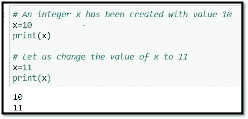
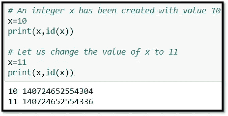
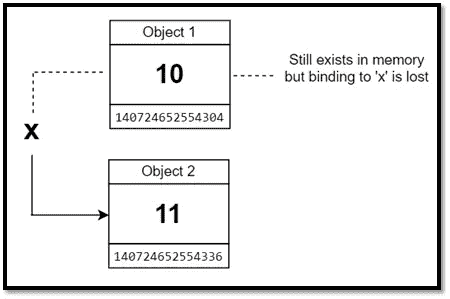
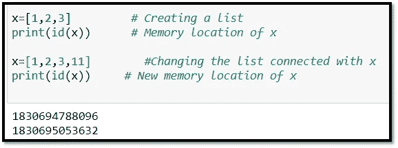
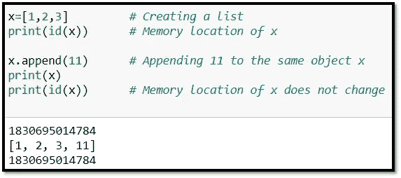

# Python 中的可变性

> 原文：<https://medium.com/geekculture/mutability-in-python-39e483fc9f4d?source=collection_archive---------22----------------------->

永远走过人生，就好像你有新的东西要学，你会的。
——*弗农·霍华德*

作为 Python 初学者，我们遇到的许多重要概念之一是可变性的概念。根据定义:

*一旦创建，其值可以改变的对象是可变对象。例如列表、字典、集合等。*

*一旦创建，其值就不能改变的对象是不可变对象。例如字符串、整数、浮点、元组等。*

听起来很简单？是的。

清醒？号码

所以下面是我试图用非常简单的例子来解释它。

**不可变对象**。

Image 1

整数是不可变的对象。我们创建了一个整数 x=10，后来又把它改为 11，从图 1 的输出中可以明显看出，这种改变似乎已经发生了。但是如果整数是不可变的，不应该改变，为什么会改变呢？要回答这个问题，我们必须使用函数 id()来查看 x 的内存位置

Image 2

图 2 清楚地显示了内存位置的不同。值为 10 的对象仍然在同一个内存中，没有变化。值为 11 的对象位于一个全新的内存位置。这里的“x”只是一个名字，与内存位置无关(不像其他一些编程语言，变量名附加在内存位置上)。它就像一个句柄/轴，最初连接到值为 10 的对象，然后断开连接，并与值为 11 的对象形成绑定。旧的装订丢失了。这就是不变性的含义。对象的值一旦被创建就不能在同一个位置/存储器中被改变。下图可能有助于更好地理解这个概念。

Image 3

还要注意，值为 10 的对象 1 仍将保留在内存中，但 python 解释器稍后会删除它，内存将再次被释放以供重用。这个过程被称为“垃圾收集”。

**可变对象**

现在让我们看一个可变数据类型列表的例子。当我们切断它与原始对象位置的绑定，并用一个不同的位置重新绑定它时，可变变量也可以表现得像不可变变量一样，如图 4 所示。内存位置会改变，就像不可变对象的情况一样。

Image 4

因此，如果我们想保留列表、集合、字典等对象的可变属性。并确保对相同的原始对象进行更改，而不是在不同的位置创建一个全新的对象，我们必须使用特定于可变对象的操作，如 append()、insert()、extend()等。让我们看一个使用 append()的例子。append 函数只是将元素‘11’添加到已经存在的对象 x 中，而不是创建一个新的对象。这从 x 的存储位置在改变后没有改变的事实中是明显的。这是可变性的属性。图 5。

Image 5

还要注意，set 是一个数据类型，它本身是一个可变对象，但是 Set 中的元素只能是不可变的。所以一个集合可以有整数，字符串，浮点数等等。但不能有列表和字典。

希望这些简单的例子能帮助你更好地理解可变性。

保重，继续学习。