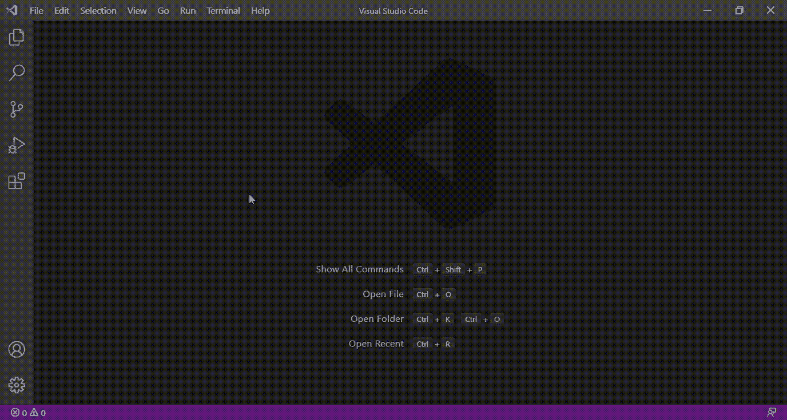
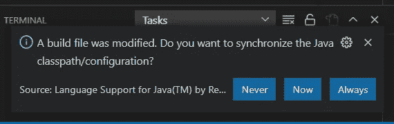
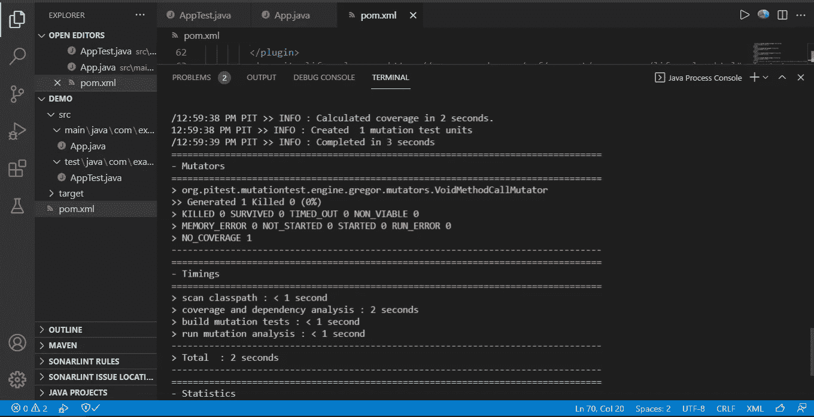
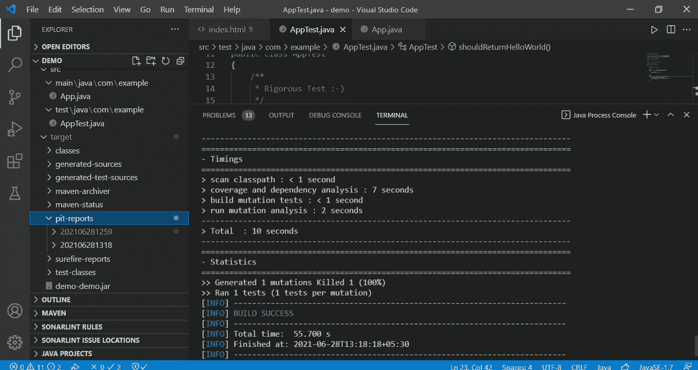
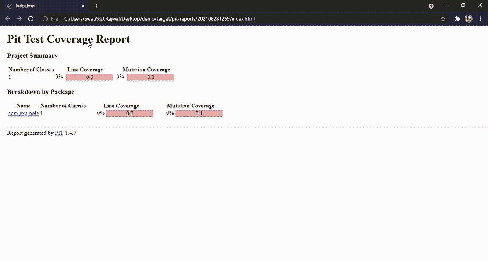
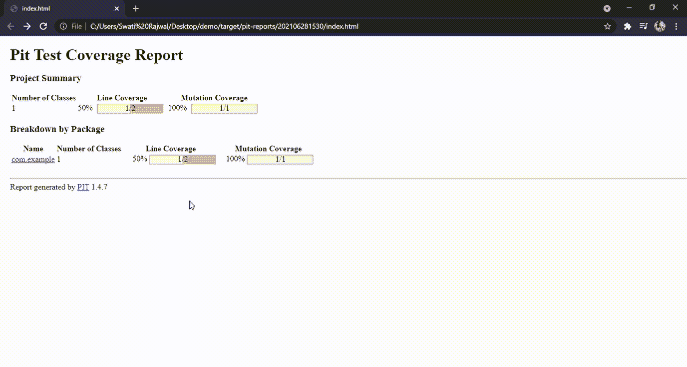

# 使用 Pitest (PIT)对 Maven 项目进行突变测试

> 原文：<https://medium.com/geekculture/mutation-testing-for-maven-project-using-pitest-f9b8fef03a05?source=collection_archive---------13----------------------->

## 使用 pitest 测试工具为基本 Java 项目的突变测试设置您的系统。


Image Credits: [testbytes](https://pixabay.com/users/testbytes-1013799/) from [Pixbay](https://pixabay.com/)

# 范围

在这篇博客中，我们将首先介绍如何设置您的系统来运行突变测试。一个众所周知的叫做 Pitest 或 PIT 的工具将贯穿本文。从那以后，我们还将看到如何增加突变覆盖率得分。

# 先决条件

*   你应该知道突变测试的理论概念。如果你想了解突变测试，请查阅[1]。
*   Java 应该安装在您的系统上。如果你需要任何帮助，请查看[2]关于设置。在本文中，Visual Studio 代码被用于编辑和运行代码。不过，您可以选择自己喜欢的编辑器。
*   确保 [maven](https://maven.apache.org/download.cgi) 设置在你的系统路径中。如果你面临任何错误，我强烈建议你查看[这个](https://stackoverflow.com/questions/17432809/mvn-is-not-recognized-as-an-internal-or-external-command-operable-program-or) StackOverflow 答案。

# 创建一个 Maven 项目

1.  打开 VS 代码
2.  按 Ctrl+Shift+p
3.  然后选择“java:创建 java 项目”→“Maven，由 Maven 为 Java 提供”→“Maven-原型-快速启动”→选择一个版本
4.  继续操作并提供您选择的包名，然后等待项目被创建。
5.  供参考，下面找 GIF 1 了解上述步骤。



GIF 1: Creating a Maven Project in Visual Studio Code

# 运行您的项目

1.  此时，您应该确保代码正确运行。
2.  确保你的默认 java 程序(App.java 和 AppTest.java)已经启动并运行。

# 向项目添加 Pitest

1.  暂时导航到 [Pitest](https://pitest.org/) 网站。它将向您简要介绍这个工具的作用。
2.  由于这个博客将会涉及 maven 的突变测试，我们将使用 [this](https://pitest.org/quickstart/maven/) 链接来复制代码，如下面的代码片段所示。还要注意，在撰写本文时，1.5.0 是最新版本。
3.  将这段代码粘贴到项目目录下的 ***pom.xml*** 文件中。

```
**<plugin>**
    **<groupId>**org.pitest**</groupId>**
    **<artifactId>**pitest-maven**</artifactId>**
    **<version>**1.5.0**</version>**
 **</plugin>**
```

# 运行 Pitest 插件



Figure 1: Automatic pop-up after pom.xml is updated

1.  对 pom.xml 进行必要的修改后，可能会自动要求您构建 xml 文件。选择“现在”,剩下的将由您的智能插件处理(图 1)。
2.  理想情况下，pitest 插件应该在项目的插件目录下可见。但对我来说，这并没有发生。
3.  转到 VS 代码中的命令行，键入`mvn install`来编译您的项目。
4.  运行 PIT 后，使用以下命令:

```
mvn eu.stamp-project:pitmp-maven-plugin:run
```

5.输出将如下面的图 2 所示。



Figure 2: After running Pitest command for mutation testing

# 了解输出

如果看到目前为止的输出，肯定不太好理解。幸运的是，当我们运行上面的代码时，在项目目录中创建了一个名为“target”的文件夹。在那里你可以找到“pit-reports”文件夹，你所有的跑步记录都会保存在里面。



Figure 3: Every time you run the Pitest, more folders will be created under “pit-reports” as shown on the left-hand side of the picture.

转到“维修站报告”文件夹，找到最新的运行文件夹。在该文件夹下，在你的网络浏览器(Chrome、Firefox、Edge 等)中打开“index.html”文件。).你会看到类似 GIF 2 的东西。注意*浅粉色*表示缺少线条覆盖，*深粉色*表示缺少突变覆盖。



GIF 2: Mutation test report generated by Pitest for your default (hello world) maven project

# 增加突变覆盖率得分

根据上面生成的报告，我们观察到线覆盖率和突变覆盖率是 0%。这是预料中的行为，因为 App.java 和 AppTest.java 的文件是最基本的，不包括任何会杀死突变体的东西(再次，确保你知道突变测试的理论概念)。

在您的 App.java 文件中写下以下内容:

```
public class App{public static String hello(){ //simply returns "Hello World"
return "Hello World";
}public static void main( String[] args) {
App.hello();    //calling hello() method
}}
```

修改您的 AppTest.java 文件以测试断言的值，如下所示:

```
package com.example;
import static org.junit.Assert.assertEquals;
import static org.junit.Assert.assertTrue;
import org.junit.Test;public class AppTest {@Test
public void shouldAnswerWithTrue()
{
assertTrue( true );
}**@Test      //new test case added
public void shouldReturnHelloWorld(){
String value = App.hello();
assertEquals(value, "Hello World");
}**
}
```

现在像以前一样运行 pitest 并观察 HTML 测试报告。



GIF 3: Mutation coverage score increased to 100% after adding new test cases

*浅绿色*表示线条覆盖，*深绿色*表示突变覆盖。注意突变分数是如何从 0 增加到 100%的。线路覆盖率也提高到了 50%。在接下来的教程中，我们将看到一个相对复杂的问题，并致力于增加线和突变的覆盖范围。

# 结论

在本教程中，我们学习了如何在 maven 项目中集成 pitest (PIT)。我们还看到了如何生成非常方便的突变测试报告。PIT 对于提供自动化突变体是有用的，因此我们可以专注于提高单元测试用例的质量，这将为突变覆盖率提供更高的分数。这将识别代码中更易受攻击的部分。

还有，你可以在 [Twitter](https://twitter.com/SwatiRajwal) 和 [LinkedIn](https://www.linkedin.com/in/swati-r-84682b12b/) 上问我一个问题！

# 参考

[1]龙格塔，K. (2021 年 5 月 10 日)。*软件测试中的变异测试:变异得分&分析实例*。古鲁 99。[https://www.guru99.com/mutation-testing.html](https://www.guru99.com/mutation-testing.html)

[2]拉杰瓦尔，S. (2021 年 6 月 10 日)。*软件测试:简单 Java 程序的单元测试用例*。中等。[https://medium . com/geek culture/unit-testing-of-simple-Java-programs-b785a 164 b 440](/geekculture/unit-testing-of-simple-java-programs-b785a164b440)

[3]未注明日期。邮票-项目/pitmp-maven-插件。GitHub。于 2021 年 6 月 28 日从[https://github.com/STAMP-project/pitmp-maven-plugin](https://github.com/STAMP-project/pitmp-maven-plugin)检索