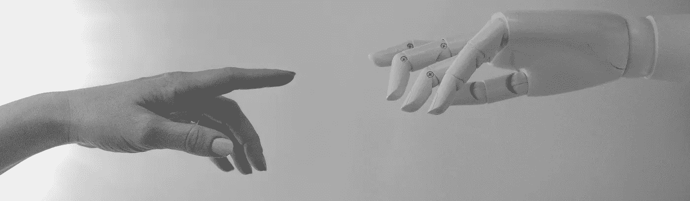
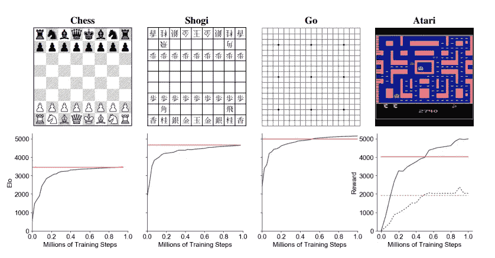
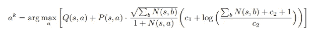
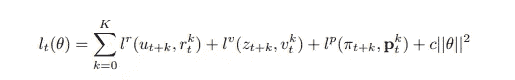

# 超人算法:穆泽罗解释

> 原文：<https://medium.com/geekculture/muzero-explained-a04cb1bad4d4?source=collection_archive---------18----------------------->

## 不知道规则就赢的算法

# **前言**

MuZero 是谷歌 DeepMind 开发的一种强化学习算法。它是著名的 AlphaZero 算法的继承者，其性能不亚于超人。该算法能够实现比谷歌开发的所有其他强化学习算法更好的性能，并且在不知道游戏规则的情况下这样做！在 DeepMind 发布的【2019 年原始论文中，该算法显示在国际象棋、围棋、围棋和几款雅达利游戏中以相当大的优势击败了人类和 AlphaZero。人工智能的兴起以及小说和非小说中围绕它的几种理论，可以说已经使它成为计算领域讨论最多的领域之一；尤其是谷歌发布新的机器学习算法的时候。

Evaluation of MuZero throughout training in chess, shogi, Go and Atari. The x-axis shows millions of training steps. For chess, shogi and Go, the y-axis shows Elo rating, established by playing games against AlphaZero using 800 simulations per move for both players. MuZero’s Elo is indicated by the blue line, AlphaZero’s Elo by the horizontal orange line. For Atari, mean (full line) and median (dashed line) human normalized scores across all 57 games are shown on the y-axis and the orange is the performance of R2D2

# 介绍

MuZero 被描述为强化学习规划算法。规划算法依赖于对环境动态的了解，如游戏规则或模拟器——因此它阻止了它们在现实世界中的使用，因为在现实世界中没有模拟器来准确预测下一个状态。然而，MuZero 是一种基于模型的强化学习算法，旨在解决环境不可预测性的问题，并能够在这种情况下进行规划。MuZero 在基于模型的强化学习中使用了一种新方法来规划和解决视觉复杂环境中的问题。AlphaZero 的继任者 MuZero 算法遵循 AlphaZero 的许多类似方法，但一个关键的区别是使用学习模型来改善其训练系统。此外，它能够在三个神经网络的帮助下实现精确规划和预测未来的能力，而不像它的前身 AlphaZero 只使用一个神经网络

MuZero 算法旨在准确预测其认为对规划很重要的未来特征和细节。该算法最初接收输入，例如国际象棋棋盘的图像，其被转换成隐藏状态。隐藏状态然后基于先前的隐藏状态和提议的后续行动计划经历迭代。每当隐藏状态被更新时，该模型预测三个变量:政策、价值函数和直接奖励。政策是下一步要下的棋，价值函数是预测的赢家，直接的回报是棋的力度(如果它提高了玩家的位置)。然后训练该模型以准确预测上述三个变量的值。本节将使用研究论文提供的伪代码来突出兴趣点，并详细解释一些代码，任何对函数和类的提及都与伪代码有关。伪代码可以在这里找到[。](https://arxiv.org/src/1911.08265v1/anc/pseudocode.py)

MuZero 算法不接收任何游戏规则，例如在国际象棋游戏中，该算法不知道合法的移动或什么构成赢、平或输。它没有这些规则的概念，所以它的目标是创建一个游戏的隐藏表示。这可以被认为是 MuZero 创建了它实际正在玩的游戏的迷你游戏。坚持以国际象棋为例，MuZero 可能会了解到，通过在棋盘中央开发棋子，它可以对棋盘进行更多的控制，因此它会使用隐藏状态表示来实现这一结果。关于游戏的隐藏表示，另一个要提到的关键点是，MuZero 只在游戏结束时收到其行为的奖励，无论是赢、平还是输。然而，在学习期间，MuZero 会根据自己在迷你游戏中的表现定期获得奖励。本质上，MuZero 能够根据自己对游戏的描述来评估自己在游戏中的表现，这可以被看作是 MuZero 为自己创造规则；因为它从未被赋予规则。

MuZero 通过与自己对抗几次并记录游戏数据来生成游戏数据，以便在训练中使用。这允许算法改进其神经网络，因为它们可以访问游戏数据、游戏的隐藏表示以及结果等。神经网络的训练和改进使 MuZero 玩得更准确，产生更多的游戏数据，这种反馈循环不断发生，使 MuZero 和它的神经网络随着时间的推移而改进。

# 2.2.3 穆泽罗的两个部分

当从高层次的角度检查 MuZero 算法时，可以认为它有两个关键组件，自玩和训练，分别用于生成游戏数据和训练神经网络。两者一起工作来提高算法的性能。这两个组件都可以访问 replayBuffer 和 sharedStorage 对象，以便存储生成的游戏数据和存储神经网络的先前迭代。共享存储对象的目的是存储不同版本的神经网络，以及能够检索最新的神经网络。另一方面，replayBuffer 对象的主要用途是用来存储以前游戏的数据。因此，让这两个物体都变得可访问，对于提高自我游戏和训练是至关重要的。

# 自我游戏和 play_game 功能

self-play 函数负责玩指定的游戏，例如与自己下棋，并将生成的游戏数据保存到 replayBuffer 对象中。需要指出的是，MuZero 将运行几个 self-play 实例，每个实例将使用最新的神经网络独立运行，然后每个实例将游戏数据保存到 replayBuffer。

play_game 函数通过将游戏初始化到其初始状态开始，例如对于井字游戏，一个空白的 3x3 网格。然后，它试图利用蒙特卡罗树搜索找到最佳的下一步行动。重复这个过程，直到满足终止条件，例如在国际象棋中被将死，或者当移动次数超过允许的最大移动次数时。

# 穆泽罗的蒙特卡罗树搜索

蒙特卡洛树搜索从根节点开始，其中节点存储各种信息，例如轮到谁玩、节点被访问的次数、节点的子节点和候选移动的预测奖励以及其他信息。play_game 函数返回游戏的当前状态，然后开始扩展根的过程，其中探索噪声被添加到扩展的根，以便确保考虑更多的选项，而不仅仅是当前探索的一个。由于 MuZero 不知道游戏环境的法律规则，也不知道在学习和寻找最佳走法的过程中它可能得到的回报，所以它使用了一个名为 MinMaxStats 的对象。MinMaxStats 对象存储当前遇到的最大和最小奖励，这允许 MuZero 调整其奖励值。蒙特卡洛树搜索过程通过运行 N 次模拟来决定一个动作，N 次模拟总是从根节点开始，并根据给定的 UCB 公式沿树向下遍历，直到探索到没有子节点的节点。

以上是 MuZero 用于标准化行动估计值的 UCB 评分公式，它还考虑了探索偏差以及行动之前被选择的次数(Schrittwieser 等人，2020 年)。一旦它探索了树，动作的预测值必须被反向传播。访问次数最多的动作被选为最佳移动。这是因为该算法探索各种不同的移动，因此，如果一个动作被重复访问，它必须是给定位置的最佳移动。

# 训练和损失函数

MuZero 的训练是使 MuZero 独特的另一个关键方面，函数 train_network 通过使用 replayBuffer 重复训练神经网络。该功能还包括梯度下降优化器，它定期更新权重以保持相关性。train_network 函数的工作原理是循环训练步骤的总数，默认情况下设置为一百万。然后，该函数在每一步对一批数据进行采样，并使用这些数据来更新神经网络。更具体地说，训练批次是通过使用 replayBuffer 类中的 sample_batch 函数创建的，批次包含一个元组列表。一批中的元组是:游戏的当前状态，从当前位置采取的动作列表，以及最后用于训练神经网络的目标。通过使用时间差分(TD)学习来计算用于训练神经网络的目标。TD 学习背后的关键概念是使用先前以动态方式收集的数据来更新状态的预测。本质上，在 TD 学习中，估计被用来更新未来的估计，这被称为自举。MuZero 的损失函数负责如何更新神经网络的权重。下面是穆泽罗使用的给定损失函数

在上面的公式中:k 用于表示在给定状态后采取的步骤数，lr、lv 和 lp 分别是奖励、价值和政策的损失函数。损失函数有三个主要目的:

1.  最大限度地减少预测奖励和实际收到的奖励之间的差异。
2.  将预测值优化为从 TD 学习中得出的目标值。
3.  以减少预测策略和目标策略之间的差异。为了更新 MuZero 中的权重，MuZero 使用初始推理和递归推理。初始推断的作用是提供一个给定国家的当前政策、价值和奖励的初始观察。这些然后被用来创建一个预测。然后，MuZero 利用递归推理来预测下一个政策、价值和奖励。当与政策、价值和回报的目标值相比较时，这些预测然后被用于计算损失。

为了更新 MuZero 中的权重，MuZero 使用初始推理和递归推理。初始推断的作用是提供一个给定国家的当前政策、价值和奖励的初始观察。这些然后被用来创建一个预测。然后，MuZero 利用递归推理来预测下一个政策、价值和奖励。当与政策、价值和回报的目标值相比较时，这些预测然后被用于计算损失。

# 算法概述

MuZero 算法有很多活动的部分，这需要对人工智能中的不同领域有很多深入的理解。该算法的性能优于其前身 AlphaZero，尽管它收到的真实环境信息较少，如游戏规则或合法举措。利用自我游戏和训练这两个关键因素，可以取得更好的效果。自我游戏利用三个神经网络来创建游戏的隐藏表示，并使用这个新环境来学习和使用蒙特卡罗树搜索来找到最佳移动。MuZero 的训练是通过使用 replayBuffer 来完成的，replay buffer 存储以前玩的游戏的数据，并使用这些数据来训练 MuZero 的神经网络，同时使用 TD 学习和它独特的损失函数来不断实时更新权重。

虽然 MuZero 算法能够在国际象棋中胜过 alphaZero，但该算法的行为并没有被完全理解。MuZero 能够利用隐藏状态表示，并将其用于寻找更好的移动，这无疑是算法性能的优势；然而，这使得该算法难以预测和分析以进一步优化其性能。该算法的行为可以被认为是一个黑盒，其中隐藏状态和深层神经网络的计算是未知的。因此，对算法的度量和性能进行分析，例如:解决一个问题所需的最佳迭代次数或所需的最佳神经网络数量，是极其困难的。MuZero 也是一种计算量非常大的算法，对其进行实验可能会非常耗费计算量，这使得对其进行研究非常困难。这些因素会使对算法的任何研究和分析变得相当困难。

本文仅供参考，仅代表我个人观点。