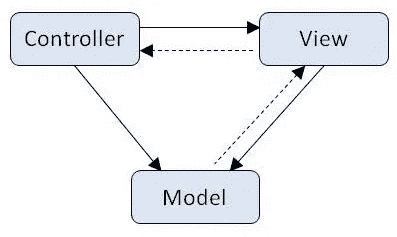

# 带有 Express Server 的 MVC 架构

> 原文：<https://medium.com/geekculture/mvc-architecture-with-express-server-e35aedfe7889?source=collection_archive---------22----------------------->

构建 MERN 应用程序后端



photo credit: [critical technology](http://criticaltechnology.blogspot.com/2011/09/mvc-in-three-tier-architecture.html)

## MVC 概述

当开始一个新项目时，有几种不同的方法可以用来设置整个文件结构和流程。最常用的架构模式之一叫做 MVC。这是模型、视图、控制器的缩写。

这种模式之所以受到青睐，是因为它符合计算机科学的设计原则，即[关注点分离](https://en.wikipedia.org/wiki/Separation_of_concerns)。通过在我们的文件结构中划分职责，我们可以通过抽象来封装要引用的信息，并维护更干净的代码库。

MVC 结构通过让模型负责我们的应用程序所使用的数据来分离关注点，而控制器则处理接收 HTTP 请求所需的业务逻辑，并在包含 UI 实现的视图显示数据之前对数据进行必要的操作。

您的应用程序的文件结构应该如下所示…

```
app-name-here
 |- controllers
 |- db
 |- models
 |- node_modules
 |- views
.gitignore
index.js
package.json
package-lock.json
```

## 猫鼬设置(模型)

虽然我们可以单独使用 MongoDB，但是 Mongoose 为我们提供了一个额外的方法层，可以用在数据库中创建的对象上。要使用 Mongoose，我们需要通过运行以下命令进行安装:

```
npm i mongoose
```

然后，我们可以通过在 db 文件夹中创建 connection.js 文件来连接到数据库。确保在文件的顶部需要 mongoose。

```
const mongoose = require('mongoose')
```

然后定义数据库 URI。它应该指向一个. env 文件中的秘密变量，并根据您是在生产环境中运行还是在开发环境中运行来动态分配。

```
const URI = 
process.env.NODE_ENV === 'production'
//if in production use this URI
? process.env.DB_URL
//otherwise use this
:'mongodb://localhost/app_name_here';
```

最后，您希望使用 mongoose 连接方法。这需要两个参数，数据库 URI 和可选配置的对象。

```
mongoose.connect(URI, {
  useNewUrlParser: true,
  useCreateIndex: true,
 //continue with any other options here
})
```

补充一下很有帮助。然后()和。catch()函数在这个 connect 方法之后运行，以确认它工作正常。不要忘记在文件底部导出 mongoose，以便能够在需要的地方导入它。

```
module.exports = mongoose
```

## 设置模式和模型

在模型文件夹中，按照以下约定创建一个文件:model-name-here.js。

这个文件将包含我们的模式定义和模型的预期字段。这里有一个例子。

```
const mongoose = require('mongoose')const userSchema = new mongoose.Schema ({ name: { type: String, required: true, trim: true}, email: { type: String, required: true, unique: true, lowercase: true, }, password: { type: String, required: true, trim: true }, {timestamps: true})const User = mongoose.model('User', UserSchema);

module.exports = User;
```

现在我们可以加载一些测试数据并检查它。您需要创建一个文件来保存 JSON 对象的数组，其中包含您的模式需要的所有字段，还需要创建另一个文件，其中包含删除任何现有数据和从。json 文件。这些文件也将保存在 db 文件夹中。

```
//userSeeds.json[ { "name": "John", "email": "john@example.com", "password": "123ffedead" }, { "name": "Joey", "email": "joey@example.com", "password": "123fffeaedead" }]//userSeeds.jsconst User = require('./models/Users')const seedData = require('./userSeeds.json') User.deleteMany({}) .then(() => { return User.insertMany(seedData) }) .then(console.log(seedData)) .catch(console.error) .finally(() => { process.exit() })
```

运行节点。/db/userSeeds.js 来加载数据。您应该在终端中看到种子数据，但是您也可以在 mongo shell 中运行 db.users.find()来确认它被插入。

## 创建服务器(和控制器)

为了让一切正常运行，让我们讨论一下如何创建一个 express 服务器，然后添加一些控制器来定义我们的 UI 所需的路径和方法。

顶层目录中的 index.js 文件是我们设置所有这些的地方。当然我们需要先要求快递。之后，我们可以为我们的模型和我们想要运行的端口创建一个变量。最后，我们需要使用。listen 方法，第一个参数是端口，第二个参数是一个回调函数，表示它正在运行。

```
//index.js

const express = require('express');
const app = express();

// Require User model
const User = require('./models/user.js');

// Define a port variable
const port = process.env.PORT || 5000;

//Run the server
app.listen(port, () => {
  console.log(`App running on port ${port}`);
});
```

此时，运行 npm run index.js 应该会启动服务器，您应该能够从。终端中的监听方法。

现在我们需要包含一个控制器来定义在给定的端点应该返回什么数据。按照 MVC 结构，我们将把这个逻辑添加到 controllers 文件夹中的一个文件中。我们需要 express 和模型文件，并添加一个运行 express.Router 的路由器变量。

为了获取所有用户对象，我们可以设置一个指向 todos/index 的控制器，并为我们提供所有用户。在下面的示例代码中，您会看到。find 方法有一个空对象作为参数。不定义特定的标识符允许返回所有用户。

```
//controllers/users.jsconst express = require('express');
const router = express.Router();const User = require('../models/user.js')router.get('/users', (req, res) => {
 User.find({})
  .then((users) => {
    res.render('users/index', {users});
  })
  .catch(console.error)
})
```

因为我们现在有一个单独的用户控制器文件，所以我们需要调整 index.js 文件。我们可以用用户控制器需求替换用户模型需求，并添加一个方法来告诉应用程序在索引路径时使用控制器。

```
//index.js

const express = require('express');
const app = express();

// Require User controller
const userController = require('./controllers/user.js');

// Define a port variable
const port = process.env.PORT || 5000;

//Run the server
app.listen(port, () => {
  console.log(`App running on port ${port}`);
});//Use the User controller at the /users path
app.use('/users', userController)
```

## 准备用户界面(视图)

快好了！最后一步是在 views 文件夹中定义我们需要的视图文件。这些文件需要一些 HTML 来显示浏览器中的数据。

我们可以使用一个名为 Handlebars 的库来迭代 HTML 代码中的对象。运行 npm i hbs 来安装这个依赖项，并将下面一行添加到 index.js 文件中，使它在整个应用程序中都可用。

```
app.set('view engine', 'hbs')
```

我们用#each 表示迭代的开始，用/each 表示结束。所有利用手柄的文件都需要。文件名末尾的 hbs。

坚持上面的例子，我们可以为所有名为 users 的用户视图创建一个子文件夹，并在该文件夹中创建一个名为 index.hbs 的新文件

```
//views/users/index.hbs
<h1>All Users</h1>
<ul>
  {{#each users}}
  <li>
    <div>{{this.name}}</div>
  </li>
  {{/each}}
</ul>
```

使用 RESTful 路由约定，您还可以设置显示、新建、创建、编辑、更新和/或销毁操作，以及它们自己的视图。

## 概述

如果你还和我在一起，干得好！我们在这里讨论了很多内容，从回顾 MVC 架构到获取模型、控制器和视图并在 express 服务器上运行。我希望这是有价值的，你能够将这一点纳入未来的项目。一如既往，我鼓励您继续钻研文档。查看 MongoDB、Mongoose 和 Express 指南，以便更好地理解这些概念和其他示例。下次见，编码快乐！