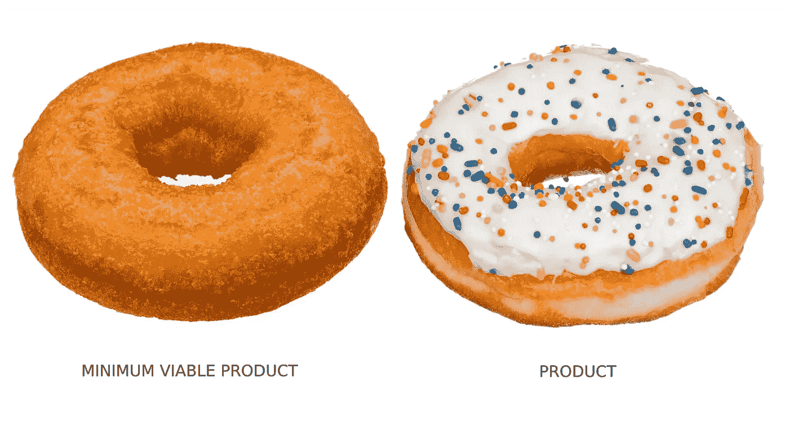

# MVP 软件开发:什么，为什么，以及如何

> 原文：<https://medium.com/geekculture/mvp-software-development-what-why-and-how-23c389fe2f20?source=collection_archive---------19----------------------->

2021 年，最低可行产品(MVP)标志着其概念推出 20 周年。

其教父 SyncDev 首席执行官 Frank Robinson 将其定义为“大到足以引起采用、满意和销售，但又不会大到臃肿和有风险”的产品，MVP 概念在几年后由 Eric Ries 带入主流。在他的《精益创业》这本已经成为 MVP 圣经的书中，他描述了如今众所周知的 MVP:

**软件开发中的 MVP 是*“一个新产品的版本，它允许一个团队以最少的努力收集关于客户的最大量的经验教训”*。**

从那时起，MVP 已经成为基于迭代和改进产品的敏捷软件开发过程中不可或缺的一部分。许多热门应用首先以 MVP 的形式发布:Snapshot、Dropbox、Instagram、Airbnb 和脸书，仅举几例。

你应该效仿吗？

让我们找出答案。

在本指南中，我们将详细了解软件开发中的 MVP 是由什么组成的，为什么需要它，以及如何构建一个伟大的 MVP。开始吧。

# 关于 MVP 的快速事实

1.  软件开发中的 MVP 是一种构建具有最少基本功能的产品早期版本的方法，该产品被投放到市场或放在用户面前，以检查产品如何满足需求，并收集反馈以进行改进。
2.  MVP 是测试创业公司和致力于创新解决方案的企业的假设的完美方式( [AI](https://itrexgroup.com/services/artificial-intelligence/) ， [RPA](https://itrexgroup.com/services/robotic-process-automation/) [，](https://itrexgroup.com/services/artificial-intelligence/) [大数据](https://itrexgroup.com/services/big-data/)等)。)
3.  MVP 不是发布一个半成品给用户测试。
4.  MVP 不是原型或概念证明。
5.  没有编码技能也能构建 MVP。

# 那么到底什么是 MVP 软件开发呢？

# MVP 的关键特征

1.  **MVP 拥有用户所需的最小功能集。这是一个小而简单的产品，所有的绒毛都是在以后的迭代中添加的。以 Tinder 的早期版本为例，它缺乏当前的大部分功能，甚至是其标志性的向右滑动功能。相反，用户点击“心”或“x”来表示同意或不同意。或者拿 Snapchat 来说。该应用程序最初只是拍摄一张照片并将其发送给另一个用户，之后这张照片就消失了。**
2.  MVP 是可行的。这是一种可以用来完成特定任务的产品，人们愿意为此而使用它。放大上面的例子，Snapchat 使即时分享照片而不存储照片成为可能，而 Tinder 创建了一个超级简单的注册过程，而大多数约会应用程序都要求用户回答冗长而无聊的问题。

我们来看一个在网上流传多年的热门 MVP 例子:

图中的 MVP 是一个完整而简单的产品，可以“照原样”使用。蛋糕烤得很完美(希望很好吃),即使没有稍后会添加的糖霜和糖屑。

这一点现在应该清楚了。让我们继续前进。

MVP 软件开发与概念证明和原型有什么不同？

# MVP 软件开发 vs. PoC vs .原型

**概念验证**或 PoC 通常是在生产前阶段作为内部项目开发的。它的目的是从技术角度验证一个想法是可行的，可以变成现实。

**原型**是产品概念的视觉表现，其目的是在产品前期测试可用性或向投资者推销。原型通常包括显示用户如何与界面交互的屏幕。它是可点击的，通常是交互式的，但不一定是功能性的。

MVP 通常是一个完整的、高质量的功能性产品，有助于发现市场契合度，即人们是否想要该产品，以及最终是否愿意为此付费。

# 为什么要建立 MVP

MVP 最初是为初创公司设计的，现在也作为敏捷方法的一部分广泛应用于企业项目中。

MVP 软件开发在这两种场景中带来的价值是巨大的。它有助于:

*   测试产品是否解决了它应该解决的问题
*   确保对它有(市场)需求
*   从用户那里了解他们最重视什么，以及他们希望看到什么变化
*   以更快的速度和更少的预算发布产品(可能会超过有类似想法的潜在竞争对手)
*   如果这个想法行不通，在大规模的市场推广上节省金钱和时间
*   扩大预发布用户群

对于很多创业公司来说，MVP 软件开发是最好的上市策略。投资者希望看到销售额，而不仅仅是一个只有想法的初创公司。使用有效的 MVP 筹集资金的机会比使用缺乏用户增长率、MRR 和其他经过现场测试的产品指标的宣传材料要高得多。条款也更好。

# 如何进行 MVP 软件开发

# 第一步。定义你的产品应该解决的问题

无论你是创业公司还是企业，你的产品都应该帮助用户解决一个他们非常想解决的问题。在着手 MVP 软件开发之前，您需要一个强大的价值主张，包括以下三个要素:

1.  有特定需求的特定受众
2.  你的产品将解决它的方式
3.  观众将获得的利益

这是极其重要的。根据 CB Insights 的调查，三分之一的创业公司失败是因为没有人想要他们的产品。

# 第二步。研究竞争

进行彻底的市场调查对于了解直接和间接竞争对手在利基市场中能提供什么是至关重要的。每天都有几十种产品发布，你的想法可能并不那么独特。也可以有替代产品。

对于初创公司来说，评估市场规模以确保有足够多的潜在客户愿意为他们的产品花钱是很重要的。此外，尝试联系那些没有成功的类似创业公司的创始人，找出原因，这总是一个好建议。许多人非常渴望交谈。

# 第三步。选择核心功能

很可能你已经知道你的产品应该包括哪些特性。现在，重要的是根据用户故事或用户场景对它们进行优先排序，以确定哪些功能是必须的，哪些功能是最好拥有的(使用[莫斯科方法](https://www.productplan.com/glossary/moscow-prioritization/)或[卡诺](https://www.productplan.com/glossary/kano-model/))。目标是识别 MVP 软件开发绝对必要的特性，以提供核心价值主张。

例如，一个非常基本的电子商务网站的 MVP 的范围将集中在客户购买商品必须采取的步骤上:

1.  创建一个帐户
2.  选择产品类别
3.  打开页面
4.  点击按钮购买产品
5.  检验

其他的都可以以后再加。

# 第四步。建立解决方案的原型

这不是人们想跳过的事情。一个概念的交互式表示将有助于绘制用户流程图，估计 MVP 软件开发成本，并获得早期反馈。这在销售环境中也很有帮助。

使用 Figma、Marvelapp、Miro、AdobeXD 或 Axure 等 UX 工具创建原型。其中一些有免费的定价计划。

构建原型后，将它放在早期采用者面前，以测试对产品的兴趣。

# 第五步。创建一个 MVP

在这一阶段，您最终创建了您的 MVP，其中包含您已经确定的必备功能。有三种方法可以做到:

*   **无代码 MVP 方法**

不是每个 MVP 都需要写代码。

事实上，企业有时可以通过免费的在线工具尽可能精确地衡量需求。这可以通过构建一个带有产品文本或视频描述的登录页面，并添加一个行动号召按钮(例如，从感兴趣的人那里收集电子邮件地址，以了解产品何时准备好)或手动执行幕后流程来假装自动化来实现。

这里最好的例子是 1) Dropbox，它通过制作一个展示其产品全部功能的短视频获得了大量反馈和资金，而无需预先制作任何东西；2)Zappos，其创始人发布了当地商店的鞋子照片，并在收到订单后亲自购买，以测试人们是否愿意在线购买鞋子。

*   **自己构建 MVP 软件**

不是每个 MVP 软件开发项目都需要有经验的开发人员。

即使你没有工程技能，你仍然可以使用拖放工具自己开发一个 MVP，前提是你的核心功能不是太复杂。我们推荐 [Webflow](http://www.webflow.com/) 、 [Softr](https://www.softr.io/) 或 [Bubble](http://bubble.io/) 用于构建网站，推荐 [Adalo](https://www.glideapps.com/) 或 [Glide](https://www.glideapps.com/) 用于构建移动应用。他们可能在响应性、UI 光滑性、可扩展性或集成方面有一些问题，但他们实际上已经为许多初创公司工作过。

对于更复杂的事情，非技术型创始人通常会寻找一位能够带来坚实开发背景的 CTO/技术型创始人(查看[此处](https://itrexgroup.com/blog/how-to-find-a-cto/)了解在哪里可以找到这样的人)。

*   **招聘开发者**

这是一种常见的做法。只是要小心糟糕的雇佣。

你可以在 Upwork 或者 Freelancer 这样的平台上找一个自由软件工程师。他们提供开发人员的内部评级、以前项目的描述和客户反馈。然而，你至少应该有一些技术知识来审查你的候选人——雇佣自由开发者有更高的风险。

获得 MVP 软件开发权的一个更可靠的方法是与一个有经验的 IT 机构合作，该机构也可以提供有价值的咨询和一个 [CTO 即服务](https://itrexgroup.com/services/cto-as-a-service/)。此外，他们可以迅速建立一个完整的项目团队，由业务分析师、 [UX/UI 设计师、](https://itrexgroup.com/services/ui-ux-design/)开发人员和[测试人员](https://itrexgroup.com/services/software-testing-qa/)组成，处理所有招聘的麻烦。从市场研究到功能路线图、MVP 架构设计、技术堆栈选择和测试，您的所有技术需求都将得到满足。

Clutch、AppFutura 和 GoodFirms 是开始寻找合适的技术合作伙伴的好地方。或者您可以请求 [ITRex MVP 开发服务](https://itrexgroup.com/services/mvp-development/) —我们才华横溢的团队已经为各行各业的初创公司和企业提供了许多优秀的产品。

# 第六步。收集反馈并重复

为了弄清楚哪些特性需要改变，接下来要添加哪些功能，建立有效的反馈循环是很重要的。

你可以在屏幕上显示这些是测试版功能，并通过添加一个反馈按钮或创建另一个容易被注意到的反馈机制来征求用户的意见。建议通过自由形式的调查来收集反馈，例如，要求最终用户分享他们不喜欢的功能以及他们希望看到的功能。这将有助于获得公正的评论，并改善您的产品。

# 包装它

打造 MVP 可能具有挑战性，但这是检验人们是否真的想要你卖的东西的关键试金石。我们希望这份 MVP 软件开发指南对你有用，并帮助你开发一个伟大的产品，无论你是一家初创公司还是一家企业。

> 如果你还有关于 MVP 软件开发的问题，[联系 ITRex](https://itrexgroup.com/contact-us/) 。他们会很乐意回答的。

*原载于 2022 年 11 月 30 日 https://itrexgroup.com***。**