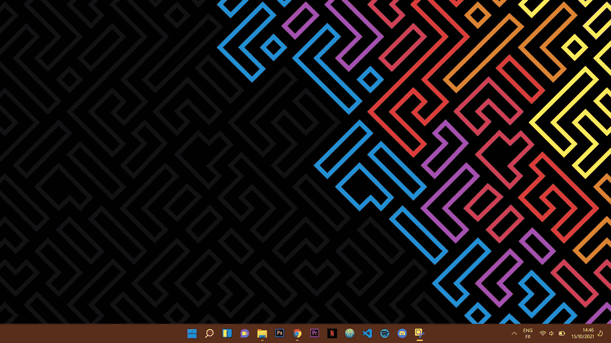
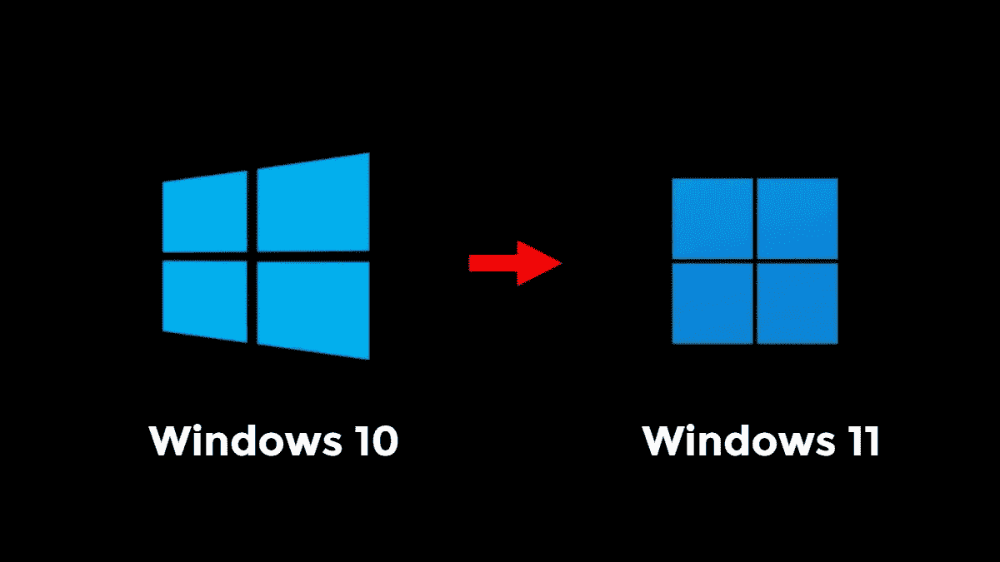
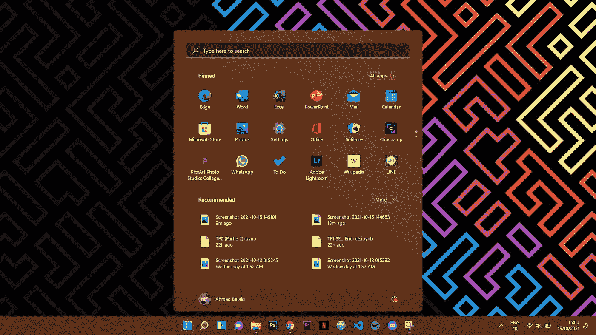
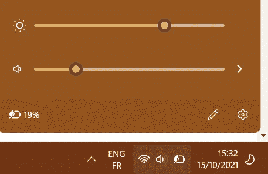
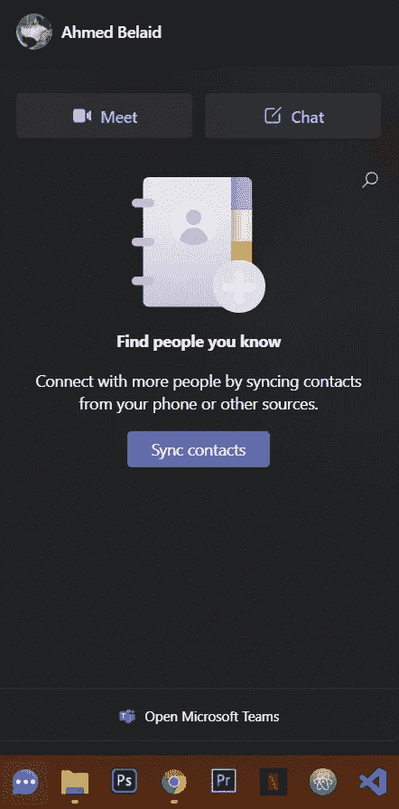
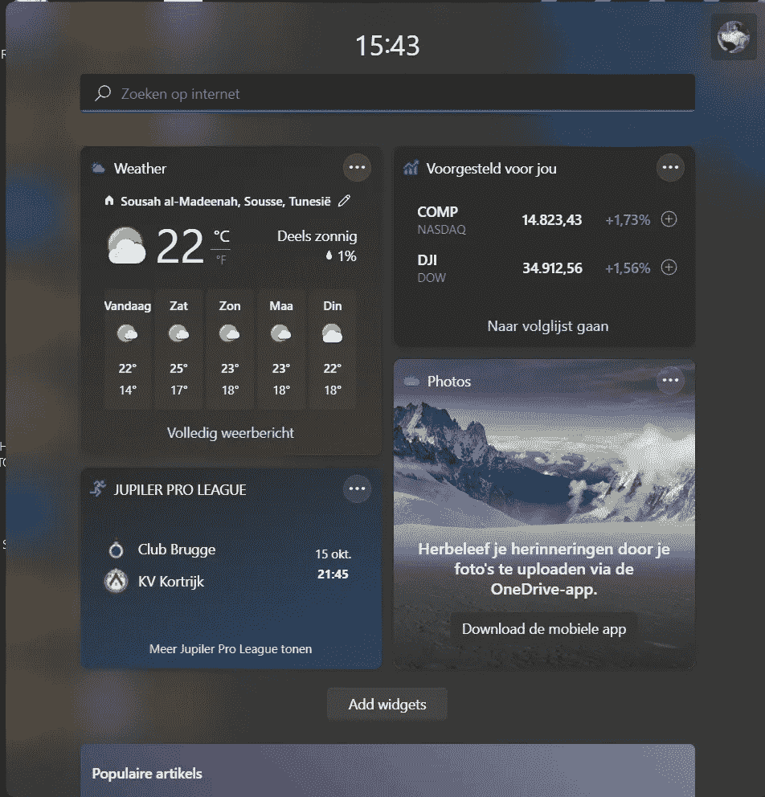
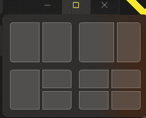
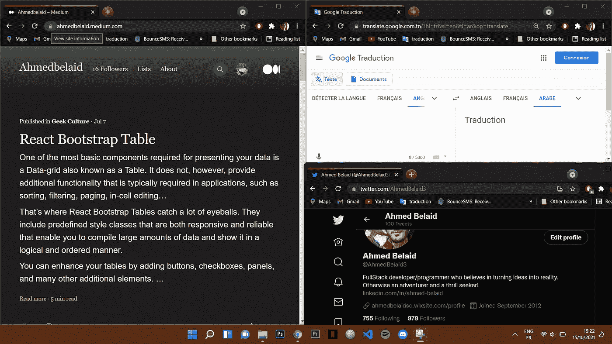
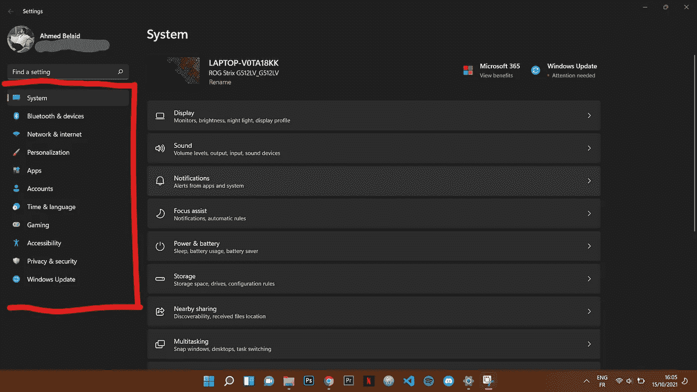
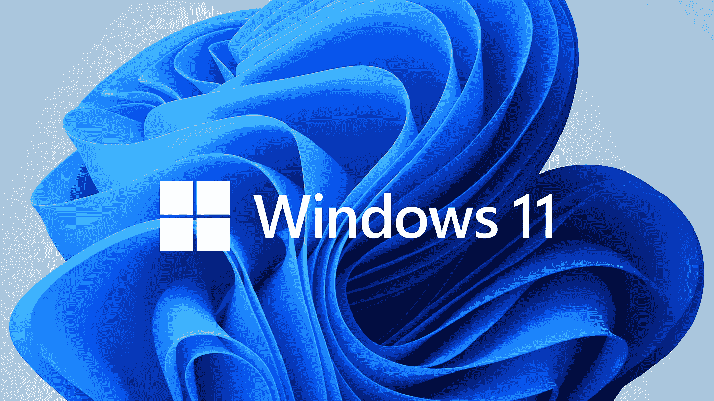

# 我的 Windows 11 体验| Ahmed be laid

> 原文：<https://medium.com/geekculture/mwindows-11-experience-a0824527a0a9?source=collection_archive---------0----------------------->

在 Windows 上，互联网诞生并成长。这是我们许多人写第一个笔记、玩第一个游戏、看第一个视频的地方，因为微软已经成功地统治了个人电脑操作系统几十年。

就像 Windows 10 可以免费从 Windows 8.1 和 Windows 7 升级一样，Windows 11 现在也可以免费从 Windows 10 升级。

我个人使用它作为我的主要操作系统还不到一个月，以下是我到目前为止学到的东西。

# 新现代设计

Windows 11 on my personal computer

“为生产力、创造力和易用性而重新设计”，这是微软对它的说法。对我来说，看到新设计后我说的第一句话是‘这太光滑了！’。在整个用户界面中，微软增加了新的动画、用户界面、动作和透明效果。他们简化了设计，使其看起来简洁而现代。

就像 MacOS 一样，开始按钮和任务栏现在位于中心，以便更容易快速找到您需要的内容，这种方式使其具有美感，但您仍然可以通过进入设置将其更改为左侧。

开始按钮的新设计现在像微软的标志一样扁平，这是 Windows 10 上 3D 设计的转变。

右击它，你可以显示一个功能列表，我在网上查找时称之为“隐藏”的，例如，任务管理器、运行等。

Source: Si instalas Windows 11 solo tendrás 10 días para arrepentirte y volver a Windows 10 de manera oficial — TEC

# 全新的开始菜单、搜索栏和小工具

Start button on my personal computer

这是简单的定义，现在更安静了，它在一个小窗口中显示固定和推荐的应用程序。搜索栏位于上部，但在 windows 图标旁边有另一个完整的按钮，显示最近使用的应用程序，无论你之前在什么平台或设备上查看它们，即使是在 Android 或 iOS 设备上。

任务栏角落图标也被重新设计，因为它们现在有一个新的极简外观，让我们可以控制，并带来一种平静和轻松的感觉。

我注意到，在任务栏中，我无法从微软团队中删除聊天图标，它现在永久集成在那里，正如微软所说的“我们希望继续让人们无论身在何处都能轻松地保持联系。我们不希望你使用的设备或平台成为障碍。”

另一个我无法移除的图标是 widget 图标，我不喜欢 windows 一直强加一些我们可能不喜欢的功能。然而，由于我们经常查看手机上的新闻、天气和通知。我们现在从 windows 中看到了类似的个性化体验。当您在 widget 的图标中打开您的自定提要时，它会像一块玻璃一样滑过您的屏幕，允许您继续做您正在做的事情，而不会打扰它。

# 多任务处理体验和设置

new Snap Layouts feature

Windows 11 改进了其多窗口体验，因为它现在更灵活地帮助您组织窗口和优化屏幕空间，以便您可以在视觉上干净的布局中以您想要的方式查看您需要的内容。

它们被称为快照布局、快照组和桌面

Multitasking on my personal computer

在 Windows 11 中启动设置应用后，你会注意到新的巨大变化。您首先看到的是系统面板。其干净、基本的外观使得定位某个设置变得简单。与 Windows 10 不同，它没有一个概览屏幕，上面有一个显示所有区域的图标菜单。在它的位置，出现了一个新的侧边栏。

只要你点击侧边栏中的一个选项，一个新的子菜单按钮面板就会在窗口的右半部分打开。

***没错，控制面板还是个东西！***

# 我对 Windows 11 的看法

Windows 11 无疑打破了 Windows 10 的单调，让你的设备重获新生。由于开始菜单和 Windows 搜索的改变，学习曲线很低，但用户将能够在几天内再次享受他们的机器。

然而，Windows vibe 已经减弱，Windows 11 现在感觉更像一个视觉上令人愉悦的 Linux 发行版甚至 MacOS，但它肯定更快，更安全，也更熟悉。

令我惊讶的是，windows 11 在我的笔记本电脑上比 Windows 10 表现得更好，到目前为止，我对这个版本的体验对于开发、游戏甚至编辑都很好。我对最终版本持乐观态度，因为我会继续使用这个版本的 Windows，直到下一次更新，但现在，Windows 11 似乎不会添加一些不会在 Windows 10 上运行的东西，所以你不必超快做出决定。

Windows 11 logo

你对 Windows 11 有什么想法？把它们放在下面的评论里。

作者艾哈迈德·贝莱德。