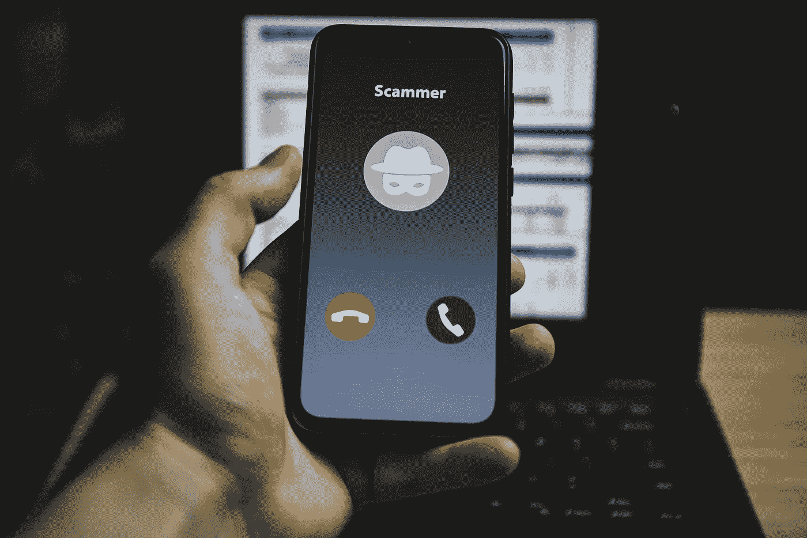

# 我的银行打电话来。我以为是骗子

> 原文：<https://medium.com/geekculture/my-bank-called-i-thought-it-was-a-scammer-f38883c45a2e?source=collection_archive---------27----------------------->

B2C 通信中的信任问题

Image Licensed from BigStock

上个月，我走进银行，不知道会发生什么。我收到了他们关于我的一个账户的信息。我以为这是一个网络钓鱼骗局，但也许不是。回拨网络钓鱼语音邮件中的号码是不安全的，它可能会回到诈骗者那里。单击潜在网络钓鱼电子邮件中的链接是不安全的，它会转到一个看起来像(但不是)您的银行的网站。

我的银行有我的电话号码和电子邮件地址。但这并不重要。他们没有可靠的途径与我联系。对于我从他们那里得到的每一个真实的信息，我都会收到 10 个以上的网络钓鱼或诈骗信息。我一点都不相信。所以我亲自走进银行，去解决这个问题。就像 145 年前贝尔发明电话之前一样。

# **电话，文字&邮件有架构问题**

电话、短信和电子邮件的工作方式都是一样的。所有联系我的人都用同一个地址。我给我的银行，我的健身中心和我最好的朋友的电子邮件地址都是一样的。我妈妈用来打电话给我的电话号码，每年也有 1000 多个自动电话。

在正常对话中，我们有一个变通办法。在决定接电话或相信一条消息之前，我们会查看来电者 ID 或回复电子邮件地址。这很有效，因为我知道我的朋友 Shane 会从哪个电话号码打来。我也非常了解我的朋友和家人，以至于在几秒钟内我就能认出假装是他们中任何一个的人。

Image licensed from BigStock

# **没有企业可信地址**

但是公司采取了完全相反的方法。我不知道我的银行会用什么电子邮件地址联系我，也不知道他们会用什么电话号码联系我。每次都可能不一样。

每次打电话、发短信或发邮件，你都换了一个人。即使建立关系看起来更容易，公司也在以相反的方式运作。

查找我在田纳西州的银行分行的电话号码，并拨打当地号码。你猜怎么着？电话会被转到阿拉巴马州的一个大型呼叫中心，你永远也不会接通当地银行家的电话——即使你在分行时已经知道他的名字和面孔。

# **企业绊网**

企业还创造了绊网——它们发送信息，不回应会受到惩罚。你是否预约了医生或空调公司，并请了一天假去那里？

希望你回复了预约确认短信——如果没有，他们可能会泄露你的预约时间。

你信用卡或借记卡上的可疑交易？最好尽快回复你银行的信息，否则你可能会无法支付账单。

公司期望来自未知地址和未知雇员的通信对消费者有约束力，忽视它们将受到严厉的惩罚。毕竟，消费者给出了他们的电子邮件地址和电话，对不对？

Image Licensed from BigStock

# **骗子的沃土**

所有这些公司政策加在一起，为我们今天看到的骗子创造了肥沃的土壤。消费者觉得他们必须回复来自未知地址和未知雇员的通信，否则他们将面临严峻的后果。

[63%的美国人靠薪水过日子](https://www.marketwatch.com/story/a-shocking-number-of-americans-are-living-paycheck-to-paycheck-2020-01-07)，他们无法接受未经授权的 975 美元的 iPhone 购买。当他们与医生或水管工的预约被取消时，他们不能多休息一天。他们正生活在边缘。

我们都知道会发生什么——如此多的骗子出现，以至于你无法区分真实的通信和虚假的通信。现在每个人都生活在持续的、低层次的焦虑中，他们错过了一个真实的电话或信息。或者把你的信息给了骗子。

# **企业现在能做什么？**

解决这些信任问题的公司会产生客户忠诚度，避免被商品化。让我们来看看几个可行的策略。

Image Licensed from BigStock

# **利用科技建立关系，而不是破坏关系**

在过去的 30 年里，B2C 通信已经被设计成摆脱客户和企业任何特定员工之间的关系。每一个呼叫或支持票证都会被路由到下一个可用的代理。一个顾客从来不会和同一个员工说两次话。

现代联络中心技术可以很容易地改变，在第一天就将客户分配给代理，甚至可能基于位置和人口统计等因素。这是你作为客户的联系人，只要有可能，这就是你要与之打交道的人。随着时间的推移，客户与员工建立了某种关系和背景。你花更少的时间互相认证，花更多的时间解决问题。

“但是我们的呼叫中心人员流动过多！!"雇主们说。也许离职是因为安排你的技术破坏了所有的人际关系？

Image Licensed from BigStock

# **为重要信息提供可信应用**

一些银行和经纪公司有设计良好的应用程序供消费者安装和认证。到达应用程序的消息是真实的。消费者可以放心地忽略任何其他信息(电话、短信、电子邮件)——这些都是骗子。

该应用程序为与客户的沟通提供了一个可靠的来源。它还为消费者提供了一个可信的地方来发送回复，甚至拨打语音和视频电话。

这种方法的主要问题是，消费者在日常生活中要与 150 多家供应商打交道。他们想要安装多少不同的应用程序是有限制的。

# **为重要消息提供可信的 URL**

最简单和最可靠的方法是，银行和其他供应商在第一天给消费者一个唯一的编码 URL，用户的关键信息将到达该 URL。如果信息到达那里，它是真实的。否则就是假的。

由于 DNS 的工作方式，骗子很难伪装成 https://MyBank.com/aldskfjwe324tqr 的

如果你把这个链接加入书签，保存在你的联系人列表中，甚至写在便利贴上，就很难被欺骗了。关键是——你没有点击电子邮件或文本中的链接。你在第一天就获得了链接，并且在客户关系的整个生命周期中保持不变。

# **混合应用程序和网址**

我的预测是，你将开始看到通用应用程序，在那里你可以订阅与你打交道的供应商的信息。

在一个通信应用程序中，你可能会订阅美国银行、太平洋煤气电力公司和其他几十家公司的网址。一个应用程序，与许多公司的可信连接。