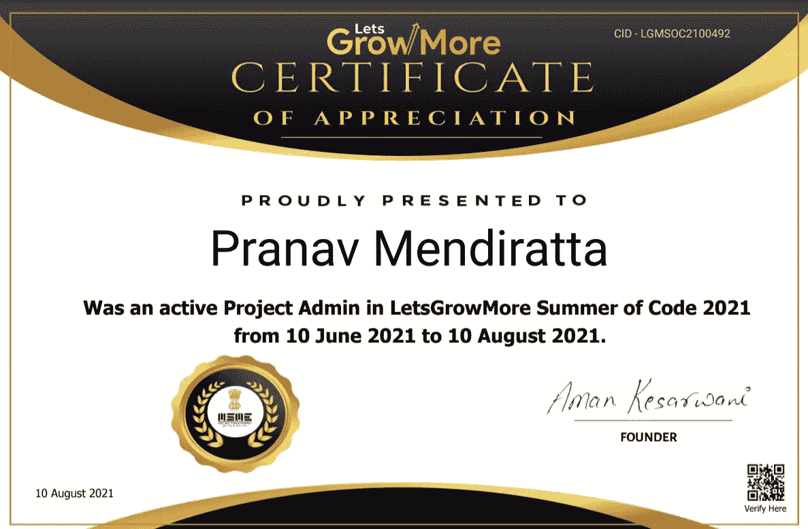
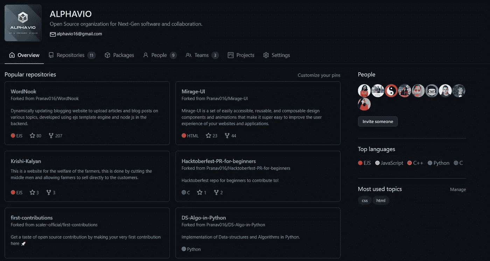
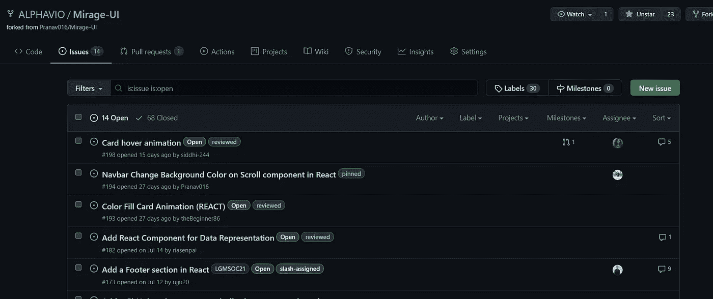
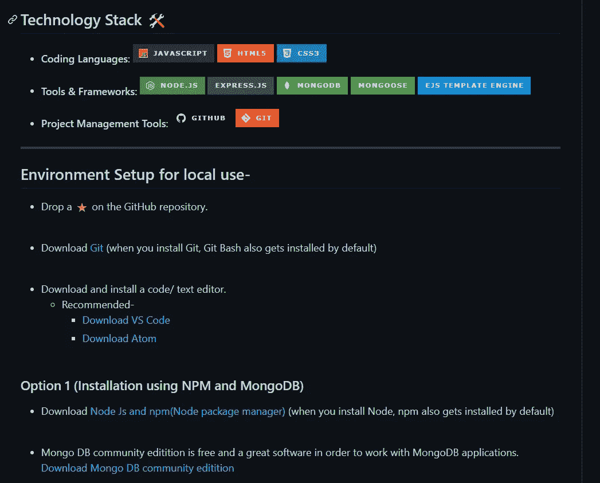
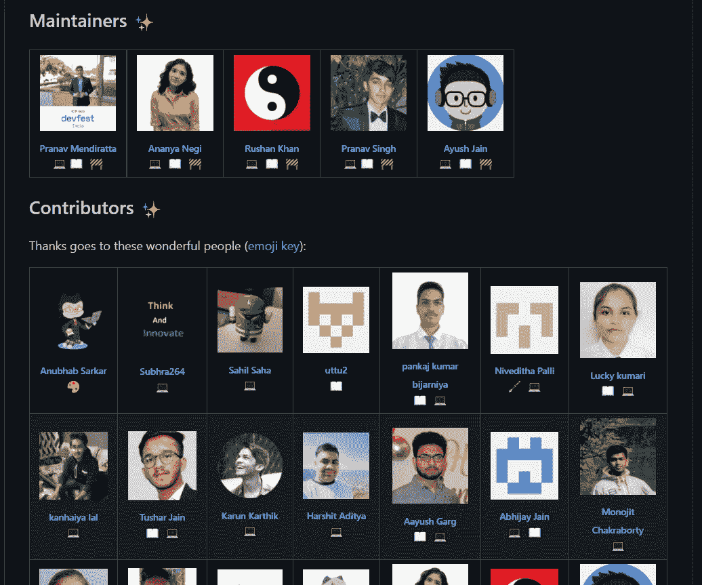

# 我在 LGM SOC 担任项目管理员和导师的经历

> 原文：<https://medium.com/geekculture/my-experience-at-lgm-soc-as-a-project-admin-and-mentor-24da7cf1f763?source=collection_archive---------43----------------------->

*GitHub-*【github.com/Pranav016 

让我给大家介绍一下 **LGM-SOC(让我们成长更多-代码之夏)**一个由让我们成长更多社区组织的开源项目。在 https://letsgrowmore.in/[拜访他们](https://letsgrowmore.in/)。

该计划旨在促进学生为开源软件做出贡献，并帮助提高他们的编程和交流技能。这使他们能够接触到各种工具和技术，这些工具和技术是行业中的标准，从而使他们即使在接受教育的同时也能获得宝贵的经验。这有助于他们做好更多的行业准备，并帮助他们获得技能，使他们在未来更具就业能力。

# 什么是 OSS 或开源软件，我如何为它做贡献？

开放源代码软件(OSS)是随其源代码一起发布的软件，允许在与商业软件相同的条款下使用、修改和发布。大多数计算机用户从未见过源代码，源代码是软件开发人员用来控制程序或应用程序行为的代码。有权访问源代码的程序员可以通过添加、修改或修复程序中的错误来改变程序。OSS 通常附带一个许可证，允许程序员根据他们的具体需要定制软件，并决定如何传播。

每一个人，不管是不是开发人员，也不管是什么级别的程序员，都可以以这样或那样的方式为开源软件做出贡献，并为人们免费使用的基于社区的软件做出贡献。开源社区遵循这样的格言**‘没有贡献是小的’**。

1.  你可以从寻找你感兴趣的组织开始。
2.  然后，你可以在 GitHub 或 Bitbucket 等平台上注册，并搜索组织名称，在那里你可以找到公开的软件库，供人们贡献和使用。
3.  你可以浏览所有的存储库，选择你感兴趣的。
4.  转到存储库本身的“问题”选项卡，在这里您可以找到要参与的问题。如果你不知道从哪里开始，那么寻找带有**“良好的第一期”**标签的问题。这些问题更容易帮助你开始你的开源贡献。

5.如果您遇到困难，请仔细阅读项目文档，然后与项目管理员讨论您的疑问，他们会很乐意帮助解决您的疑问。

# 我在 LGM 足球俱乐部的经历:

它于 2021 年 5 月 15 日至 2021 年 7 月 18 日举办，由各种技术和开源研讨会组成，旨在帮助初学者进入软件开发领域。

我被任命为 ALPHAVIO 组织的两个项目的项目管理员。这两个项目是:

1.  [**WordNook**](https://github.com/ALPHAVIO/WordNook)——动态更新博客网站，上传各种主题的文章和博客帖子，在后端使用 EJS 模板引擎和 Node JS 开发。访问 https://word-nook.herokuapp.com/[的网站](https://word-nook.herokuapp.com/)
2.  [**Mirage UI**](https://github.com/ALPHAVIO/Mirage-UI)**—**Mirage-UI 是一套易于访问、可重复使用和可组合的设计组件和动画，可以非常轻松地改善您的网站和应用程序的用户体验。

WordNook banner

Our contributors wall

*   我负责指导参与者通过提出问题为项目做出贡献，为源代码和文档做出贡献，并帮助他们提出拉请求和问题，审查问题和拉请求，并帮助他们在 GitHub 中导航。版本控制和 GitHub 可能需要一点学习曲线，但我通过分享有用的技巧和学习资源来确保帮助他们感到舒适。我还教他们在为开源做贡献时应该遵循的最佳实践。
*   为每个项目指派了熟练的导师，以协助项目管理员审查问题和 PRs，并解决参与者/贡献者的疑问。
*   我们使用各种方法来自动化我们项目中的东西，如自动添加标签到问题，自动依赖关系更新，问候机器人，CI 管道等，以使我们的工作更容易，并帮助管理存储库上的流量和清除贡献者的疑虑。
*   对我来说，这是一次很好的经历，能够从我的导师团队以及为 ALPHAVIO 项目做出贡献的学员那里学到很多东西。我们能够将 30 多个成功的 PRs 合并到我们的项目中，并帮助和鼓励参与者开始他们的开源之旅。
*   这个项目帮助我提高了沟通技巧、团队合作、写好文档、分析和调试技巧、技术技能以及时间管理。希望能在下一届 LGM 足球赛上回来，与我的导师和学员们一起体验技术盛宴，共同开发令人兴奋的项目。