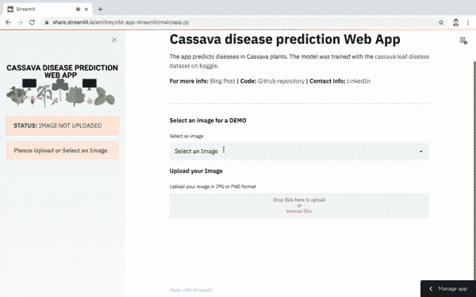
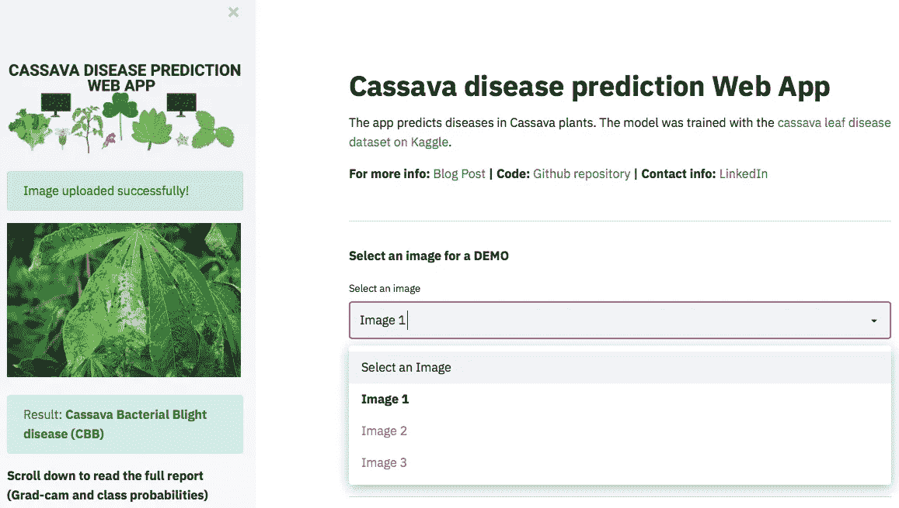
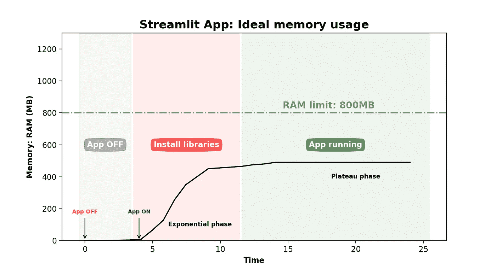
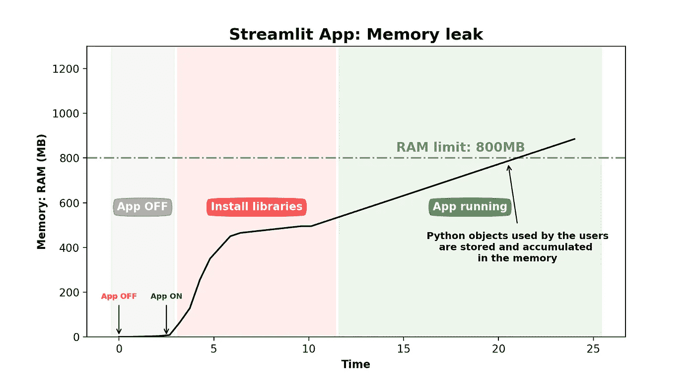

# 我部署具有 Streamlit 共享功能的应用的体验

> 原文：<https://medium.com/geekculture/my-experience-deploying-an-app-with-streamlit-sharing-471e49905247?source=collection_archive---------12----------------------->

## 构建一个具有良好内存管理和避免内存泄漏的多功能应用程序


Photo by [Adem AY](https://unsplash.com/@ademay?utm_source=medium&utm_medium=referral) on [Unsplash](https://unsplash.com?utm_source=medium&utm_medium=referral)

这不是如何使用 streamlit 的教程，你可以在 [streamlit 文档](https://docs.streamlit.io/en/stable/)和[媒体文章](/search?q=streamlit%20tutorial)中找到很棒的教程。这是我在部署应用程序和调试 streamlit 共享最常见的错误时反复试验的总结。

对于那些不知道 [streamlit](https://streamlit.io/) 的人来说，这是一个开源的应用框架，数据科学家可以用几行代码部署他们的数据应用。streamlit 的使用非常简单。在这里，我们讨论的是构建应用程序，因为部署应用程序是另一回事。就像他们说的那样:简单得离谱。

> N 现在，让我们进入主题:**如何调试您在使用 streamlit 构建和部署应用程序时遇到的最常见的错误？**

我将分享的技巧对于有计算机科学背景的人来说可能是小菜一碟。然而，对于主要使用 jupyter 笔记本的数据科学家来说，**他们是潜在的 streamlit 用户**，这篇文章可能是有用的，因为它强调了面向对象编程在构建内存友好的干净管道中的重要性。

# 我的 Web 应用程序:

**App 预测木薯植物病害:** [**Web App**](https://share.streamlit.io/amiiney/cld-app-streamlit/main/app.py)



**Figure 1.** GIF of my App’s page: Select an image to discover the app’s features.

上面的 gif 显示了我的应用程序的功能:**你上传/选择一张木薯植物图像，深度学习模型预测植物图像中的疾病，并提供详细的报告。**

***这款应用背后的想法:*** 我参加了一个 kaggle 比赛:[木薯叶疾病预测比赛](https://www.kaggle.com/c/cassava-leaf-disease-classification)我们要训练模型来预测木薯植物中的疾病。我已经准备好了模型和权重，所以我决定创建我的第一个 streamlit 应用。

如果你想了解更多关于模型的训练过程，请查看我的文章:

[](https://aminey.medium.com/how-to-train-ml-models-with-mislabeled-data-cf4bb353b3d9) [## 如何用错误标记的数据训练 ML 模型

### 当你的数据有噪音和标签错误时，如何有效地训练机器学习模型的 3 个技巧…

aminey.medium.com](https://aminey.medium.com/how-to-train-ml-models-with-mislabeled-data-cf4bb353b3d9) 

# 演示应用选项

为了获得灵感，我检查了 [streamlit 应用程序库](https://streamlit.io/gallery)中的许多应用程序，并意识到作为用户，为用户提供演示选项来测试应用程序非常重要。

许多应用程序都很棒，但它们需要用户上传文件才能运行，大多数用户会直接跳过。然而，**如果你给用户提供一个演示选项，那么用户很有可能会测试你的应用程序并发现它提供的所有功能。**

我的应用程序的演示版本的一个例子。我为用户提供了 3 个内置图像供选择:



**Figure 2\.** Demo app provides the user with 3 images to select for trial

向你的应用程序添加演示会增加你的内存消耗，这就是为什么学习如何有效地管理你的 RAM 以避免内存泄漏是很重要的。

# 内存管理:充分利用 800MB 内存

通过 streamlit 共享，应用程序可以获得多达 1 个 CPU、800 MB 内存和 800 MB 内存。与 Heroku 只有 512 个 RAM 的自由层相比，这是一个很大的计算能力。内存是我们要优化的变量，尤其是多功能应用。**我们希望我们的应用程序以最小的内存消耗拥有尽可能多的功能。**

您可以在 ***图 1*** 中看到，我的应用程序有许多可能会消耗大量内存的元素:

*   **很多依赖:** OpenCV，matplotlib 和 albumentations 用于图像预处理，Pytorch 和 torchvision 用于建模…
*   **图像:**图像数据比文本或表格数据占用更多的 RAM 空间。
*   **深度学习模型:**加载训练权重(大小 100MB)。
*   **众多功能:** **(1)** *选择/上传图像* **(2)** *显示图像* **(3)** *打印预测结果* **(4)** *显示 grad-cam 图像* **(5)** *打印* *类预测表。* **每执行一个特性都会导致一个对象存储在内存中。**

理想的内存使用应该如下图所示。



**Figure 3.** App memory usage: (1) Installing dependencies/Libraries (Exponential phase) (2) App running without memory consumption (plateau). [Image by Author]

当你的应用程序启动时，当安装你在 [requirements.txt](https://github.com/Amiiney/cld-app-streamlit/blob/main/requirements.txt) 文件中引用的依赖项时，它会消耗大量的内存，这些依赖项是你的应用程序运行所必需的。

指数阶段的快速增长之后是平台期，在平台期，你的应用程序在稳定点附近正确运行，而不会增加内存消耗。

> 您的内存限制(800MB)和稳定阶段之间的差异很重要。it 停滞越低，您的应用程序可以同时处理的用户就越多。

关于[调试内存泄漏](https://www.cloudbees.com/blog/debugging-a-memory-leak-on-heroku/)的更多信息。

# **提示 N 1:不要安装不必要的库**

如果你是一个 jupyter 笔记本用户，你可能总是通过导入几十个库来开始你的工作，有时你不会使用它们中的大多数，因为你在 colab 笔记本中有 15GB 的 RAM，保留它们不会有什么坏处。如果你用 streamlit 部署一个应用，你只有 800MB 的内存。

**下面是我如何减少库数量的两个例子:**

*   ***避免“重复”库:*** 我同时使用 Pillow 和 OpenCV 库进行图像预处理。你可以和他们中的任何一个完美地合作。所以我必须转换所有的枕头代码，坚持使用 OpenCV。
*   ***避免“中介”库:*** 我使用 [Timm 库](https://pypi.org/project/timm/)来导入我的 pytorch 模型。嗯，Timm 库本身从[火炬视觉库](https://pytorch.org/vision/stable/index.html)引入了这个模型。所以，**我完全可以删除 Timm 库，直接从 Torchvision 导入**。

# 技巧 2:避免内存泄漏

我犯的错误，也是大多数 jupyter 笔记本用户会犯的错误，是在整个笔记本的许多变量中存储相同的数据，这转化为不必要的内存消耗。**最理想的做法是将所有变量封装在 python 函数或类中**,以确保每个变量只被读取和存储在内存中一次。

这适用于单次使用，然而，我们的应用程序是指由多个用户多次使用。每次用户使用该应用程序时，你的 python 脚本在后台运行，你的 python 对象存储在内存中。

> 我意识到，在将我的应用程序发送给一些用户进行测试后，在第 4 个用户打开它之前，应用程序就崩溃了。



**Figure 4\.** Memory leak: The accumulation of not deleted python objects by the users lead to a constant increase in memory consumption and exceeding the RAM limit. [Image by Author]

正如我前面提到的，我的应用程序使用了一个沉重的深度学习模型，仅模型的权重就消耗了 100MB 的内存。因此，在内存中反复存储模型使得我的应用程序在 3 次尝试后崩溃。

解决这个问题的方法很简单，把所有的变量包装在一个函数或者一个类里面。代码执行后，**删除每一个变量(图像、数据框、模型、重量……)。**

> 可以查看我的 [app.py 脚本](https://github.com/Amiiney/cld-app-streamlit/blob/main/app.py)中的代码。所有的变量都包裹在 ***deploy()*** 函数中。该函数执行后，用 ***del*** 关键字删除所有变量。

如果在使用完内存后不释放它，会导致内存泄漏。有时候删除使用过的变量是不够的，尤其是当你的变量是从一个类或者一个函数中复制过来的时候。从长远来看，这可能会影响你的应用。

为了确保所有使用过的数据都从内存中释放出来，[使用 python 中的垃圾收集模块](https://docs.python.org/3/library/gc.html)。运行垃圾收集进程会从内存中清除大量未使用的对象。

```
#Import the garbage collection module
Import gc#Enable garbage collection
gc.enable()#Clean up the memory from unused objects
gc.collect()
```

要了解更多关于垃圾收集的知识，我推荐阅读这篇文章: [Python 垃圾收集:什么是垃圾收集，它是如何工作的](https://stackify.com/python-garbage-collection/)。

# 最后的想法

我在本文中分享了一些改善 Web 应用程序内存管理的基本技巧。这是我的第一个应用程序，所以任何关于如何提高应用程序性能的建议或提示都非常受欢迎。你可以在[我的 GitHub 库](https://github.com/Amiiney/cld-app-streamlit)中找到代码，可以随时通过 pull 请求为项目做贡献。