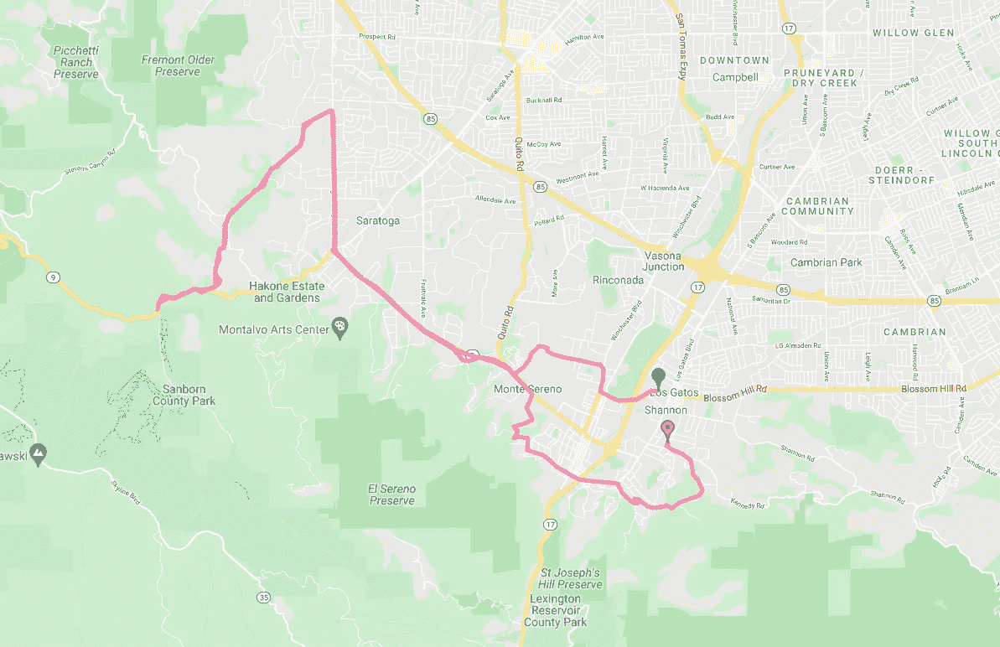

# 我在树莓派上使用 GPS 传感器的经历

> 原文：<https://medium.com/geekculture/my-experience-working-with-a-gps-sensor-on-a-raspberry-pi-bc9493700a9?source=collection_archive---------37----------------------->

最近，我购买了一个 GPS 传感器来集成树莓 Pi。使用 Go code 从它那里收集 GPS 数据很有趣，也是一次很好的学习经历。我的传感器是一个 [PA1010D](https://www.adafruit.com/product/4415) 通过 I C 总线连接到 Raspberry Pi Zero W。有了电池组为树莓派供电，整个装置变得非常便携。

下面是设置的最终输出，显示了 GPS 数据在谷歌地图上的叠加。这个覆盖图是使用 Google drive 的地图功能制作的，该功能允许导入 GPX 格式的 GPS 坐标。因此，GPX 格式是我为这个设置编写的 Go 二进制文件的输出。



Overlay of GPS data on Google Maps

让我们看看达到这一点所采取的步骤。第一步是连接设备，并确保通过如下所示的`i2cdetect`命令检测到设备。在这种情况下，`0x10`地址用于 GPS 传感器，`0x77`用于温度、湿度和压力传感器。我们需要使用这个总线地址与传感器通信。

```
$ i2cdetect -y 1
     0  1  2  3  4  5  6  7  8  9  a  b  c  d  e  f
00:          -- -- -- -- -- -- -- -- -- -- -- -- -- 
10: 10 -- -- -- -- -- -- -- -- -- -- -- -- -- -- -- 
20: -- -- -- -- -- -- -- -- -- -- -- -- -- -- -- -- 
30: -- -- -- -- -- -- -- -- -- -- -- -- -- -- -- -- 
40: -- -- -- -- -- -- -- -- -- -- -- -- -- -- -- -- 
50: -- -- -- -- -- -- -- -- -- -- -- -- -- -- -- -- 
60: -- -- -- -- -- -- -- -- -- -- -- -- -- -- -- -- 
70: -- -- -- -- -- -- -- 77
```

下一步包括发送基本命令来初始化和配置设备。例如，以下两个命令初始化设备输出和刷新率。在[数据表](https://www.eurocomposant.fr/pub/media/pdf/CD-PA1010D.pdf)中阅读关于这些命令的更多信息。

```
[]byte("PMTK314,0,1,0,0,0,0,0,0,0,0,0,0,0,0,0,0,0,0,0")
[]byte("PMTK220,1000")
```

我的最终目标是构建一个 Go 二进制程序，我使用 Golang 库`periph.io/x/conn/v3/i2c`在 I2C 总线上发送读/写命令。本 [python 代码](https://learn.adafruit.com/adafruit-mini-gps-pa1010d-module/circuitpython-python-i2c-usage)中描述的工作流程是一个很好的参考。

此时，读取设备地址上的 I2C 总线`0x10`开始传送所谓的 [NEMA](https://en.wikipedia.org/wiki/NMEA_0183) 语句。下面是一个`GNRMC`句子类型的例子，这是我们从设备接收到的几种句子类型之一。

```
$GNRMC,152616.000,A,1234.5678,N,123456.9876,W,17.59,120.60,310521,,,D*5B
```

此时，与设备的基本通信正在进行，我们现在可以开始解析这些`GNRMC`语句来提取 GPS 信息。句子格式如下:


Reference: [https://www.nxp.com/docs/en/application-note/AN4046.pdf](https://www.nxp.com/docs/en/application-note/AN4046.pdf)

考虑到输出中可能有格式错误的句子以及我们可能希望在代码中处理的其他错误，我将`NotAGnrmsSentence`和`DataNotValid`定义为自定义错误类型。定义这些自定义的错误类型允许我们使用 Go 标准库中的`errors.Is()`函数来检测特定的错误实例…更多信息请见最后。

首先我们可以过滤`GNRMC`的句子类型:

```
parts := strings.Split(input, ",")
 if strings.ToUpper(parts[0]) != "$GNRMC" {
  return fmt.Errorf("invalid input: %w", NotAGnrmcSentence)
 }
```

此外，让我们确保使用有效的数据:

```
if len(parts) == 13 && strings.ToUpper(parts[2]) != "A" {
  return fmt.Errorf("valid GPS data not yet ready: %w", DataNotValid)
 }
```

我们可以用类似的方式处理其他项目，但是我将更多地描述提取 GPS 数据。首先需要解码纬度信息，纬度信息是`ddmm.mmmm`格式，即前两位数字代表北半球或南半球的度数，其余数字代表分钟。

```
// parts[3] is the 4th element in the GNRMC sentence
if splits := strings.Split(parts[3], "."); len(splits) != 2 ||
  len(splits[0]) != 4 {
  return fmt.Errorf("latitude info is not in correct format ddmm.mmmm %s, %w", parts[3], DataNotValid)
 }
```

然后，我们可以单独解析纬度的拆分:

```
latDegrees, err := strconv.ParseFloat(parts[3][0:2], 64)
 if err != nil {
  return fmt.Errorf("could not decode latitude degrees: %w", err)
 }latMinutes, err := strconv.ParseFloat(parts[3][2:], 64)
 if err != nil {
  return fmt.Errorf("could not decode latitude minutes: %w", err)
 }latDegrees += latMinutes/60
```

类似地，我们可以解析经度信息:

```
lonDegrees, err := strconv.ParseFloat(parts[5][0:3], 64)
 if err != nil {
  return fmt.Errorf("could not decode longitude: %w", err)
 }lonMinutes, err := strconv.ParseFloat(parts[5][3:], 64)
 if err != nil {
  return fmt.Errorf("could not decode longitude: %w", err)
 }lonDegrees += lonMinutes/60
```

最后，我们需要确保根据`GNRMC`句子中报告的半球来调整这些数字的符号:

```
switch strings.ToUpper(parts[4]) {
 case "S":
  latDegrees *= -1
 case "N":
 default:
  return fmt.Errorf("latitude hemisphere neither N nor S, got %s: %w", g.LatDir, DataNotValid)
 }switch strings.ToUpper(parts[6]) {
 case "W":
  lonDegrees *= -1
 case "E":
 default:
  return fmt.Errorf("longitude hemisphere neither W nor E, got %s: %w", g.LonDir, DataNotValid)
 }
```

让我们看看 Go 中的错误管理。如下定义自定义错误类型允许我们分析下游代码中的特定错误:

```
// Error is a custom error type
type Error stringconst (
  NotAGnrmcSentence Error = "not-a-gnrmc-sentence"
  DataNotValid      Error = "data-not-valid"
)// Error complies with error interface
func (e Error) Error() string {
  return string(e)
}// Is method allows use of errors.Is() to parse errors
func (e Error) Is(err error) bool {
  var target Error
  if !errors.As(err, &target) {
    return false
  } if e == target {
    return true
  } return false
}
```

最后，我们可以使用解析器生成使用`github.com/tkrajina/gpxgo/gpx`库的`GPX`输出，它可以被导入到 Google maps 中来绘制 GPS 坐标。

在 Raspberry Pi 上使用 PA1010D 传感器当然非常有趣。在过去，我写过关于测量温度、压力和湿度的 BME280 传感器。我认为将这两种传感器输出结合起来会很棒，这样我们就可以在谷歌地图上绘制温度、湿度和压力…稍后会有更多的介绍。