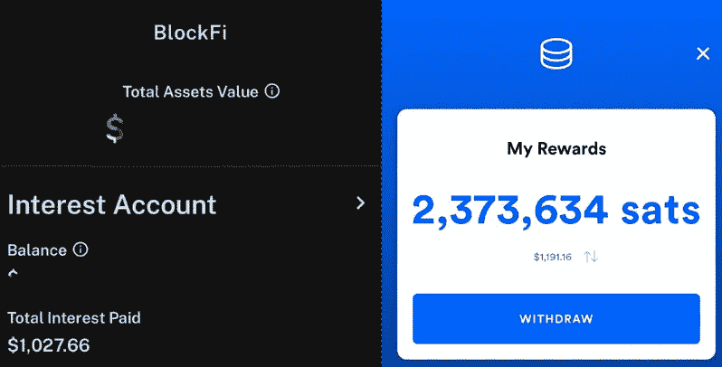

# 我最喜欢的在 sat 中堆积成千上万的方法

> 原文：<https://medium.com/geekculture/my-favorite-way-to-stack-thousands-in-sats-66596362d0d3?source=collection_archive---------28----------------------->

## 获得这些产品的橙色药丸！

Fold 和 BlockFi 是加密经济中两个一致的组件，我经常用它们来堆叠 sat。今年到目前为止，它们都为我带来了超过 1000 美元的加密奖励:

BlockFi and Fold Rewards

对我来说，这是一个两败俱伤的局面。一个满足了作为储蓄工具的需求，另一个非常适合支付…