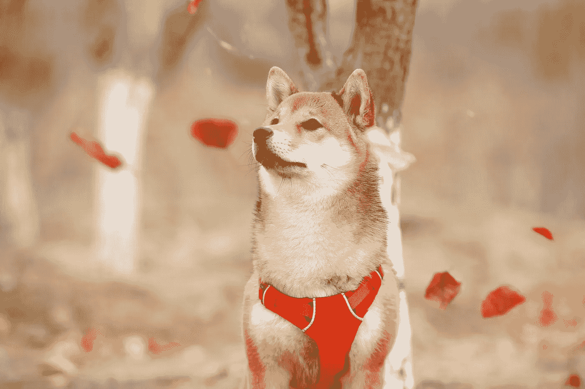

# 我的第一个一百万柴犬币

> 原文：<https://medium.com/geekculture/my-first-1-million-shiba-inu-coins-cff070304297?source=collection_archive---------9----------------------->

## 我买它们的原因是

Photo by [Jaycee Xie](https://unsplash.com/@jayceexie?utm_source=unsplash&utm_medium=referral&utm_content=creditCopyText) on [Unsplash](https://unsplash.com/s/photos/shiba-inu?utm_source=unsplash&utm_medium=referral&utm_content=creditCopyText)

我对加密领域的兴趣始于我在比特币接近 2017 年牛市峰值时赚的一小笔钱，并继续投资 Cardano、VeChain、Stellar、Chilliz 等自 2021 年 5 月以来几乎翻了一番的硬币。

我最近的投资是一个名为[柴犬](https://shibaswap.com/)的迷因币。我把我在 Chilliz 投资的 50 枚硬币换成了 100 万枚柴犬硬币，对此我很兴奋！

为了让你理解这背后的原因，我来解释一下这枚硬币是怎么回事。

# 柴犬&迷因币热

迷因硬币热始于 Dogecoin。我在脸书的群组上看到过各种各样宣传 Dogecoin 的人之间的讨论，我也看到过 Dogecoin 随着时间的推移而增长，这得益于 Elon Musk 的推文，他说他可能会利用 Dogecoin 开展他的火星殖民计划。

## 柴犬是什么？

一旦 Dogecoin 热开始消退，新的 meme coins 就像雨后春笋般涌现。其中之一是柴犬，这是一种模因币，其形象来自日本猎犬柴犬。

柴犬或柴犬令牌是一种分散式令牌，由一位名叫 Ryoshi 的未知人士于 2020 年 8 月创建，作为 Doge 的 altcoin。它迅速获得了牵引力，特别是因为人们喜欢狗品种柴犬，他们也喜欢迷因硬币。

## 我得到了:100 万枚硬币

由于我认为 Chiliz 仍然可以等待，因为目前的世界局势不鼓励体育运动，所以柴犬一在我使用的交易所 Bitpanda 上市，我就用 100 万柴犬币交换了它们。如果价格下降，我会考虑买更多。现在，价格在整数和小数之间加了四个零。

想象一下，如果你现在买入 100 万枚价值约 30 美元的硬币，如果硬币价格只向左移动两个零，你的美元余额就会变成 3000 美元。这可能发生在明年，或者更晚，但我认为这最终会发生，因为太多的人在购买和持有，市值在不断增加。

# 购买柴犬的理由

我对这枚硬币的看法是，它很快就会创下新高，只是因为人们到处都在大力推广它。他们买入并长期持有。还有其他原因，例如不时发生的焚烧硬币以造成稀缺，埃隆·马斯克关于他拥有一只柴犬小狗的一些推文，以及可能很快就会在更多交易所上市。

最后，我只有四个字要说:

> 柴犬到月球！

**免责声明**:我不是财务顾问，也不鼓励任何人在加密货币上投入超过他们承受得起的损失，因为加密货币波动性很大。请不要认为这篇文章是财务建议，而是个人观点。