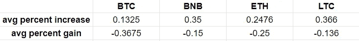
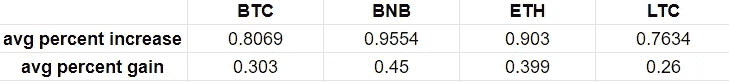
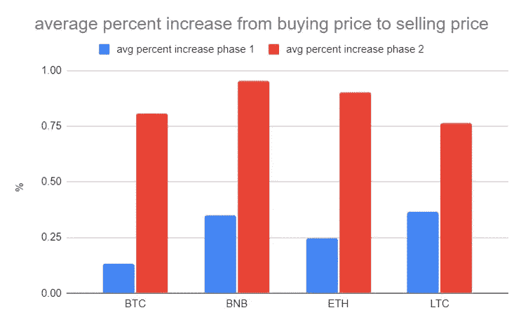
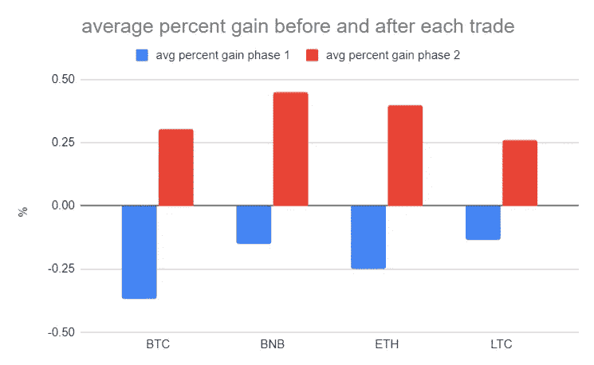

# 我用 LSTM 实现加密货币交易机器人的第一次尝试

> 原文：<https://medium.com/geekculture/my-first-attempt-of-implementing-cryptocurrency-trading-bot-using-lstm-5eb108ebd545?source=collection_archive---------5----------------------->

## 当机器学习遇到加密货币

本文的目的是分享我使用 python 实现的纯监督机器学习技术实现简单加密货币交易机器人的方法。由于我不是加密货币和交易方面的专家，任何评论或建议都将非常感谢！


Photo by [Rock’n Roll Monkey](https://unsplash.com/@rocknrollmonkey?utm_source=unsplash&utm_medium=referral&utm_content=creditCopyText) on [Unsplash](https://unsplash.com/s/photos/cryptocurrency-robot?utm_source=unsplash&utm_medium=referral&utm_content=creditCopyText)

# 目标

目标是在仅给定历史价格输入的情况下，通过确定最佳买入时间和最佳卖出时间，最大化买入和卖出加密货币前后法定货币的平均百分比收益。

# 限制

1.  如果当前操作是买入，下一个操作可以是卖出或者什么都不做。而如果当前动作是卖出，则下一个动作可以是买入或者什么都不做。
2.  每次我们购买加密货币时，我们花费相同数量的法定货币，每次我们出售加密货币时，我们出售我们手头的所有加密货币。
3.  每当执行购买或出售动作时，有 0.25%交易费。

# 实验设置和评估标准

性能评估是通过回测各种加密货币(如 BTC、BNB、瑞士法郎和长期货币)交易中法定货币的平均百分比收益来完成的。

我使用的分辨率是 1 分钟。20000 次观察(1 次观察= 1 行= 1 分钟)被分割成 80:20 的比例。80%即 16000 分钟(约 11 天)用于训练模型，而另外 20%即 4000 分钟(约 3 天)用于测试模型性能。

对于每笔交易，记录买价和卖价，以便计算 2 个评估指标，包括:

**1。销售价格相对于购买价格的平均百分比增长**

*   这是为了检查机器人是否以较低的价格买进，以较高的价格卖出
*   如果该值为正值，则意味着机器人通常以更高的价格出售。但是如果价值是负的，意味着机器人通常以较低的价格出售。

**2。考虑交易费用的平均百分比收益**

*   这是为了检查平均来说机器人是赢还是输
*   收益是我们在每次交易后相对于初始金额获得的额外法定货币
*   百分比收益和百分比增长之间的唯一区别是收益考虑了每一笔买卖的交易费用。
*   如果平均百分比收益值为正，这意味着机器人通常从交易中获利。

# 实施加密货币交易机器人的第一阶段

实现交易机器人的第一阶段只是使用单个 LSTM(长短期记忆)层，然后是单个全连接层来预测加密货币的未来价格。如果对未来价格的预测高于当前价格，我们买入。但是如果对未来价格的预测低于当前价格，我们就卖出。

```
#predict future price using trained LSTM
pred_price = model.predict(historical_price)#get current price
current_price = get_current_price()#determine action
if pred_price > current_price:
    #buy
elif pred_price < current_price:
    #sell
else:
    #do nothing
```

LSTM 属于深度学习的范畴，因为它使用专门用于处理时间序列数据(按时间顺序排列的每个观察序列)的 ANN(人工神经网络)机制进行学习。LSTM 的起源是 RNN(递归神经网络),其与原始前馈神经网络的不同之处在于其信号流，其中 t 时刻的输出将被用作 t+1 时刻的输入，这就是它被称为“递归”神经网络的原因。鉴于这种机制，RNN 可以比正常的前馈神经网络更好地理解序列数据。LSTM 修改了 RNN，在 RNN 结构中增加了 4 个组件:1 .输入门 2。别管 3 号门了。输出门 4。记忆。输入门决定哪些新数据应该被记录到存储器中。遗忘日期决定了哪些数据应该从存储器中删除。并且输出门将决定存储器中的哪些数据应该影响预测结果。由于加密货币的价格是具有时间顺序的序列数据，这种类型的数据可以由 LSTM 处理。



performance of trading bot phase 1

显然，结果表明，机器人通常以较低的价格购买，以较高的价格出售，因为硬币的销售价格相对于购买价格的平均百分比增长为正。例如，BTC 交易机器人的平均售价通常比买入价高出 0.1325%。然而，通过查看平均百分比收益，没有一个机器人从交易中获得收益，因为所有值都是负的。例如，BTC 交易机器人通常在每笔交易中损失 0.3675%的法定投资额。这是因为交易费。即使在我们买硬币的那一刻，我们已经输了。

即使交易机器人的当前方法在确定价格在未来是上升还是下降方面表现良好，因为每个硬币从购买到销售价格的平均百分比增加都是正的，但是确定价格变化的幅度是不够的。从购买价格到销售价格的增加需要足够高，在扣除购买和销售加密货币时收取的交易费用后，我们仍然有利润。

# 实施加密货币交易机器人的第二阶段

为了改进第一阶段的交易机器人，购买条件修改了一点点。目前的情况是，如果未来的预测价格高于当前价格，我们就买入。我们对此进行了修改，增加了一些考虑交易费用的阈值，即预测的未来价格应该至少比当前价格高出一些阈值，然后我们买入。使用下面的函数，我们可以用 3 个输入来计算法定货币的收益:买价、卖价和法定支出。

```
def gain_calculator(fiat_amount,price_at_buy,price_at_sell):crypto_amount = (fiat_amount- (fiat_amount*0.25/100))/price_at_buy
    gain_from_sell = (price_at_sell * crypto_amount) - (price_at_sell * crypto_amount * 0.25/100)return gain_from_sell - fiat_amount
```

例如，目前的加密货币价格是每单位密码 20 单位法币，交易费是 0.25%，我们花了 100 单位法币购买这枚硬币。在不考虑费用的情况下，我们应该得到的硬币数量是 5 个加密单位。然而，由于交易费用，我们只能得到 4.9875 单位密码。这就是为什么仅仅购买加密货币，我们已经输了。然后，如果我们决定在价格上涨到每单位密码 20.01 单位菲亚特时出售，由于交易费，我们出售所有股票得到的菲亚特数量是 99.550 单位菲亚特，而不是 99.799875 单位菲亚特。即使我们以较低的价格买进，以较高的价格卖出，我们还是会亏损。

但是如果价格涨到每单位密码 21 单位，我们决定出售。我们最终得到的菲亚特数量是 104.4756 单位菲亚特，现在我们获得了！因此，价格的增长应该足够高，以便有利润来支付费用。

但是多高才算够高呢？

通过使用下面的函数‘required _ magnitude ’,我们可以通过不断提高价格直到收益第一次高于零(这是阈值或幅度)来找到利润所需的最低价格涨幅。该函数将回答在考虑买卖交易费用后，我们需要的价格相对于当前价格的涨幅仍将导致收益。

```
def required_magnitude(current_price,fiat_amount):
    x = 0 
    while True:
        gain = gain_calculator(fiat_amount,current_price,current_price+x)
        if gain>0:
            break
        else:
            x += 0.01
    return x
```

在这种情况下，为了从以每单位密码 20 单位法币的价格购买加密货币中获利，该价格应该至少高 0.109，即每单位密码 20.109 单位法币，以便在包括交易费的出售后获利。

最后，我们将交易机器人的购买信号修改为…

```
#predict future price using trained LSTM
pred_price = model.predict(historical_price)#get current price
current_price = get_current_price()#calcualet required magnitude of increase in price
mag = required_magnitude(current_price,fiat_amount)#determine action
if pred_pricec - urrent_price >= mag:
    #buyelif pred_price < current_price:
    #sellelse:
    #do nothing
```



performance of trading bot phase 2

通过修改购买条件，bot 在从购买价格到销售价格的平均百分比增长以及平均百分比收益方面表现更好，如下图所示。



compare average percent increase from buying price to selling price between 2 approaches



compare average percent gain in fiat currency between 2 approaches

# 摘要

我的方法使用基于序列的监督机器学习模型来预测加密货币的未来价格。当预测的未来价格高于当前价格时触发买入信号，而当预测的未来价格低于当前价格时触发卖出信号。使用最小阈值来确定价格的增加是否足够高以获得利润确实有助于提高模型性能。尽管 bot 只能提供低于 0.5%的法定货币平均收益，但这仍是一个良好的开端。