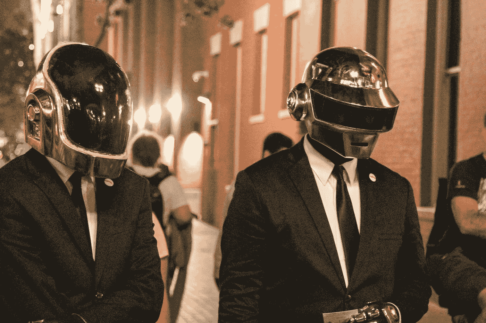

# 我对比特币和以太坊的第一手体验

> 原文：<https://medium.com/geekculture/my-first-hand-experience-with-bitcoin-ethereum-88833acf9e17?source=collection_archive---------11----------------------->

## 当我买入时，我赚了多少，对未来的想法

A post-fiat currency kind of world

好吧，这是正式的。在过去的几个月里(严格来说是从 2021 年初开始)，每个人和他们的母亲都在谈论加密货币、替代硬币、比特币、以太坊、区块链、总账、钱包、霍德林、Doge、突破、上升的楔子，以及去…