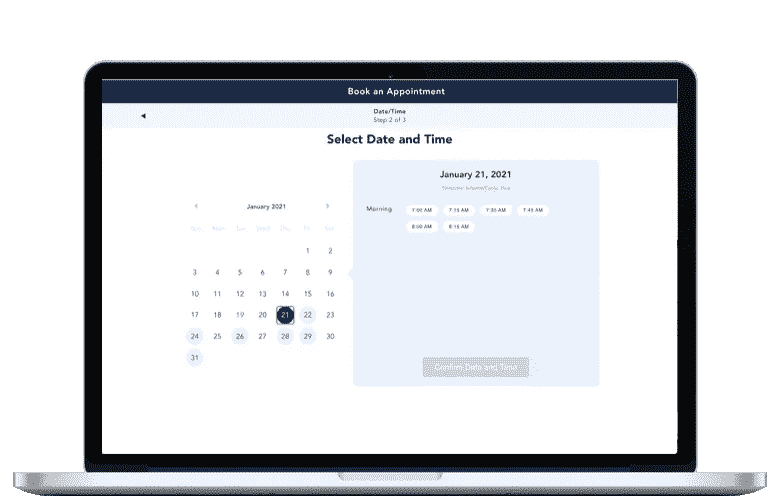
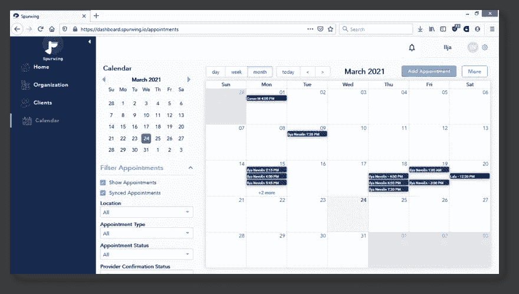
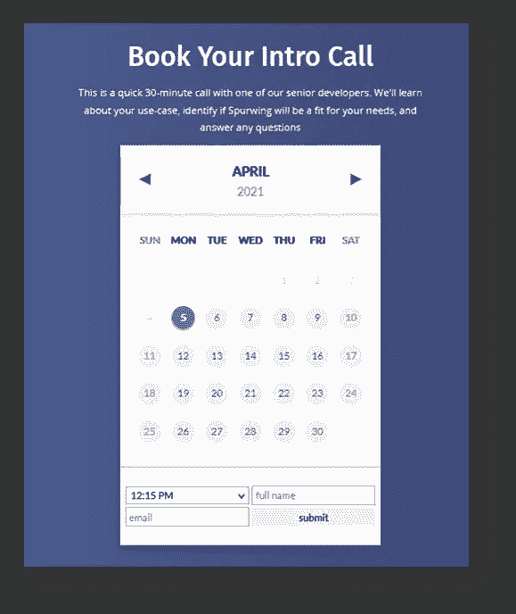
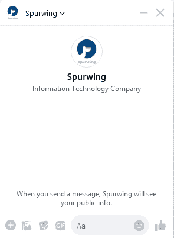
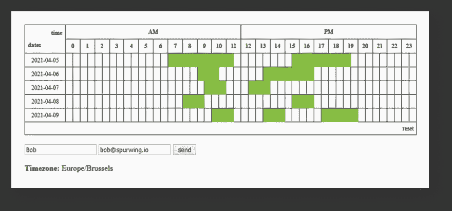

# 我运行 API 的第一个月——第一次启动

> 原文：<https://medium.com/geekculture/my-first-month-of-running-an-api-first-startup-52e1678048c?source=collection_archive---------31----------------------->

三月初，我被雇佣去经营和发展刺激。我负责业务开发、销售和营销方面，并共同负责几个工程项目。在这篇文章中，我将分享我在初创公司第一个月的个人见解、技巧和诀窍。

# 这个公司

我们的核心产品是**预约调度 API** 。我们的主要客户是工程团队和经理。API 允许开发人员更快地创新，更便宜地构建和更容易地扩展任何类型的时间敏感过程。

我们关注的最常见的用例是**时间管理解决方案**。最简单的用例是定制预订和日程安排小部件。更复杂的解决方案需要企业日历管理、远程团队协作工具和供应链管理。我们的产品适合任何行业，大多数角色都可以使用。

我们不会与 Calendly 这样的产品直接竞争。我们的使命是为开发团队提供工程资源和工具，以便更快、更容易、更便宜地解决问题。

Spurwing 实际上是为 Healthie Inc. 开发的衍生产品，其技术用于安排和管理数百万的年度预订和活动。

# 第一周

我从事软件工程、产品和业务开发已经超过 10 年了。因此，对我来说，这是一个相当简单而高效的入职流程。你们中的一些人可能会有同感，但我们在 Spurwing 做的大多数事情，以及我们面临的挑战，我以前已经面临过。对于如何应对大多数挑战以及如何执行，我有一个非常坚实的想法。

话虽如此，第一周我花了很多时间与董事们就我们的愿景和战略进行沟通。我们设定的目标是建立一个大型的免费开源市场。这个市场将为工程团队和开发者提供大量的资源和工具。其中包括 API 库、小部件、聊天机器人、管理仪表板以及与第三方提供商的许多集成。

免费提供所有这些资源为我们提供了巨大的营销机会，也是我们在竞争中的一大优势。

一旦我们有了明确的目标，就该执行了。我开始用几种编程语言构建 API 的库:Python、NodeJS、JavaScript/Ajax，我们也在用 Java、C++和 C#进行工作。多亏了这些库，我们现在可以轻松快速地构建新的工具和平台。

# 第二周

研究是我每天做的一项重要活动。具体来说，我研究并记下所有类型的项目和解决方案，供我们工作。

我首先开始构建最关键的部分:1:1 的网站预约安排窗口小部件，日历链接等等。

# 第三周

那一周我大部分时间都花在了研究、寻找潜在客户和与他们交谈上。大多数交流发生在 LinkedIn 或电子邮件上。LinkedIn 很棒，但是让人们和你交谈并不容易。大多数高级工程师和经理都没有时间和 randoms 聊天。这一切都是为了找到那些积极的人，并与他们互动。

那一周，我们构建了一个非常受欢迎的解决方案，那就是一个具有预订/安排功能的 Facebook Messenger 聊天机器人:

我们仍在改进这个聊天机器人，增强用户体验和试验新功能。除此之外，我们还有几个聊天机器人集成在管道中:Discord，Slack，WhatsApp，Skype，Intercom，Amazon Lex，Google Chat 等等。

我们开始为市场上所有的库、小部件和工具建立 CI/CD 管道。多年来，我变得非常积极主动地进行测试驱动的开发，以及 CI/CD 管道为工程和 QA 团队提供的价值。这些天来，我不再构建没有一些像样的自动化测试(和部署)的产品。

# 第四周

主要是寻找潜在客户、构建营销内容和研究产品创意。除此之外，我们还为不同时区的国际团队制定了简单的日程安排:

像这样的工具可以让我们节省宝贵的时间，提高内部效率。我们的大多数员工和合作伙伴位于不同的时区，因此安排会议有时会很麻烦。此工具允许所有参与者提交他们在特定日期范围内的可用性。活动的组织者然后可以查看所有提交的严格重叠，并选择一个适合所有人的时间段。这是一个非常简单和基本的实现，但提供了巨大的价值。

# 结论

你可能想知道我们是如何在不到一个月的时间里完成这么多工作的。这一切都是伟大的管理与经验和专业知识的结合。

我们使用 Slack / Discord 与我们所有的业务和工程团队轻松快速地沟通。我们花在电子邮件或电话交流上的时间很少。我们每周只有一次专门的视频聊天电话来聊天。如您所见，我们试图最小化和减少任何不必要的瓶颈。这让我们非常有效率。

如果你有任何具体的问题，请在下面留言！

# 有用的链接

[开发博客](https://dev.to/spurwing)
[开源市场](https://github.com/Spurwingio/)
[宣传册](https://www.slideshare.net/IljaNevolin/time-management-tools-appointment-scheduling-software-and-booking-solutions-for-business-teams)

# 关于我

我是一名普通的软件工程师，在为网络、桌面和一些安卓系统构建软件方面有超过 10 年的经验。多次创业的创始人和产品开发人员。随意连接:[https://www.linkedin.com/in/iljanevolin/](https://www.linkedin.com/in/iljanevolin/)

再见。