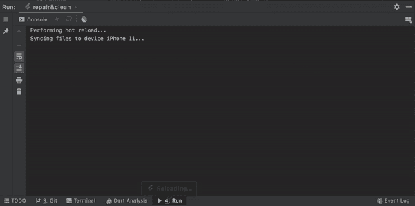
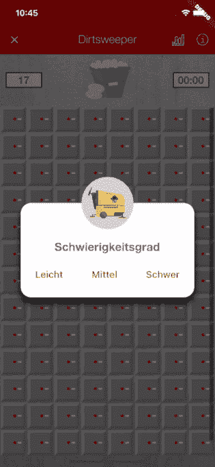

# 我作为移动开发者的第一步

> 原文：<https://medium.com/geekculture/my-first-steps-as-a-mobile-developer-207d0c83af2d?source=collection_archive---------13----------------------->

## ***——或者说我是如何在储物柜里藏脏东西的，以及在这个过程中我从中学到了什么。***

W 当我第一次开始寻找一个临时职位，渴望学习如何编码时，我发现从事基于二进制非对即错逻辑的工作会令人欣慰。有了市场营销的背景，我渴望这样一个具体的设置，摆脱固执己见的决定，而是由功能性原则决定。要么成功，要么失败——没有中间环节，你几乎立刻就能知道。

(为了不惹怒各地的营销伙伴，我必须声明，营销当然也有可量化的标准来作为决策的基础。只是…没有那么多杰出的人)。

现在，四个月过去了，我可以自信地说:我在很多方面都犯了错误。

首先也是最重要的是，被告知你是在正确的道路上还是错误的道路上实际上是令人欣慰的——然而，主要是当你在正确的道路上时，而当你在错误的道路上时就不那么令人欣慰了。我花了几个小时在谷歌上搜索各种错误信息，这些信息在命令行中以鲜红色显示。

没人告诉你的是:真正的麻烦在白线之间，而不是红线之间。在某种程度上，红色的错误信息对你来说很明显。他们用一种具体而简洁的方式告诉你是什么在困扰着他们，使得解决起来相对简单(或者至少是谷歌)。另一方面，如果你要将白色错误信息拟人化，它们会是那些令人讨厌的小生物，让你清楚地感觉到有什么事情困扰着它们，但它们拒绝告诉你具体是什么。更确切地说，他们将困扰他们的问题隐藏在一行又一行的消息之下，迫使像我这样的初级开发人员一行一行地费力地查看输出，不知道他们首先在寻找什么，并且(至少在我的情况下)相应地无法自己解决问题。

但是让我们从头开始，而不是从错误和问题开始(据我所知，这显然是开发人员特别容易关注的焦点)。我参加了瑞士联邦铁路 SBB CFF FFS 公司的一个青年才俊项目，该项目包括我们自己选择的不同部门的四次轮岗。在这种情况下，我们不仅被鼓励应用我们所知道的，而且在我们舒适区之外的领域获得工作经验和技能。这个机会就在眼前，再加上基本编程技能的重要性与日俱增，加上我自己仅限于用 HTML 标记格式化文本，我开始寻找一个愿意在我身上碰碰运气的团队。

不出所料，大多数人都持怀疑态度。在几次试图将我推向业务分析项目而不是任何类型的编程后，我发现一个移动开发团队愿意为我提供受欢迎的环境，有自学的自由，一个独立的编码项目，以及途中的指导。

我在 IT 行业的头六个星期，我通过一个在线的 Flutter 训练营工作。通过讲座，我了解了 widgets 的基本作用和 Flutter 的跨平台兼容性。我学会了如何用行列来安排一切，如何包含图像和动画，如何在 Firebase 中嵌入 API 或存储用户输入。六个星期后，我收到了成功完成课程的证书，并准备好…在现实生活中完全没有。或者至少感觉是这样。就好像我只摸过一个巨大池塘的表面，我甚至不知道底部有多深。“我知道我只完成了一个新手训练营，并不期望现在就知道所有的事情——但我觉得自己好像什么都不知道！“我告诉我的高级合作开发人员。”这很正常。我仍然觉得好像我也什么都不知道”，他背着十多年的编程工作回答道。这是一种在某种程度上令人欣慰和幻灭的认识，但最终是典型的语言，无论是编程语言还是自然语言。在这两种类型中，知识变得更加广泛，但从来没有穷尽——鉴于语言是短暂的，这怎么可能呢？

但是，当然，我说的不是最后的百分之几。我说的是缺乏对实质性概念的理解，比如国家管理。我花了相当多的时间试图弄清楚如何利用其他文件和类的功能，这一努力看起来如此基本和自然，以至于失败了令人沮丧。虽然谷歌搜索可能的修改总是第一步(StackOverflow 是你的朋友)，有人检查你的代码并指出你的错误是非常宝贵的。因为无论我在网上搜索了多少小时，在代码中尝试了多少东西，我都没有解决这个基本问题。引用现有的工作代码怎么会这么难？！一次又一次，我在这一点上卡住了，并依赖于我的合作开发人员来解开这个结，只是为了在下次我需要引用一个类时再次感到完全无助。然后，奇怪的事情发生了:事情就这样水落石出了。一天早上醒来，我自己实现了一个功能，成功地应用了我到目前为止一直在努力的概念，好像到那时为止，我的学习曲线的梯度不比荷兰的小。

但是我在里面客串的时候实际上写了什么呢？很高兴你问了。

标志性的 90 年代游戏扫雷的版本，主题适应并隐藏在(公司内部)修复和清理应用程序的深处。换句话说:我实际上把脏东西藏在了储物柜里。我从 UI 元素开始，格式化了盒子(储物柜)和一个包含附加按钮和显示的顶部栏。到目前为止一切顺利。但是一旦这样做了，事情就变得更加困难了。关于游戏引擎，我有一个很好的想法，但是我自己实现一个就是另一回事了。幸运的是，和大多数事情一样，其他人已经做了这件事，并把它发布到了网上。我渴望应用我所学的知识，充满雄心壮志，我打算只是偶尔偷偷看一眼，当我在自己解决问题时被卡住了。这种野心持续了大约一天。

结果是，[复制粘贴](https://stackoverflow.blog/2021/04/19/how-often-do-people-actually-copy-and-paste-from-stack-overflow-now-we-know/)构成了开发人员工作的一大部分，我从我的同事对我可耻地承认代码不是来自原始想法的反应中意识到:“复制粘贴是正确的做法；投入精力独自解决已经存在的问题是没有用的。”我想最终我的雄心可能会被认为是一个错误的信念，将原创置于效率之上——鉴于这个职业群体的短缺，可能没有一个开发人员有时间去思考这个哲学。

说到效率:在 IT 部门工作，我当然也接触到了敏捷的工作方法，也就是 Scrum 的一个改编版本。我认识到，自吹自擂的“敏捷”一词并不一定意味着效率。敏捷工作环境中的团队动态让我想起了许多齿轮，团队成员都在为一个更大、更狭窄的目标的一小部分工作。在这种情况下，我的团队将每天举行简短的站立会议，每周进行一整天的改进。坚持这个比喻，日常工作和改进是保持事情顺利进行并确保所有事情都正确排列的润滑油。虽然我得到了背后的理论，但我仍然怀疑举行一个固定的每日会议，让每个人总结他们在过去 24 小时内一直在做的事情，是不是最有效的方式。这些日线图可能是文本(或吉拉分配)。关于改进——你听说过高效的全天会议吗？

如前所述，效率是编程中推崇的原则。在最大限度地减少代码行数的同时，非常关注功能的最大化。在日常业务中，这个原则经常会通过“是的，但是…”这样的话传递给我，然后是另一种方法来优化(或者简而言之:重构)我的代码的功能长度比。从这个意义上说:没有正确的方法，但有许多错误的方法。

增加困难的一件事(因此我不会像我自己一样建议婴儿开发者)，是从一个包开始作为我的第一个项目。令人疯狂困惑的是，尽管复制了以前成功过几十次的行为，但在训练营期间非常成功的简单事情突然不再有效了。帮助论坛上关于软件包问题的文档和文章相当稀少，如果不太熟悉文档，可能很难找到和解决。

但与此同时，一旦克服了这些额外的障碍，编写一个理论上可以在任何应用程序中实现的包就太棒了。因为最终，这就是我在 4 个月的移动开发结束时得到的东西:一个嵌入在官方应用程序中的古怪游戏，我可以把它塞到人们的脸上，说“*这是我做的。*

## 主要学习内容:

*   StackOverflow 是你的朋友，但你的合作开发者也是
*   没有正确的方法，但有许多错误的方法
*   学习编程是一项永无止境的努力
*   编程一个包需要一些特殊的习惯
*   敏捷的工作方法不一定高效
*   你不会因为自己编写了可以复制粘贴的代码而获得 cookie 点数
*   在其中，每个人事实上总是忙忙碌碌