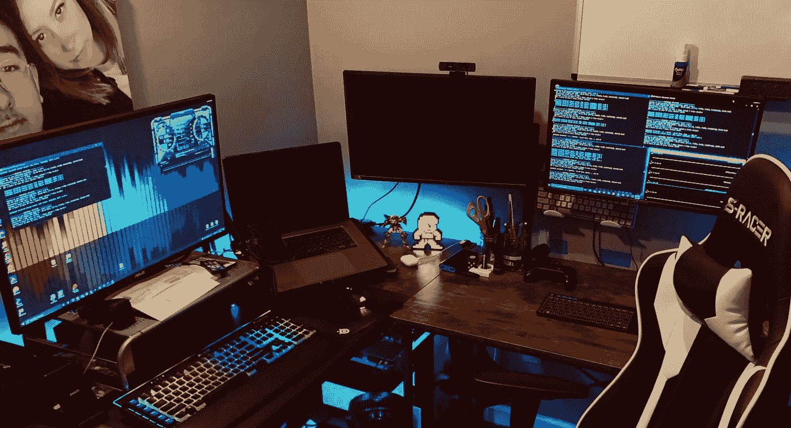
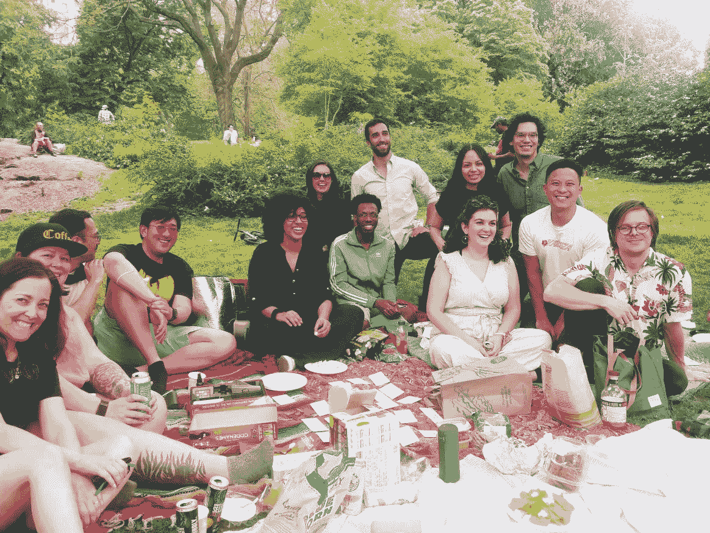

# 我软件工程的第一年

> 原文：<https://medium.com/geekculture/my-first-year-of-software-engineering-5baa4951acc?source=collection_archive---------57----------------------->

My class/office/playground

自从我决定学习如何编码已经一年了，今天我将从我开始的地方和今天我在哪里写我的旅程。一路上经历了许多起起落落，但最终，我很高兴我做出了那个选择，也很高兴我学到了很多东西。

我记得当我七岁的时候，我叔叔来看我，他看到我在奶奶家很无聊。他接着问我****你做完作业了吗？****，我回复****你以为我作业没做完奶奶会让我闲坐着****。他看着我的奶奶，大声笑了好几分钟。我的叔叔一定认为这很有趣，因为在那之后他喜欢上了我，他后来奖励我买了一个 GameBoy Color 和一本 Pokemon Red，这就是我如何接触数字技术的，也是我成为技术极客的那天。后来我转到了个人电脑上，在那里我花了无数的时间玩游戏，比如:**星际争霸**，**江湖**，**反恐精英**和**地图故事**。作为一名电脑游戏玩家，更新的游戏需要更新的硬件，所以在我 11 岁的时候，我开始改装我自己的电脑，那时我知道我想进入技术领域作为我的职业。****

***快进几年，然后爆炸！我进入了我最喜欢的学校，布鲁克林的纽约城市技术学院。万岁！这离我儿时拥有一家网吧的梦想又近了一大步，我可以在那里闲逛，摆弄电脑。但是生活发生了变化，由于某些情况，我不得不辍学，全职工作来养活自己。***

***我一生都很幸运，在我从大学辍学并最终成为我家乡纽约市一家连锁餐厅的经理后，我在餐饮业有了很好的职业生涯。***

***快进到 2020 年 3 月。新冠肺炎疫情餐厅正处于鼎盛时期，和许多其他餐厅一样，由于员工生病和整体业务下滑，我被迫关闭了所有三家餐厅。对我来说，这是一段非常黑暗的时期，因为我的表弟刚刚从 COVID 住院，我担心这位同事未来的生活和职业生涯。***

***多亏了善良的老山姆大叔，这个问题以疫情救济金的形式解决了，机会来了。我知道封锁不会很快解除，所以我向老板递交了辞职信，用我的刺激支票作为定金，报名参加了熨斗网络开发学校。***

# ***0 月***

***起初，重返校园是非常令人畏惧的，因为我已经离开学校十多年了，根本不知道自己是否还有能力学习像软件工程这样复杂的东西。但是有了我亲密的人的爱和支持，它给了我信心，让我在熨斗入口代码挑战赛之前努力学习了一个月，并提供了一些免费资源，例如:***

***[免费学习编码| Codecademy](https://www.codecademy.com/)***

***【免费学习编码——为大忙人开设的编码课程(freecodecamp.org)***

***[CS50 的计算机科学入门| edX](https://www.edx.org/course/introduction-computer-science-harvardx-cs50x)***

***使用这些免费的平台，我能够用我自己学会的一个小 Python 来学习基本的 HTML 和 CSS。感谢那些创造了这些令人惊叹的免费工具的勤劳的人们，我能够通过熨斗学校入学密码挑战。***

# ***第二个月***

***我们做到了！我进了熨斗学校，被分配到最棒的一组。在接下来的四个月里，我们一起日复一日不知疲倦地工作。***

***第一个月，我们学习了编程基础，比如用 Ruby 进行面向对象编程，并学习了如何用 Ruby 构建条件 CLI 应用程序。***

***在第二个月，我们学习了函数式编程，以及如何使用 MVC 模型和 Ruby on Rails 构建后端服务器。***

***第三个月是纯 Javascript 和 HTTP 请求如何在互联网上工作，以及作为 web 开发人员，我们都需要实现 fetch。***

***第四个月也是最后一个月，我们学习了 React 等前端框架，以及如何使用 Redux 进行状态管理。在课程的最后一周，我们被分配进行顶点项目，在这个项目中，我们可以构建我们喜欢的任何东西，如果我们做得好，我们就可以毕业。***

# ***第 6 个月***

***成功！我的顶点项目非常棒，我建立了一个全栈游戏博客网站([查看这里的演示](https://youtu.be/x1XqqEM3NuE))，我能够带着我的 web 应用程序毕业，并在我的每月代码挑战中获得完美的 4/4 分。虽然我从未后悔从大学辍学，但我亲爱的亚洲老母亲多年来一直让我很放松，但这次我很自豪地打电话告诉她这个好消息。***

# *****第八个月*****

***毕业后，我请了 7 个月的假，和我的女朋友一起去了一次愉快的小旅行，因为疫情的禁闭放松了管制。我们租了一辆货车，住在国家公园露营地，在全国旅行，过了一个我们能想到的最负责任的假期。顺便很棒的推荐！***

******

***Nothin like the crisp air of the great outdoors.***

***后来我花了整整八个月的时间自学，学习了一堆新的框架和库，比如用 Hooks 代替 Redux 作为我的状态管理，用 Sass 充实我的前端知识。如果你想看的话，这里有一些链接。***

***对我的 CSS 越来越无礼💁‍♂️.时髦 CSS 入门指南|作者吴兴华| 2021 年 6 月|中级***

***[迷上了反应过来的 Hooks🪝.React 挂钩简单指南|作者吴兴华| Medium](https://stevenwu91.medium.com/hooked-on-react-hooks-e7d93ec7f258)***

# ***第 9 个月***

***游戏时间！到了第九个月，我已经正式开始找工作了，我埋头于工作申请，大部分时间都在通过以下网站学习数据结构和算法:***

***[leet code——全球领先的在线编程学习平台](https://leetcode.com/)***

***[仪表盘|黑客排名](https://www.hackerrank.com/)***

***此时，我们团队中的一些人已经被雇用，我们都接种了疫苗，所以我们都决定在我们中的一些人离开纽约工作之前聚一聚。***

******

***Miss these guys 😢***

# ***第一年***

***我们今天在这里。我的软件工程之旅开始已经整整一年了，虽然最近几个月我还没有找到工作，但我希望它很快就会到来，我很高兴地告诉大家，我的大多数同学都已经找到工作了。
不到一年，我现在已经能够构建完整的 web 应用程序，我对过去一年学到的东西感到非常高兴。过去的几个月是非常艰难的 algo 问题，但我已经完成了我的[作品集网站](https://stevenwu.netlify.app/)，甚至学会了如何用我新学到的知识用 HTML & Javascript 构建经典的 [Pong 游戏](https://stevens-pong-app.herokuapp.com/)。***

***我个人认为这是我一生中最好的决定之一，我很感激我一路上遇到的所有开发者，他们与我分享了他们的知识。***

***我也要感谢所有的观众，他们从我熨斗计划的第一个月就开始关注我的博客。***

***如果你喜欢这篇文章，请关注或留下评论。***