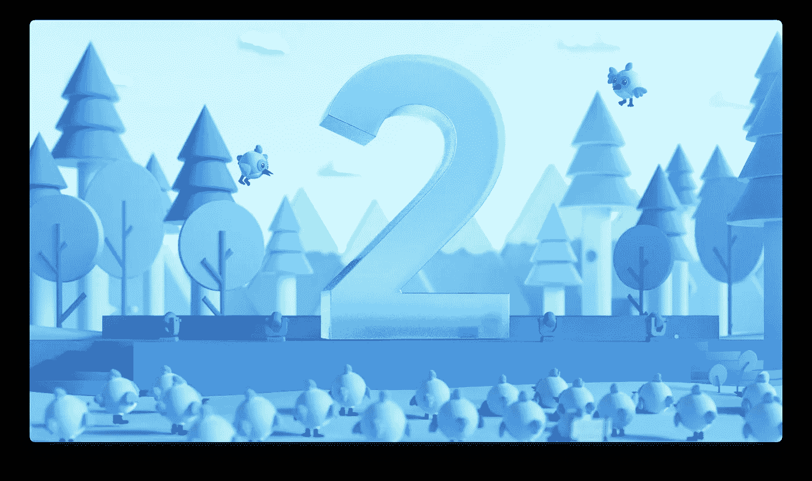
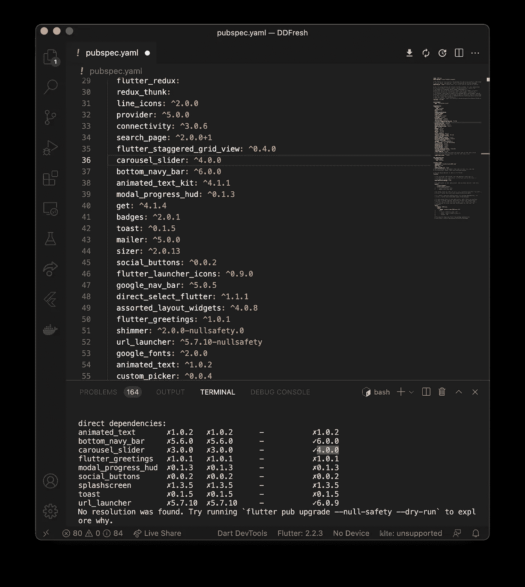
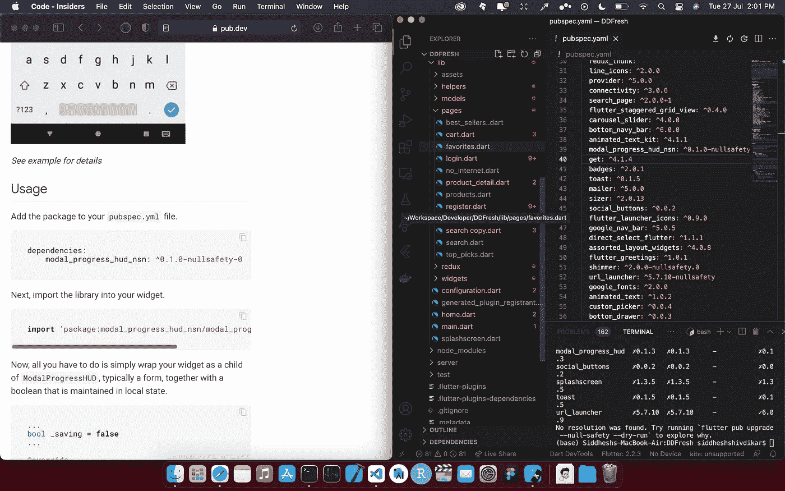
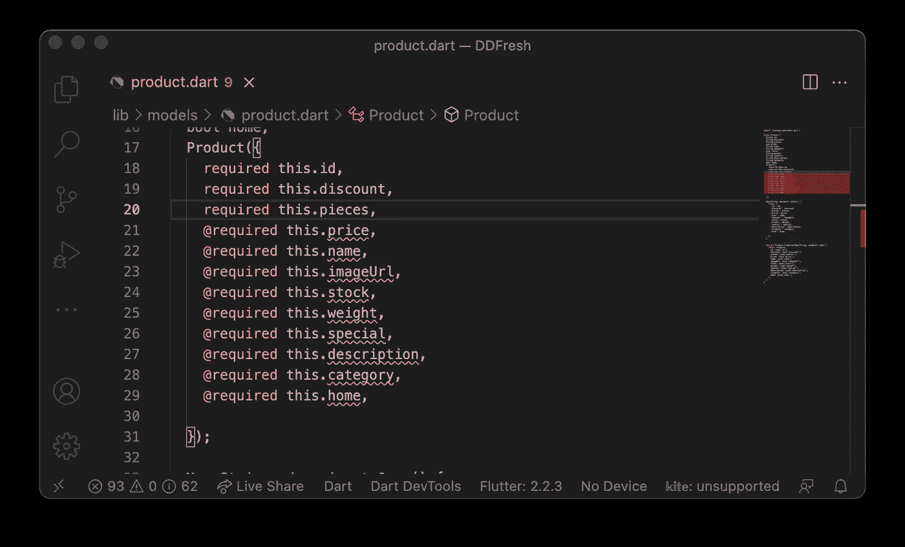
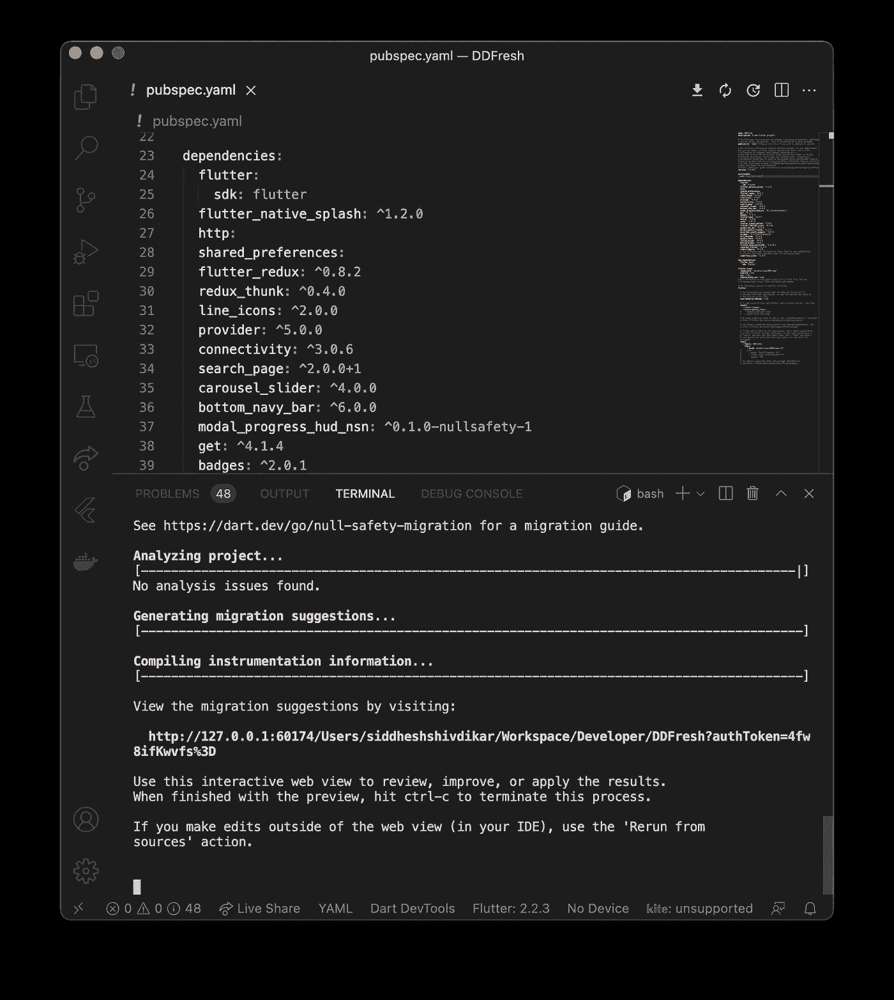
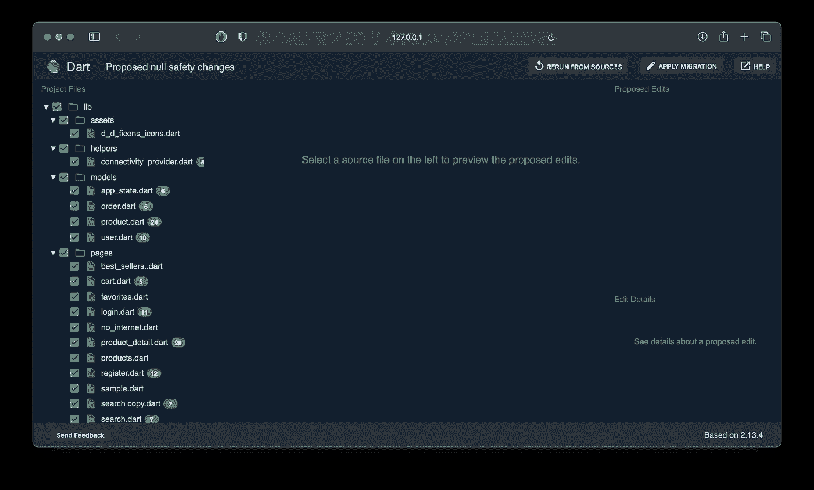
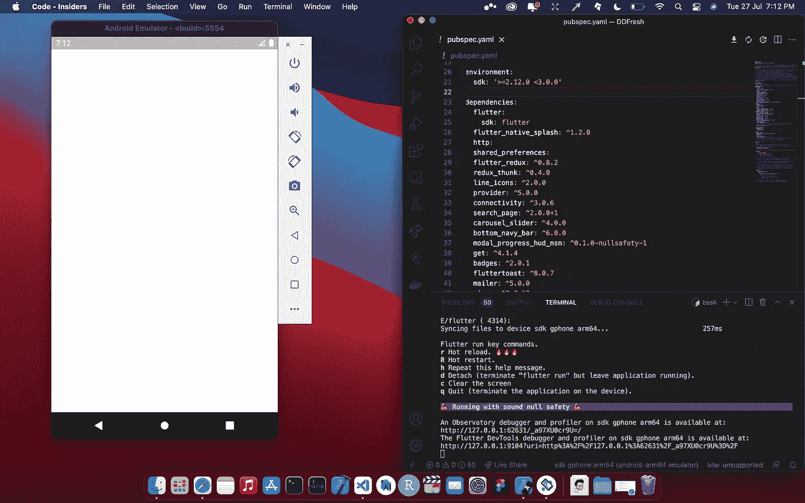
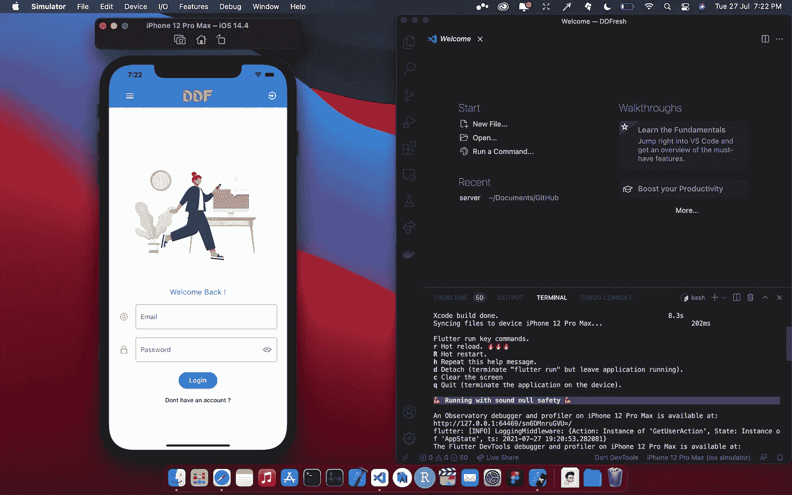

# 我的 flutter 2.0 迁移故事:比《暮光之城》更好的故事🔮

> 原文：<https://medium.com/geekculture/my-flutter-2-0-migration-story-still-better-story-than-twilight-5d3754bbf1a6?source=collection_archive---------24----------------------->

## 将 flutter 和 dart 版本升级到 2.0，并将现有项目迁移到新的更新开发环境



免责声明:在开始迁移过程之前，请务必进行完整的备份。一般来说，建议你至少拥有高于平均水平的 flutter 或编程技能👍，如果您有任何未解决的依赖关系。我不建议迁移您的开发环境，除非您需要整合 flutter 2.0 的特性。先说故事。

## 日期是 7 月 27 日，颤振应用程序…需要升级…🤭

对于喜欢构建原生应用程序的开发人员来说，flutter 2.0 带来了什么新的东西？最重要的特性是空安全性，它通过区分可空类型和不可空类型进一步增强了 Dart，这有助于防止空崩溃，这是应用程序崩溃的常见原因😵‍💫。看起来很漂亮的谷歌移动广告和 iOS 的新 Cupertino 材料组件是我的最爱。

首先，你必须升级你的颤振和飞镖版本。你可以在你的终端上运行 flutter--upgrade。如果这个命令不起作用，这意味着已经对您的 flutter SDK 进行了修改，因此您可以通过使用以下指令来强制升级。之后，您可以运行 flutter a doctor 来验证用于检查您的 flutter 安装的待办事项列表。

## 起初一切都是彩虹和独角兽🦄

让我们继续将我们的应用程序迁移到最新的 SDK 版本，但是首先备份您的 flutter a 项目，因为不是所有的 flutter 项目都可以迁移。对于可解析的包，我们可以使用下面的命令。

```
flutter pub outdated --mode=null-safety
```



Package checking

如果您注意到最右边带有“x”的依赖项，这些是无法解决的，如果它们提供了功能性的可能性，您应该等到它们被解决。有记号的是头奖；您可以复制这些版本，然后将它们粘贴到您的“pubspec.yml”文件中。



Find alternatives if packages are for Aesthetics

现在是未解决的问题，因为它们没有提供像状态管理、API 处理或会话存储这样的功能前景。我选择放弃其中的一些，并在酒吧开发网站上寻找替代品。检查发布开发中未解析的包；您可能仍然会发现许多支持零安全的替代方案。例如，我没有使用 SplashScreen，而是使用了 flutter native splash: 1.2.0，它提供了 null 安全性。我将对剩下的三个包重复这个过程，我们不再有任何包的问题。如果你注意到一波错误，不要惊慌；一切都会恢复正常，希望是🥲.

检查您的 dart 版本是否至少是 2.12。如果不是，请使用命令" dart- -version "来检查您的 dart 版本。它通常会随着你的 flutter 包更新。

## 让我们为了科学而这样做🚀

您可以跳到下一部分，无需手动修复。升级后我在 pubspec 文件里把 flutter SDK 版本改成了 2.12.0 3。零安全的标准相当简单。让我们通过添加最近的关键字来修复空变量，并出于科学的目的做一些手工劳动来观察发生了什么变化。示例“@ from @required”



！将可空类型转换为不可空类型，比如在 snackbar 中放置空检查，以及许多其他规则幸运的是，我发现了一个演练，我将在参考资料部分提供。

```
_scaffoldKey.currentState!.showSnackBar(snackbar);_formKey.currentState!.reset();}
```


Using the Late keyword for undefined placeholders

现在，在更新了变量并修复了 150+个可空约束之后，我仍然有几个问题，下面提到了其中的一些，我将手动纠正它们，因为，你猜对了！为了科学！🧑‍🔬你认为我修复 23 个错误需要多长时间？更新:修复它们花了一个小时。

```
error • A value of type 'Color?' can't be assigned to a variable of type 'Color' at lib/configuration.dart:3:21 • (invalid_assignment)
  error • The argument type 'Color?' can't be assigned to the parameter type 'Color' at lib/configuration.dart:6:13 • (argument_type_not_assignable)
  error • The argument type 'Null' can't be assigned to the parameter type 'Key' at lib/.dart:595:27 • (argument_type_not_assignable)
  error • The named parameter 'onInit' is required, but there's no corresponding argument at lib/.dart:46:16 • (missing_required_argument)
  error • The named parameter 'key' is required, but there's no corresponding argument at lib/pages/.dart:27:14 • (missing_required_argument)
  error • The argument type 'void Function(String)' can't be assigned to the parameter type 'void Function(String?)?' at lib/pages/cart.dart:324:15 • (argument_type_not_assignable)
  error • The named parameter 'user' is required, but there's no corresponding argument at lib/pages/.dart:194:15 • (missing_required_argument)
  error • The named parameter 'key' is required, but there's no corresponding argument at lib/pages/.dart:195:15 • 
  error • The named parameter 'user' is required, but there's no corresponding argument at lib/pages/.dart:216:15 • (missing_required_argument)
  error • Undefined name 'user' at lib/redux/.dart:24:33 • (undefined_identifier)
  error • The default 'List' constructor isn't available when null safety is enabled at lib/redux/.dart:156:42 • (default_list_constructor)
  error • The named parameter 'store' is required, but there's no corresponding argument at test/widget_test.dart:16:29 • (missing_required_argument)
```

*鼓角色* 🥁成功地更改为空安全，但让我们看看应用程序是否再次工作，因为我想自己学习所有的转换。手指交叉。这款应用确实推出了，但一些功能被破坏了。现在我们已经完成了实验，让我们试试 dart 迁移工具。

## 你迷失了方向…你的起点在这里。🤗

我回滚到开始，保留了迁移文件中的 pub 文件，删除了未满足依赖关系的实例，并执行了 **dart 迁移。**



Dart migrate success

此时，我想对 Flutter 和 Dart 团队表示感谢，感谢他们让手动迁移预览变得信息丰富👏，通过视觉亮点向您展示迁移的变化，这太棒了。我亲自检查了所有提议的修改并发现了它们。在点击迁移之前，我成功地完成了其中的 85%以上。点击 migrate flutter 后，更改会自动进行，你不必担心🤩。



Null safety changes proposed by the migration tool

然后我尝试了颤振运行命令。是的，这似乎没有工作，所以我尝试了两个模拟器只是为了确定，但没有，所以我没有颤振干净和颤振酒吧得到代替。没有运气仍然停留在空白屏幕上



Flutter Migration blank screen result

让我看看，当我手动执行时，只有几个功能坏了，但其他功能都正常。我能够浏览所有的面板，状态管理看起来是可操作的。由于我进行了手动迁移并了解了哪里最有可能出错，我做了必要的修改，然后,*鼓点* 🥁 ，它在🥳.成功了



Worked 🥳

从功能到布局的一切现在都可以利用新的颤振 V2 功能。我将进一步测试我的应用程序是否有任何错误，科学又一次拯救了我们！这就是我飘忽不定的迁徙故事。我将列出一些对我真正有帮助的资源，它们是纯粹的幸福。看看那些伟大的开发者，给他们你的支持。快乐编码✨