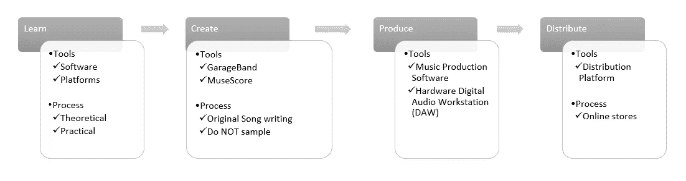

# 技术如何推动音乐制作(以及我尝试的框架)

> 原文：<https://medium.com/geekculture/my-framework-for-music-production-658d63a6713c?source=collection_archive---------6----------------------->

Not a Cloud or Cybersecurity topic as you can guess

在当今时代，学习、创作、制作和发布自己的音乐从未像现在这样简单——这是现代技术广泛采用和使用的结果，因为数字音乐格式和标准(MIDI、音乐压缩等)以及可以在任何低预算 windows 机器甚至平板电脑上运行的音乐制作软件(数字音频工作站)的便捷访问。

当然，知道如何演奏乐器的人并不多，但对于任何对成为“行业”的一部分感兴趣的人来说，这样做非常容易。

> 在这篇文章中，我着眼于我的一个爱好，从中学习，做我最擅长的事情，通过一个框架来理解过程和工具。

# 音乐创作

我不是一个熟练的玩家，也不是一个熟练的制作人(事实上，[我不擅长制作](https://www.youtube.com/c/yousuckatproducing)——这是一个多层次的事实，因为它有字面意义，但也是一个我非常欣赏的频道和内容)，我涉猎一些东西。

在我演奏(*)和*钢琴的这些年里，我在教堂接受指导时遇到了令人难以置信的天才音乐家。没有受过任何正规训练的人，有些受过正规训练，有些是高技能的多乐器演奏者。一些朋友走过这条路，在网络平台上创作和发布他们的作品，特别是[这位伟大的作曲家、歌手、吉他手和钢琴家](https://open.spotify.com/artist/2FYS1zCOspTDFb9TLsIIol)，他是我的老师、导师，在我很小的时候就给我分享学习音乐的工具。

从那时起，我通过自学和一些课程继续我的旅程，这些课程非常有助于获得在三角钢琴上演奏的额外知识和技巧。我还设法让朋友和家人对演奏一种乐器感兴趣，这也是令人满意的。

不过最近，我决定看看重新编码、编辑并将其发布到主要平台的过程。

如今发行和出版一首歌曲的过程非常简单。这是在抽象出一些关于版权、版税所有权等的复杂性的同时。

值得注意的是，这些将是在叶旧时代发布任何东西的部分问题。注册你自己的作品的过程本身就可能是繁琐和官僚的。我记得 7 年前看着这个，当时我创作了一些东西，投入了一定程度的精力写在乐谱上。从我当时的研究中发现，将我的创作转化为正确的音乐是相对困难的——那是在巴西，这也表明难度增加了，因为大多数过程不会像在第一世界国家那样数字化——我在这里没有实际的数字和统计数据来支持我，所以印象只是来自 7 年前对此的快速研究……

如今，在一个技术主导的世界里，从音乐学习的起源到向世界发布，整个过程变得容易多了。

我的看法是，通过观察音乐创作的过程，即 4 个阶段**(同样，这来自爱好者，而不是音乐家，也不是真正研究过这个的人——所以如果你有见解和评论，请分享，我可以附加/添加更多合格的信息)。**

1.  学问
2.  创造
3.  生产
4.  分配

对于每一个阶段，我相信都有必要说明:实现每个阶段所需的一些 ***工具*** 和 ***过程*** 。

# 结构

技术为每个阶段提供了许多好处，这是创造容易的核心——获得技术。

> 因此，每个人都必须有机会接触到上述技术。
> 
> 这句话本身包含了无数的挑战，这些挑战超越了你和我，但我们都可以参与解决:成为贫困人口的导师，捐赠对我们的工作流程没有或几乎没有价值的旧设备，但可以为某人的发展增加巨大的价值，等等。
> 
> 尽可能多地实践社会回馈，这就是我要说的。

## 学问

来源因您尝试学习的乐器类型而异。想学钢琴/工作室的人

**工具**

从硬件的角度来看，你会在网上找到大量关于你所选乐器的建议。有些入门套件可以在主流媒体上找到，如[《连线》](https://www.wired.com/story/best-gear-for-learning-music/)。

我强烈推荐的一项技术是 iOS 平板电脑。这应该是重中之重，即使它是一个旧设备。我有一台旧 iPad(带耳机插孔！)在消费、内容甚至后期制作方面，它都比 windows 平板电脑好得多。至于他们有多好，这一点都不好笑。

其他一些工具包括 iPad 应用程序，也包括在线视频和内容创作者。尽管对于初学者来说，我会推荐一个结构化的课程——对于初学者来说，观看随机的理论视频是一个陷阱，会耗费你的学习意愿。

我最近偶然发现了这个免费资源，里面有一些理论信息。但是我只是在对音阶的基础有了一些基本的了解之后才推荐。

有很多专注于音乐教学的订阅。这些应该是首选的方法，因为它鼓励持续参与音乐——我的意思是，当你看到你的钱经常离开时，这是你可能需要重新练习的额外动力(相信我，我曾经有过)。

如果你正在学习钢琴/琴键，买一架数码钢琴是一个很好的开始。这些包括加重的按键来模拟按键中的压力感(这需要并迫使更好的技术)。

便宜的钢琴对初学者来说并不理想，因为它缺乏演奏者的演奏范围。

附:学习乐理时避免“DJ”设备。这些都是伟大的后续跟踪，但采取了很多远离实际音乐理论的球员。这是一个专业的技巧，因为我自己陷入了购买青少年工程和 Arturia 硬件的陷阱，而没有正确的范围和需求定义。🙃

**流程**

我不是音乐老师，但我的经验是理论性的。首先，学习音阶和音乐理论是基础。有了它，你可以更容易地进行练习，因为你可以双重思考你用手在做什么，以及支持它的理论。

学习模拟仪器是有益的——我经常发现自己在专注于特定练习时，如果没有大量声音选项可供选择，效率会更高。此外，模拟仪器允许并迫使我们致力于我们的技术，随着时间的推移，这种技术会产生很高的收益。

## 创造

**工具**

用于创作的工具将包括您的乐器——拥有一个数字乐器有很大的帮助，因为一些软件可以使用 MIDI 从您的设备获取输入并生成其乐谱。

我最喜欢的音乐创作工具是 MuseScore 和苹果的 GarageBand。

**流程**

创作和准备发行原创作品需要原创作品。正如你在发布你的歌曲时会看到的，不使用样本和其他人的知识产权是最基本的。

受到某样东西的启发和直接复制某样东西之间只有一线之隔。

一些工具将极大地帮助你的作曲过程，你会看到与 MIDI 设备一起工作的软件，以帮助根据你的演奏生成乐谱，这对仍在音乐理论道路上爬行的人来说是天堂的东西。

## 生产

**工具**

制作工具将包括您的乐器，但也包括对其他组件[的更多了解，如混音器](https://www.youtube.com/watch?v=oXFiXWbj7Jc)、数字音频工作站 (DAW)或硬件 DAW (就此而言)。

我是 GarageBand 的忠实粉丝，因为它在 MacOS 和 iOS 上易于使用。对于 Windows，也有很好的免费选项，尽管有些可能太复杂而不值得花时间。

**流程**

制作音乐本身就是一门科学，只要开始寻找从事合成器工作的人，你就会明白声音设计的重要性。

我从来没有深入过这一层次的制作，但是有了基本的编辑知识，你就可以越过这一关。这并不是破坏或削弱声音设计师的工作，恰恰相反，把这部分留给专业人士，这就是我要说的。

> 把这部分留给专业人士，我就是这个意思。

## 分配

**工具**

当涉及到在网络平台上发布你的作品时，你必须使用一个发布平台。为此有各种选项，包括: **Distrokid、CD Baby、TuneCore 和 AWAL** 。

我不是专家，只用过 Distrokid，它运行良好，尽管它本身并不便宜。你需要为这项服务支付年费，才能无限制上传。但是在上传的时候，可能需要额外的费用，这取决于你提供的内容——例如，封面要求你每月向原创作者支付版税。

在 [youtube 上有这些平台的各种对比指南，比如这个](https://www.youtube.com/watch?v=mdep5z5-biI)。

**流程**

通过使用市场上的工具，分发的过程很简单。当你创建你的 Spotify 的艺术家页面时，你会看到可以用来将你的歌曲上传到平台的平台推荐。

事实证明，这些分发工具也适用于(几乎)世界上所有的音乐商店。一旦你选择了分销平台，它就会为你做好一切。

最后，从框架的角度来看，这是这样的:

A simple way to look at it.

# 结果

这样做的结果可以从单曲[的发行中看出来，比如这首](https://open.spotify.com/track/1sl1szRlYdFm7MYDCBMN8i?si=f997172ae1614a86)，这首歌是我几年前创作的，并在我上课的地方用*雅马哈格兰钢琴*录制的。我保留了录音，并在快速修改软件后，现在在这些平台上发布了它。

在一个需要更多努力、硬件和关系才能实现(某种程度上)类似的东西的行业发展了几十年之后，自己能够执行这些步骤确实是一个奇迹。

方法和结果不会说谎:

> 这是普及的技术，让每个人都能实现自己的梦想。

[考虑订阅 Medium (here)](https://andrecamillo.medium.com/membership) 获取更多内容，让你更有力量！

感谢您的阅读，并留下您的想法/评论！

# 。/参考

分散在整个文档中

Andre Camillo 的《Surpresa em D maior》——DistroKid