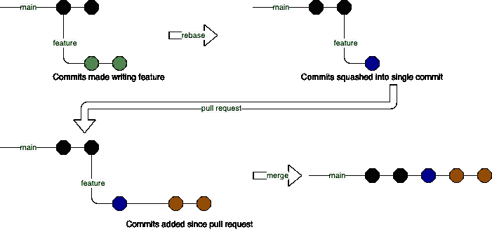

# 我的 Git 工作流

> 原文：<https://medium.com/geekculture/my-git-workflow-74d791fe2e96?source=collection_archive---------30----------------------->

2021 年 3 月 15 日

作者托马斯

当涉及到编写特性和处理`git`提交历史时，我想发布我自以为是的`git`工作流。我希望有人能获得一套新的`git`命令，甚至采用我的工作流程。该工作流假设 repo 是远程托管的(即 GitHub ),并且处理代码库的团队使用功能分支和拉请求来合并新代码。

我开始在`main`分支上工作，并运行`git fetch`和`git pull origin main`。这将更新我的主分支，并向我提供在远程回购中所做的、我还没有看到的任何更新。接下来是用`git checkout -b feature/my-feature`分支。当我在开发我的特性时，我提交。就像，很多承诺。我曾经在做了好事的任何时候都会保存我的视频游戏，那么如果它让我更接近接受标准，我为什么不保存我的工作呢？我确保提交消息对我来说是有组织的和可理解的。这样做的原因是因为我可能需要回滚到以前的良好状态，我想让未来的自己更容易找到它。

在完成并润色我的工作后，我检查`main`并从远程将其拉出以更新它，然后我运行一个 rebase 命令`git rebase -i main`。在 rebase 中，我将所有的提交压缩到一个提交中，并在出现冲突时修复它们。使用这个策略，我限制了我的 pull 请求和`main`历史中的提交混乱。

完成所有工作后，我进行最后一次推送(可能必须是强制推送)并创建一个拉取请求。如果在 pull 请求期间有建议的代码更改，那么我会对每个更改和 push 进行单独的提交。创建拉取请求后，不要重设基础。在发出“拉”请求或其他人正在使用分支后，重新确定提交的基础会使合并冲突难以解决，因为重新确定基础会重写提交历史。更不用说，当我必须强制推送更新时，它看起来并不太好。

这在流程图中是这样的:



Rebasing 本身可能是一篇博客文章，但我会尽量把它浓缩。当我们重定一个分支的基础时，我们获取自上次公共提交以来添加的提交，并将它们粘贴到我们正在重定基础的分支之上。如果我们重定基础的分支是我们最初分支的分支，实际上没有变化。当我们用不同于我们的提交重定一个分支的基础时，问题就来了，因为有潜在的冲突。首先，我将遍历一个没有冲突的分支上的 rebase，然后遍历一个有冲突的 rebase。我将用来演示的设置是一个全新的`git` repo，首先在`main`分支上有一个文件和一个提交。

```
$ git branch
* main
$ ls
test.txt
$ cat test.txt
this
is
a
test
file
```

首先是提交的分支和编辑

```
$ git checkout -b feature/add-text
Switched to a new branch 'feature/add-text'
$ echo "new" >> test.txt
$ git add .
$ git commit -m "Added the word 'new'"
[feature/add-text 7a6c68b] Added the word 'new'
 1 file changed, 1 insertion(+)
$ echo "text" >> test.txt
$ git add .
$ git commit -m "Added the word 'text'"
[feature/add-text 48392c2] added the word 'text'
 1 file changed, 1 insertion(+)
$ cat test.txt
this
is
a
test
file
new
text
```

现在我在我的特性分支上有两次提交，我的特性已经完成了，所以我将重定基础。

```
$ git rebase -i main
```

运行 rebase 命令后，我在默认的`git`文本编辑器中看到一些文本。(运行`git config --global core.editor`看看是什么。如果没有返回任何内容，`git`将使用`vi`作为默认编辑器。从现在开始，我们需要使用普通的`vi`命令来修改、保存和退出 rebase 的交互提示。)

```
pick 7a6c68b Added the word 'new'
pick 48392c2 Added the word 'text'

# Rebase 3427361..48392c2 onto 3427361 (2 commands)
#
# Commands:
# p, pick <commit> = use commit
# r, reword <commit> = use commit, but edit the commit message
# e, edit <commit> = use commit, but stop for amending
# s, squash <commit> = use commit, but meld into previous commit
# f, fixup <commit> = like "squash", but discard this commit's log message
# x, exec <command> = run command (the rest of the line) using shell
# b, break = stop here (continue rebase later with 'git rebase --continue')
# d, drop <commit> = remove commit
# l, label <label> = label current HEAD with a name
# t, reset <label> = reset HEAD to a label
# m, merge [-C <commit> | -c <commit>] <label> [# <oneline>]
# .       create a merge commit using the original merge commit's
# .       message (or the oneline, if no original merge commit was
# .       specified). Use -c <commit> to reword the commit message.
#
# These lines can be re-ordered; they are executed from top to bottom.
#
# If you remove a line here THAT COMMIT WILL BE LOST.
#
# However, if you remove everything, the rebase will be aborted.
#
```

为了保持这篇文章的长度，我想做的是通过将`pick`改为`s`或`squash`来压缩第一次提交后的所有提交。这是我几乎总是做的事情，尽管如你所见，有许多选择和路线。有教程详细介绍了 rebase 和这些选项。当我完成时，文件将如下所示。

```
pick 7a6c68b Added the word 'new'
s 48392c2 Added the word 'text'
```

在保存并退出`vi` ( `:wq`)后，我又面对另一个文件。

```
# This is a combination of 2 commits.
# This is the 1st commit message:

Added the word 'new'

# This is the commit message #2:

Added the word 'text'

# Please enter the commit message for your changes. Lines starting
# with '#' will be ignored, and an empty message aborts the commit.
#
# Date:      Mon Jan 25 17:29:34 2021 -0600
#
# interactive rebase in progress; onto 3427361
# Last commands done (2 commands done):
#    pick 7a6c68b Added the word 'new'
#    squash 48392c2 Added the word 'text'
# No commands remaining.
# You are currently rebasing branch 'feature/add-text' on '3427361'.
#
# Changes to be committed:
# modified:   test.txt
#
```

在这个文件中，我可以选择修改提交消息。因为我压缩到一个提交，所以所有压缩的提交消息和原始的提交消息都显示在这个文件中。在这里，我们可以将文件更改为我们想要的任何内容，当文件保存并退出时，任何文本都将成为新提交的消息。在保存和退出之前，我的文件是这样的。

```
Added the words 'new' and 'text'
```

保存并退出后，我被带回终端。

```
$ git rebase -i main
[detached HEAD fa7c054] Added the words 'new' and 'text'
 Date: Mon Jan 25 17:29:34 2021 -0600
 1 file changed, 2 insertions(+)
Successfully rebased and updated refs/heads/feature/add-text.
```

现在，我将做最后一次推送，并为我的特性分支创建一个拉取请求。

有冲突的 rebase 看起来略有不同，需要不同的`git`命令。我将使用同一个文件设置我的特性分支，但是这一次，我的`main`分支将添加一个 commit，对同一个文件进行新的更改。`main`的`test.txt`将如下图所示。

```
this
is
a
test
file
this is new text from main
```

当我运行 rebase 命令时，弹出的第一个屏幕将和以前一样，因此我将执行相同的操作。然而，当我保存并退出屏幕时，我在终端中遇到了新的输出。

```
$ git rebase -i main
Auto-merging test.txt
CONFLICT (content): Merge conflict in test.txt
error: could not apply 9a31390... Added the word 'new'
Resolve all conflicts manually, mark them as resolved with
"git add/rm <conflicted_files>", then run "git rebase --continue".
You can instead skip this commit: run "git rebase --skip".
To abort and get back to the state before "git rebase", run "git rebase --abort".
Could not apply 9a31390... Added the word 'new'
```

我需要解决合并冲突，或者运行`git add .`然后运行`git rebase --continue`来完成重置或者使用其他选项。我通常用`--continue`标志运行，除非发生了不好的事情，在这种情况下我运行`git rebase --abort`并重新开始。对于这个演示，我通过允许两行通过来修复合并冲突。

```
this
is
a
test
file
this is new text from main
new
```

在将文件添加到`git`并继续重定基础之后，我出现了一个屏幕，要求我为刚刚重定基础的提交输入一条提交消息。

```
Added the word 'new'

# Please enter the commit message for your changes. Lines starting
# with '#' will be ignored, and an empty message aborts the commit.
#
# interactive rebase in progress; onto 9fed945
# Last command done (1 command done):
#    pick 9a31390 Added the word 'new'
# Next command to do (1 remaining command):
#    squash 000a13a Added the word 'text'
# You are currently rebasing branch 'feature/add-text' on '9fed945'.
#
# Changes to be committed:
# modified:   test.txt
#
```

一个简单的保存和退出让我继续前进。下一个屏幕是我们之前看到的将两个提交消息合并成一个提交的屏幕。我执行相同的操作，保存，然后退出。重定基础现在已经完成，所以我将进行最后的推送，并为我的特性分支创建一个拉取请求。

*原载于 2021 年 3 月 15 日*[*https://thomasstep . dev*](https://thomasstep.dev/blog/my-git-workflow)*。*