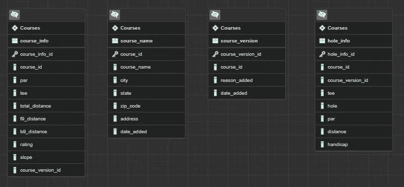
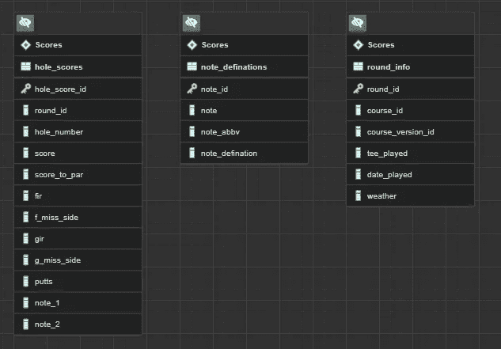
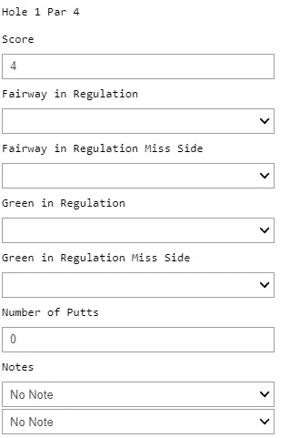
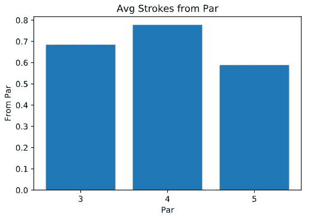
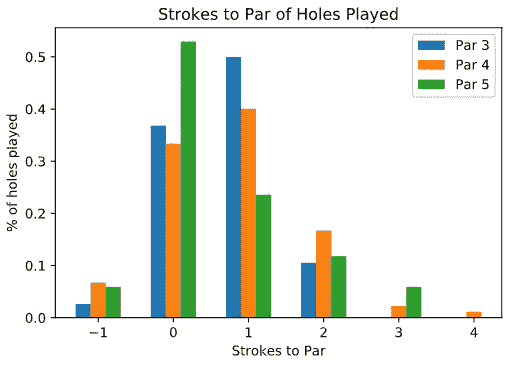

# 我的高尔夫数据—存储和输入

> 原文：<https://medium.com/geekculture/my-golf-data-storage-and-entry-d816546bae68?source=collection_archive---------29----------------------->

随着我在数据职业生涯中的进步，我的眼睛总是越睁越大，不仅在专业上，而且在个人方面。对于我的下一个个人项目，我想把我的职业经历和我的爱好高尔夫结合起来。我一直断断续续地打高尔夫，但随着年龄的增长，我花越来越多的时间关心我打得有多好，我认为是时候在我的比赛中运用一些分析技术了。

研究这个项目的第一步是开始寻找高尔夫应用程序，为我保存分数和其他数据。有一些应用程序可以在你的手机或智能手表上记录分数，但我想把我的分数拉下来进行个人分析。我看到的这些应用程序都没有公开的 API，所以我发电子邮件或以某种方式询问我是否可以访问我在他们的应用程序中输入的分数。我收到了一大堆“不”字的回答，但其他公司都没有给我回复。我甚至试图联系 USGA(美国高尔夫协会)，看看他们是否有一个 API 可以让我收集关于球场的信息，这也导致了另一个“不”。这让我开始尝试建立自己的系统来记录我的分数。

在弄清楚我将需要完全从零开始构建一个系统之后，我开始设计存储数据的数据库。我进入了一个双模式系统。第一个包含关于我玩的课程的信息，第二个包含关于我玩的每一轮的信息。第一个模式“Courses”包含四个表；课程名称，课程版本，课程信息，球洞信息。该模式包含可以在记分卡上找到的信息，最重要的表是 course_info 和 hole_info。Course_info 保存了一个球场的所有相关信息。这将是前九洞和后九洞的距离、总距离、等级和坡度。等级和坡度是两种不同的难度指标，用于比较课程。大多数高尔夫球场都有不同的发球台，人们可以在那里打球。这种球座差异会影响球场的距离和难度。尽管我有发球台，但我最喜欢的还是在同一球场的不同发球台上打球，这取决于和我一起打球的人。Hole_info 存储球场/球座级别的每个球洞的数据。标准杆、距离和差点是应该在这个表格中突出显示的栏。球洞差点是球场上特定球洞的难度等级。旁注——我认为用我的高尔夫分数和统计分析来揭穿这个排名会很有趣。Couse_name 保存了有关课程的可识别信息，而 course_version 是为了防止课程进行任何更新或更改。下面是课程模式的示意图。

第二个模式围绕每一轮游戏，包含三张桌子；round_info、hole_scores 和 note _ definations。Round_info 存储了每轮比赛的地点、使用的球座，甚至比赛期间的天气等信息。Hole_scores 保存一轮比赛中每一洞的数据。它不仅包含每个球洞的得分，还包含推杆、球道和果岭的规则击球，以及球道和果岭上的失误。如有必要，每个孔也有两个注释栏。我用笔记来标记发生了不正常的事情，通常是不好的事情。这些注释以缩写形式存储，但是全名及其定义可以在 note _ definations 表中找到。下面是分数模式的示意图。

这两个模式可以通过使用 round_info 表中的 course_id、course_version_id 和 tee_played 连接到 course_info 或 hole_info 表。

接下来是数据输入。我希望我的数据输入过程尽可能简单，但我可以很容易地重复。在 jupyter 笔记本中找到一个数据输入解决方案似乎非常适合我的情况。我偶然发现了一个名为 ipywidgets 的 python 包，并找到了我要找的东西。Ipywidgets 是一个 python 包，它允许您在 jupyter 笔记本中构建交互式 HTML 小部件。这些是非常简单的小部件，可以让您输入值、选择日期或从列表中选择值。这是我第一次使用 ipywidgets 包，但我想再次使用这个包，并在将来制作更复杂的小部件。大多数桌子都有自己的 jupyter 笔记本用来输入数据。Course_info 和 course_version 共享一个笔记本，round_info 和 hole_score 也共享一个笔记本。左上方是单个孔的数据输入示例。包含所有数据条目的完整笔记本可以在我的 GitHub 上找到:[https://github.com/CBJohnson30/Golf-Scores](https://github.com/CBJohnson30/Golf-Scores)

所有这些数据库设置和数据输入都会导致分析。由于这些数据只在我打高尔夫球的时候才出现，所以创建足够的数据来进行适当的分析需要时间。这包括播放的单个课程，足以推动对单个课程的分析并对课程进行比较。对我的高尔夫球运动来说幸运的是，我住在科罗拉多州，那里有很多不同的和很棒的球场，我可以去打，但这意味着我最有可能要等到 10 月份才能打完同一个球场五次。
我所做的是一些初步的分析，当谈到那个洞的标准杆时，什么类型的洞我打得最好。我有今年打了 162 洞的数据；38 个三杆洞，90 个四杆洞和 34 个五杆洞。我从查看每种球洞的平均杆数开始。

正如你在上面看到的，我打五杆洞最好，四杆洞最差。这些对我来说都不奇怪，但我认为这些数据可能有点失真，因为与其他两种类型的洞相比，我打了 4 杆洞。即使只打了 90 个洞，我也肯定会有几个放大的洞。更有趣的是，我将每种球洞与标准杆的击球进行了比较。这点可以从下面看出来。

对我来说，有两点偏离了图表。第一个是所有三种孔类型的方差。标准杆 4 杆分布在所有 6 杆中，而标准杆 3 杆只出现在其中的 4 杆中。另一点是五杆洞的+2 杆和+3 杆与标准杆洞的接近程度。这只是大约 0.06%的差距。也就是说，我打出三杆五杆洞的可能性几乎和我打出两杆洞的可能性一样大。这意味着当我有一个吹起来的洞时，我需要保持抬头，当我在一个洞上挣扎时，我也需要提高我的抢球能力。我将进一步研究这个问题，并使用我在这些洞上做的笔记来给我进一步的见解。

我想强调我在创建和填充高尔夫分数数据库时学到的最重要的事情之一。这就是将 ID 号视为整数和 varchars 的区别。在我以前的经验中，我总是特别注意将可识别的或分类的值作为字符串处理，即使它们可能是一个整数。我曾经在一个地方工作，在那里我们可以获得带有前导 0 或 2 ID 号的数据。这些前导零没有在 ETL 管道中丢失，这对我们数据的完整性至关重要。这个习惯也延续到了这个项目中。我的 ID 号是在插入到表中时使用 smallserial 数据类型创建的。相同的 smallserial ID 在连接表中是 varchar 数据类型。如果您查看我的 SQL 查询，您会发现我在我的 join 语句中将一列转换为 int 或 varchar。在这个小数据库中，这个操作根本不需要时间，但是我担心这个数据类型选择会在一个大得多的数据库中引起效率问题。在未来的项目中，我将需要统一这些数据类型，以使我的数据库更容易理解和查询。

这是一个与我开始时方向不同的项目，但我很高兴它走了这条路。我自己建立一个数据库将允许我做更多的事情，如果我是从另一个应用程序上下载的话。今年夏天和秋天，我继续打高尔夫球，一旦我有了更多的数据，我将在今年冬天从这个项目中获得更多的见解。