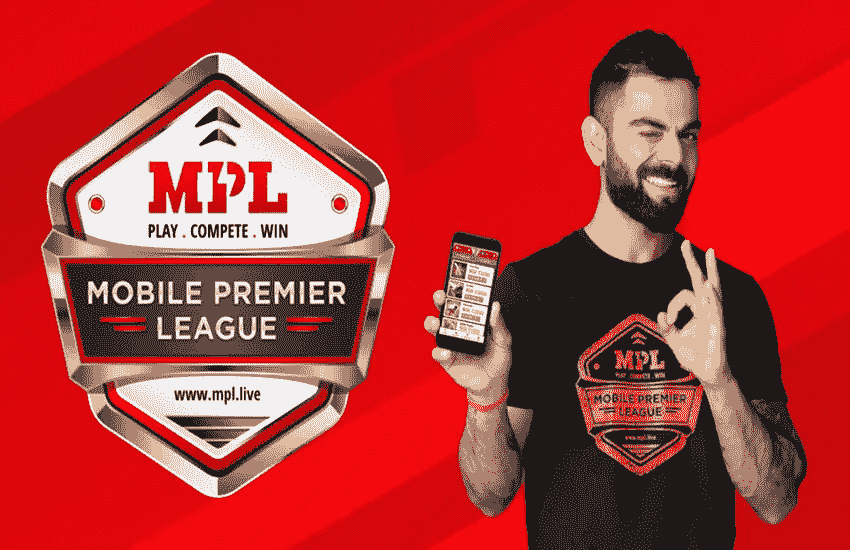

# 我在 MPL | React Native |游戏公司的面试经历

> 原文：<https://medium.com/geekculture/my-interview-experience-at-mpl-react-native-gaming-company-48b05fa2b999?source=collection_archive---------13----------------------->

MPL 代表**移动超级联赛**是一家印度在线游戏公司，拥有 9000 万以上的用户群(撰写本文时为 9000 万以上)。他们的规模对我来说是一个令人向往的机会，因为很少有应用程序拥有如此庞大的用户群。所以，我决定申请这个职位，下面是我的面试经历。

Fig: Mobile Premier League

(如果你正在准备 JavaScript 相关技术的面试准备(ReactJS，React Native，NodeJS，AngularJS)，请观看我的 YouTube 视频系列，附在下面)

# **我是怎么接到面试电话的？**

我在 LinkedIn 上申请了这个职位空缺，两天后我接到了招聘人员的电话，我的第一轮面试已经安排好了。我必须提到，他们有一个可爱的招聘团队，在每一轮之前和之后都非常温柔地和我说话。

**第一轮(JavaScript 基础和 React 原生屏幕实现)**

第一轮专门讨论 JavaScript 基础知识。面试官问了我很多 JavaScript 基本问题，总结如下。

1.  用 JavaScript 实现去抖动
2.  在 JavaScript 中实现节流
3.  给定一个嵌套数组(例如:[[1，2，3]，4，[5，6]，[7，[8，9]])，您需要按顺序打印所有元素。(例:1，2，3，4，5，6，7，8，9)
4.  函数 curry 与无限 curry(例如:sum(10)(20)(30)…..())
5.  在 React Native 等中实现基本 FlatList

当我参加这次面试的时候，我已经被很多公司面试过了，所以这些问题很常见，我回答了所有这些问题，面试官很高兴。

**第 2 轮(JavaScript 和 React Native 的基础知识)**

我在完成第一轮后 2-3 天参加了这一轮。不记得这一轮问了什么具体问题，这一轮主要是基于 React Native 和 JavaScript 的基础知识。

**第 3 轮(人力资源讨论)**

这是一个文化契合的回合，HR 解释了很多关于公司的信息，她提到了公司内部的该做和不该做的事情。除了这一轮，没有什么特别要提的。

**第 4 轮(薪资讨论)**

此时，我得到了另一家公司的录用通知，因此我没有参加 MPL 的薪资讨论。总的来说，这是 MPL 采访的一次很棒的经历，一群优秀的人在创造伟大的产品。

为了更好地准备你的面试，请观看我下面的视频。

# 同一作者的更多文章:

1.  [我在信实 JIO 的面试经历。](https://mevasanth.medium.com/my-interview-experience-at-reliance-jio-react-native-jio-money-2805086d851e)
2.  [使用头部发出 Get 请求，以在 React Native 中呈现图像](https://javascript.plainenglish.io/react-native-making-get-request-to-display-the-image-f75d4338c5e2)
3.  [JavaScript array . push()是深度拷贝还是浅度拷贝？](https://javascript.plainenglish.io/array-push-in-javascript-is-it-deep-or-shallow-copy-90cd195ec5b7)
4.  [如何在 JavaScript 中展平数组的数组](https://mevasanth.medium.com/flatten-array-of-array-in-javascript-microsoft-interview-question-345c71ff9ccd)

在这里阅读作者[的所有文章](https://mevasanth.medium.com/)。