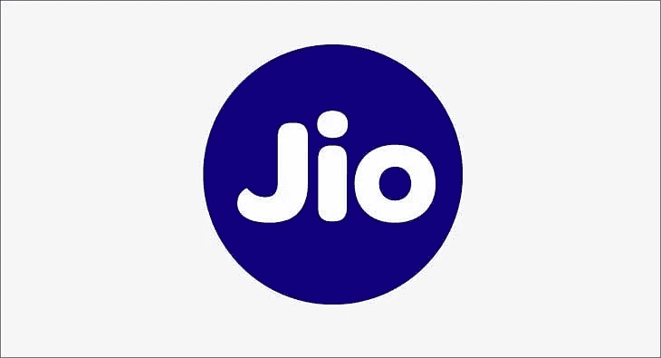

# 我在 Reliance - Jio 的面试经历

> 原文：<https://medium.com/geekculture/my-interview-experience-at-reliance-jio-react-native-jio-money-2805086d851e?source=collection_archive---------5----------------------->

我认为印度人不需要介绍 Reliance Jio。对于外国人， *Reliance Jio Infocomm Limited，以 Jio 的名义开展业务，是一家印度电信公司，也是 Jio Platforms 的子公司，总部设在马哈拉施特拉邦的新孟买。*

我在 Reliance Jio(以下简称 Jio)面试 React 本地开发者的角色，以获得他们的应用 Jio 资金。为支付应用程序工作对我来说是一个有抱负的角色。所以，我决定接受这次采访。以下将解释我在 Jio 的面试经历。

(如果你正在准备 JavaScript 相关技术的面试准备(ReactJS，React Native，NodeJS，AngularJS)，请观看我在下面附上的 YouTube 视频系列)

# 我是怎么接到面试电话的？？

我申请了 LinkedIn 的职位空缺，因为我的 LinkedIn 个人资料是最新的，两天内我接到招聘人员的电话，我的第一轮面试就安排好了。

**第一轮— (JavaScript 和数据结构与算法)**

第一轮专门讨论 JavaScript 和数据结构的基础知识。下面是一些 JavaScript 问题，

1.  写一个片段来解释去抖动
2.  写一个解释节流的片段
3.  如何找到给定链表的中间元素
4.  给定一个二叉查找树，写一个程序来执行深度优先搜索和 BFS

我能够回答前 4 个问题以及 JavaScript 和 DS/Algo 的其他基本问题。但是我无法回答第四个问题。因为那一轮我只准备了 JavaScript 和 React Native，它来得太突然了。但是面试官没有认真对待，从第一轮中选出了我。

**第 2 轮—(纯 React Native)**

在一天内通过第一轮后，我接到招聘人员的确认电话，下一轮就开始了。这一轮是纯自然反应，问的问题是，

"**以相反的顺序实现倒计数计时器。从 10 开始到 0，第二次延迟，同时显示每次计数**

这在开始时似乎很容易，但是除非你知道 setTimeout 在 useEffect 中是如何表现的，否则你将无法回答这个问题。这花了我大约 40 分钟来回答，因为每次我完成一个面试官问的小问题，我都能回答。

**问这个问题的原因**

1.  面试官最近已经解决了这个问题，他想知道我的解决方法。
2.  了解我对 react 生命周期挂钩和在其中使用 setTimeout 的理解。

我能够回答这个问题，但是有一个最优解，面试官后来给我解释了。

**第三轮(纯反应原生)**

幸运的是，我也可以清除第二轮。我花了 2-3 天时间准备下一轮面试，这一轮是架构师或技术负责人的一轮，他们问了一些关于 React 和移动应用开发的深入问题，只有你每天都在 React Native 上工作，你才能回答。

被问到的问题。

1.  鉴于这一事实，为了成功地进行 API 调用，我们需要 auth token 。在屏幕**中，三个 API 调用正在并行进行**。**甚至在进行第一次 API 调用之前，auth 令牌就已经过期**。如何确保只进行一次调用，就知道令牌已过期，并且在进一步调用 API 之前从后端收到新令牌。
2.  创建一个包含一些项目列表的平面列表。其中，默认情况下，所有的卡都是绿色的，点击一张卡，只有那张卡变成红色，其余的卡保持绿色。
3.  如何编写一个服务，以便每个 API 调用都通过它。

如果您没有开发过涉及复杂令牌处理机制的应用程序，那么第一个问题就有点棘手。我能够部分回答第一个和第二个问题。第三，我很容易回答。除此之外，还有许多基本的 JavaScript 问题，我都能回答。

**第 4 轮(CTO 回合)**

第三轮结束后，有一段时间没有任何消息，突然招聘人员打电话通知你，你被 CTO 选中参加最后一轮面试。这一轮是电话，而其余几轮是视频电话。CTO 接受我采访的时候正忙着一些个人工作。他问了我一些基本的编程问题，我相信他问的决定性问题是

***给出九颗相同的石头。一块石头比其他九块稍微重一点。您只能使用秤两次。怎么才能找到重一点的呢？***

如果你不知道答案，可以在这里找到[。](https://www.quora.com/Nine-identical-stones-are-given-One-stone-is-slightly-heavier-than-the-other-nine-You-can-only-use-the-scale-twice-How-can-you-find-the-heavier-one)

坦率地说，我无法正确回答，这是一个大约 15 分钟的简短电话，而剩余的会议是 1 到 1.30 小时。

这一轮过后，招聘人员没有任何消息，后来他们说，我被搁置了。可能我还在等着😂😂。我尊重他们的决定，如果你们中的任何人申请类似的机会，在参加面试之前至少准备好这些问题。

为了更好地准备你的面试，请观看我下面的视频。

# 同一作者的更多文章:

1.  [我在 MPL 的面试经历](/geekculture/my-interview-experience-at-mpl-react-native-gaming-company-48b05fa2b999)
2.  [使用头部发出 Get 请求，以在 React Native 中呈现图像](https://javascript.plainenglish.io/react-native-making-get-request-to-display-the-image-f75d4338c5e2)
3.  [JavaScript array . push()是深度拷贝还是浅层拷贝？](https://javascript.plainenglish.io/array-push-in-javascript-is-it-deep-or-shallow-copy-90cd195ec5b7)
4.  [如何在 JavaScript 中展平数组的数组](https://mevasanth.medium.com/flatten-array-of-array-in-javascript-microsoft-interview-question-345c71ff9ccd)

在这里阅读作者[的所有文章。](https://mevasanth.medium.com/)