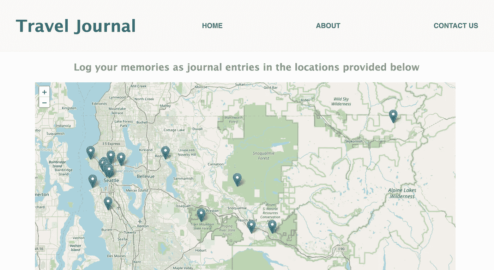
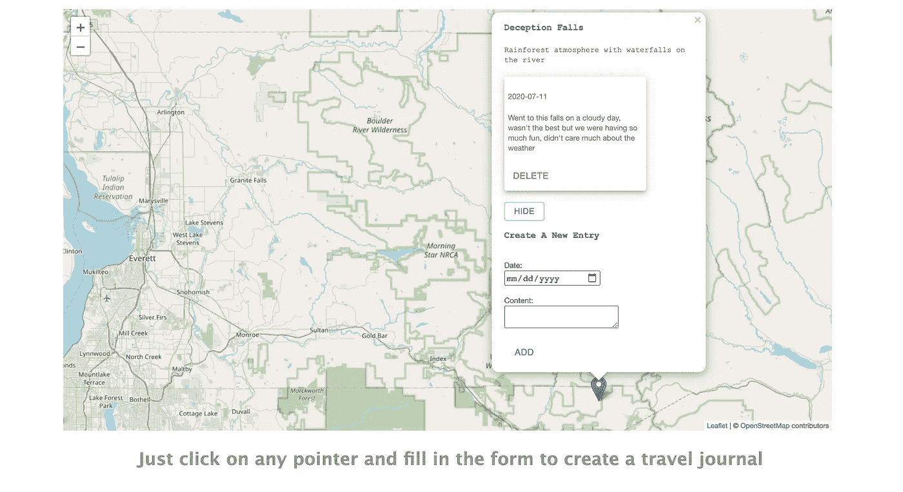

# React-Redux 应用简介

> 原文：<https://medium.com/geekculture/my-intro-to-react-redux-application-4c081560388e?source=collection_archive---------26----------------------->

对于我的最终作品集项目，我必须在终端中使用 create-react-app 命令创建一个应用程序。我将谈谈我在做这件事时学到的东西。

起初，React 看起来很复杂，这与你通常所习惯的大相径庭，所有的信息看起来很多。但是，与代码和生活中的所有其他事情一样，实践有助于您掌握诀窍。不仅如此，过了一段时间，我对他们提出 React 的方式印象深刻。我知道 javaScript 有多个版本，但 React 是我的第一个版本，我很喜欢学习它。

对你最有帮助的指南肯定是 reactjs.org，这是他们自己的文档，实际上写得很好，非常容易理解。所以让我们开始吧。

create-react-app 为您提供了一个类似如下的文件结构:

```
>Your-Project-Name
>public
>src
 #App.css
  App.js
  App.test.js
 #index.css
  index.js
  logo.svg
  reportWebVitals.js
  setupTests.js
  .gitignore
{}package.json 
```

公用文件夹中有您不需要对其进行更改的文件。您的工作将落在 src 中，如果您使用 redux，您的 src 应该看起来像这样:

```
>src
 >actions
  getTodos.js >components
  Home.js
  Nav.js
  Footer.js
  TodosContainer.js
  Todo.js >reducers 
  todosReducer.js
```

这是不必要的，大多只是惯例。在 Rails api 的帮助下，我在上面的目录中设置了我的后端。

```
>Project_Directory
 >project_api
 >project_client
```

这里，project_api 处理后端，而 project_client 处理前端。

在 scaffold 的帮助下，您可以使用已经填充的控制器自动构建数据库、模型和控制器，并像应该的那样呈现 json。我的项目只使用了一个模型，并计划在未来添加其他模型。

我想建立一个项目，用户可以在旅行时创建基于位置的日志。当我和我的同事去旅游的时候，我有了这个想法，有时候我们不记得我们是否去了一个特定的地方或者我们在那里做了什么。另外，我也不是那种习惯写日记的人，这种事情从来没有发生过！

这个应用程序可以帮助你创建基于位置的日志条目，你可以输入发生的个人事情，这样更容易记住。
对于这个项目，我使用了 leaflet.js，并且必须键入 yarn add react-fleagle 来安装依赖项。



This is the home page where the map from leaflet is being rendered along with the pointers

回到代码，我曾经使用 Redux 通过 thunk(中间件)连接到商店，这使得添加新条目或删除它们更容易。规则是，如果你发现自己过于频繁地使用“道具”,那么只需将该状态添加到存储中，并从那里调用它，这样就减少了从父母到孩子传递道具的情况。

在***actions/get journals . js***中，你可以进行所有的获取调用，从后端获取这些条目，或者在你创建一个新条目时“发布”它们。

它看起来应该是什么样的示例:

```
*actions/getJournals.js*export const getJournals = () => {
   return dispatch => {
      dispatch({ type: "LOADING" })
      fetch("http://localhost:3001/journals")
      .then(resp => resp.json())
      .then(journals => dispatch({type: "SET_JOURNALS", journals}))
    }
}
```

这就是你如何访问后端的所有项目。

```
***reducers/journalsReducer.js***const initialState = { journals: [], loading: true }const journalsReducer = (state=initialState, action) => {
   switch(action.type) {
   case "LOADING":
      return {
         ...state,
         loading: true
    } case "SET_JOURNALS":
       return {
         ...state,
         loading: false,
         journals: action.journals
    }
    default:
    return state,
    }
}export default journalsReducer
```

你的**减速器**被连接到商店，它是一个**函数**，决定**将**改变为**应用程序的状态。**它使用收到的**动作**来确定这种变化。Redux 非常依赖 reducer 函数，这些函数接受前一个状态和一个动作，以便执行下一个状态。
您可以添加更多类似“添加 _ 日志”或“删除 _ 日志”的案例。这些情况用在分派函数的参数“type”中。

您可以在表单中或任何决定添加用户可以使用的按钮功能的地方使用这些函数。

**父组件和子组件**

您可以将道具从父组件传递到子组件。你甚至可以使用回调函数。我将 List.js(呈现所有条目的地方)连接到存储，方法是使用:

*从“react-redux”导入{ connect}*

然后添加一行:

*导出默认连接(mapStateToProps，{deleteJournal})(列表)*

到最后。通过这种方式，我们将状态发送到存储，并从操作中获取调度函数(在本例中为 deleteJournal)。

```
class ListFiltered extends Component { render() { const journals = this.props.journals.map( journal =>
      <Journal key={journal.id} date={journal.date} content=       {journal.content} **deleteJournal={this.props.deleteJournal}** />) return (
          <div>
          {journals}
          <p></p>
          </div>
       )
   }}
```

这里我们将 deleteJournal 函数发送给子组件。

由于上述原因，我们可以在我们的子组件(Journal.js)中这样做

```
class Journal extends Component {handleDelete = () => {
     this.props.deleteJournal(this.props)
     }
     render() {
     const { id, date, content } = this.props;
        return (
           <div>
           <p>{ date }</p> 
           <p> { content }</p>
           <button onClick={this.handleDelete }>Delete</button>
         )
      }
}
```

现在我们可以在子组件中使用删除功能。



Here is what happens when you click on the pointer. You are able to fill the form and that gets added to the list.

除此之外，还有很多其他的反应，但我喜欢使用它的原因是它的纪录片是如此容易获得，以及无数人的博客显示他们将如何做。这就是 React 的问题，做一件事有很多方法，你只需要选择一个你觉得合适的方法。

感谢阅读。