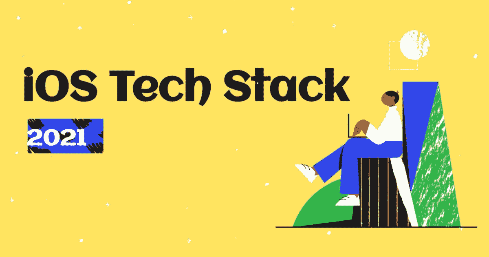

# 我的 iOS 技术堆栈 2021

> 原文：<https://medium.com/geekculture/my-ios-techstack-2021-2cdb6739972c?source=collection_archive---------12----------------------->

*最初发表于*[*【https://blog.malcolmk.com】*](https://blog.malcolmk.com/my-ios-techstack-2021-ckqrs544t06p9jcs1dt778b7a)*。*

在这篇文章中，我将分享我目前用来开发的工具、架构和资源。

关于我:我是南非开普敦的一名 iOS 工程师🏝👋🏾。我在金融科技和电子商务领域开发 iOS 应用已经超过 5 年了。我喜欢打造影响人们生活的产品，我认为在 Swift ⚡️😉。

我的目标是让这成为我博客的年度内容。这个列表将总结我每年的学习，以及分享新事物的方法。看看这份名单每年的变化会很有趣。

# 2021 年的 iOS 发展

作为一名 iOS 开发者，这是一个非常激动人心的时刻。#WWDC21 & #WWDC20 充满了许多新的有趣的东西，我们现在可以用它们来构建应用程序。虽然由于缺乏与 iOS 版本的向后兼容性，有些不能立即使用，但我认为这是一个学习的机会。从现在起到你的团队准备放弃对以前 iOS 版本的支持，你可以利用这段时间学习 SwiftUI、Combine 和 async-await。

由于我开发的大多数应用程序都不能使用苹果发布的一些最新功能，所以你不会看到它们包含在列表中。

# TL；(博士太长；没看)

*   浪子
*   开源代码库
*   CI / CD — GitHub 操作
*   雨燕
*   SwiftGen
*   RxSwift
*   MVVM
*   UIKit
*   快速灵活
*   博客
*   油管（国外视频网站）

这些是我用于 CI *(持续集成)* & CD *(持续交付)*的工具

## Xcode

作为一名 iOS 开发者，不使用 Xcode 几乎是不可能的。这些年来，我们钟爱的 IDE 有了很大的改进。苹果团队已经发布了许多令人惊叹的功能，让我们作为开发者的生活变得更加轻松。就个人而言，我真的很喜欢源代码控制集成，迫不及待地想尝试 Xcode Cloud。

## 浪子

我用浪子来自动化所有的事情！发行版、发行说明、变更日志、测试飞行和 AppStore 构建是我用浪子自动化的一些事情。

## 开源代码库

我不仅使用 Github 进行源代码控制，最近还开始使用 GitHub Actions 进行 CI/CD。将我的代码和 CI/CD 放在一个位置对我来说是一个重大的胜利💯。

# 代码工具

在我看来，每个 iOS 项目都应该设置这些工具。 [SwiftLint](https://github.com/realm/SwiftLint) 确保代码风格和语法得到遵守和一致。SwiftGen 为你的所有资源生成代码，使它们类型安全。所有的 iOS 开发者都喜欢类型安全和干净的代码❤️.

随着越来越多的库增加对 SPM 的支持，我已经开始从 CocoaPods 迁移库并使用 SPM 进行依赖管理。

# 体系结构

架构和设计模式的话题永远是 iOS 社区的热门话题。我愿意相信我已经找到了适合我的架构。这个部分可能是一系列独立的文章。

*   MVVM *(模型-视图-视图模型)*
*   RxSwift
*   [协调员模式](https://www.hackingwithswift.com/articles/71/how-to-use-the-coordinator-pattern-in-ios-apps)
*   用于持久性的 SQLite
*   [gRPC](https://github.com/grpc/grpc-swift)
*   [快速&敏捷](https://github.com/Quick/Nimble)进行单元测试

我非常喜欢 MVVM 图案。它没有太多的样板代码，这使得它易于理解和测试。与 MVVM 合作，我喜欢使用 RxSwift 将属性绑定到视图。苹果已经认可[函数反应式编程](https://yalantis.com/blog/reactive-programming-on-objective-c/)与 Combine。我很期待将来什么时候能用 Combine 代替 RxSwift。

我已经包括了 gRPC，尽管它通常依赖于后端。与 gRPC 一起工作是一种享受。我不知道为什么更多的球队不用 gRPC。它是轻量级的、类型安全的，并且具有用于大多数语言的内置代码生成。这里可以阅读更多[。](https://www.altexsoft.com/blog/what-is-grpc/)

# 用户界面

我不会在这里详细介绍，但会包括讨论所列主题的资源链接。如果您想让我更详细地讨论任何主题并讨论我的具体实现，请留下您的评论。

*   [可样式化视图](https://stackoverflow.com/questions/61162934/generic-uiview-initializer-with-closure-in-swift)
*   [可组合&可重用协议](https://swiftwithmajid.com/2019/01/17/using-protocols-as-composable-extensions/)
*   堆栈视图
*   [ScrollStackViewControllers](http://octotap.com/2019/08/03/uistackview-inside-uiscrollview/)
*   [构图布局](https://lickability.com/blog/getting-started-with-uicollectionviewcompositionallayout/)
*   [不同的数据源](https://github.com/ra1028/DiffableDataSources)
*   [翠鸟](https://github.com/onevcat/Kingfisher)

我不得不提到这两个不同的库 DataSource & KingFisher🌟。DiffableDataSource 是苹果 diffable 数据源的一个反向端口，可以在 iOS 9 及更高版本中使用。因此，您可以使用复合布局和不同的数据源，而不会失去对以前 iOS 版本的支持。

翠鸟是图像缓存之王。如果你的应用下载图片，看看这个库。它增加了对缓存、加载状态、占位符图像和其他图像呈现相关特性的支持。

# 知识库

始终跟上最新技术并不断提高技能是很重要的。下面是我用来实现这一目标的资源列表。

# 社区

*   开源代码库
*   推特
*   同事
*   Stackoverflow

iOS 开发者社区就是这么牛逼的一个社区。有很多人自由地与他人分享他们的知识。这些年来，我从这个社区学到了很多东西。

*如何最好地利用社区:*

1.  积极点！创建 Twitter 个人资料，关注其他 iOS 开发者，参加 iOS 开发者欢乐时光。
2.  看文档，看 Github 上的代码，找公开的 repos，试着理解代码。
3.  使用 Stackoverflow，不要只是复制粘贴，理解然后复制粘贴。
4.  向你的同事和前辈学习。不要害怕提问和挑战现状。

# 博客

*   [SwiftBySundell](https://www.swiftbysundell.com/)
*   [利用 Swift 进行黑客攻击](https://www.hackingwithswift.com/)
*   [SwiftWithMajid](https://swiftwithmajid.com/)
*   [Khoa 的快速发现](https://onmyway133.com/)
*   [SwiftLee](https://www.avanderlee.com/)
*   [可舔性](https://lickability.com/)
*   [五星](https://www.fivestars.blog/)
*   瓦迪姆·布拉文
*   中等
*   哈希诺德

# 油管（国外视频网站）

*   [TundsDev](https://www.youtube.com/c/tundsdev)
*   [KavSoft](https://www.youtube.com/c/Kavsoft/featured)
*   彼得·弗里斯

# 书

*   唐尼·瓦尔斯
*   [Swiftjectivec](https://www.swiftjectivec.com/a-best-in-class-app/)
*   [雷文德里奇](https://www.raywenderlich.com/)

# 时事通讯

*   [Infinum iOS 可可请客](https://infinum.com/ios-cocoa-treats/)
*   [iOSGoodies](https://ios-goodies.com/)

> *“成为你大三需要的高级工程师。”—匿名*

感谢您阅读我的帖子，请用工具留下您热爱✌的评论🏾。请继续在 Swift ⚡️思考！

*原载于*[*https://blog.malcolmk.com*](https://blog.malcolmk.com/my-ios-techstack-2021-ckqrs544t06p9jcs1dt778b7a)*。*