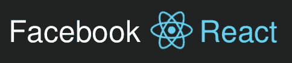
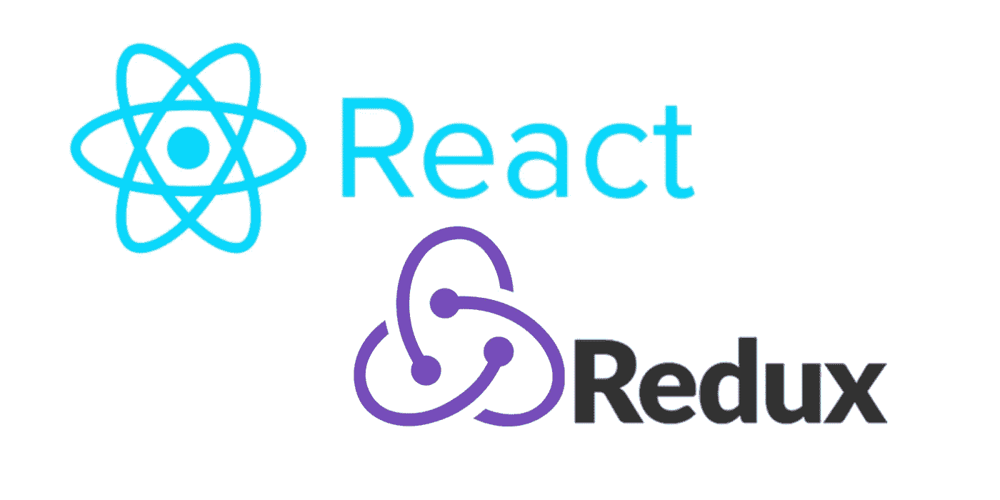

# JavaScript 疲劳

> 原文：<https://medium.com/geekculture/my-javascript-fatigue-c12552095d9a?source=collection_archive---------14----------------------->

让我告诉你一个关于我的 JavaScript 疲劳和我如何克服它的故事

JavaScript 是软件开发领域最受欢迎的编程语言。由于其受欢迎程度，工具不断被发明出来，很快就有了转头的功能。

结果，开发人员在**“跟上 JS”**上受到了压力，由于这种影响，它导致了我们现在所说的“JavaScript 疲劳”。

# 定义

根据 [**Auth0**](https://auth0.com/) 这是一家安全公司声明，JavaScript 疲劳定义为:

> ***担心变得过时并难以跟上 JavaScript 工具不断变化的开发人员。***

# 什么时候开始？

每当一个新的框架诞生，当你对你的项目失去兴趣时，它就开始了。

认为新框架的突出特点总是优于旧框架。

还在迷茫？让我举一个现实的例子来进一步解释。

# 故事

谷歌在 2010 年 10 月 20 日推出了 AngularJS，并推广了其他框架没有的“数据绑定”特性。

我被它打动了，因为我认为一旦我的客户的应用程序有了这个功能，他们会感到惊讶，这就像用户界面中的**【实时】**变化。

我的另一个同事也从 K [nockoutJS](https://knockoutjs.com/) 转到另一艘船上 [AngularJS](https://angularjs.org/) 。

三年后，脸书推出了 ReactJS ，知道它是迄今为止最受欢迎的社交网络之一。

然后他们引入了基于组件的架构。它为应用程序的模块化和可维护性提供了更大的机会。

而我呢，并没有被它卖了，依然 [**AngularJS**](https://angularjs.org/) 对当时的我来说已经足够了……直到 [**反应过来 REDUX**](https://react-redux.js.org/) 推出。

它破坏了管理全球状态的方式，在这种方式中，它提供了“单一真实来源”原则，而不是拥有多个存储。

这给开发带来了巨大的好处，因为您使用的是单个状态实例，调试数据流更加方便，所以可以最大限度地减少编码工作。

现在，它又重复着从安古拉吉斯到雷卡特吉斯的跳船循环。

现在感觉又重新开始了。各公司开始对 ReactJS 的创新功能趋之若鹜。所以我需要尽快重新学习。这就是他们所谓的“JavaScript 疲劳”的确切现实。

就像永远不会有幸福结局的仙女尾巴。

# 诱饵

让我给你一些营销关键词，这些框架通常会告诉你，当他们推广。

# 1)更快！

千万不要用这个借口说服自己“越快越好”。对于今天这一代人来说，再也没有慢框架这种东西了。因为 JavaScript 已经足够优化，客户端或用户不会注意到框架之间的速度差异。

# 2)重量轻

术语“轻量级”是非常主观的，如果你正在使用一个轻量级框架，但你仍然严重依赖于第三方库，那么它与一个完整的笨拙的框架没有什么不同。

# 3)庞大的社区

这将是有益的，但它不应该是你的决定因素的一部分。像 google 和 facebook 这样的大公司当然会大力推广他们的框架。所以他们的框架有一个巨大的社区也就不足为奇了。

还记得震惊全世界的 PHP Framework CodeIgniter 吗？当时 ElisLab 公司宣布他们将不再继续开发无敌框架，即使它得到了社区的大力支持。

我对 PHP 语言并无芥蒂。我只是在陈述一个事实。

# 补救

与其追逐不切实际的期望，我可以给你一些建议。

# 1)学习基本原理

通过学习基础知识，如接吻，干代码，YAGNI。你可以有一个更好的视角，所有的框架都有相似之处。

如果你记得这些话:吻，干代码，YAGNI，那么对你有好处。如果不是，那么我可以告诉你，你正在试图驾驶一辆没有安全措施的汽车。

# 2)建筑为王

如果您对应用程序架构有足够的了解。您肯定会发现这些框架的输入和输出在哪里。

# 3)设计模式是必须的

如果你在提升的框架上听到一个新的术语，但没有印象。那么这些仅仅是基本设计模式的副产品，要么被重新设计，要么被组合以形成更好的模式。

# 4)反模式是你的朋友

你能拥有的最好的武器是知道谁是你的敌人。反模式有助于您理解您将在应用程序中实现哪种设计模式。

如果有我没有提到的关键点，那就是要么我还在学习，要么我在没有足够睡眠的情况下在半夜写这篇文章。

# 结论

我分享这个是为了让你知道，你不应该因为工具而伟大，而是因为实践。

请始终记住，这些现有的框架是使用编程的基本原则构建的。

所以为了让你学得更快，永远不要担心不相关，你需要首先知道这些框架是从哪里开始的。