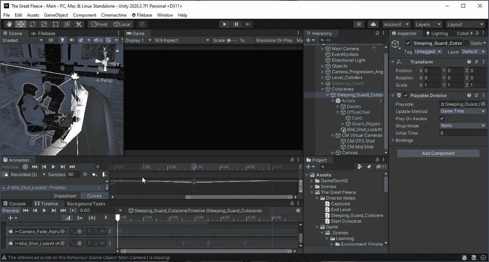
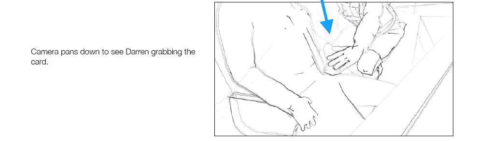
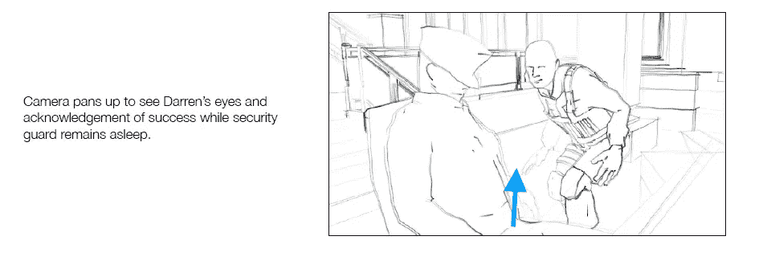
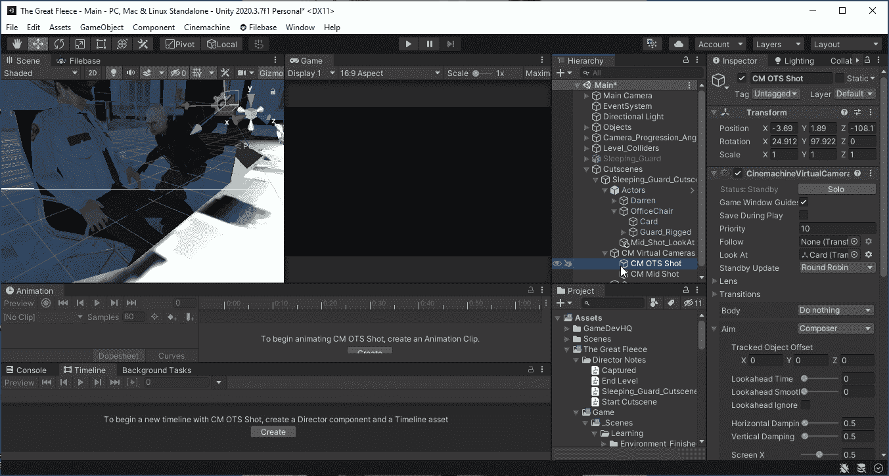
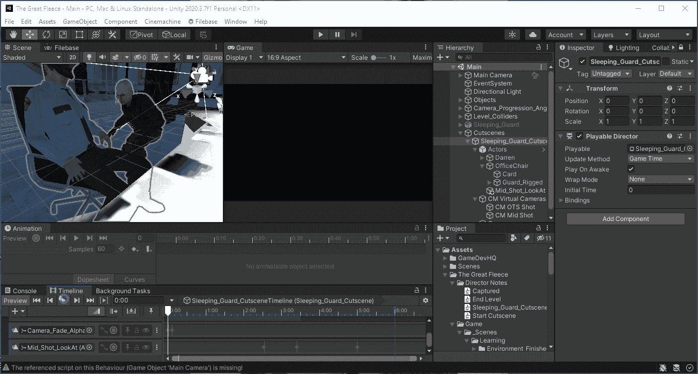
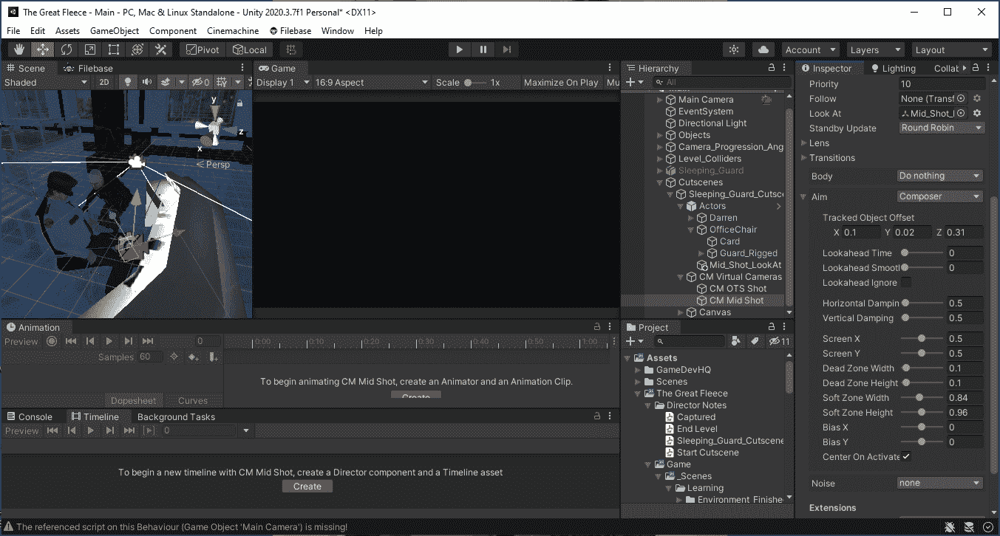

# 我成为 Unity 游戏开发者的旅程:过场动画-潘中景相机

> 原文：<https://medium.com/geekculture/my-journey-becoming-a-unity-game-developer-cutscenes-pan-mid-shot-camera-c966529af7e0?source=collection_archive---------37----------------------->

目标:将中景镜头从达伦偷卡的镜头转到看到达伦在脸上展示他的成功。

Mid Shot final camera animation.

我们将使用虚拟摄像机中的【T2 看着属性，使用不同的方法制作**中景**摄像机的动画。导演的故事板笔记希望镜头向下平移看到达伦偷牌，然后向上平移看到他承认成功的眼睛。

我本来用**保安的卡**作为 **CM OTS 拍摄**虚拟相机中的**看**物体。这一次，我们将通过将 **Look At 设置为 NONE** 并将 **Composer 设置为 Nothing** 来使该摄像机的动画不同于**中景**。相机的位置仍将与之前相同，但不会聚焦在任何特定的对象上，因为它正在场景中平移。

Set the over-the-shoulder camera to not Look At any objects while panning.

创建一个新的名为 **Mid_Shot_Look_At** 的空游戏对象，它将使用**注视**向下平移，然后向上平移。将 **Mid_Shot_Look_At** 对象放入**演员**游戏对象中，使其对他们来说是本地的。在我们的 **CM 虚拟摄像机**内选择 **CM 中景。**转到**检查器， **Cinemachine 虚拟摄像机**组件内的**点击 **Solo** 旁边的**状态、**并拖动**中景查看**游戏对象到 ***查看*** 设置。

Created a game object for the virtual camera to Look At in the scene.

我们将需要有一个开始位置，然后向下滚动看到达伦把卡从警卫手中拿走，然后向上滚动看到达伦的脸显示他成功了。

点击**沉睡的守卫过场动画**，在**时间轴**中创建一个新的**动画轨迹**。将**中景注视**对象拖动到**动画轨迹**槽中。

Mid Shot Look At object added to new Animation Track.

锁定**检查器**以允许我们在定位相机时在游戏对象之间切换，而不脱离**时间线**。然后在**中景中查看**动画轨迹，点击**录制**按钮，开始为摄像机的每个位置创建关键帧。首先将摄像机移至达伦的眼睛高度。接下来，将摄像机向下移动，以显示 Darren 在卡片上的双手。最后，将摄像机向上移动，以显示 Darren 看到他成功偷到卡时的脸。一切就绪后停止录制。

Animation keyframes created for camera’s down and up movements.

当**中景**摄像机按照设定的方式移动时，过场动画镜头过于机械，没有给我们一个特殊的场景镜头。这样做的原因是，当我们退出**死区**时，摄像机将快速移动到一个新位置，并跟随**死区**的新位置。

Mid Shot Look At animation track playing.

在 **Aim 的**属性中，有一个属性是**阻尼**。**阻尼**将允许相机平滑跟随目标方向的过渡。保持您使用的**阻尼**值不变，这将防止摄像机出现大范围的行为。我们使用 ***的低数值让摄像机反应更灵敏，快速调整*** 的方向，将目标保持在**的死区**。

Damping settings are set to a low value with the same values for the camera to pan smoother.

如果我们想使摄像机的动画更加平滑，双击**中景动画轨迹**打开**动画窗口**(如果它还没有打开的话)。点击**曲线**按钮，沿 Y 轴*移动曲线。*

**

*Using Curves in the Animation Window to fine tune the camera animation.*

*请记住，在启用和禁用游戏对象或查看场景中的目标游戏对象之间，虚拟相机可以使用不同的动画方法。*