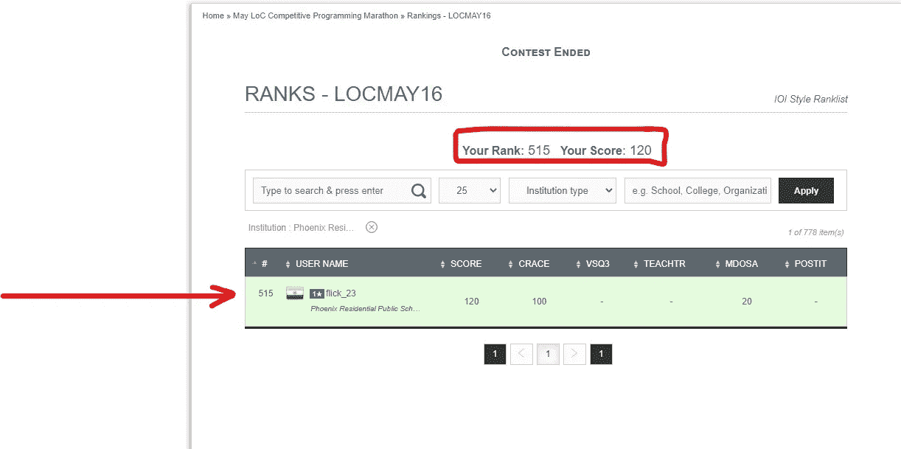
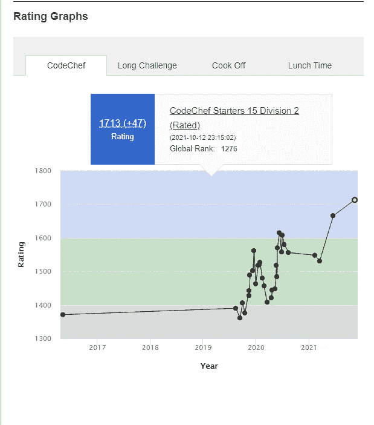
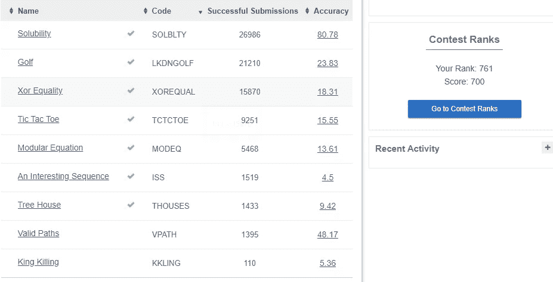
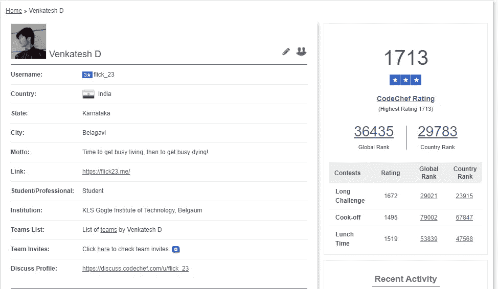

# 我在 CodeChef 上成为 3 星程序员的旅程。

> 原文：<https://medium.com/geekculture/my-journey-to-become-a-3-star-programmer-on-codechef-833a03a3dcad?source=collection_archive---------5----------------------->

在我开始之前，我想声明这是我的第一篇文章。请留下建设性的批评，以便我可以更好地写我未来的作品。

那是在我 10 年级[2016 年]的时候，当我学会用*Java*编程时(是的，我来自 ICSE 的一所学校)，当我写完我的第一个“Hello World”程序后，我非常激动。我只是想学习越来越多的关于编码的东西(比如编码来构建一个计算器之类的东西)。

现在，在学习了一些 Java 的概念之后，我决定和其他人竞争，看看我是一个多么优秀的程序员。就在那时，我开始在谷歌上搜索“学校孩子的编码竞赛”,并发现了 codechef。
过去，codechef 有一个名为 [LoC【代码之王】](https://www.codechef.com/LOCMAY16/)的竞赛系列，我决定参加这个竞赛，希望我能赢。

My rank in LoC May Challenge’16

但令我惊讶的是，问题的程度超出了我的理解和想象。然而，我设法完全解决了一个问题，部分解决了另一个问题。解决这个问题的斗争是真实的。我不知道我不应该有告诉“输入 N 的值”等等的打印语句。此外，当年的互联网对我来说非常昂贵。(我记得为 2GB (3G 速度)的数据包支付 199 卢比，超过 2GB 后，剩余 30 天将是 2G 速度)。

所以我决定定期在 codechef 上解决问题。我花了很多时间在我的书上涂鸦，试图实现逻辑来解决问题。我不知道堆栈、队列和其他数据结构的存在。此外，我用 Java 来解决问题。所以我过去常常尝试纯粹通过使用循环、条件语句和数组的概念来解决问题。

下一阶段是我准备竞争性考试，在我第 12 次考试后进入顶尖大学。所以我和我的 CP 分开了 2 年。

快进后，我所有的竞争性考试的 CET，JEE 主和高级(是的，我有资格获得高级，也有一个体面的排名在高级，只是不够好，进入 IIT CSE 分支 xD)。我决定重新站起来，开始编码。那时我意识到 codechef 有这些评级比赛，有一个星级系统和 laddus 奖励。因此，在给定的时间限制内解决这些问题的真正斗争开始了。只是为了让你看一下我当时的初学者水平，我甚至不知道 codechef 问题陈述中“约束”的含义。我慢慢开始理解如何提交以及如何在 codechef 上解决问题。此外，我还没有学会高级数据结构和算法的概念。
我的评分时高时低。

My Ratings graph

有很多起伏。在短短的 2-3 个月内，我几乎达到了三星级。然后我在接下来的几场比赛中表现不佳，这几乎让我回到了 1 星。我系好安全带，决定全力以赴。花时间分析我的错误，解决实践问题，也在 Hackerrank 等平台上解决。你可以查看我的评分图表，看看起伏。

My rank for Long Challenge May’21

经过所有的努力，我刚刚达到 3 星，这真的非常令人满意。(所有这些仅仅是基本的编程知识)
但是保持并超越三星甚至比进入三星的二级还要困难。就在接下来的比赛中，我跌回了 2 星，不得不再次努力回到 3 星。我现在休息一下，学习和理解堆栈、队列和其他数据结构和算法。我理解时间复杂性的概念。休息了一会儿学习之后，我又回到了擂台上，准备迎接漫长的挑战。
最终，在[五月挑战 21](https://www.codechef.com/MAY21C) 中解决了 9 个问题中的 7 个，并在**的近 30，000 +** 参与者中获得了 761 的**排名后，我终于再次成为 3 星程序员，距离 4 星程序员只差 2 场比赛了。**

希望我会很快找到时间来建立我的技能和水平，成为一个 4 星程序员。这些天我几乎没有时间参加比赛，因为我有一份工作和一些自由职业者。
PS:我是一名在 CSE 攻读工程学士学位的学生，目前在读第五学期(三年级)。

***快乐编码！🥂***