# 我选择高端 3D 打印机的旅程(raise 3D E2)——第二部分

> 原文：<https://medium.com/geekculture/my-journey-to-choose-a-high-end-3d-printer-raise3d-e2-part-2-f78e9cb9f4e5?source=collection_archive---------19----------------------->

好吧，所以生活变得不稳定，我还没有得到 Raise3D 的支持请求，但我将在 Raise3D E2 上分享我的第一次打印的结果。

我此时的目标是:

*   会打印出来吗？
*   它能印得多好？
*   单一挤压
*   它响吗？
*   滑动 Y 平台如何影响打印？

如前一部分所述，测试部分来自以下内容

Howl’s moving castle (credits: [Howl’s Moving Castle by Mag-net — Thingiverse](https://www.thingiverse.com/thing:2772256))

我刊登了第一部分，在我看来这真的很棒。我需要在其他打印机上测试相同的打印以进行比较，但让我们仔细看看哈尔的移动城堡的上半部分的结果。

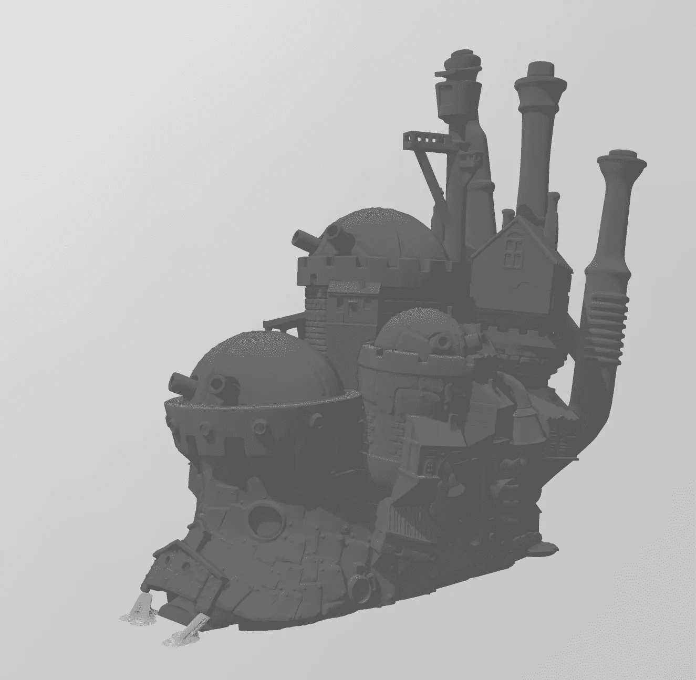

The original model

一开始我们开始印刷。这是我用我的 iPhone 从上往下透过封面打印了大约一天之后的照片。我不想影响印刷。

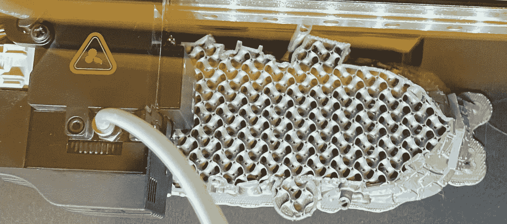

After about 24 hours

印刷出来的照片绝对令人惊叹。

# 它是如何印刷的

先说一下打印配置。

## 灯丝

使用的细丝是 OEM BASF PLA 的新卷，但是没有标签，因为它“仅用于评估”。从我的经验来看，这是我遇到的一些最高质量的 PLA 长丝，但巴斯夫真的不会乱来。这是一个发送给供应商的样品，他们最终会在上面贴上自己的标签，在爱上这个之前，他们经历了测试许多不同 PLA 的过程。我每次都打印得很完美。通过对多台打印机的测试，我可以有把握地说，如果这款 PLA 的打印有瑕疵，要么是由于打印机本身，要么是由于灯丝的储存方式。

## 设置

我很想深入了解这个的很多细节，但我所做的只是选择[Raise3D] PLA 并将图层高度改为 0.05 毫米。

## 壁分离(挤压下？)

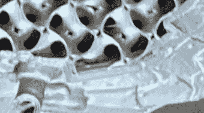

First thing I noticed — a little wall separation

因此，当您开始达到每层 0.05 毫米的条件时，这是大多数打印机上的常见现象。为了处理非常非常薄的层并且不产生气泡，像 0.4 毫米这样的巨大喷嘴在处理薄层时会有问题。你正在通过一个 0.4 毫米的圆形喷嘴挤压 1.75 毫米的细丝，从 3D 角度来看，挤压出来的东西更像一个椭圆形的圆柱体。在比例不允许将圆形喷嘴挤压得足够宽以进行补偿之前，可以将圆形喷嘴挤压成椭圆形的程度是有限制的。

我认为切片软件应该认识到这种情况，而不是试图挤出更多，当它切片时，它应该考虑细丝的 3D 物理属性，并将细丝的平行段移近一点以进行补偿。因此，在 0.05，不做任何数学计算，而不是平行线之间的距离是 0.4 毫米的差异，一个“感觉良好的距离”可能是 0.3 毫米甚至 0.25 毫米。我认为这应该很容易通过更新切片算法来解决。

## 开始时的小烦恼

所以，这是我既爱又恨的事情。默认情况下，在开始打印之前，打印机会执行全床筛网调平。我相信这张照片和商店员工评估是否出售 Raise3D 产品时所做的前一张测试照片的温度条件是相似或相同的。因此，它应该能够使用保存的设置。我希望这只是因为我用的层很薄，而不是“每次”都这样。毕竟，一个合适的网格调平需要时间，Raise3D 似乎非常彻底。我没数，但我相信它至少取样了 20 个点。

# 完成的印刷品

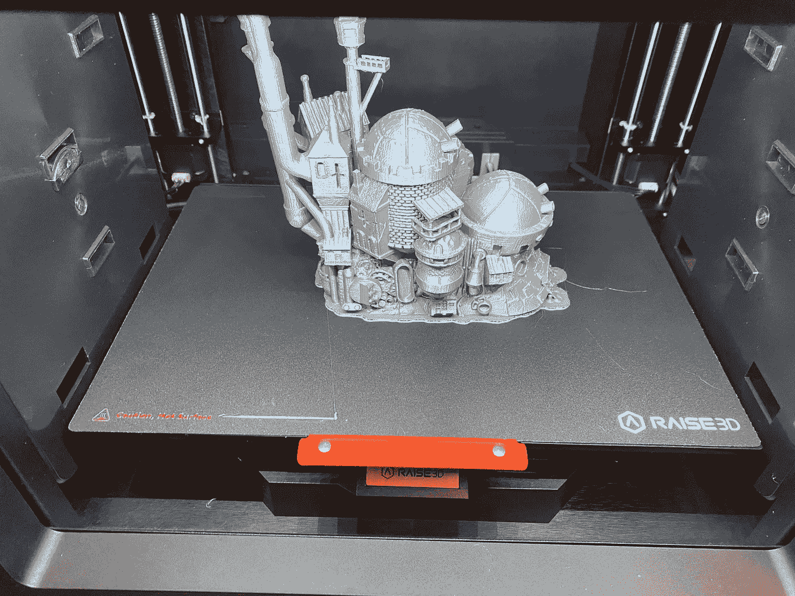

A moment to admire the print before ripping it off

## 一个木筏？

我真的没有想过这个问题，但是考虑到我遇到的绝对完美的床粘附力，以及我认为在打印之前几乎完美的平坦床+网格调平，我认为 IdeaMaker 中的默认配置文件在执行单个挤出机打印时包括一个筏子有点傻。

当以复制或镜像模式打印时，IDEX 平台上的 Rafts 非常有用。这是因为喷嘴之间的 Z 偏移可以通过在开始时喷出一些非常厚的层来校正。对于单挤压机印刷，这是没有意义的，通常只是在印刷的基础上留下人工制品。虽然打印的木筏分离看起来很均匀和漂亮，但这只是一个不必要的烦恼。

好消息是，我现在意识到了这一点，以后不需要 Raft 时，我会直接打印。

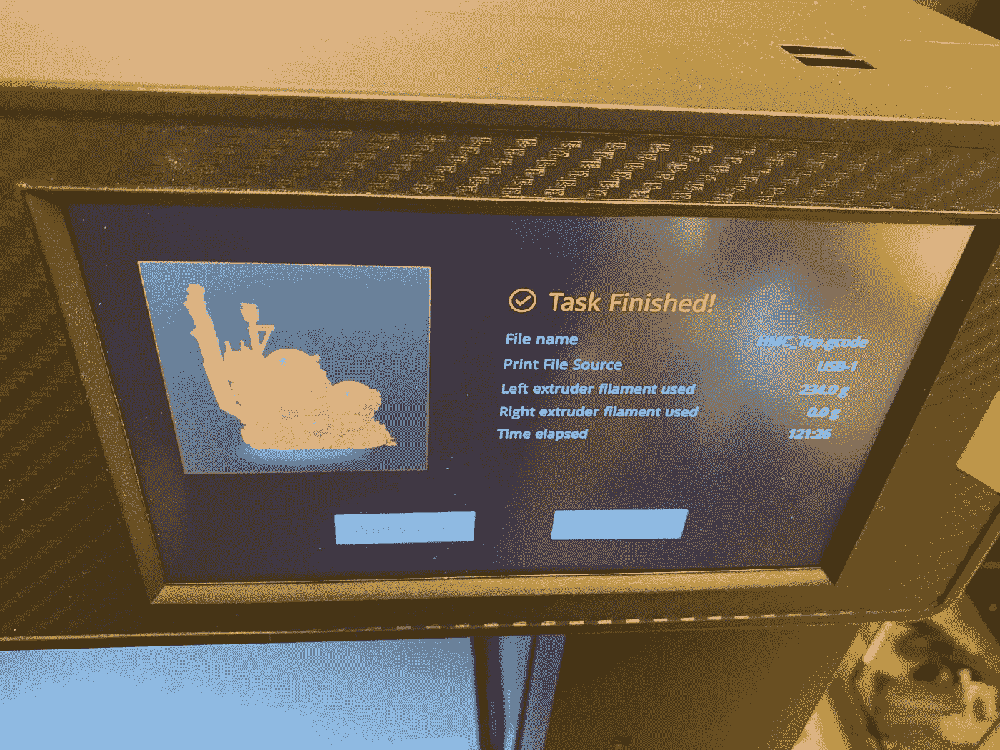

That was a LONG print

## 打印时间

我很高兴打印机做了如此惊人的工作。与移动平台的 Z 位置而不是 Y 的恒定运动的打印机相比，它似乎对打印时间有重大影响。当我用经过极大改进的 Ender 5 Plus 在 Cura 上配置近乎精确的打印时，打印时间增加了一倍多。

不过，这是意料之中的事情。即使我对 E2 的 Y 轴的精度感到惊讶，它仍然基本上前后前后滑动平台。平台的重量很轻，但是如果将平台的重量和大型印刷品的重量结合起来，如果移动得更快，即使像这样大的 Y 轴也极有可能会发生明显的层偏移。在这种情况下，Ultimaker S5 或者 Raise3D Pro2 将明显更胜一筹。

但是，由于这将是我的“make it perfect”打印机…那么，与我的 Form2 相比，下一个最好的完美产品，我没有问题等待更长的时间来获得出色的结果…正如您将看到的那样，随着我们的继续，结果绝对是一流的。

## 逼近

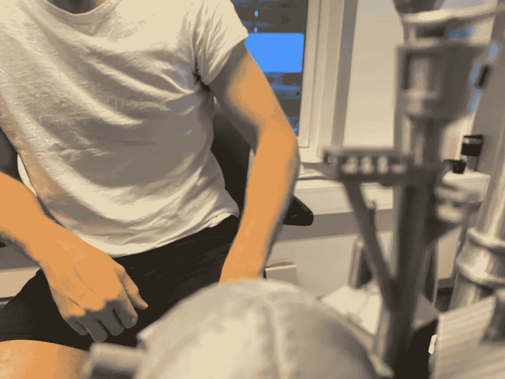

Hang overs? Over hangs? Whatever

在这张照片中很难看到，但绝对平坦的平台被印刷出来…悬挂在半空中…除了一根狭窄的支撑杆之外什么都没有，非常漂亮。如果我要衡量切片机/打印机组合的质量，这张照片足以说服我花大价钱购买一台挤出机打印机。这绝对是一件美丽的东西。

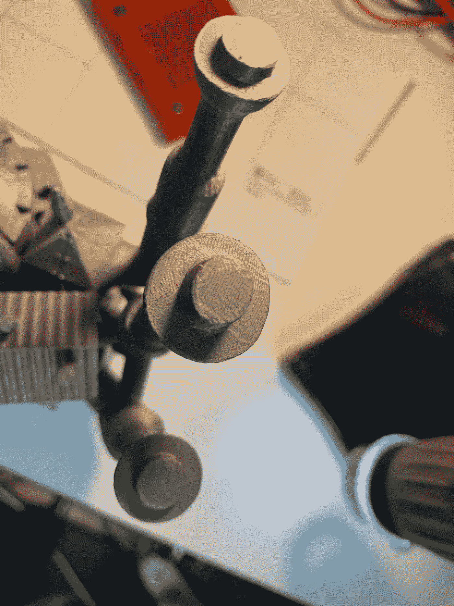

more amazing overhangs and a fabulous final layer

我从上面非常仔细地看着这幅画，所以虽然这幅画看起来像是这里的山脉和山谷，但它实际上几乎是完美的平滑。如果我要考虑画这个，我可能会决定只使用两层薄薄的喷枪底漆，而不是先打磨。实际上，结果比我过去用过的所有其他打印机都要好。

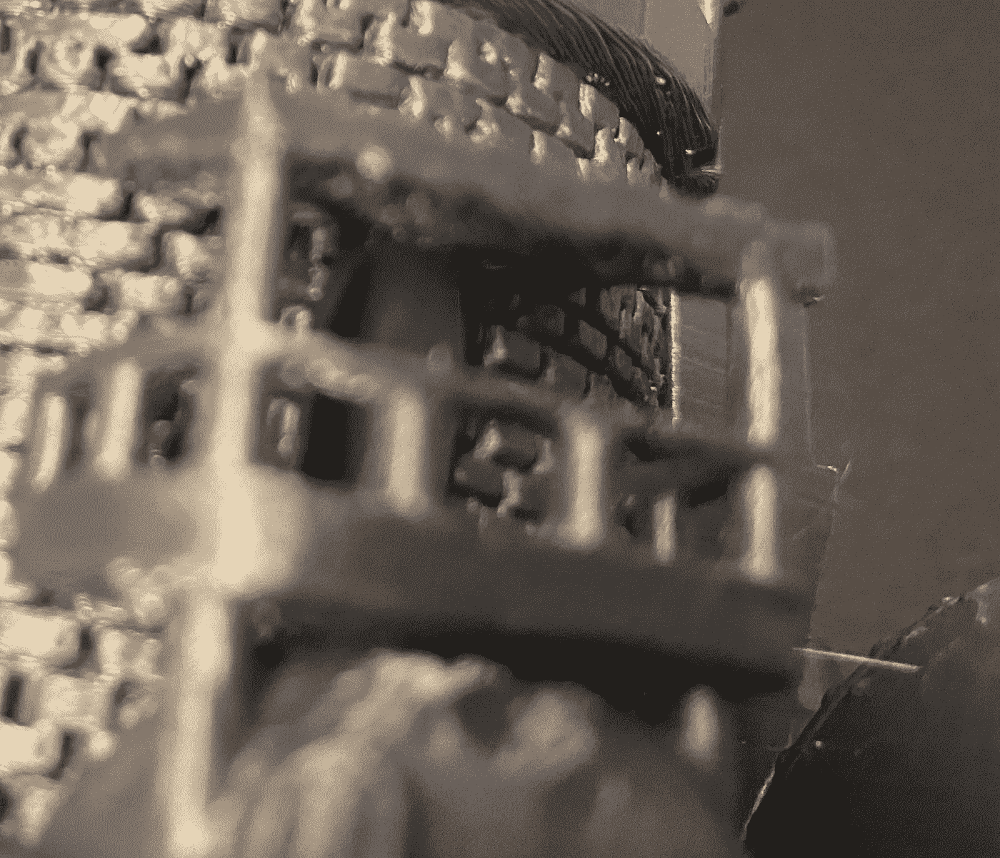

Hooked on the overhangs

这种悬伸是惊人的。它不仅很好地处理了非常复杂的突出物和桥梁，而且在印刷时屋顶下的人工制品非常少。这意味着 IdeaMaker 在选择何时打印每层外墙时表现得非常出色。Cura 在这种情况下也做得很好(只是 3D 失败了)，但正如 Cura 会在 Ultimaker 上打印并知道如何真正最好地利用打印机来扩展物理定律一样，IdeaMaker 和 E2 肯定是同一类的。

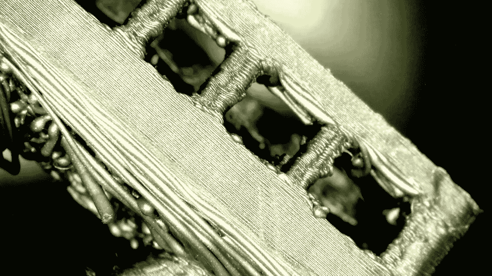

Under a microscope

我想开始仔细观察桥接和突出部分，所以我拿出我的数码显微镜来看得更清楚。

你可以看到桥实际上是起泡的，危险的，有点乱，但如果你考虑到每个绝对完美的层都像预期的那样粘着 0.05 毫米厚，你可以说它做得非常好。

我想，如果我要对这个图像做任何改变，我会在 IdeaMaker 中寻找一个滑行选项和一个可能的最小预挤压选项，以便更好地开始和停止。

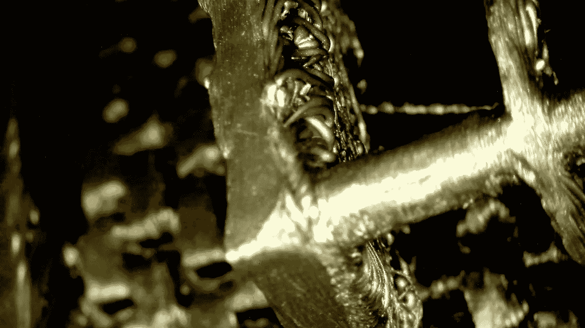

A better shot… or is it?

桥接和悬垂在这里确实是一个问题，但我故意打印了这个没有支撑的模型，以精确地看到它将如何处理这种情况。

没有悬垂的细丝线，它实际上很好地纠正了重力拉下软熔化塑料的问题。

我认为一个可能的很好的解决方法是移动喷嘴稍微快一点，以避免灯丝下垂，并施加更多的张力，或者在制作这些桥时增加冷却…不幸的是，这仍然是下一层的一个大问题。我认为 Raise3D 的人可能会通过一些实验和一些配置文件调整来解决这个问题。它可能不需要对打印机或算法做任何改变。

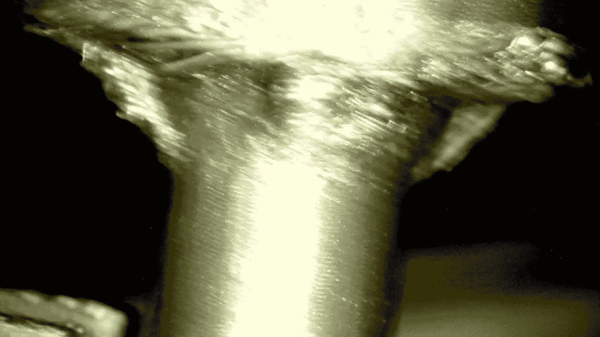

Under the tower

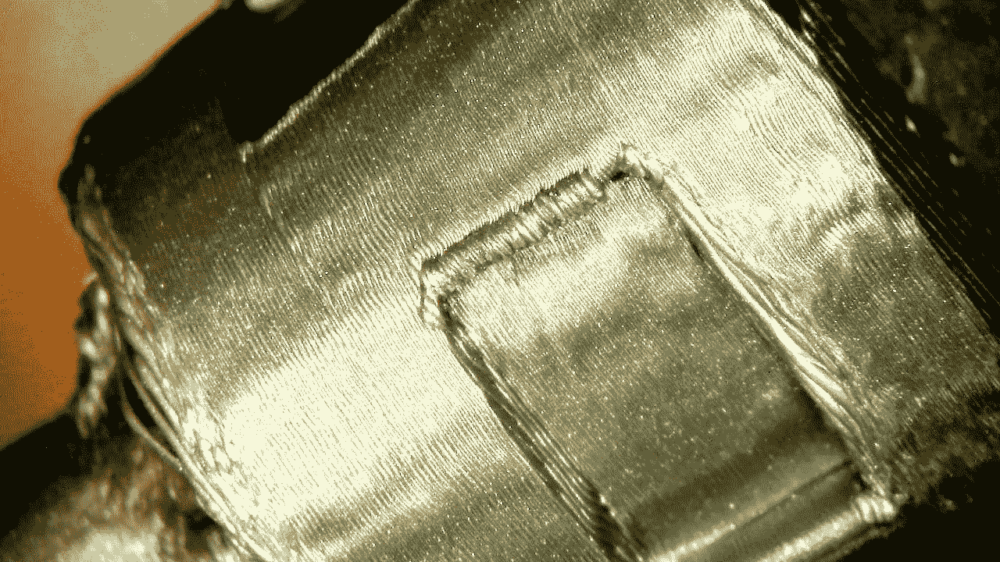

Another angle

要打印这个…切片机足够聪明，建立支持和打印同心环，以避免其他切片机常见的问题。IdeaMaker 在这里确实做得很好。当我们在这里的时候..看两件事

## 如此接近完美

看上面标有“另一个角度”的图片，我们看到弧线的处理非常非常好。处理角落…这可能需要一点工作。窗框周围的图案至少应该更干净或更一致。它看起来真的很纠结。但作为参考，考虑到这些都是非常小的细节。

## 它需要更好的加速控制吗？

我认为这台打印机可能会大大受益于 Y 轴和 X 轴上的加速度计，或者可能只是通过一些令人印象深刻的 g 代码巫术来预测急转弯并调整拐角处的加速度。但我认为，对于 Y 轴上的锐角和微小的振动，打印机在加速度控制方面有所欠缺。

## 超高硬度的小特征

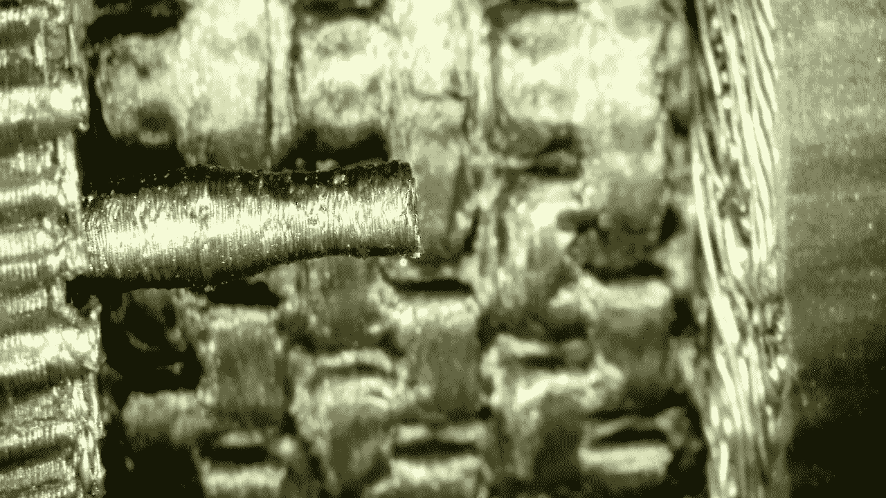

Look at my little pipe

我不认为这里看到的这个特征超过大约 1.5 毫米宽。它打印出来了…完美无缺。我是说这太美了。我想在 Ultimaker S5 上测试这一点以进行比较……就这一功能并执行一次穿线测试，但正如你所见，它不仅完美地打印了各层，还打印了微小的凹痕，这些凹痕实际上是设计的一部分，非常完美。

# 本部分的结论

我担心 Y 轴的响铃…与 Ultimaker 和 Ender 5 Plus Plus 相比，它在显微镜下很明显。这是 Y 轴上的简单加速度计无法解决的问题，或者他们可以将加速度控制添加到软件或配置文件中。不管怎样，有一点点响。

我没有把它作为一个要求，但我有一个想法，我的 3D 打印应该是几乎防水的，如果不是气密的。除了墙上的缺口，我认为这绝对通过了测试。每张照片看起来都很完美。

速度比我所关心的要慢，但是我不是为了速度而购买这台打印机，我购买它是因为我想要一台具有这种精度的打印机，它将实际上适合我为它保留的位置(不完全公平，因为我使用这台打印机的测量值来建立表格)。

我觉得热控制似乎非常好，它肯定是 pro/prosumer 级的，但软件可以做得更多一点，以处理复杂的桥梁。

今天早上我告诉我妻子，如果它通过了水溶性支撑的双重挤压测试，我就把这个宝贝带回家…但前提是商店同意直接支持打印机。由于 FlashForge Creator 3 对双重挤压的处理绝对“糟糕”,以及 Ultimaker S5 对双重挤压的出色处理，我对 IDEX 打印机的双重挤压抱有极高和极低的期望。这只是我相信一个凸起的喷嘴打印机每次都会做得更好。没有人关心 IDEX 的镜像和复制，如果你需要打印单挤出机两倍的速度，只需购买两台便宜的打印机。它更便宜，而且可能更好。昂贵的双挤压打印机的唯一原因是有两个不同温度的喷嘴。

# 最后一点

我目前没有合适的气压计或湿度传感器，可以很好地放在打印机的卷轴存储区内。一旦我得到它们，我将尝试测量打印机内外的相对湿度。由于我打算使用聚乙烯醇和尼龙，这两种材料都是憎水材料，并且因为打印机实际上是为了保持卷轴本身，所以我希望有一个好的解决方案，如果可能的话，将一卷昂贵的聚二甲基硅氧烷长时间留在打印机中。