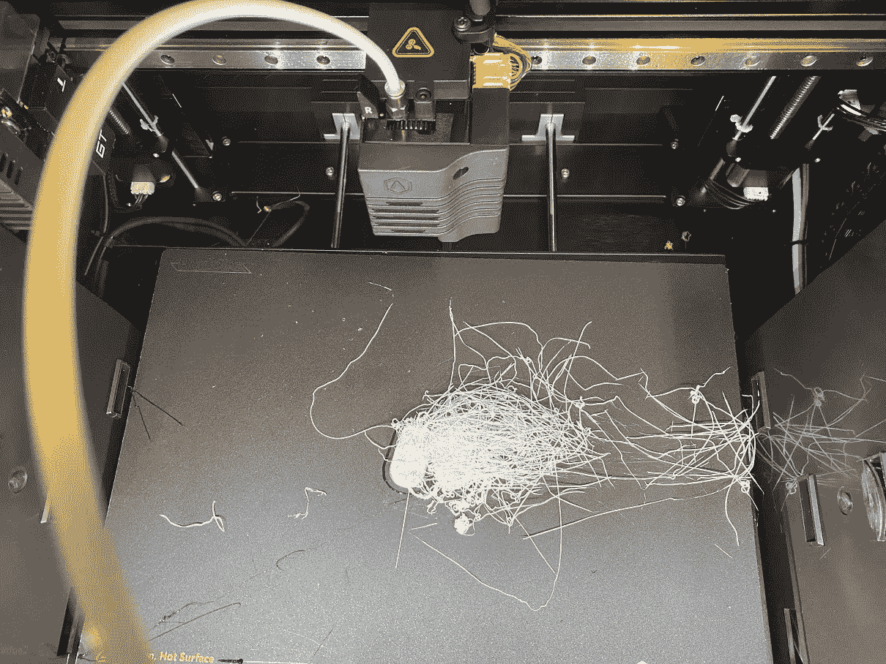
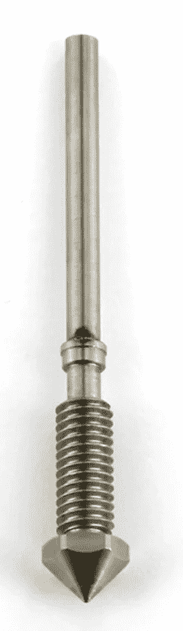
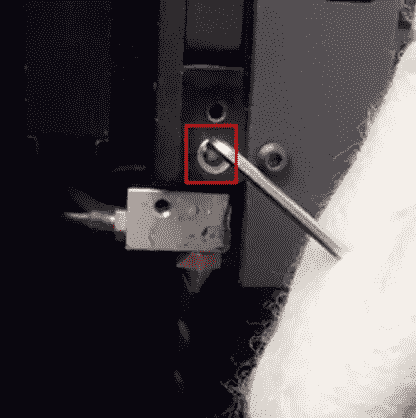
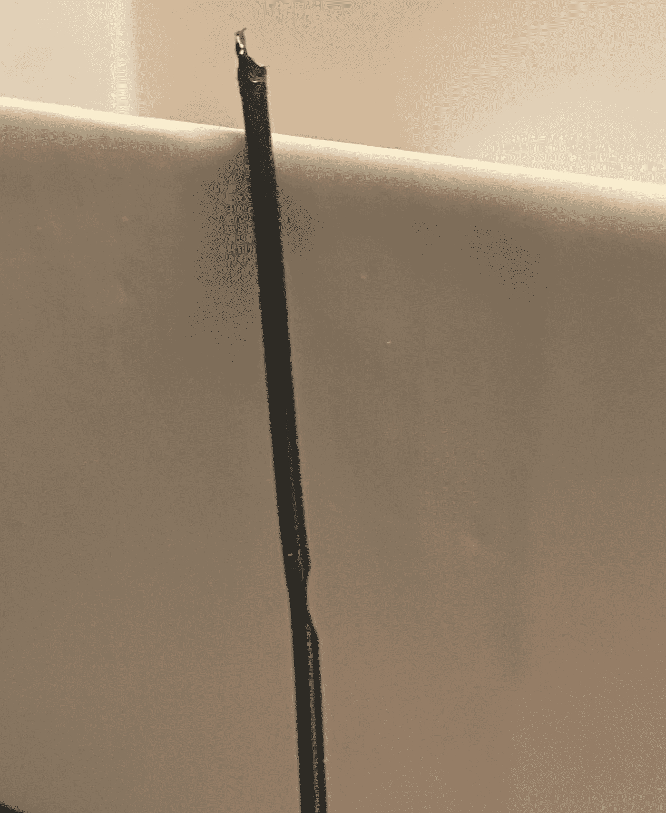
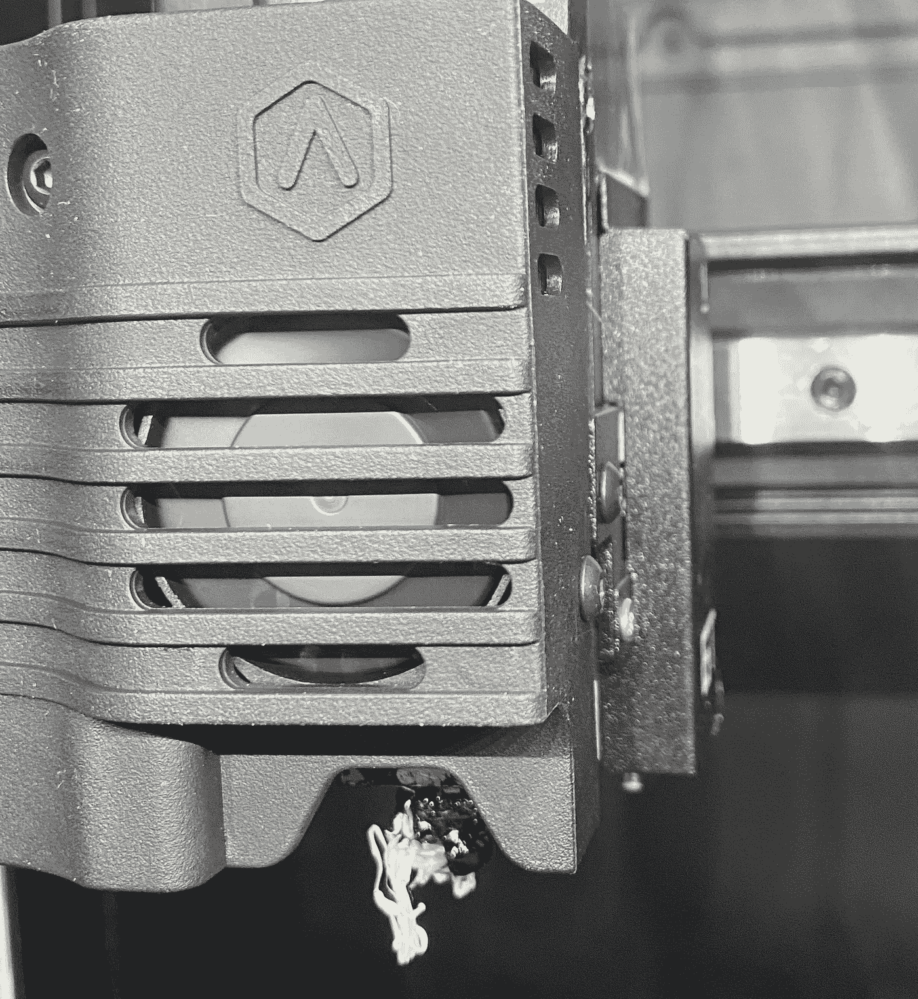

# 我选择高端 3D 打印机的旅程(raise 3D E2)——第 4 部分

> 原文：<https://medium.com/geekculture/my-journey-to-choose-a-high-end-3d-printer-raise3d-e2-part-4-73ede02b3135?source=collection_archive---------17----------------------->

# 给我放些果酱！

Waking up in the morning is lovely!

你们中的一些人可能会问，为什么给我们看这张可怕的照片？我看着它，觉得这是一天的良好开端。我不想只在工作的时候才看到打印机。当事情出错时，我希望看到它，并且我希望找出解决问题的合理性。

## 那又怎样？只是意大利面，对吗？

不，这是一次灾难性的堵塞。它向我展示了一些关于打印机的真正可怕的事情。但好消息是，已经修好了。坏消息是，它很难修复。

所以，左边的挤压机堵塞了。它不仅堵塞了，它堵塞了，卡住了，哦…太可怕了。它卡在散热器里了，而且被卡住了！

这个问题在 FlashForge Creator 3 上是一个可怕的重复事件。由于多种原因，热，软，灯丝发现自己冷却和倒伏在散热器。我相信在我们面临的情况下，这要么是暂时的热蠕变，要么是由于收缩和散热器上非常有效的冷却器的结合。不管怎样，它发生了。

**这是要发生的！**

在你开始怀疑这是否是打印机的缺陷之前，它不是。这是 FDM 印刷，而直接驱动，如果正确实施将永远优于鲍登，它也使打印机维护成为一场灾难。

Credit: FlashForge EU Store

由于多种原因，FlashForge 的设计是市场上最差的设计之一。FlashForge 上的喷嘴是这种长实心管，有许多令人难以置信的好处。但这也意味着当堵塞发生时(它们将会发生),要么是时候扔掉昂贵的喷嘴，要么你必须移除喷嘴，这很难，将其加热到疯狂的温度，并小心地钻出灯丝。原因是你不能仅仅使用有意的热蠕变来释放灯丝。

Raise3D 明智地使用了一个典型的加热器和喷嘴

Credit : [How to Change a 3D Printer Nozzle on the E2 (raise3d.com)](https://www.raise3d.com/academy/how-to-change-a-3d-printer-nozzle-on-the-e2/)

这太棒了。我喜欢这个。但是好事也会带来坏事。这种设计已经被证明是可靠的，虽然我已经多次被 BMG 蚊子或者 E3D 火山所诱惑，但我相信这种设计是我最喜欢的。

不过，随之而来的还有一些真正的问题。

当你拥有像 E2 这样设计精美的热端组件时，它们是一个讨厌鬼。对喷嘴的任何维护都需要取下面板，有时需要拆除整个支架等。因此，为了避免处理常见的维护问题，我们倾向于尝试每一种替代方法来解决这个问题，而不必进行全面的手术。

# 我关心的事情

The horror of single drive extruders

这可能是 E2 打印机设计中最大的一个缺陷。semi-pro 或专业级直接驱动打印机不应配备单驱动挤出机。这是 3D 打印机的大罪。当然，这台打印机是在 2019 年发布的，当时我们还没有了解真相，但现代 3D 打印机应该永远不会有抓取细丝的问题。

E2CF 事实上已经解决了这个问题，我希望从 Raise3D 那里听到是否有可能为 E2 购买一个升级套件，但老实说，我希望在 2020 年从 Raise3D 获得这个升级。

有很多问题是双硬盘不会出现的，而单硬盘会一直出现。虽然我还没有在打印机上测试柔性材料，但 Raise3D 确实明确表示他们的打印机不能处理柔性材料。他们对打印机的评价是 90A 以下(如果我没记错的话)。

我之所以强调这一点，是因为在没有完全拆卸热端的情况下清除堵塞的方法变得更加糟糕，因为我不能依靠挤出机来解决这个问题。事实上，它碍事了。

The shame! The Horror!

我想补充 Raise3D 上一个优雅的失败，正如你在上面的照片中看到的。由于他们的良好设计，当左喷嘴被拖过右喷嘴的意大利面条时，它不会像 Creator 3 一贯做的那样爬上组件。事实上，FlashForge Creator 3 是一个火灾风险，因为它如何处理这种情况。灯丝会慢慢爬上来，形成一个包围整个热端和散热器的茧，Creator 3 甚至不会检测到热超限。那真是一场噩梦。

由于 Raise3D 更传统的设计和它有点细长的喷嘴(例如与 MK8 相比)，它在这里失败了。我不得不把鼻涕从喷嘴上刮下来并清洗干净。但它没有火灾或过热的风险。然而，我本应预料到软件中应该注意到的热欠载，但我相信在与这场灾难的战斗中，喷嘴从未加热到 250C 以上。

此外，考虑到热端周围的良好屏蔽，灯丝永远没有机会攻击加热块的侧面。

在这一点上提高 3D 的最高分。真的。这太棒了！

# Raise3D 应该增加意大利面检测

由于 Raise3D 不是基于 OctoPrint 的平台，使用第三方服务来检测意大利面条并自动暂停打印需要由他们来实现。这将需要培训一个 ML 模型，并在他们的 RaiseCloud 服务上运行它，但这是 2021/2022 年的逻辑增加。我不知道这方面是否有专利，但将其表述为“打印权”而不是“意大利面条检测”，甚至在打印机价格上再增加 3 美元并支付许可费，都是合理的。这是一项不难实现的技术，一旦模型得到训练，他们没有理由不能将其集成到打印机的附加组件中，以便在边缘运行它。

# 为什么我对此并不像看起来那么开心

请注意，在这一部分中，我将 Raise3D 更多地与 FlashForge 而不是 Ultimaker 进行了比较。

这是因为 UM S5 是 Bowden 打印机，一般不会出现这些问题。

此外，UM S5 热端组件是一个系统，您可以像从打印机中取出墨水一样轻松地取出组件。

Raise3D E2 在这里遇到了一些与 FlashForge Creator 3 相同的问题。

*   这是一个封闭的热端组件。这有好有坏。
*   任何需要力量的维护操作都会造成恐惧，因为你担心它会打乱排列
*   拆除喷嘴会导致热端和热端不对齐，因此在不拆卸整个模块的情况下，无法从底部接近灯丝路径。
*   挤出机只是单齿轮传动的，这限制了电机为清除细丝堵塞所能提供的扭矩。
*   细丝路径非常长，这使得很难找到足够坚硬的工具来试图强行打开该路径。
*   单驱动挤出机不能输送诸如 ProtoPasta 的铁 PLA 之类的材料，铁 PLA 非常坚硬，可以解决这个问题。
*   路径太长，无法有效使用清洁丝。

所以，最终的结果是，为了打开通道，我把一片断裂的尼龙放进了挤压机，让问题变得更糟。然后我用一个 2mm 的 umbraco 键(六角键)强制灯丝进给。我还通过喷嘴插入了一根钢丝(从 Ender 3 v2 附件抽屉中借来的)，希望提供一个传输热量的导管。然后，我用另一根折断的灯丝来阻止散热器风扇冷却散热器。

总的来说，解决这个问题的唯一方法是使用过度的力，冒着损坏挤压机齿轮的风险(我没有……但是有可能),冒着使打印机不对齐的风险(你永远不应该对直线轨道施加这种横向力)。或者，我可以拆卸热端组件，这真的让我害怕，因为我可以想象取出 20 个螺钉，然后装回 19 个或 21 个。

# 缓解？

我还没有足够的时间来消化 Raise3D E2 上的这些问题。我在 FlashForge Creator 3 上解决这些问题的方法就是把它交给别人哈哈。不，真的，我做了，但是因为还有许多其他的问题。

## 双驱动挤压机

我认为 Raise3D 应该干脆停止制造单驱动挤出机。运送单驱动器真的没有意义了，现在他们有了替代品，他们应该用新的挤出机改造所有新型号，并使它们可用于升级现有的 E2 打印机。

## 学会进入细丝通道

我敢肯定，出于制造和维护的原因，Raise3D 文档非常适合展示如何移除热端并正确地重新放置它。我也确信他们一定已经在这个过程中帮助了成百上千的客户，并且我确信他们的软件一定在这个过程之后干净利落地处理重新调整。

有一些关于丰田如何接管汽车世界的故事。我听过的最著名的故事是他们发明了螺钉，使得汽车无需不断调整就能快速、干净地组装起来。这发生在 20 世纪 70 年代末。整个机器设计行业的每个人都知道这个规则(除了 FlashForge)，我相信 Raise3D 热端的重新组装可以轻松确保它在需要的时候处于正确的位置。

我期待着当我有时间完成这些步骤，并适应它们的时候。

最后一个问题对于 Raise3D E2 来说比 BCN3D 适马更糟糕。

要对 Raise3D E2 的热端组件进行手术，需要能够深入打印机内部并转动螺钉。这真的不是一个大问题，但是特别是当第一次做的时候，它会很难，因为它看起来好像需要你完全通过触摸来工作。

# 包装它

总的来说，除了我对单驱动挤出机的失望之外，我仍然认为 E2 在这一点上是一台不折不扣的打印机。我将做一些研究，看看 Raise3D 建议如何清除这些可怕的堵塞。他们的支持似乎真的很重视这类问题。