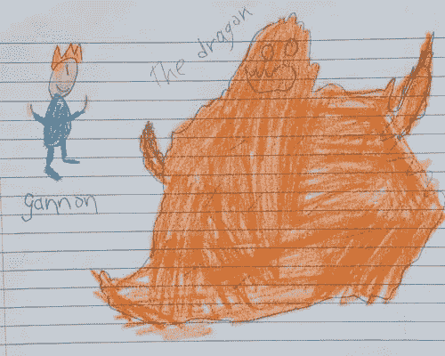
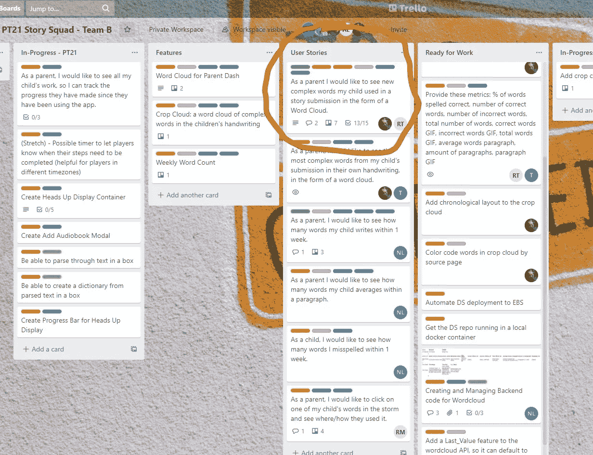
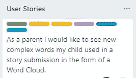
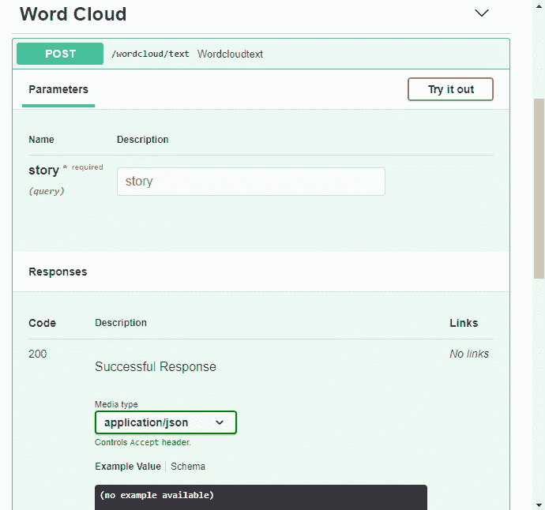
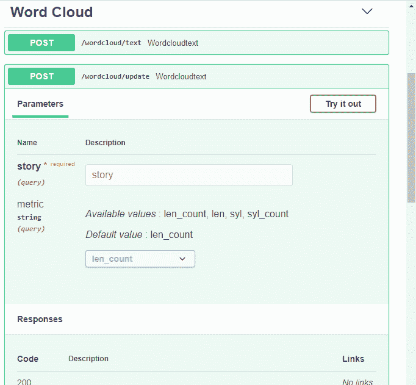
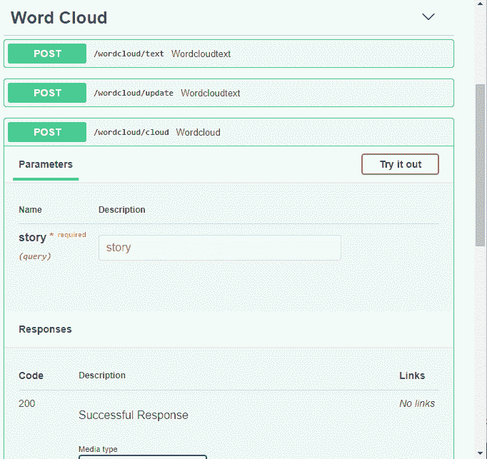
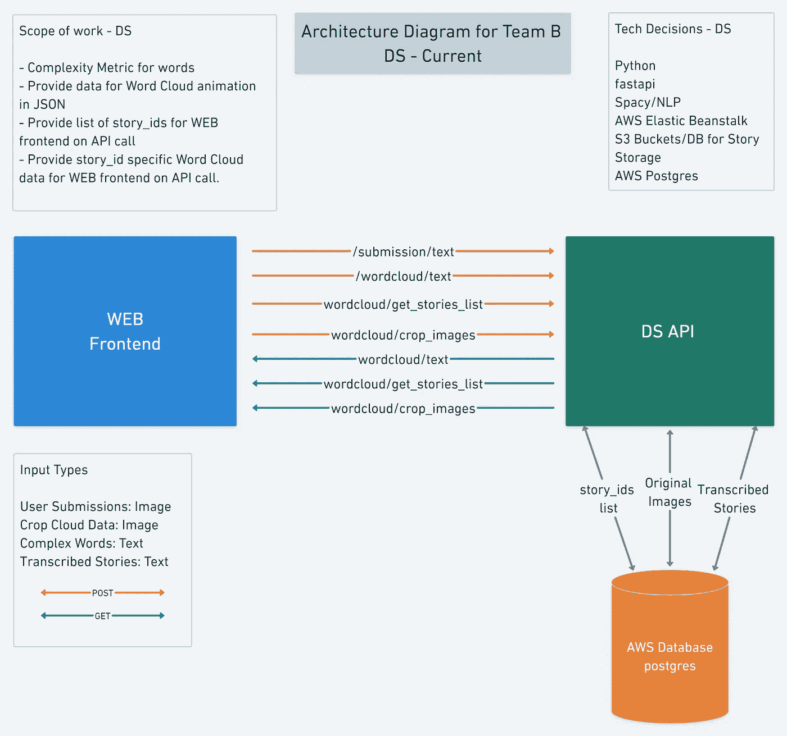
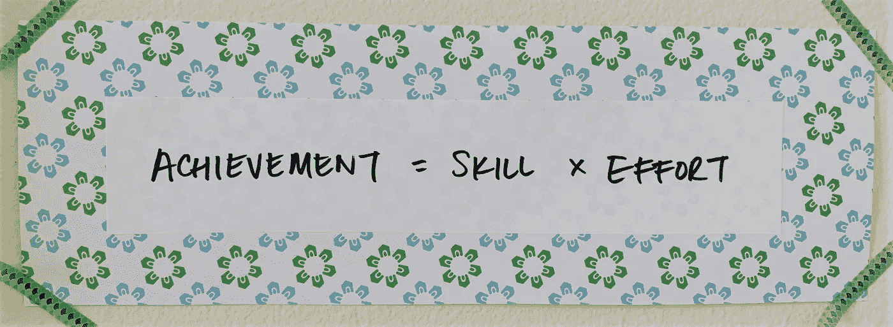
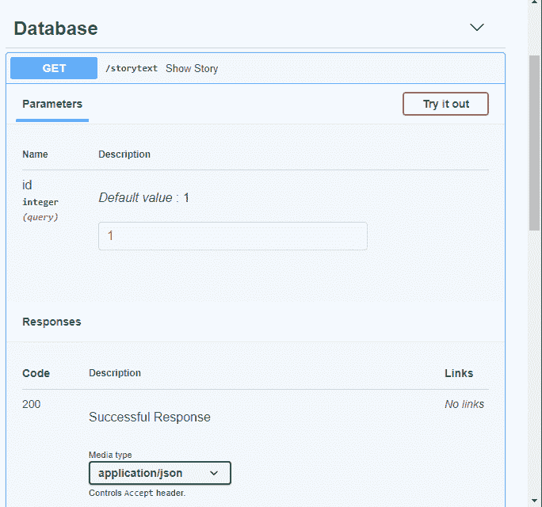

# 我在 Lambda 实验室的经历:用 FastAPI 向 AWS 部署 Wordcloud 特性

> 原文：<https://medium.com/geekculture/my-lambda-labs-experience-deploying-a-wordcloud-feature-with-fastapi-to-aws-276a663d2824?source=collection_archive---------44----------------------->

## 关于突破障碍、与利益相关者互动和团队合作的课程

# 创业公司

当父母们在网上阅读许多关于如何让他们的孩子远离屏幕回到现实生活的文章和讨论时，他们一定会感到讽刺。大人和小孩都不能离开太久，我们的注意力不断被吸回去。幸运的是，对于下一代来说，有一个雄心勃勃的应用程序专注于保持孩子们对 IRL 的兴趣:[故事小队](https://www.storysquad.education/)。

Story Squad 是一个面向儿童的在线故事写作比赛。它让孩子们远离屏幕，让他们**用手创作故事和图画**。每周，比赛都以一个故事提示开始。提交的作品以照片的形式上传，然后由一组同行进行评估和评分，以确定获胜者。结果是一个令人兴奋的、赋权的社区活动，同时也培养了自信、创造力和专注等品质。

# 有用吗？

我马上测试了这个理论，并向我自己的两个孩子解释了这个概念，他们同意参加。为了说服你不要认为我的孩子讨厌屏幕，喜欢写日记，这里有证据，这是我女儿学校指定的暑期日记中唯一的一条:

> 夏天已经结束了，但是我们玩得很开心

他们阅读了故事提示，然后安静地坐着写了一个下午，每个人都提交了一个密集的，长达一页的故事和一幅画。我认为 Story Squad 是一个非常有效和有前途的应用程序。

# **作业**

我是 Lambda School 的一名数据科学学生，我课程的顶点是花两个月时间在一个由三名数据科学家和四名 Web 开发人员组成的跨职能团队中从事一个项目。故事会是我们的股东。我们将为现实生活中的创业公司工作，但有 Lambda 员工的安全网支持我们。

Story Squad 的联合创始人是前教师 Graig Peterson 和数据科学家 Darwin Johnson。他们向我们解释说，Story Squad 打算成为一项订阅服务，虽然在为儿童创造令人兴奋的体验方面投入了大量精力和工作，但他们也需要一些功能来说服那些愿意订阅的人:父母。

他们给我的团队分配了一个绿地项目(意味着我们是第一个开始这项工作的人):一个单词云，展示一个孩子写作中最令人印象深刻的单词。这将出现在父母的仪表板上，向父母展示他们孩子最好的和最有创造性的词汇。我们必须让他们眼花缭乱，让他们相信故事班的卓越价值。

我对着手做这件事感到紧张吗？哦，是的，我做到了。我和一个新的团队一起工作，使用一套我并不完全熟悉的技术，而且只有八周的时间来交付我们的产品。事实证明，我的担心并非完全没有根据。

# **团队项目经理**

我自愿成为技术项目经理(TPM)。我与我们的产品经理共同主持了会议，维护了我们的 Trello 板，并跟踪了团队成员的进度和阻碍因素。我事先不知道作为一名 TPM，我会参加关于敏捷、SCRUM 和管理系统工具的项目管理的附加讲座。我喜欢学习项目管理的价值和方法，并且我有兴趣继续学习下去。

Our team Trello Board that we evaluated and updated daily

We chose this User Story as our MVP (Minimum Viable Product)

# 敏捷方法

我们的过程是敏捷的，所以我的团队在每日例会上回顾我们的进展。我们会在每周的利益相关者会议上与我们的利益相关者会面。随着我们核对已完成的任务，列出障碍(也就是阻碍因素)，并接受或创造更多的任务，我们的 Trello 板也在发展。该系统允许团队成员和利益相关者在过程的每个阶段进行灵活、透明和修正。通过频繁的会面，我们被鼓励成为优秀的沟通者。作为一个团队，没有人比其他人更高，我们必须作为一个团队来指导自己。最初的日子很艰难，但随着我们彼此熟悉，这是一个不断学习的过程。

# 团队冲突

两周过去了，这个团队仍然不知道是数据科学(DS)还是网络团队创造了这个词 cloud。双方都有能力做到这一点。我们公开讨论了我们的选择，但是含糊其辞，或者只是羞于做出决定。最后，在一次会议上，一名网络团队成员表示，他对该做什么感到困惑和麻痹。对我来说，这是一个灵光乍现的时刻。DS 和 Web 成员不再在同一页面上。我们没有解决一个难题，让它拖延了太久。SCRUM 的价值观之一是勇气，我们的 Web 团队成员有勇气说出这个令人不安的事实。从那以后，我决心总是说得更多而不是更少，并拯救艰难的话题从缝隙中滑落。

我们团队决定给 Web 团队分配一个动画单词云，作为备份，DS 会创建一个静态单词云。动画单词云更能引起利益相关者的共鸣，但需要网络团队进行研究和编写更多代码。DS 团队可以使用 WordCloud 库轻松创建一个开箱即用的 word cloud。

# **我的技术贡献**

我们继承了一个已部署的应用，所以技术栈已经决定了:FastAPI 用于 RESTful API，AWS Elastic Beanstalk 用于部署。我承担了构建 FastAPI 框架并将其部署到 Elastic Beanstalk 的任务。我的队友研究算法来确定复杂的单词并创建单词云。

这是我在本地创建和部署的第一个 API 端点。它接受一个文本字符串并返回一个复杂单词的列表。在我的例子中，我复制并粘贴了一个孩子转录的故事的文本。

This endpoint takes in a story submission as a string of text and outputs a list of the complex words used.

# **修订版#1**

当我创建第一个端点时，Web 和 DS 成员之间有一个松散的讨论，这导致了一个想法，即 DS 可以提供一个故事中每个单词的列表，每个单词都有一个相关的权重来衡量其复杂性。Web 团队可以使用这些信息在前端创建单词云，选择权重较大的单词。没过几天，我的 DS 队友交给我一个更新的算法，我为它创建了第二个端点。在这两种情况下，将代码从笔记本转移到 FastAPI 都需要调试，以纠正在 FastAPI 中不起作用的变量格式。

例如，下面的代码行将字典转换为数据框。一列是故事中的单词，第二列是出现次数的计数。代码在 Google Colab 中运行良好，但破坏了 FastAPI。

下面是我在 FastAPI 中使用的代码来完成同样的事情。

在新的端点中，我们包含了一个下拉菜单，允许用户在四种算法之间进行选择。每种算法都权衡音节和/或单词长度的重要性，以确定哪些单词是复杂的。

# 备份计划

我创建了第三个端点，它返回 base64 代码格式的静态单词云，Web 可以在前端将其重新生成为图像。

# 将 AWS RDS 添加到 API

在审查了 API 之后，Web 团队要求进行另一项更改:保存演示数据的数据库。目前，API 强迫用户输入他们自己的文本串，这破坏了从一个孩子的手写故事中炫耀单词的目的。我们需要随时向用户提供数据。

我会见了 DS 团队，我们一起制定了一个计划。吸取了前面的教训，我们想确保 100%清楚我们正在做什么。

Schema for the Data Science API

## **精神疲惫&成长心态**

我自愿担任数据库任务的先锋，尽管那时我感觉自己已经爬完了珠穆朗玛峰的顶峰。**在精神上，我被将 API 部署到 Elastic Beanstalk 的研究、调试和变通办法**弄得筋疲力尽。我以为这个项目最艰难的部分已经过去了。现在我不得不回到山上，学习如何创建和连接 RDS 数据库。将我从绝望中拯救出来的是我在 Lambda 学校一年中获得的最有价值的东西:知道我想成为一个终身学习者，我不得不习惯于不舒服。我睡了个好觉，并重复了我的咒语，这是我从《砂砾》的作者安吉拉·杜克沃斯那里抄袭来的:

I taped this up above my computer when I began my program at Lambda School. It has served me well.

# 最终的 API

两个星期和多次迭代之后，我有了一个 API 来访问 Story Squad 提供给我们的 167 个演示故事。我通过将一个包含 167 个文本文件的 zip 文件转换成一个数据库表来创建它。文本文件中的每个故事都是一行中的一个值，以及一个序列号。通过迭代学习，我首先在本地创建并连接一个数据库，然后在 ElephantSQL 上，最后在 RDS 上。

My code for inserting zipped text files into a table

使用新的 API，用户可以输入故事的 ID 号(1-167)，并根据 Web 团队的要求，输出单词和权重列表。在仪表板的前端，这将被转换成一个动画单词云。就这样，我们获得了 MVP！🍾

The final endpoint used fetches a story from a database and outputs a list of words and weights

MVP: the animated word cloud

# 我们功能的未来

我在 Story Squad 的时间结束了，下面是我们的最终产品:

*   部署在 AWS Elastic Beanstalk 上的 RESTful API
*   访问 AWS RDS 上的演示故事数据库
*   解析出故事中最令人印象深刻的词语的算法
*   显示高亮单词的动画单词云

## 主意

我期待着未来团队对这一功能的改进。虽然我们的第一次迭代显示了一个故事提交的动画单词云，但在未来，这个云可以基于时间，显示作者一生中使用的复杂单词。父母可以看到他们的孩子从他们的第一个故事到今天的演变过程中使用的最佳词汇。换句话说，**父母可以获得孩子教育成长的实时数据。**

## 挑战

我预见的一个技术挑战是何时将单词云与应用程序的其余部分连接起来。Story Squad 应用程序的一个主要组件使用神经网络 OCR(光学字符识别)从手写故事提交的照片中提取文本。当单词云与应用程序的其余部分合并时，转录功能会将提取的文本发送到单词云功能，而**很可能格式不正确。**根据我自己的经验，API 的每次修订都需要弄清楚输入和输出的正确格式。

# 结论

这八周我学到了什么？

*   FastAPI、AWS Elastic Beanstalk、RDS 和 Postgres 方面的技能。
*   像 SCRUM 这样的项目管理方法。
*   在跨职能团队中工作需要大量的沟通。过度沟通！这比不说出来或者假设所有人都在同一页要好。
*   作为一名数据科学家和开发人员，我获得了自信。我开始实验室的时候不知道如何做这些任务，尽管很多次我认为我会失败，但我没有。我不再害怕新的技术堆栈。

保持斗志和毅力！并留意故事班(即将更名为 Scribble 体育场)。他们发射的时候我已经把钱包准备好了！