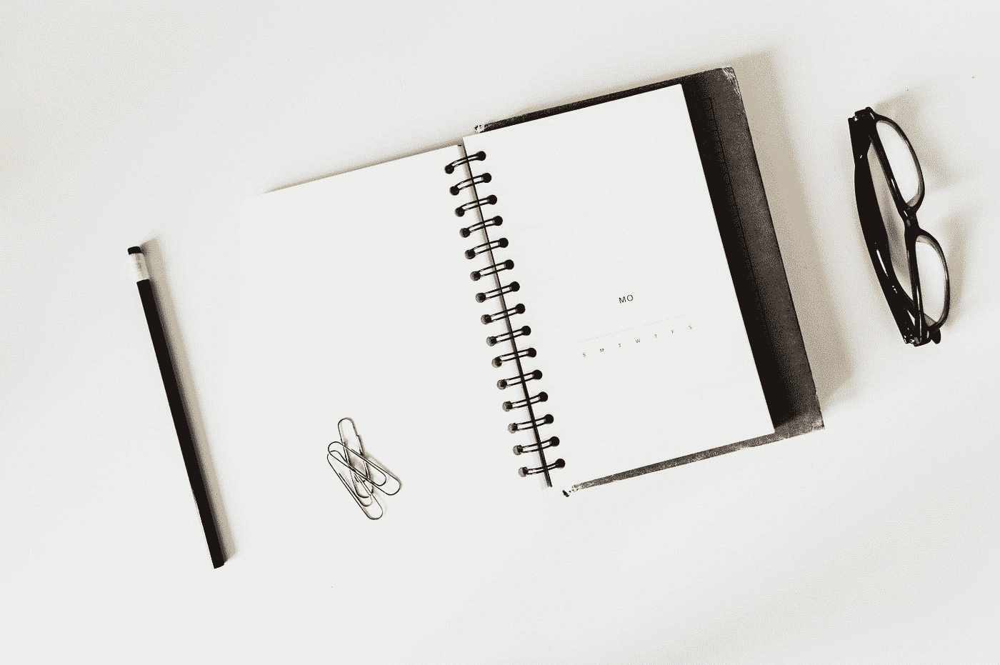
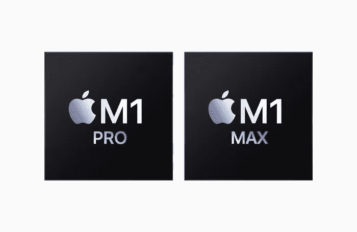
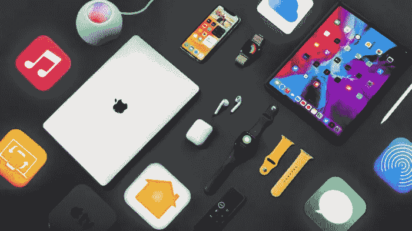
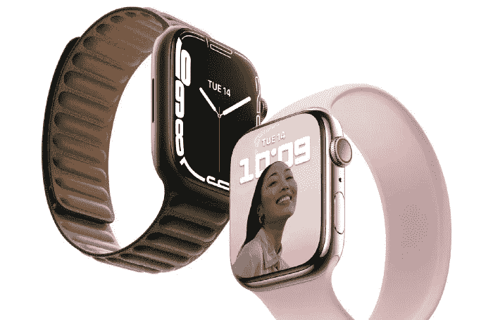
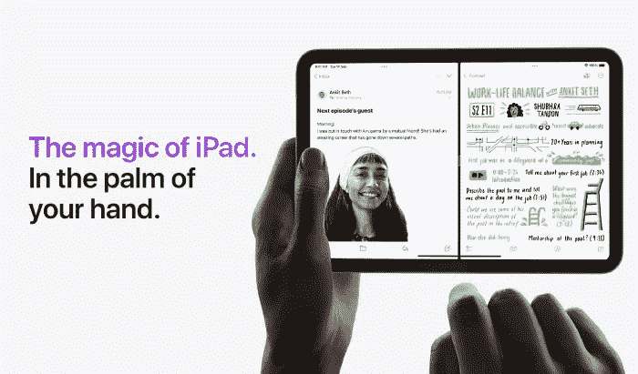
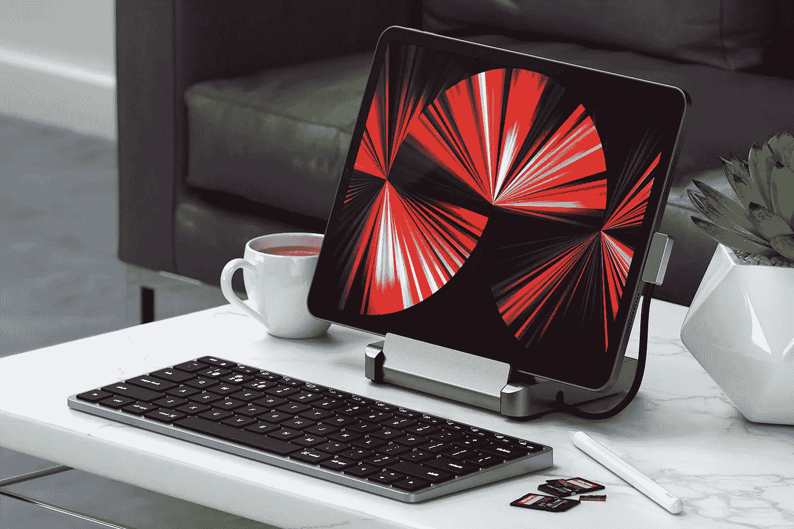

# 我关于苹果最有见地的故事——中等

> 原文：<https://medium.com/geekculture/my-most-insightful-stories-about-apple-medium-3d856f7ad98b?source=collection_archive---------20----------------------->

Photo by [Austin Distel](https://unsplash.com/@austindistel?utm_source=medium&utm_medium=referral) on [Unsplash](https://unsplash.com?utm_source=medium&utm_medium=referral)

## 以下是我迄今为止发表的最有见地的苹果故事

你好。

谢谢你过来。我创建了这个索引来帮助你找到迄今为止我发表的最受关注和最有见地的苹果帖子。

> 展望未来，我会定期整理这篇文章并更新索引。

Photo by [Markus Winkler](https://unsplash.com/@markuswinkler?utm_source=medium&utm_medium=referral) on [Unsplash](https://unsplash.com?utm_source=medium&utm_medium=referral)

下面简单介绍一下我自己。不过你可以跳过这一段。

> 我叫 Rajshekhar Reddy。我的职业是 SAP 顾问。一个顽固的苹果粉丝。我喜欢苹果产品。但显然，我的故事大多围绕着他们。

那好吧。让我们马上开始今天的故事。如果你有任何问题，请在评论中告诉我。

# 目录—索引

Photo by [Lauren Sauder](https://unsplash.com/@laurensauderstudio?utm_source=medium&utm_medium=referral) on [Unsplash](https://unsplash.com?utm_source=medium&utm_medium=referral)

为了节省您的时间和精力，我创建了这个目录作为您的索引，这样您可以通过点击链接快速跳转到您感兴趣的故事，而不是无休止地滚动整个故事。毕竟，你的时间是宝贵的。

页（page 的缩写）s–如果您在笔记本电脑或台式机上查看，以下链接有效。如果你使用手机或平板电脑，我会要求你向下滚动。

[**1。庆祝史蒂夫——科技先驱**T3](#2518)

[2**。是什么让苹果的设计如此出色**](#4a93)

[**3。有史以来最强大的 Mac 笔记本**](#4a18)

[**4。新款 iPhone 13 mini —苹果**](#d1ce)

[**5。苹果生态系统讲解**](#4208)

[**⑥。apple Watch Series 7——这是给你的**](#a2ae)

[**7。iPad mini 6 —新款 iPad mini**](#ec28)

[8。10 个不可思议的 iPad 桌面设置创意](#af74)

# 1.庆祝科技先驱史蒂夫

Image Source: [Apple](http://www.apple.com/in)

我想以我写的关于科技先驱史蒂夫·乔布斯的故事开始这个故事。这是他的十周年忌日。他在很多方面改变了这个世界。

作为一个死忠的苹果粉丝，这个故事就像是我对故事大师、幻想家和偶像的敬意。他本身就是一个绝对的传奇。

一定要读一读，让我知道你的想法。下面给出了链接。

 [## 庆祝科技先驱史蒂夫

### 十个，还在数。让我们停下来思考一下。

medium.com](/macoclock/celebrating-steve-the-tech-pioneer-fe95d06e4549) 

# 2.是什么让苹果的设计如此出色

Image Source: Instagram

我的第二个选择是苹果设计。众所周知，苹果是工业设计的黄金标准。虽然苹果以其伟大的技术而闻名，但其声誉的很大一部分在于其干净简约的设计和简约。

那么苹果是如何每次都想出如此永恒的设计的呢？

**这个故事将探索苹果公司坚持至今的设计原则。**

一定要读一读，找出答案，并让我知道你的想法。下面给出了链接。

 [## 是什么让苹果的设计如此出色

### 苹果设计背后的秘密。原理揭晓。

medium.com](/macoclock/what-makes-apple-design-so-good-d430ef97c6d2) 

# 3.有史以来最强大的 Mac 笔记本

Image Source: [Apple](http://www.apple.com/in)

对于我的第三个故事，我会选择性能、功率和效率作为我的主题。众所周知，苹果公司最近结束了今年的 Mac 主题演讲。

苹果宣布了 MacBook Pro 设备的新系列，由苹果硅产品系列中的两个新 SOC 驱动:**M1 Pro 和 M1 Max** 。

所以，今年发布的 Macbooks 是有史以来最强大的 Mac 笔记本。毫不夸张地说。

但如何衡量“最强大”这个词呢？依据是什么？

**这个故事根据苹果公司进行的一些关键基准和测试，探讨了新型 SoC 如何成为同类最佳产品。相信我，结果会让你大吃一惊。**

一定要读一读，找出答案，并让我知道你的想法。下面给出了链接。

 [## M1 Pro/M1 Max vs 当前最佳

### 用当前最好的 GPU/CPU 对苹果的新 SoC 进行基准测试

medium.com](/macoclock/m1-pro-m1-max-vs-the-current-best-24dc8ef798a6) 

# 4.新款 iPhone 13 mini——苹果

Image Source: [Apple](http://www.apple.com/in)

iPhone 13 mini 是苹果 2021 年 iPhone 阵容中最紧凑、最实惠的机型。它与配备更大 6.1 英寸显示屏的 iPhone 13 共享大多数规格，包括相机设置。

但是，这是否足以赢得今年口袋火箭的称号呢？

**这个故事详细探讨了 iPhone 13 mini 的各种功能，并帮助你做出是否应该购买 mini 的最终决定。**

一定要读一读，找出答案，并让我知道你的想法。下面给出了链接。

 [## 苹果 iPhone 13 mini

### 新型全能移动火箭。就在你的口袋里。

medium.com](/macoclock/apple-iphone-13-mini-d3423126e1a2) 

# 5.苹果生态系统解释道

Image Source: Instagram

苹果生态系统是我们在日常生活中都会接触到的不同产品和服务。上面显示了一个示例图像。这很有启发性，但并不详尽。

但是为什么尽管苹果产品这么贵，人们还是会一直买呢？

**这个故事涵盖了上述方面。苹果的生态系统被认为是最好的，在这里我将讨论这个生态系统是什么，以及为什么你可能会被困在其中。**

一定要读一读，找出答案，并让我知道你的想法。下面给出了链接。

 [## 苹果生态系统解释道

### 苹果是如何每年卖出更多手机的

medium.com](/macoclock/the-apple-ecosystem-explained-c9dd6d00ec95) 

# 6.苹果手表系列 7——这是给你的吗

Image Source: [Apple](http://www.apple.com/in)

早在 2021 年 9 月宣布的 Apple Watch Series 7 是最初于 2015 年推出的 Apple Watch 的当前迭代。

Apple Watch Series 7 建立在以前 Apple Watch 型号的设计基础上，采用了更圆润的设计，并提供了一些值得注意的新功能，如更大的显示屏、更高的耐用性和更快的充电速度。

但是这些特性足以成为你选择 7 系列的理由吗？

一定要读一读，找出答案，并让我知道你的想法。下面给出了链接。

 [## apple Watch Series 7——这是给你的吗？

### 前方全面回顾。是时候了。

medium.com](/macoclock/apple-watch-series-7-is-this-for-you-8bd113343b54) 

# 7.iPad mini 6——新款 iPad mini

Image Source: [Apple](http://www.apple.com/in)

iPad mini 迫切需要彻底改造。

虽然在 2019 年，苹果公司以新版 iPad mini(第五代)的到来给了我们惊喜，但在软件方面，这或多或少是一个小小的变化。

但是今年，苹果改变了一切。

**那么新的苹果 iPad mini 够强大吗？**

一定要读一读，找出答案，并让我知道你的想法。下面给出了链接。

 [## iPad mini 6——新款 iPad mini

### 迷你变得很棒。迷你变得更强大。迷你变大了。

medium.com](/macoclock/ipad-mini-6-the-new-ipad-mini-5c35f57ca9c1) 

# 8.10 个令人难以置信的 iPad 桌面设置创意

Image Source: Instagram

十多年前，史蒂夫·乔布斯推出了 iPad。

我一直相信 iPad 有一个美好的未来。在整个苹果产品线中，这是一款有趣的设备。除了轻便易携带之外，它的用途也非常广泛，可以胜任任何任务。

但是我们应该如何设置才能最大限度地发挥其潜力呢？

**为此，我们需要了解一点人物角色。这个故事将向你介绍那些角色，然后帮助你从头开始设置事情。**

假设你喜欢在 iPad 上工作，你很可能重视极简主义，喜欢用更少的电缆保持整洁有序。

一定要读一读，让我知道你的想法。下面给出了链接。

 [## 10 个令人难以置信的 iPad 桌面设置创意

### 超级简约。超级高产。超级实用。

medium.com](/macoclock/10-incredible-ipad-desk-setup-ideas-ef972c724b54) 

# 最后的想法

Photo by [Johan Godínez](https://unsplash.com/@johanemanuel?utm_source=medium&utm_medium=referral) on [Unsplash](https://unsplash.com?utm_source=medium&utm_medium=referral)

这些是我目前为止点击率最高的一些故事。这个列表会随着时间的推移不断增长，如上所述，我会定期整理它。

在我结束之前，这里有几个要点给你。请考虑一下。

*   如果你喜欢这些故事，并且想读更多类似的故事，你可以关注这个空间。
*   你也可以选择订阅我的时事通讯，这样我的最新帖子就会直接发送到你的收件箱里。

请在评论中告诉我你是如何找到这篇文章的。

暂时就这样了。直到我的下一个，和平！