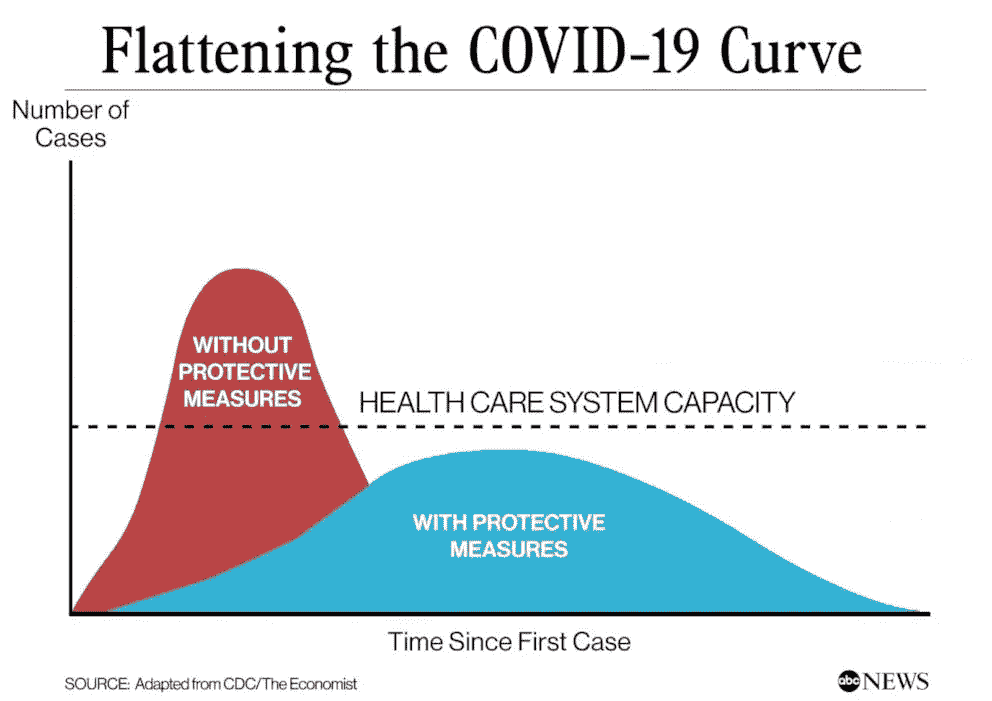

# 我的隔离项目:解开 SIR 流行病模型

> 原文：<https://medium.com/geekculture/my-quarantine-project-untangling-a-sir-epidemic-model-dc94268d80db?source=collection_archive---------38----------------------->

在隔离开始的前一段时间，我开始听到即时专家谈论[使曲线](https://abcnews.go.com/Health/flattening-coronavirus-curve-happening/story?id=70119118)变平，通常伴随他们的评论的是这样的图像:

Peak-y curve means higher R0.

更重要的一点是，您希望曲线的峰值——需要住院治疗的感染者——低于医院房间的容量，从而避免另一次健康…