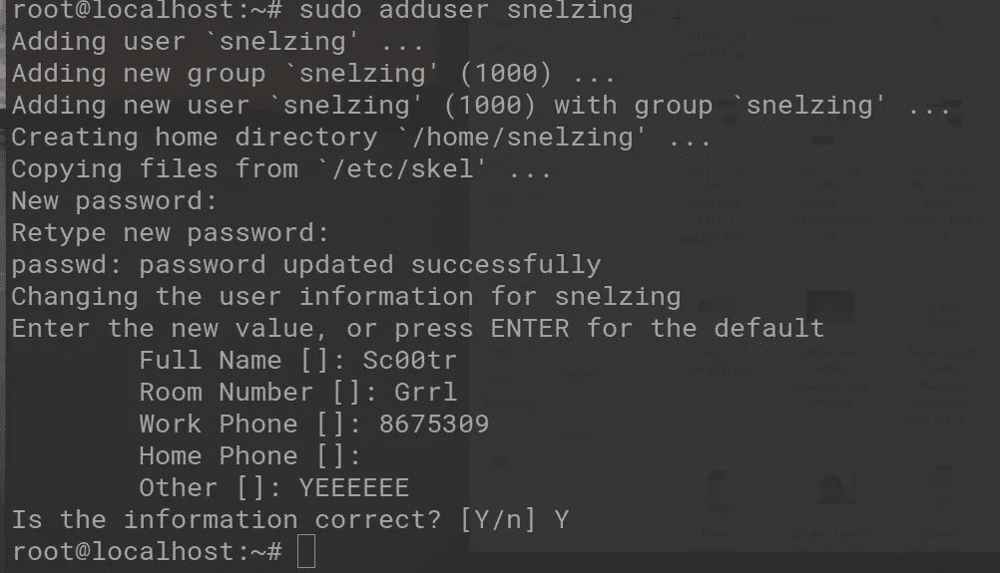
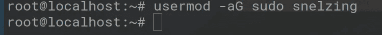
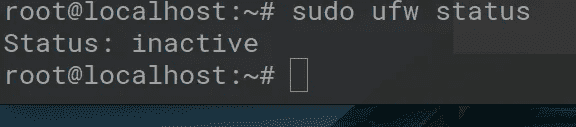
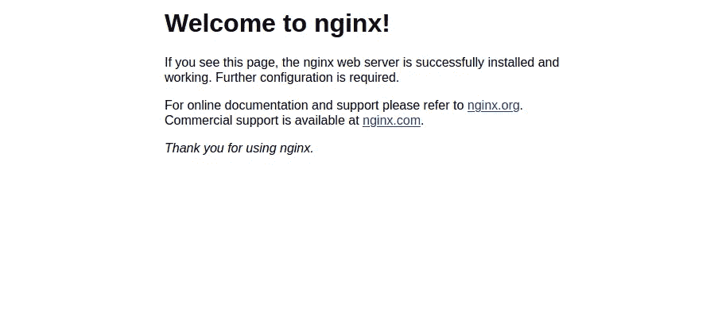
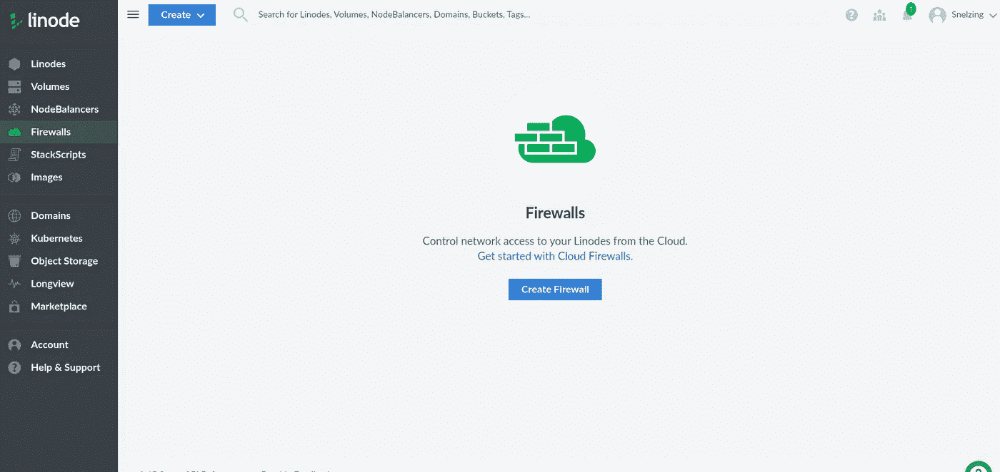

# 我的 SDBA 训练营:第 3 集

> 原文：<https://medium.com/geekculture/my-sdba-bootcamp-episode-3-49fb2fd56947?source=collection_archive---------31----------------------->

节点知道。但我没有。

有趣的事实:你知道 Node 不是一个框架，而是一个运行时环境吗？我在 Node 上看了这个家伙长达一小时的视频，他给了我一些我认为其他大师不会在意的非常好的信息。Tbh，我还是不确定是要用 Node 还是说，Flask。从我所做的初步研究来看，Flask 重量轻了很多，但会涉及更多的配置。Node 很强大，有一个非常大的库。这里是我看的主要网站之一:【https://stackshare.io/stackups/flask-vs-nodejs 

它将 Flask 描述为被开发者描述为*一个基于 Werkzeug、Jinja 2 和 good intentions 的 Python 微框架。*

哎哟。

然后 Node 被描述为*一个基于 Chrome 的 JavaScript 运行时构建的平台，用于轻松构建快速、可扩展的网络应用。*

所以我只是在想象:

对于这个迷因，我比我应该的要自豪得多。

所以这总是我找到的任何项目中最难的部分。你有服务器，你摔跤了哈哈哈…现在怎么办？我知道我的很多朋友希望我使用像 Flask 或 Django 这样的 python 框架。但是 Flask 似乎太轻了，我用过 Django。抱歉，但是我发现姜戈过度设计了，至少在我现在做的事情上。实际上，我也曾与 Node 合作过。当然，它是在已经开始和正在进行的项目上，但是我惊喜地发现它是如何工作的。我有时候差点忘了，它只是一个 f****** *JavaScript 运行时环境*。我想我倾向于 Node。我看到它作为人们想要的东西出现了很多次，我一直觉得它很有趣(*它就是起作用*)。这是我应该担心的事情吗？

我经常发现最好是开始，让它自己展现给你。我知道这听起来像一些道学的东西，但是分析麻痹是我们这里的敌人。我喜欢做的是排列一些问题，然后在回答这些问题的过程中，我们在一些轨道上得到一些火车。只是希望是在陆地上，而不是在海里。这个比喻正在土崩瓦解。

不管怎样，我可以从以下几个问题开始:

*我们如何将这个美化了的虚拟机变成一个真正的服务器？*

所以 Node 似乎经常在一个叫做 MERN 的堆栈中使用。它代表 Mongo Express React 节点。太奇怪了。我已经习惯了在这些缩写中看到 Nginx。Mongo 是一个数据库，React 是前端̶f̶r̶a̶m̶e̶w̶o̶r̶k̶库，Node 是 Chad。所以 Express 要取代 Nginx 的位置？我觉得我以前必须用 Express 做些什么，但我当时迷路了，就像在森林里一样，而且地图是拉丁文的。

所以我快速谷歌了一下，Express 其实叫框架(终于！).提示:如果你不确定什么是技术，你不知道的谷歌技术和你认为最相似的技术。通常你会被告知你错得有多离谱，但是它会把一些地图翻译成你的母语。我确实做过 Express vs. Nginx。现在我应该在这里警告你和我。Nginx 经常与其他东西一起使用(有时甚至与 Apache 一起使用，但我认为它是一个负载平衡器？).所以我用 Express 不代表我以后不会用 Nginx。而且根据我的初步阅读，听起来无论如何我都会用 Nginx。

嗯，这给了我一个开始的地方。将 Nginx 安装到服务器上，确保我能看到它漂亮、简约的“欢迎”页面。

糟糕，不。我是我服务器的超级用户。坏谢尔比！一般来说，你只是不想在根用户下设置东西。

I find it hilarious they still ask for all this info in Ubuntu, as if all offices aren’t either at home or 1 room open-air offices nowadays. Does this info get used anywhere BTW?

然后，您希望将新用户添加到 sudo 组中。这一直让我困惑。*让我们添加一个用户，这样我们就不必使用 root 用户，然后赋予该用户与 root 用户相同的权限。*这实际上不是的情况，稍后你会看到 Nginx 的情况。所以让我们开始吧。

No news is good news here.

至于 Nginx，我知道有几种方法可以做到。有时候 nginx 已经安装在一个东西上了。可以用`nginx -v`查一下。我查了，但是没人接。

我用这个搞清楚了怎么做:[https://www . digital ocean . com/community/tutorials/how-to-install-nginx-on-Ubuntu-20-04](https://www.digitalocean.com/community/tutorials/how-to-install-nginx-on-ubuntu-20-04)

(在 Linode 上使用 DigitalOcean 教程感觉很脏…耶自由市场！)

当我输入命令的时候，有一个延迟。上次发生这种事的时候，我空间不够了。我们刚刚安装了 Nginx。我确定没问题(背景有火的声音)。

我得到了这个:

这是我始料未及的。去谷歌！

等等，如果防火墙被禁用了，那我是怎么进入的？！

Welp。这对我来说是全新的。

为了看看我会得到什么样的错误，我把 IP 地址放在了 url 栏中。

quite the error.

嗯……酷？这可能更糟，因为我真的不明白发生了什么。我将注销并重新登录到服务器。也许之后状态会更新…

没有。仍然显示无效。该死的。然后我试着看看是否有一个像 AWS 一样的单独的防火墙设置。似乎没有。有这个，但这似乎是一个完全不同的防火墙:

*叹息*

好吧，今晚我不干了。我想我已经完成了我的使命。我*将*在板上插一根针，试图更好地理解防火墙。把它列在需要学习的东西的清单上，还有我的朋友一直唠叨着要我学习的函数式编程。晚安！

这里有同样的狗屎:

 [## snelzing -概述

### 阻止或报告将在复制到剪贴板的内容中找到电子邮件 Python 将文本文件转换为 CSV Python…

www.github.com](https://www.github.com/snelzing)  [## JavaScript 不可用。

### 编辑描述

twitter.com](https://twitter.com/@Sc00tr_Grrl)  [## Shelby E. -职业自由职业者-我自己| LinkedIn

### 在手机和桌面软件 QA 测试方面经验丰富。也有一些自动化测试的经验。请…

www.linkedin.com](https://www.linkedin.com/in/shelby-e-baa410b3/) 

如果你第一次没有失败，那就再成功一次。