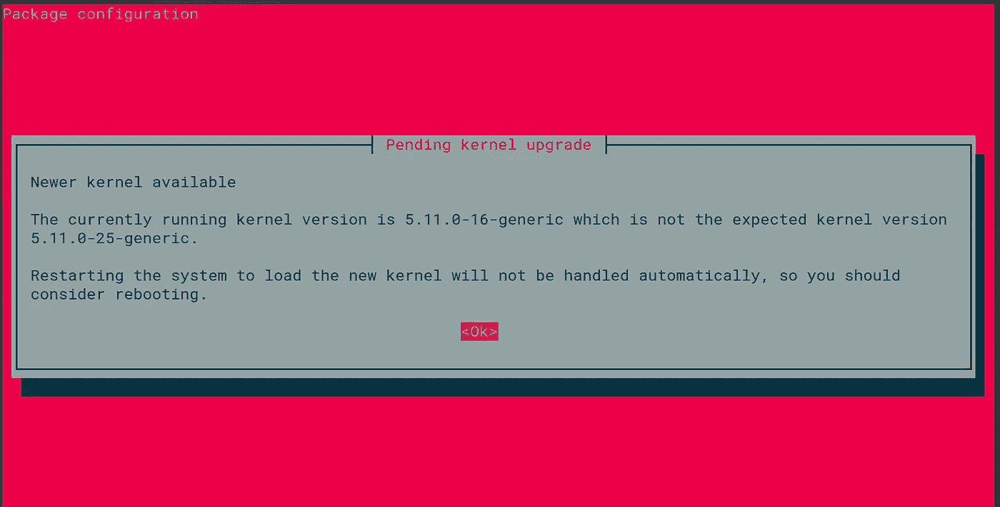
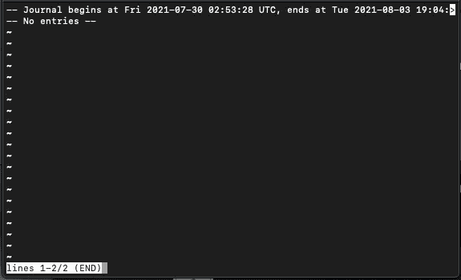
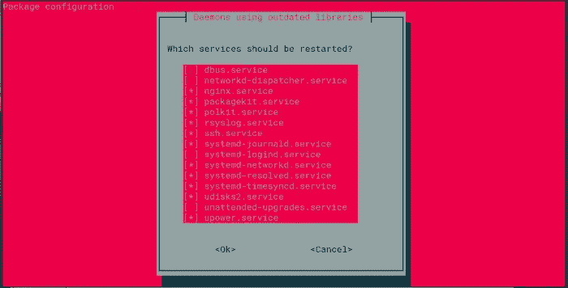
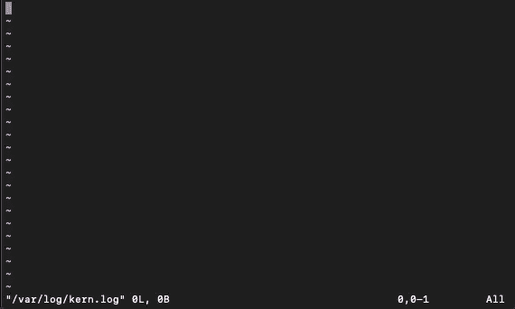

# 我的 SDBA 训练营:第 5 集

> 原文：<https://medium.com/geekculture/my-sdba-bootcamp-episode-5-dd4fe9c3c066?source=collection_archive---------71----------------------->

我开始认为 Node 基本上是 Javascript 的紧身衣。

Photo by [Matthew Henry](https://unsplash.com/@matthewhenry?utm_source=unsplash&utm_medium=referral&utm_content=creditCopyText) on [Unsplash](https://unsplash.com/s/photos/warm-blanket?utm_source=unsplash&utm_medium=referral&utm_content=creditCopyText). Unsplash people really don’t get enough love.

所以[直到](https://codewithmosh.com/)，Node 中的几乎每个文件都是一个模块，该模块将文件包装在一个函数中，该函数采用`exports`、`require`、`module`、`__filename`和`__dirname`(dirname 大声说出来很有趣— DUUUUURRRRRR。也说明了我的感受)。如果你以前接触过 Node，你可能认识这些。好的一面是你不必担心这个函数，而且在很大程度上，这似乎不是你的问题。但很高兴知道它在那里。我们被包裹在一个温暖的模块包装毯中，保护我们免受 Javascript 在一周内被一起破解并为浏览器而生的事实的影响。

## 系统警告警告警告警告

总之，上一集我们在做什么？哦，是的，我想知道为什么 SystemD 要跳过内核。

Why hot pink? Maybe the better question is why not…..

我想知道为什么只有当我安装 Node 时它才会抱怨这个问题…..假设 SystemD 是一个 init 系统。我确实记得我的朋友说也许一些更新被中断了。

我只记得日志是个东西(我想我听到远处有个系统管理员在打脸…).下面是我在这部分使用的一个很酷的源码:[https://www . cloud bees . com/blog/running-node-js-Linux-systemd](https://www.cloudbees.com/blog/running-node-js-linux-systemd)

(非赞助——我甚至不知道他们卖的是什么。):

所以这里他们说用`journalctl -u`。(有人搞清楚用 Medium 写代码了吗？好像不能复制粘贴进去吧！所以如果你想知道为什么会有截图…..)

我要试试`journalctl -u systemd`，看看会发生什么。因为我们只是要求一些东西的日志，我觉得开始尝试不同的服务是安全的。对于其他我不太确定的命令，这可能不是一个好主意。

Welp. (You press Q to get out of this BTW)

现在让我们试试 systemD@1。在我发表的文章中，作者把它放在了 Redis 之后(我们在这里肯定不会乱用 Redis)。

和以前一样。

你还记得之前的事吗？：

Oh god my eyes!

这些是我们所知道的以某种方式接触到的(听起来很奇怪……)。所以让我们试试这些，看看会发生什么。这至少有助于学习 journalctl 命令。

所以我试了 upower.service，nginx.service，why-no-service，都没有日志…..

这是不幸的。尽管到处都是木头。我想看看利诺德自己有什么要说的。没有像 Linode 提供的 GUI 控制台中那样的日志，但是他们有这篇文章:

 [## 如何检查服务器的日志文件？|里诺德问题

### 你好，我只是想知道如何检查服务器的日志文件，因为我们一直注意到服务器…

www.linode.com](https://www.linode.com/community/questions/295/how-do-i-check-my-servers-log-files) 

我忘了那些日志…..不过我并不是非常有信心，因为我认为这些只是从会议一开始就告诉你的。不知道为什么我会这么想。所以我会试着查看 kern.log。

你需要须藤。数字。每当你在一个路径的开头看到那个`\`，你就知道它的起始目录在根目录中。

sigh

我们真的需要继续前进。这是一个问题，我将坚持一针，并回来。或者如果它再次出现，那么我至少可以得到更多的信息。但现在，我们需要让这个项目继续下去，这已经够糟糕了，我已经脱离了我的职位时间表(我听到互联网来了，它的统治者在手中…)。如果有人有任何见解，请告诉我。

## 让这个东西与另一个东西对话，然后做这件事…

所以我参与过一些有 Node 和 Nginx 的项目，但是它们已经被设置好了。我从来没有从头开始过。如果我回忆的话，我觉得就是让 Nginx 知道监听哪个端口那么简单。Nginx 对给你冒名顶替综合征很好。我花了很多时间试图学习 Nginx，并试图不去想这样一个事实:我的导师似乎对它理解得如此完美。我发现(IMAO)网上很多文档都假设你已经配置了 Apache，Nginx 的教父级，它很快就黯然失色了。你得给自己时间。也就是说，我将为您节省一些时间:

Nginx 将自己安装在根目录中，并将其分散到各处。如果你是一个技术狂人，这就没有意义了，因为你已经习惯了某个东西被安装在一个地方，比如应用程序文件夹或者桌面(如果你曾经注意到除了桌面图标之外的任何东西的话)。虽然没有判断，我也没有)。但是服务器实际上只做一件事——为网站服务。既然你很可能从 Ubuntu 开始(告诉我我错了)，这里有一些东西:

*   主 conf 文件是 nginx.conf，位于`/etc/nginx`下
*   有时在`/etc/nginx/conf.d`下也有一个 default.conf。至少我记得是这样。我在我的 linode 服务器上没看到。默认情况下，它只是引用 nginx.conf，直到你对它做了别的事情。当你开始在一台服务器上处理多个网站时，它就更有用了。到了那里就到了
*   这就是令人困惑的地方——用户访问网站时看到的实际上是 html 文件的文件在`/var/www/html`中
*   RTFM:【http://nginx.org/en/docs/beginners_guide.html 
*   然后 RMOTFM:[http://nginx.org/en/docs/](http://nginx.org/en/docs/)

当你开始时，只需担心 nginx.conf。你会看到所有这些声称是为初学者准备的教程，然后进入站点可用和站点启用文件夹。呃，那是当你有多个网站的时候，我很确定。无论如何，现在您只需要弄乱主 nginx.conf 文件。

尽管有时会让人不知所措，但请记住，nginx 真正能做的一切都在这些指令中:【http://nginx.org/en/docs/dirindex.html】T2。即使这样，我认为你真的只用了 10-20 个。请记住，Nginx 只是把输入从互联网传到它需要的地方。就是这样。

很抱歉以一种令人毛骨悚然的方式离开，但至少我现在知道下一个条目是什么了。谢天谢地，Node 很简单，我觉得下一部分将是我与 Nginx 的一次简单接触。

社交媒体！：

 [## snelzing -概述

### 阻止或报告将在复制到剪贴板的内容中找到电子邮件 Python 将文本文件转换为 CSV Python…

github.com](https://github.com/snelzing/)  [## JavaScript 不可用。

### 编辑描述

twitter.com](https://twitter.com/sc00tr_Grrl)  [## Shelby E. -职业自由职业者-我自己| LinkedIn

### 在手机和桌面软件 QA 测试方面经验丰富。也有一些自动化测试的经验。请…

www.linkedin.com](https://www.linkedin.com/in/shelby-e-baa410b3/) 

推特上已经有 5 篇文章了。找到你的 Javascript！(除非他们这样做了，否则这个笑话就没有意义了)