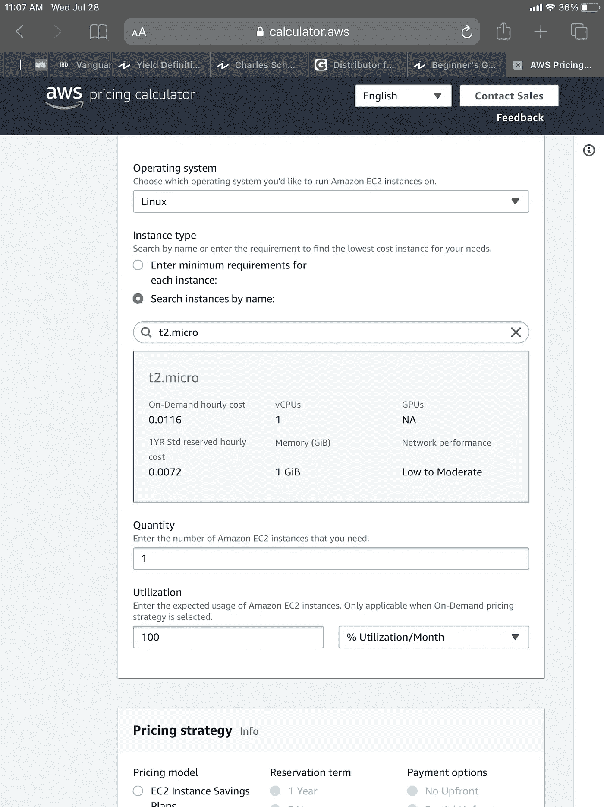
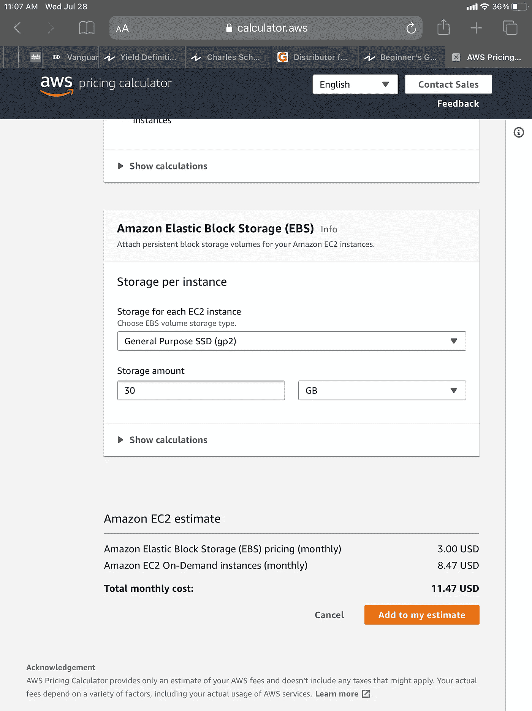
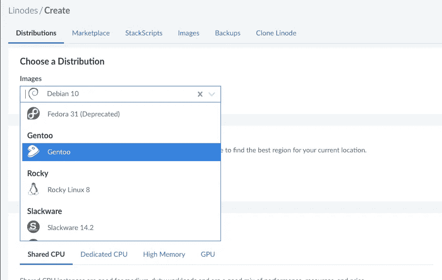
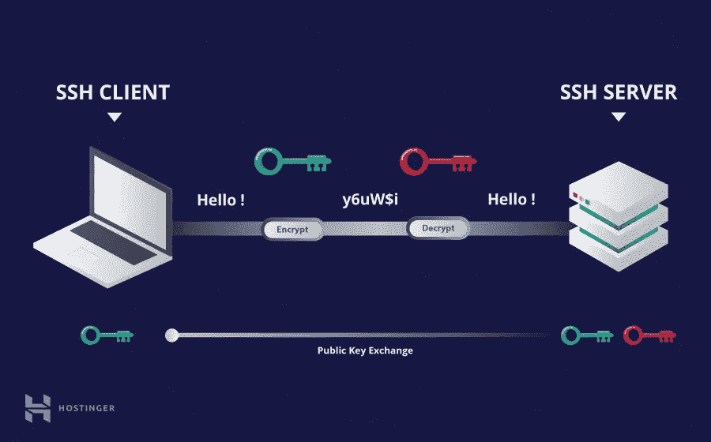

# 我的 SDBA 编码训练营:第 2 集

> 原文：<https://medium.com/geekculture/my-sdba-coding-bootcamp-episode-2-ab83e3217cdc?source=collection_archive---------63----------------------->

顺便说一句，我用任何能让这一切运转起来的东西。(再次语言警告)

Does anyone know who originally made this? It is brilliant.

啊，这是第二天了。那一定意味着它现在是一种习惯，对吗？我希望这种兴奋感能持续下去。你真的必须每天都有所期待才能让生活快乐，对吗(也就是说，除了蛋糕之外的东西)？

今天早上我醒来的时候在想取消训练营是不是正确的事情。我讨厌那种你不确定一个决定是否正确，但任何一个方向都会让你有这种感觉的感觉。由于融资，我实际上每月只需支付 17 美元，持续五个月。但是这也很费时间。当你是以每小时 100 美元为基础的自由职业者时，时间就是金钱的口号就变得非常字面化了。另外，我听说政府学生贷款从去年九月开始。一旦我跑完了所有的$ numbers 美元，我可能不得不在训练营结束后找一份“真正的”工作来偿还我所有的债务。

事情就是这样，现在已经做了。我想我只是讨厌它，因为我总是幻想自己是“承担高风险，获得高回报”的类型。但是在一个该死的疫情期间从事自由职业已经是那种类型的最终决定了。我不能老是把这些决定一个接一个地堆在一起。总有一天，它们会倒塌。

但是足够的存在主义。所以我开始了让我的网站运转起来的第一步:弄清楚我是否负担得起 AWS。能够使用这些服务真是太棒了，因为我也想获得 AWS 认证。不是挑我的女孩，但我从来不是那种记住一堆狗屎并通过考试的人。我知道其他一些人能够用 AWS 测试做到这一点，但即使是我的实践结果也是糟糕透顶。部分原因是我是一名 IT 人员，而不是像我最初计划的那样是一名神经科学家。无论如何，以下是我通过 [AWS 定价计算器](https://calculator.aws/#/addService)计算出的一些初始数字:

甚至 EC2 t2.micro(在你问之前，但免费层前一段时间干涸)将是很多 tbh。我尝试了其他一些可以为您节省开支的保留选项，但是对于这种情况，它们并没有好到哪里去。我过去也观察过 spot 实例。对于那些不熟悉的人来说，spot instances 基本上是 AWS，让您对额外的未使用空间进行投标。你为你愿意支付的东西设置一个价格，当它超过你设置的价格时，实例终止。(所有这些都假设空间可用—如果 AWS 只是想要回空间，您也可能随时丢失 EC2)。他们对快速、廉价、肮脏的欲望很酷(他/她/泽是这么说的)。但我确实希望这能持续运行很长时间。哦，上帝知道还有很多其他的 VPS 服务。

谢天谢地，我不用找很长时间。我试了一下 Linode，发现他们为首次用户提供了 100 美元的信用额度(9 月份结束，但即便如此，一台小型服务器也要 5 美元)。这 100 美元可以让我玩一会儿更有趣的东西，比如他们有一些 Kubernetes 的东西。听起来很棒，只要你记得关掉它！否则，他们就是这样赚钱的。

在 linode 中设置服务器是非常标准的。我过去也使用过 Digital Ocean，老实说，Linode 似乎更简单。我会给你们一个推荐代码，但显然你必须在那之前在利诺德花了 25 美元。所以当我有了，我会把它贴在后面的文章中，这样我就可以看起来像一个出卖。

I just thought this was amusing.

Here is a dank meme no one has used in awhile.

我决定选 Ubuntu 21.04(喘气！).我试图创建一个网站，而不是简单的一套吹牛的权利。嗯，我想是这样的，如果我做这一切是为了产生更多的业务…不管怎样。至少它不是 Windows。

所以唯一困难的事情就是处理呵呵呵呵。听着，如果你不明白如何设置 SSH，不要难过。我能做到这一点的唯一原因是因为我已经做到了，而且已经做了 23 次了。

这是我发现的一篇文章，我认为它很好地涵盖了这一点。

 [## SSH 初学者教程——SSH 是如何工作的

### SSH 或 Secure Shell 是一种远程管理协议，允许用户控制和修改他们的远程服务器…

www.hostinger.com](https://www.hostinger.com/tutorials/ssh-tutorial-how-does-ssh-work) 

我们使用公钥-私钥对。

You has a public key, and then through the magic of math, no one knows the private key who isn’t supposed to. (from above article in case you skipped it. I know you did Frank. I know you think you are too good for this.)

如果你*仍然*困惑，以下是要点:

*   有一个公钥和一个私钥。在 mac 和 linux(实际上是任何基于*nix 的系统)中，您可以使用“`ssh-keygen -t rsa`来生成它们。窗户需要油灰之类的东西。它变得非常粘。罗罗罗罗……..
*   默认情况下，它会将它放在一个名为`.ssh`的隐藏目录中。它几乎总是在主目录下。你必须做`l -a`或`ls -a`才能看到它。我会让 ssh-keygen 将它放在默认目录中。相信我。
*   你将把公共密钥给服务，像 DigitalOcean 或 Linode。
*   不要把私钥给任何人。整个系统的安全都建立在它的基础上。甚至不要把它发给你最好的朋友，他们知道你所有的秘密。每次你把东西送到任何地方，都有可能被拦截。这就是 SSH 比密码更安全的原因。密码必须存储在某个地方*。即使只是你的大脑。使用 SSH，只有您的电脑知道“密码”*
*   每个设备都需要自己的公钥-私钥对。因此，当我想连接另一台设备时，我需要在那台计算机上生成一个对，并将公钥交给服务器。不要把公钥和私钥粘在闪存盘上，放到另一台电脑上。我很想做那件事。这就像建造一条护城河，让一棵树完美地倒在上面。然后把树留在那里。

我应该给出一个免责声明，以防有任何老兵在那里:不要犹豫，纠正我在文章中说的任何事情。我会试着对我确定的和不确定的事情保持透明。我知道宋承宪还有很多东西，但我在这里给出了我觉得绝对可以传授的东西。如果你评论的东西真的很好，我会在以后的文章中收录。

这是我的社交媒体之类的:

 [## snelzing -概述

### 阻止或报告将在复制到剪贴板的内容中找到电子邮件 Python 将文本文件转换为 CSV Python…

www.github.com](https://www.github.com/snelzing)  [## JavaScript 不可用。

### 编辑描述

twitter.com](https://twitter.com/@Sc00tr_Grrl)  [## Shelby E. -职业自由职业者-我自己| LinkedIn

### 在手机和桌面软件 QA 测试方面经验丰富。也有一些自动化测试的经验。请…

www.linkedin.com](https://www.linkedin.com/in/shelby-e-baa410b3/) 

咦。