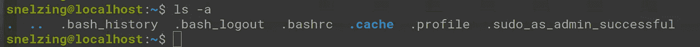
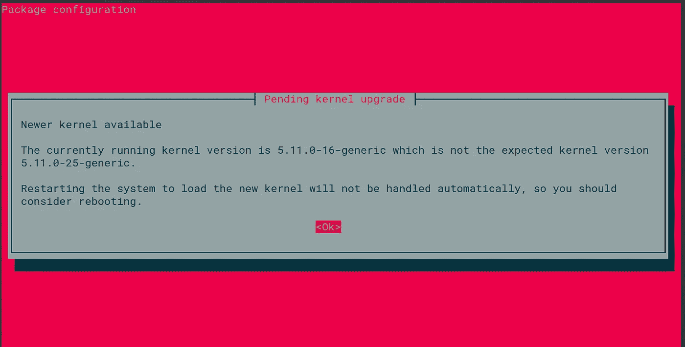
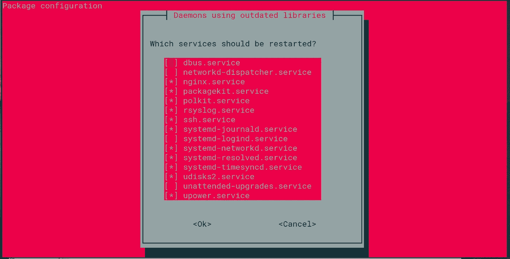
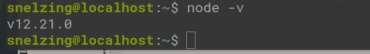

# 我的 SDBA 编码训练营:第 4 集

> 原文：<https://medium.com/geekculture/my-sdba-coding-bootcamp-episode-4-fe6facf837ab?source=collection_archive---------32----------------------->

但如果绕道就是目的地呢？

在一个新的 linux 环境中，我最喜欢做的事情之一就是 ls -a。你会惊讶于不同副总裁之间的差异。例如，今晚我发现了这个:

什么是`.sudo_as_admin_successful`？敬谷歌！

我发誓我以前没见过。但我也可能是那个不被注意的人。

 [## 移除。主文件夹中的 sudo_as_admin_successful 文件。第 56 期 sudo-项目/sudo

### 肯定有其他方法可以检查用户是否第一次运行 sudo。谷歌搜索文件名为…

github.com](https://github.com/sudo-project/sudo/issues/56) 

洛洛洛洛尔。所以这一小段弯路并没有真正推进我们的任务，但却是一段非常有趣的旅程。显然这是 Ubuntu 告诉你现在可以成功地使用 sudo 作为用户的一种方式？如果你进入这个文件，它里面什么也没有。网上充斥着无休止的关于如何以及何时移除它的讨论。

我想不出比 linux-y 更好的了。

好的，那么今天*的实际*任务是看看如何设置节点。我在 Node.js 上买了这个人的 14 小时课程(每小时一美元！).我从对 node 的了解中解释了多少细节还有待观察。事实是，如果你真的想学习 Node，你可能也应该考虑上一门从汤到蛋糕的课程。那会非常美味。不，实际上我的意思是和某人一起实时编码，我认为这是最好的学习方式之一，然后一起尝试和犯错误。我在教你做后者，而不是前者。

(Psssst。psst Pssssssssssssssssssssst:这里有一个多看推荐代码:[http://referral.pluralsight.com/mQnfAIG](http://referral.pluralsight.com/mQnfAIG)。我想我可以在媒体上使用这些，只要我声明它们是正确的？无论如何，我用过 Pluralsight，我认为如果它符合您的预算，它们是值得的。他们可能有点贵，但他们似乎什么都有！当钱不是问题的时候，我使用它们，但是经理们强迫你更快地学习。现在我有了反过来的问题…学习的道路也很好。这对于括号来说太长了，所以我现在要离开了。)

## 让我们开始使用字幕吧！

我在做什么？哦，是的，试图通过有趣的项目来寻找生活的目标，以分散自己对不可避免的走向死亡的注意力！总之，安装 node 总是有点奇怪，因为你似乎必须通过下载页面安装它。然后，您将获得 node 和 npm，它的软件包管理器。

哦，等等，不。这是最新的，你可以通过`apt`安装。可能是我第一次了解 node，才知道命令行*是什么*。我很好奇这到底是怎么回事…

Welp。

这一点都不像 sus！

## 在火车轨道上玩的时候，我们要小心谨慎。

这可能是意料之中的行为，但我倾向于站在锡纸帽的一边，也知道什么是[域名仿冒](https://en.wikipedia.org/wiki/Typosquatting)(我认为有一个包管理器的等价物，考虑到下载信息的相似性质)。所以回到谷歌。我要跟你说实话，这是我第一次看到这种情况，我使用 Ubuntu 已经很多年了(只有 2.3 年，但这在技术上使复数语法正确)。

我唯一能找到的(很容易)是这个:[https://askubuntu . com/questions/1349884/how-to-disable-pending-kernel-upgrade-message](https://askubuntu.com/questions/1349884/how-to-disable-pending-kernel-upgrade-message)

即使这样，在 stackoverflow 和类似的网站上也有很多“让我告诉你如何在互联网上写作”的典型言论。

从这件事和其他一些事情来看，这似乎是正常的。所以我要打 OK 了，胃里有一种恶心的感觉(可能也是因为今天喝了四杯健怡可乐……)。

I don’t know what the duck any of this is.

唉——回到谷歌。

这是我发现的更多狗屎…..

 [## 使用过期库的守护程序问题# 5 agowa 338/MinecraftSystemdUnit

### 你好，我最近开始在我的服务器上使用你的启动脚本来运行一些《我的世界》服务器。最近什么时候…

github.com](https://github.com/agowa338/MinecraftSystemdUnit/issues/5)  [## 使用 checkrestart/needrestart 确定需要重启的进程

### 适当的软件补丁管理有助于减少系统的弱点。但是，即使你修补了一个过时的系统…

linux-audit.com](https://linux-audit.com/determine-processes-which-need-a-restart-with-checkrestart-needrestart/) 

我将重启 Ubuntu 希望我重启的服务。它似乎很乐意告诉我该做什么。

## 向你的领导鞠躬

Figured this was appropriate. I can’t find the author again, I’m sorry. Here is the original URL at least (I think; it is hard to tell without PhD levels of research anymore.): [https://www.r-bloggers.com/2014/12/opencpu-release-1-4-6-gzip-and-systemd/](https://www.r-bloggers.com/2014/12/opencpu-release-1-4-6-gzip-and-systemd/)

我认为这一切都是值得的。

尽管这个问题已经解决了，我还是会做更多的调查。这一切对我来说都很新鲜，我觉得从这辆出轨的卡车上可以学到很多东西。

我也把它贴到了我个人的不和上，我的一个朋友(只有 Linus Tovalds 比他更了解 Linux)说:

“嗯，如果它正在升级，还没有完全完成…
我承认我没有见过如此强烈的抗议
通常，Linux 发行版会保留一份旧内核的副本，以备无法启动时回滚到旧内核……”

跟着他:[https://damiencalloway.com/](https://damiencalloway.com/)

但是为什么今天要做明天能做的事呢？尤其是当你的文章已经达到了媒体认为的最佳阅读时间的极限？

## 总之…

很抱歉跳过了一天的张贴，然后张贴一些基本上是走弯路和文字呕吐的道路。但是你已经得到了你想要的。当我开始发布货币化的列表文章，并且仍然以某种方式从它们身上赚钱时，来扇我一巴掌吧:)。

## 事情是这样的:

 [## Shelby E. -职业自由职业者-我自己| LinkedIn

### 在手机和桌面软件 QA 测试方面经验丰富。也有一些自动化测试的经验。请…

www.linkedin.com](https://www.linkedin.com/in/shelby-e-baa410b3/)  [## snelzing -概述

### 阻止或报告将在复制到剪贴板的内容中找到电子邮件 Python 将文本文件转换为 CSV Python…

github.com](https://github.com/snelzing/)  [## JavaScript 不可用。

### 编辑描述

twitter.com](https://twitter.com/sc00tr_Grrl) 

不是所有流浪的人都迷失了；但他们可能很快就会。

但这就是乐趣所在。