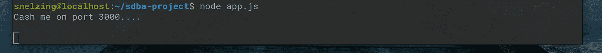
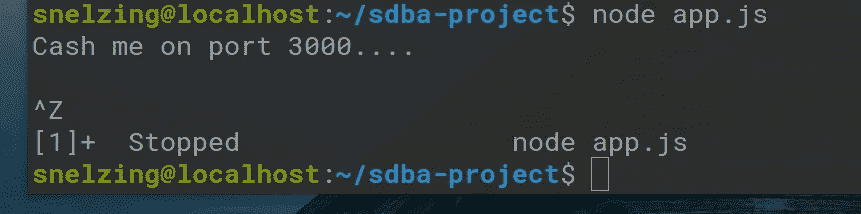
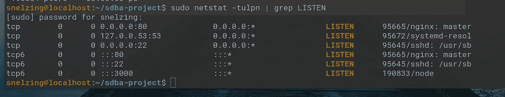
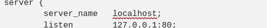
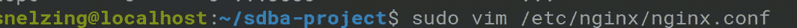
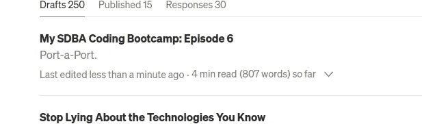
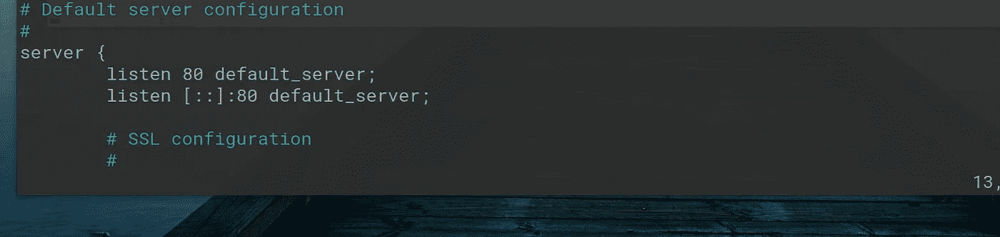
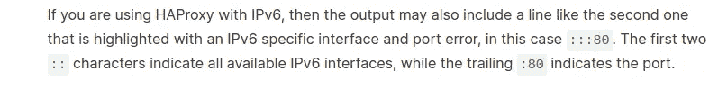
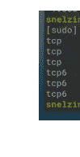

# 我的 SDBA 编码训练营:第 6 集

> 原文：<https://medium.com/geekculture/my-sdba-coding-bootcamp-episode-6-af9c6e3559ee?source=collection_archive---------10----------------------->

左舷左舷。


This is what learning Nginx felt like at first. Credit to Beasty . on Unsplash. Yes, that really was their username. Apparently the beast is in the present directory.

好吧，我在最后一部分撒了谎(*巴掌去互联网统治者*)。我真的不知道接下来该做什么。在你知道如何配置 nginx 之前，你配置了多少次 nginx？显然是三个。我想我确实知道今晚该写些什么，和我一直在写的一样:如何满怀信心地完成一个科技项目，这个人认为她可以接管世界，并希望皮格马利翁施展魔法。

所以在这种情况下，我喜欢从我所知道的开始，朝着我不知道的方向努力。我知道我存在，我的想法是真实的，所以如果我想…等等，错误的存在危机。所以我们知道我们需要处理 nginx.conf。我必须时刻提醒自己违约是什么样子的。下面是一个相当简单的 nginx.conf:

```
daemon            off;
worker_processes  2;
user              www-data;

events {
    use           epoll;
    worker_connections  128;
}

error_log         logs/error.log info;

http {
    server_tokens off;
    include       mime.types;
    charset       utf-8;

    access_log    logs/access.log  combined;

    server {
        server_name   localhost;
        listen        127.0.0.1:80;

        error_page    500 502 503 504  /50x.html;

        location      / {
            root      html;
        }

    }

}
```

这里我不打算介绍每一行是做什么的。尽管很难找到，但有很多资源可以做得更好。这里是我摘录这段代码的地方，它们似乎很好地解释了 Nginxish。如果看上面的代码没有阅读猪拉丁语有意义，(当然，除非你是猪和/或在华尔街工作)，你可能想从我链接的源代码开始。目前，我认为我们关心的只是服务器上下文。

```
server {
        server_name   localhost;
        listen        127.0.0.1:80;

        error_page    500 502 503 504  /50x.html;

        location      / {
            root      html;
        }
```

## 请稍等

几个小时(大约 23 个小时)后我回来了——虽然对你来说只是几秒钟，我知道(除非你也像我一样第三次去喝咖啡)。所以我去真的研究了 Node，并得到了大学的闪回减去冒名顶替综合症。因此，我认为我对 app.js 做什么有一个非常基本的想法，以便看看它是否能与 nginx 对话(警告:不要只是复制和粘贴这段代码到你自己的东西中——我不确定它是否能工作。如果这让你很困扰，那你就来错地方了。

```
const http = require('http');const server = http.createServer();
server.listen(3000);console.log('Cash me on port 3000....')
```

让我看看我是否能简单地解释这一点，但足以让你觉得你从我的摸索中学到了什么。在 JS 中，你需要导入模块，然后把它赋给一个常量变量。这需要一些时间来适应，因为在 Python 中它就像`import thing` 一样，就是这样。还有一个有趣的事实:显然，Node 必须进口它将使用的所有东西。这是好是坏取决于你，以及你有多想在评论中反驳我。

因此，首先我将创建一个名为`sdba-project`的目录(我确信以后可以很容易地将其重命名)。然后我会把上面的`vim`变成`sdba-project/app.js`。(或`emac`。更让你不爽的就行)。

我们试试`node app.js`。我完全期待一些狗屎去 f*ck，但我想看看会发生什么，因为我是新来的。



然后我将按 ctrl+z 将它放到后台。



没关系，那不是这里的事情。

但是等等，我刚才不显眼地链接到的那篇文章讲的是关闭终端的时候。但是还没有关闭泽终端。所以让我试试…



那为什么他妈的说早停了？是指控制台日志的显示吗？救命啊。

但事实上我们已经得到了我们想要的。还记得之前的这句台词吗？



Yes I screenshotted my own article; come fight Medium code formatting and then me.

我觉得 server_name 会变成 3000。作为一个旁白，你以后会吻我的脚:



你会想起你的小学时代，那时你花了这么多时间写论文，结果却发现微软 word 崩溃了。相反，在这里，vim 会厚脸皮地告诉你，你没有权限编辑文件*，在*之后你已经做了更改。

## *紧张的笑声*

所以很明显我的配置并不像我想的那么传统…..所以我的特定系统中的 nginx.conf 没有服务器的东西，但是引用了/etc/nginx/sites/enabled 文件夹中的 default.conf。TBH，那是我第一次看到那样的配置。我想我在 Nginx 上工作过的每个系统，每次都以不同的方式把自己放入文件系统。

好吧，让我们看看我有多少阅读时间？



好吧，妈的。我也许应该多加几分钟。好吧，让我们玩一会儿，看看我们能学到什么。所以在实际的默认配置文件中，服务器的内容看起来像这样。



有件事一直困扰着我，我想它会在这里出现。为什么有时候是 0.0.0.0:port，有时候是[::]:port？有时两者都有:


妈的，这是:80。没有括号有关系吗，还是我的自闭字面意思又发作了？去谷歌！

## …..

这有点难以谷歌，但我想我很幸运。[https://www . digital ocean . com/community/tutorials/ha proxy-network-error-cannot-bind-socket](https://www.digitalocean.com/community/tutorials/haproxy-network-error-cannot-bind-socket)

这里顺便提一下:



哦，也许这就是 TCP 旁边有个该死的 6 的原因:



今晚我不干了。

[](https://www.linkedin.com/in/shelby-e-baa410b3/) [## Shelby E. -职业自由职业者-我自己| LinkedIn

### 在手机和桌面软件 QA 测试方面经验丰富。也有一些自动化测试的经验。请…

www.linkedin.com](https://www.linkedin.com/in/shelby-e-baa410b3/) [](https://github.com/snelzing/) [## snelzing -概述

### 阻止或报告将在复制到剪贴板的内容中找到电子邮件 Python 将文本文件转换为 CSV Python…

github.com](https://github.com/snelzing/) 

[https://twitter.com/Sc00tr_Grrl/](https://twitter.com/Sc00tr_Grrl)

我真的不明白这里的链接预览。