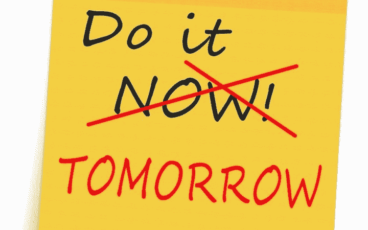

# 我的 SDBA 编码训练营:第 1 集

> 原文：<https://medium.com/geekculture/my-self-driven-broke-ass-coding-bootcamp-810bca4f9494?source=collection_archive---------50----------------------->

时间对牙齿有害！(语言警告)

所以我不得不取消我在纽坎普训练营的名额。在我父母给我买了巨额保险后，我的牙齿几乎保持了 20 年的完美，但我的牙齿却开始变得疯疯癫癫。两周后我就 26 岁了。我也没有牙科保险。我没有选择自由职业者的生活，它折磨着我。洛尔洛尔。(实际上，我无论如何也不会放弃它，但当你从朝九晚五的新封建制度中跳出来时，你确实会把一系列问题换成另一系列问题)。“积极一点”到此为止。但是如果我从我的 7，8，10(？)乔布斯，就是一扇门关上了，另一扇门就打开了。

我发现我很喜欢在网上写作。我是一个各行各业的人(不管是好是坏，后面会讲到)，但我最喜欢的专业技能似乎是写作。也许是因为在成长过程中，我并没有把全部精力放在为社交媒体撰写原声片段上(这位即将开始一个系列的女性说，这个系列可能会成为在线日记)。鉴于 Medium 刚刚增加了另一个[激励计划](/write-to-inspire/medium-has-launched-the-creator-fellowship-program-that-offers-200-a-month-53a03be2dde8)(保证每月 200 美元——如果你能加入的话),我更有理由定期发帖。嗯，你看了标题。SDBA 代表“自我驱动的穷鬼”(必须这样做，否则我永远不会从 LinkedIn 纯粹主义者那里听到它的结束)。基本上，我将成为我自己的责任伙伴(或者如果你们决定在评论中活跃起来，你们也会成为责任伙伴)。我知道这没有实际的训练营好。但是我真的很喜欢编码。这是除了视频游戏和甜点之外，你能让我坐下来一次做一个多小时的少数事情之一。

以下是我自己的基本规则/指导方针/建议:

1.  我需要做一个实际可用的网站，即使它最终成为一个巨大的迷因。
2.  我会试着每天发一篇文章(至少每隔几天——不要过度劳累是新的热门话题),哪怕是 2 段。
3.  它们可以是非常自由的/松散的联合。他们甚至可以只是一个 500 字的咆哮。一些强迫我传达我正在做的事情。我的记忆力很差，我会忘记前一天做了什么。这些文章对我和对你一样重要。
4.  这是一个完整的堆栈—一应俱全(这个短语不再有意义，但还行)。我需要理解每一部分。朋友可以来帮我，但我需要知道他们在做什么。会有很多其他的机会和其他人一起做很酷的事情(可能更酷，因为我会有帮助)。我这样做是为了避免孤立。
5.  所有文章都将在大中等付费墙后面。不好意思！这不仅仅是一次生存和技术之旅。除非你们愿意捐给慈善机构什么的。我有一颗牙齿认为它是真正的皇家的，应该得到一个皇冠！如果你没有订阅，并且像我一样是一个一文不名的母亲，请给我发送一个 DM，我会给你发送一个链接来查看。

所以这很酷。首先要做的是:

我到底在做什么？

老实说，我不会因为想出一个非常具体的想法而给自己增加压力。我见过其他人以这种方式陷入糟糕的分析瘫痪。我正要开始——我知道我想要一个网站。具体是什么可能在中途之前都不重要(Nginx 并不在乎我是否克隆了 Tinder 或者写了博客)。这里的*是*一些开始的想法:

*   无性恋/ace 光谱的约会/会议网站。我知道有一个 Acebook，但我收到的最后一条信息是一条很可能来自机器人的乱码信息。
*   与此相关的是，这是一个认识朋友的网站，只是更容易让人变得放荡。
*   一个过度设计的博客网站(*应该是！*)。
*   一个使用很酷的 API 的网站。不，不是天气或猫——每个人都已经做过了！
*   一个有一个按钮的网站，只是吐出埃里克安德烈显示报价。(开个玩笑。无论我做什么，我都会有那个按钮)

Let’s give a quick shout-out to Christina Applegate!

这是我向你们所有人征求意见的必要时间:所有 5 个人都在读这篇文章。哦，你想要技术堆栈？你真傻。我认为这也是许多初学者犯的典型错误。他们更感兴趣的是尝试使用任何酷的新技术来打动潜在的封建主义者，我指的是雇主。也就是说，我知道我会使用 NodeJs 和 React。因为它们很酷，而且我知道不管我将来做什么工作都会用到它们(实际上我已经玩过一点了)。

我希望这将是一次与我的读者的对话，也是我旅程的日志。Lmk 你怎么看，敬请关注。我明天会试着做更多的事情。

好吧，这开始看起来像是 BuzzFeed 上的一篇带有所有迷因的文章，所以让我们结束吧。

以下是我的社交媒体(希望我现在会使用更多):

 [## snelzing -概述

### 阻止或报告将在复制到剪贴板的内容中找到电子邮件 Python 将文本文件转换为 CSV Python…

github.com](https://github.com/snelzing)  [## JavaScript 不可用。

### 编辑描述

twitter.com](https://twitter.com/sc00tr_Grrl) 

阅读下一集:[https://medium . com/geek culture/my-sdba-coding-boot camp-episode-2-ab83e 3217 CDC](/geekculture/my-sdba-coding-bootcamp-episode-2-ab83e3217cdc)