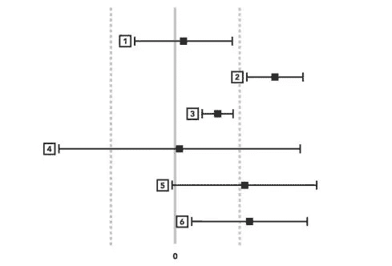

# 我阅读值得信赖的在线控制实验书的主要收获

> 原文：<https://medium.com/geekculture/my-takeaways-of-reading-trustworthy-online-controlled-experiments-book-a1a63b6b0872?source=collection_archive---------6----------------------->


Photo by [David Travis](https://unsplash.com/@dtravisphd?utm_source=medium&utm_medium=referral) on [Unsplash](https://unsplash.com?utm_source=medium&utm_medium=referral)

**目录**

```
Table of Contents
· [A step-by-step walkthrough of A/B Testing](#d619)
· [Designing The Experiment](#9dc1)
· [Getting the Data and Running The Experimentation](#2778)
· [Interpreting the Results](#830e)
· [From Results to Decisions](#b0c5)
· [Conclusion](#65a8)
· [Thank you for reading!](#7424)
```

本文包含关于 A/B 检验的内容，确保读者理解关于**控制和处理**、 **p 值、置信区间、统计显著性、实际显著性、随机化、样本和总体**的基本概念，以便获得关于 A/B 检验的概念。你可以通过看这个视频得到基本的统计数据。

实验/测试无处不在。它被初创公司和公司广泛采用，以检测项目或附加功能(无论是网站、移动应用程序等)的简单或较大变化有多好。)对现实生活/业务产生影响。在数据科学中，通过使用统计方法，实验被广泛用于预测我们的实验有多好。[在线可信对照实验](https://www.amazon.com/Trustworthy-Online-Controlled-Experiments-Practical/dp/1108724264)是我开始学习 A/B 测试/实验时就希望拥有的书。这本书通过一步一步的演练涵盖了关于 A/B 测试的所有基本概念到高级概念，例如**设计实验**、**运行实验并获取数据、解释结果并做出决策**。作者清楚地解释了实验中可能存在的陷阱和问题的解决方法。

# A/B 测试的逐步演练

# **设计实验**

做在线实验的第一步是确定我们的假设，一个实际的显著性界限，以及在运行实验之前的一些度量标准。我们应该检查用于控制和治疗的样本的随机性。我们还应该注意在进行实验时要用多大的样本。如果我们担心检测到微小的变化或对结论更有信心，我们必须考虑使用更多的样本和更低的 p 值阈值来获得更准确的结果。但是，如果我们不再关心微小的变化，我们可以减少样本来检测实际意义。

# 获取数据并进行实验

在本节中，您将获得一些与我们将要分析的实验相关的数据，例如分析应该如何使用**多个样本**、由于每个人在周末工作日有不同行为而产生的**星期效应**，以及用户在假日有不同行为的**季节性**。我们也考虑关注**首要性和新奇性效应**用户倾向于更多地使用新功能，

# **解读结果**

在解释结果时，我们应该考虑的一件事是我们的**实验将如何正确运行**并避免一些可能使实验结果无效的错误(**护栏指标)。**例如，我们可以检查可能影响控制和处理的必要检查延迟，或者期望控制和处理样本等于我们为 A/B 测试设置的配置。必须满足这些因素才能获得更好的结果，从而影响我们将要实现的指标。

# **从结果到决策**

从实验中得到一个结果并不是实验的结束。获得能够对业务产生影响的结果将是实施实验的好方法。在 A/B 测试中，好的结果如果是可重复的、可信的，就可以认为是好的。然而，有几个因素应该考虑我们是否需要在用户参与度和收入等指标之间做出权衡。如果该指标之间没有相关性，我们是否应该启动？。我们还考虑了产品的投放成本，无论是收益是否能覆盖投放成本，或者获得更多的预期收益，即使需要更多的成本来投放产品。此外，我们还考虑是否推出该产品的**统计**和**实际意义阈值**。



Statistical and Practical Significance Thresholds

上图描绘了**统计**和**实际显著性**阈值，其中两条虚线是实际显著性边界，黑框是统计显著性阈值以及**置信区间**。我们从统计学理论中知道**统计显著性阈值小于或等于 5%** 来量化我们应该拒绝零假设，并且实际显著性是基于我们想要实现的目标的条件来管理的。基于实际意义和统计意义，我们可以采取步骤选择发射或不发射。然而，我们甚至可以采取后续测试来测试我们的假设，以便根据我们的实验的一些考虑来转换实际和统计显著性界限，以获得统计功效(假设零假设为真，p 值小于(**更极端**)或等于 0.05 的条件，这意味着对照组和治疗组之间存在差异)。

# **结论**

这本书对于每一个专门从事产品分析的数据科学家来说都是必不可少的，以便通过 A/B 测试更好地覆盖我们对数据的理解。看完这本书你会得到很多启示。

看了，买了。

# 感谢您的阅读！

*真的很感谢！*🤗*如果你喜欢这个帖子并想看更多，可以考虑* [***关注我***](https://naiborhujosua.medium.com/) *。我发布与机器学习和深度学习相关的主题。我尽量让我的帖子简单而精确，总是提供可视化和模拟。*