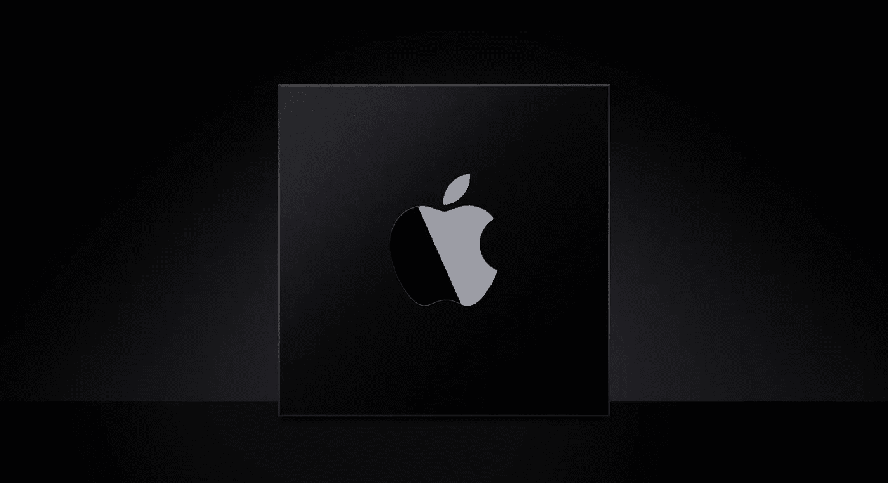

# 我的终极苹果芯片开发者设置

> 原文：<https://medium.com/geekculture/my-ultimate-apple-silicon-developer-setup-b5e4f347e5d7?source=collection_archive---------0----------------------->

## (更新)让您的新 Mac 为代码做好准备！

RIP Intel (Image from [Apple](https://developer.apple.com/documentation/apple-silicon))

一年多前，我写了一篇文章，讲述了一个人如何为编程和开发建立一台 M1 Mac 电脑。不仅在这一点上它超级过时，**而且男孩是我写得不好的**。

这本指南是那次暴行的最新翻版，尽管你仍然会发现一些相似的元素…