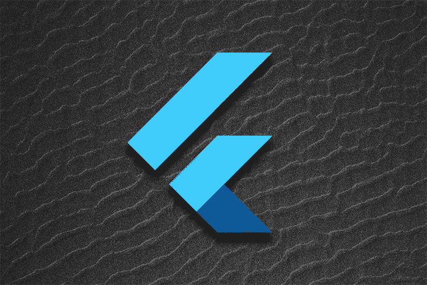
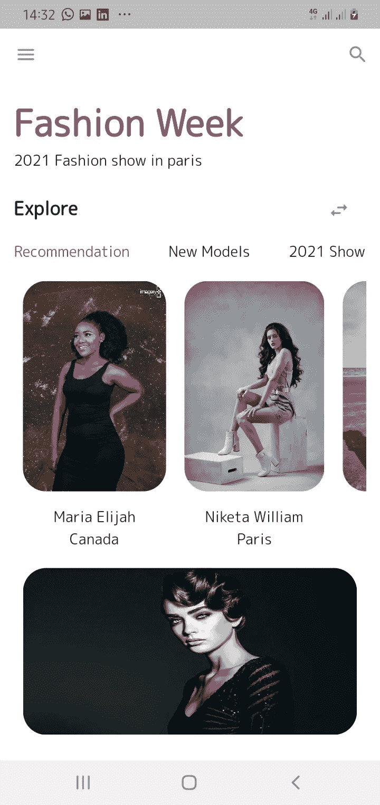
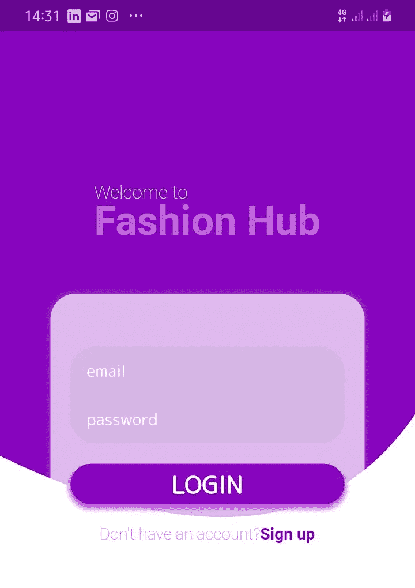

# 欢迎回到 Flutter 应用程序工作#1

> 原文：<https://medium.com/geekculture/my-welcome-back-to-flutter-app-work-1-ec26dec8e4cb?source=collection_archive---------48----------------------->



image for LogRocket.blog

> 耶！在这里分享我的扑腾之旅，我超级兴奋。我三年前开始跳 flutter。一路上，我因为一些我最清楚的原因停下来。那时候，我记得我总是在网上寻找最细微的设计工作，就像如果不在网上找，我真的不能创建一个简单的包含一堆文本或图片的容器。我的技术朋友(大哥)会说:‘小姑娘，你跳过了最基本的东西。’他是对的。一天早上，我在 IG 上看到了我们将在本文中创建的这个漂亮的 UI 设计——欢迎回到 flutter design。简而言之，我从头开始开发 UI 设计，并使用 firebase 集成身份验证。一天之内！我不敢相信，但是是的，我做到了。



UI designs

在本文中，我们将创建 UI 设计，即登录/注册页面和主页。以下是我们将涉及的主题:

1.  自定义画家
2.  弹出菜单
3.  剪辑正确
4.  列表视图。建设者

在这一点上，我假设你知道*颤动的基本知识…尽管我会尽可能多地解释这些基本知识。所以，让我们直接开始吧！*

创建一个新的颤振项目，并将其命名为。清除`main.dart`文件中的代码，删除测试文件。

在`main.dart`文件中，我们将有以下代码

```
import 'package:flutter/material.dart';
import 'package:google_fonts/google_fonts.dart';
import 'package:designapp/auth.dart';

void main() {
  runApp(DesignApp());
}

class DesignApp extends StatelessWidget {
  @override
  Widget build(BuildContext context) {
    return MaterialApp(
      title: 'Fashion Hub App',
      debugShowCheckedModeBanner: false,
      theme: ThemeData(
        textTheme: GoogleFonts.*mPlusRounded1cTextTheme*(),
        primarySwatch: Colors.*deepPurple*,
        visualDensity: VisualDensity.*adaptivePlatformDensity*,
        appBarTheme: AppBarTheme(backgroundColor: Colors.*white*),
      ),
      home: Auth(),
    );
  }
}
```

`DesignApp`启动应用程序，这是我们的根部件，返回一个`MaterialApp`。让我们继续定义`Auth`小部件，我们在`MaterialApp`的`home`属性中提到过。

在`Auth.dart`中，这是我们想要实现的设计



image depicting Auth page

步骤 1:用曲线边缘创建紫色背景

```
import 'package:flutter/cupertino.dart';
import 'package:flutter/gestures.dart';
import 'package:flutter/material.dart';

class Auth extends StatefulWidget {
  @override
  _AuthState createState() => _AuthState();
}
class _AuthState extends State<Auth> {

  @override
  Widget build(BuildContext context) {
    return Scaffold(
      body: Container(
        color: Colors.*white,* child: CustomPaint(
              painter: BackgroundPaint(),),
        ),
      ),
    );
  }
}
```

这里我们有一个脚手架，如果你是新的扑；`Scaffold`管理材料设计应用程序的组件布局。现在我们需要定义小部件`Authcontent`，这是我们`Scaffold`的`body`属性。

接下来，我们将`body`属性包装为`Container`，并将其背景设置为白色。然后我们有了以`BackgroundPaint()`为`painter`的`CustomPaint`。

`BackgroundPaint()`是我们将创建的一个自定义类，包含我们的绘图。

下面是绘图的类结构:

```
**class** BackgroundPaint **extends** CustomPainter {
 @override
 **void** paint(Canvas canvas, Size size) {
 **var** paint = Paint();
 // TODO: Set properties to paint **var** path = Path(); // TODO: Draw your path canvas.drawPath(path, paint);
 } @override
 bool shouldRepaint(CustomPainter oldDelegate) {
 **return true**;
 }
}
```

在这节课中，我们有:

1.  那个`canvas`就是我们的**板。**
2.  这是我们的**板的尺寸。**
3.  那个`paint`就是我们的**刷。**
4.  那张`path`是我们的**图。**

为了深入理解`size`变量是如何工作的，请使用下图。


explanation of size variable

我们来编辑一下上面的代码。

```
class BackgroundPaint extends CustomPainter {
  @override
  void paint(Canvas canvas, Size size) {
    // *TODO: implement paint* final height = size.height;
    final width = size.width;

    Paint paint = Paint()
      ..style = PaintingStyle.fill
      ..isAntiAlias = true
      ..color = Color(0xff8705bf);

    Path upperPath = Path();

    upperPath.moveTo(0, height * 0.55);
    upperPath.quadraticBezierTo(
        width * 0.70, height * 0.72, width, height * 0.5);

    upperPath.lineTo(width, 0);
    upperPath.lineTo(0, 0);

    canvas.drawPath(upperPath, paint);
  }

  @override
  bool shouldRepaint(covariant CustomPainter oldDelegate) => true;
}
```

在这里，我们设置我们的`paint` ( **笔刷**)属性。然后，从点 0 移动到容器高度的 55%。

接下来，在容器上画一个弯曲的形状；我们将使用`quadraticBezierTo(double x1, double y1, double x2, double y2)`的方法。然后，使用(x1，y1)作为控制点，将路径从当前点移动到给定点(x2，y2)。

最后，我们从起点到容器的宽度画一条线。

步骤 2:为登录页面创建表单

```
child: Column(
    mainAxisAlignment: MainAxisAlignment.center,
    crossAxisAlignment: CrossAxisAlignment.stretch,
    children: [
      Center(
        child: RichText(
          text: TextSpan(
            text: 'Welcome to   ',
            style: TextStyle(
              color: Colors.*white*,
              fontSize: 18,
              fontWeight: FontWeight.*w200*,
            ),
            children: [
              TextSpan(
                text: '\nFashion Hub',
                style: TextStyle(
                    color: Color(0xffbf63d8),
                    fontSize: 40,
                    fontWeight: FontWeight.*bold*,
                    height: 1),
              ),
            ],
          ),
        ),
      ),
      Padding(
        padding: const EdgeInsets.all(50.0),
        child: Container(
          decoration: BoxDecoration(
            borderRadius: BorderRadius.all(
              Radius.circular(25),
            ),
            color: Colors.*white70*,
            boxShadow: [
              BoxShadow(
                  offset: Offset.*zero*,
                  blurRadius: 2,
                  spreadRadius: 3,
                  color: Colors.*white10*),
            ],
          ),
          constraints: BoxConstraints(maxHeight: 300, maxWidth: 400),
          child: Padding(
            padding: const EdgeInsets.all(20.0),
            child: Center(
              child: Form(
                child: Column(
                  mainAxisAlignment: MainAxisAlignment.center,
                  children: [
                    TextFormField(
                      decoration: InputDecoration(
                        labelText: 'email',
                        labelStyle: TextStyle(
                            color: Colors.*white*,
                            fontSize: 16,
                            fontWeight: FontWeight.*w400*),
                        filled: true,
                        contentPadding: EdgeInsets.symmetric(
                            vertical: 0, horizontal: 16),
                        border: OutlineInputBorder(
                          borderRadius: BorderRadius.only(
                            topLeft: Radius.circular(25),
                            topRight: Radius.circular(25),
                          ),
                          borderSide: BorderSide(
                            width: 0,
                            style: BorderStyle.none,
                          ),
                        ),
                      ),
                    ),
                    TextFormField(
                      decoration: InputDecoration(
                        labelText: 'password',
                        labelStyle: TextStyle(
                            color: Colors.*white*,
                            fontSize: 16,
                            fontWeight: FontWeight.*w400*),
                        filled: true,
                        contentPadding: EdgeInsets.symmetric(
                            vertical: 0, horizontal: 16),
                        border: OutlineInputBorder(
                          borderRadius: BorderRadius.only(
                            bottomLeft: Radius.circular(25),
                            bottomRight: Radius.circular(25),
                          ),
                          borderSide: BorderSide(
                            width: 0,
                            style: BorderStyle.none,
                          ),
                        ),
                      ),
                      obscureText: true,
                    ),
                    SizedBox(
                      height: 20,
                    ),
                    GestureDetector(
                      onTap: () {},
                      child: Container(
                        height: 40,
                        decoration: BoxDecoration(
                          borderRadius: BorderRadius.all(
                            Radius.circular(25),
                          ),
                          color: Color(0xff8705bf),
                          boxShadow: [
                            BoxShadow(
                                offset: Offset(0, 3),
                                blurRadius: 3,
                                spreadRadius: 2,
                                color: Color(0xffbf63d8)),
                          ],
                        ),
                        child: Center(
                          child: Text(
                            'login'.toUpperCase(),
                            style: TextStyle(
                              fontWeight: FontWeight.*bold*,
                              fontSize: 24,
                              color: Colors.*white*,
                            ),
                          ),
                        ),
                      ),
                    ),
                    SizedBox(
                      height: 20,
                    ),
                    RichText(
                      text: TextSpan(
                        text: 'Don\'t have an account?',
                        style: TextStyle(
                            color: Color(0xffbf63d8),
                            fontSize: 16,
                            fontWeight: FontWeight.*w100*),
                        children: <TextSpan>[
                          TextSpan(
                            text: 'Sign up',
                            style: TextStyle(
                                color: Color(0xff8705bf),
                                fontSize: 16,
                                fontWeight: FontWeight.*bold*),
                            recognizer: TapGestureRecognizer()
                              ..onTap = () {},
                          ),
                        ],
                      ),
                    ),
                  ],
                ),
              ),
            ),
          ),
        ),
      ),
    ]),
```

这里，我们创建了一个包装表单的`Column`。

在`onTap()`函数中，添加以下代码以导航到`SignUp()`页面

```
Navigator.*of*(context)
    .pushReplacement(
  MaterialPageRoute(
    builder: (BuildContext
            context) =>
        SignUp(),
```

步骤 3:创建注册页面

```
child: CustomPaint(
  painter: BackgroundPaint(),
  child: Column(
      mainAxisAlignment: MainAxisAlignment.center,
      crossAxisAlignment: CrossAxisAlignment.stretch,
      children: [
        Center(
          child: RichText(
            text: TextSpan(
              text: 'Welcome to   ',
              style: TextStyle(
                color: Colors.*white*,
                fontSize: 18,
                fontWeight: FontWeight.*w200*,
              ),
              children: [
                TextSpan(
                  text: '\nFashion Hub',
                  style: TextStyle(
                      color: Color(0xffbf63d8),
                      fontSize: 40,
                      fontWeight: FontWeight.*bold*,
                      height: 1),
                ),
              ],
            ),
          ),
        ),
        Padding(
          padding: const EdgeInsets.all(50.0),
          child: Container(
            decoration: BoxDecoration(
              borderRadius: BorderRadius.all(
                Radius.circular(25),
              ),
              color: Colors.*white70*,
              boxShadow: [
                BoxShadow(
                    offset: Offset.*zero*,
                    blurRadius: 2,
                    spreadRadius: 3,
                    color: Colors.*white10*),
              ],
            ),
            constraints: BoxConstraints(maxHeight: 300, maxWidth: 400),
            child: Padding(
              padding: const EdgeInsets.all(20.0),
              child: Center(
                child: Form(
                  child: Column(
                    mainAxisAlignment: MainAxisAlignment.center,
                    children: [
                      TextFormField(
                        decoration: InputDecoration(
                          labelText: 'email',
                          labelStyle: TextStyle(
                              color: Colors.*white*,
                              fontSize: 16,
                              fontWeight: FontWeight.*w400*),
                          filled: true,
                          contentPadding: EdgeInsets.symmetric(
                              vertical: 0, horizontal: 16),
                          border: OutlineInputBorder(
                            borderRadius: BorderRadius.only(
                              topLeft: Radius.circular(25),
                              topRight: Radius.circular(25),
                            ),
                            borderSide: BorderSide(
                              width: 0,
                              style: BorderStyle.none,
                            ),
                          ),
                        ),
                      ),
                      TextFormField(
                        decoration: InputDecoration(
                          labelText: 'password',
                          labelStyle: TextStyle(
                              color: Colors.*white*,
                              fontSize: 16,
                              fontWeight: FontWeight.*w400*),
                          filled: true,
                          contentPadding: EdgeInsets.symmetric(
                              vertical: 0, horizontal: 16),
                          border: OutlineInputBorder(
                            borderRadius: BorderRadius.only(
                              bottomLeft: Radius.circular(25),
                              bottomRight: Radius.circular(25),
                            ),
                            borderSide: BorderSide(
                              width: 0,
                              style: BorderStyle.none,
                            ),
                          ),
                        ),
                        obscureText: true,
                      ),
                      SizedBox(
                        height: 20,
                      ),
                      GestureDetector(
                        onTap: () {},
                        child: Container(
                          height: 40,
                          decoration: BoxDecoration(
                            borderRadius: BorderRadius.all(
                              Radius.circular(25),
                            ),
                            color: Color(0xff8705bf),
                            boxShadow: [
                              BoxShadow(
                                  offset: Offset(0, 3),
                                  blurRadius: 3,
                                  spreadRadius: 2,
                                  color: Color(0xffbf63d8)),
                            ],
                          ),
                          child: Center(
                            child: Text(
                              'Sign Up',
                              style: TextStyle(
                                fontWeight: FontWeight.*bold*,
                                fontSize: 24,
                                color: Colors.*white*,
                              ),
                            ),
                          ),
                        ),
                      ),
                      SizedBox(
                        height: 20,
                      ),
                    ],
                  ),
                ),
              ),
            ),
          ),
        ),
      ]),
),
```

到目前为止，我们已经创建了登录/注册页面。

第四步:创建`homepage.dart`文件。

这是我们想要创造的设计。


image depicting the Home page

> 让我们开始吧！

```
import 'package:designapp/utils/recom_pics.dart';
import 'package:flutter/cupertino.dart';
import 'package:flutter/material.dart';

class HomePage extends StatefulWidget {

  @override
  _HomePageState createState() => _HomePageState();
}
class _HomePageState extends State<HomePage>
    with SingleTickerProviderStateMixin {
  int selectedIndex = 0;
  var menuList = ['Settings', 'Sign out'];

  @override
  Widget build(BuildContext context) {
    return Scaffold(
      backgroundColor: Colors.*white*,
      appBar: AppBar(
        leading: PopupMenuButton(
          elevation: 40,
          shape: RoundedRectangleBorder(
            borderRadius: BorderRadius.all(
              Radius.circular(25),
            ),
          ),
          icon: Icon(
            Icons.*menu_rounded*,
            color: Colors.*black45*,
          ),
          enabled: true,
          onSelected: (value) async {
          },
          itemBuilder: (context) => [
            PopupMenuItem(
              child: Text(
                'Settings',
                style: TextStyle(
                    color: Color(0xff8705bf),
                    fontSize: 16,
                    fontWeight: FontWeight.*w200*),
              ),
              value: 1,
            ),
            PopupMenuItem(
              child: Text(
                'Sign out',
                style: TextStyle(
                    color: Color(0xff8705bf),
                    fontSize: 16,
                    fontWeight: FontWeight.*w200*),
              ),
              value: 2,
            ),
          ],
        ),
        elevation: 0,
        actions: [
          IconButton(
            onPressed: () {},
            icon: Icon(
              Icons.*search_rounded*,
              color: Colors.*black45*,
            ),
          )
        ],
      ),
```

这里，我们为`popupMenuButton`定义一个菜单列表。然后，我们创建一个包含带有`actions`属性的`popupMenuButton`的 AppBar。

接下来，创建 body 属性并在应用程序状态中添加这个列表。

```
List<String> categoryList = ['Recommendation', 'New Models', '2021 Show'];
```

然后:

```
body: SafeArea(
  child: SingleChildScrollView(
    child: Padding(
      padding: const EdgeInsets.all(15.0),
      child: Column(
        mainAxisAlignment: MainAxisAlignment.center,
        crossAxisAlignment: CrossAxisAlignment.stretch,
        children: [
          Text(
            'Fashion Week',
            style: TextStyle(
              color: Color(0xff8705bf),
              fontWeight: FontWeight.*bold*,
              fontSize: 40,
            ),
          ),
          Text(
            '2021 Fashion show in paris',
            style: TextStyle(
              color: Colors.*black87*,
              fontWeight: FontWeight.*w100*,
              fontSize: 16,
            ),
          ),
          SizedBox(
            height: 20,
          ),
          Container(
            child: Padding(
              padding: const EdgeInsets.only(top: 10),
              child: Row(
                children: [
                  Text(
                    'Explore',
                    style: TextStyle(
                      color: Colors.*black87*,
                      fontWeight: FontWeight.*bold*,
                      fontSize: 20,
                      height: 1,
                    ),
                  ),
                  SizedBox(
                    width: 270,
                  ),
                  Icon(
                    Icons.*swap_horiz_rounded*,
                    color: Colors.*black45*,
                  ),
                ],
              ),
            ),
          ),
          SizedBox(
            height: 20,
          ),
          Row(
            mainAxisAlignment: MainAxisAlignment.spaceBetween,
            children: List.generate(
              categoryList.length,
              (index) => GestureDetector(
                onTap: () => setState(() {
                  selectedIndex = index;
                }),
                child: Text(
                  categoryList[index],
                  style: TextStyle(
                    fontSize: 16,
                    fontWeight: selectedIndex == index
                        ? FontWeight.*w400* : FontWeight.*w200*,
                    color: selectedIndex == index
                        ? Color(0xff8705bf)
                        : Colors.*black87*,
                  ),
                ),
              ),
            ),
          ),
          SizedBox(
            height: 10,
          ),
          Container(
            height: 300,
            child: ListView.builder(
              scrollDirection: Axis.horizontal,
              itemCount: mainColumn.length,
              itemBuilder: (BuildContext context, int index) {
                return Container(
                  height: 250,
                  decoration: BoxDecoration(
                    borderRadius: BorderRadius.all(
                      Radius.circular(25),
                    ),
                  ),
                  constraints: BoxConstraints(
                    maxWidth: 200,
                  ),
                  child: Column(
                    children: [
                      Expanded(
                        child: Padding(
                          padding: const EdgeInsets.all(10.0),
                          child: ClipRRect(
                            borderRadius: BorderRadius.circular(25),
                            child: Image.asset(
                              'images/' + mainColumn[index].pic,
                              fit: BoxFit.contain,
                            ),
                          ),
                        ),
                      ),
                      SizedBox(
                        height: 5,
                      ),
                      Text(
                        mainColumn[index].name,
                        style: TextStyle(
                          color: Colors.*black87*,
                          fontSize: 16,
                          fontWeight: FontWeight.*normal*,
                        ),
                      ),
                      Text(
                        mainColumn[index].place,
                        style: TextStyle(
                          color: Colors.*black87*,
                          fontSize: 16,
                          fontWeight: FontWeight.*w100*,
                        ),
                      ),
                    ],
                  ),
                );
              },
            ),
          ),
          SizedBox(
            height: 10,
          ),
          Container(
            height: 200,
            decoration: BoxDecoration(
              borderRadius: BorderRadius.all(
                Radius.circular(25),
              ),
            ),
            constraints: BoxConstraints(
              maxWidth: 100,
            ),
            child: Padding(
              padding: const EdgeInsets.all(10.0),
              child: ClipRRect(
                borderRadius: BorderRadius.circular(25),
                child: Image.asset(
                  'images/model2.jpg',
                  fit: BoxFit.fill,
                ),
              ),
            ),
          ),
        ],
      ),
    ),
  ),
),
```

下面是上述代码的分解

`List.generate`取`categoryList[]`的物品，用`GestureDetector()`包裹。在`onTap()`函数中，我们使用带有`selectedIndex`变量的`setState()`来获取索引。

接下来，`ListView.builder`帮助构建一个列表，在其中按需构建孩子的(小部件)。然而，它不是返回一个静态的小部件，而是调用一个可以多次调用的函数(基于`itemCount`)，并且每次调用都可以返回不同的小部件。

`scrollDirection: Axis.horizontal`允许我们水平滚动列表。

最后，ClipRRect 小部件用于裁剪其子部件，创建圆角矩形小部件或圆形小部件。

在下一篇文章中，我们将使用 firebase 创建认证特性。

源代码将在下一篇文章中分享。

感谢你阅读❤

