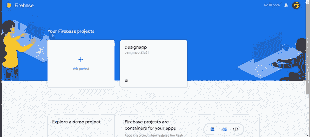
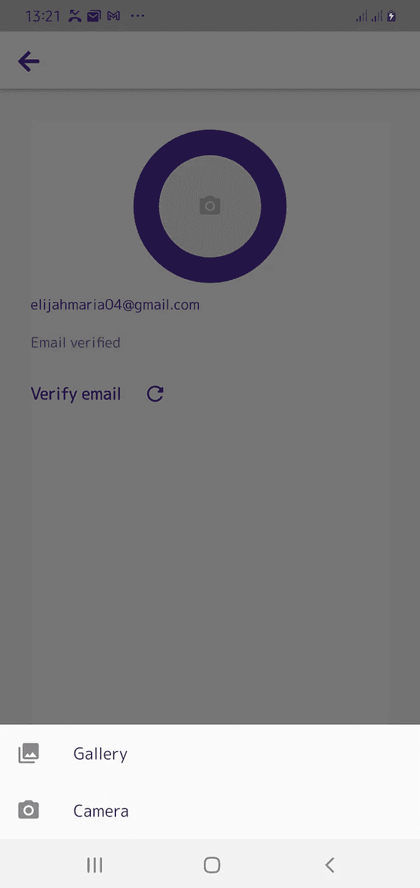
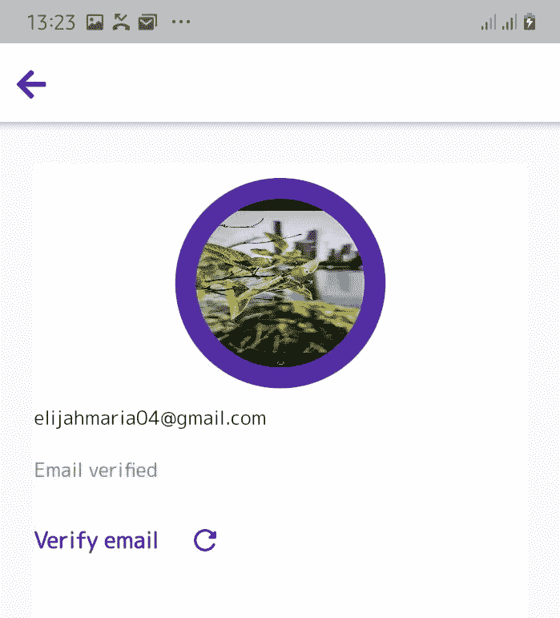

# 欢迎回到 Flutter 应用程序工作#2

> 原文：<https://medium.com/geekculture/my-welcome-back-to-flutter-app-work-2-4b851d9ecbbb?source=collection_archive---------25----------------------->


image from morioh.com

这篇文章是我之前写的关于同一主题的 [**文章**](/geekculture/my-welcome-back-to-flutter-app-work-1-ec26dec8e4cb) 的延续。如果你还没有读过，请继续读一读，这样你就可以理解这篇文章了。
无论您是开发简单的应用程序，还是构建梦想中的应用程序，身份验证都可以帮助您利用用户特定信息实现个性化体验。这也是隐私和安全的重要组成部分。

> 🤔你知道吗？
> 
> Firebase Authentication 是一种预先配置的后端服务，可以使用 SDK 轻松集成移动应用程序。您不必为身份验证过程维护任何后端基础设施。Firebase 支持与流行的身份提供商集成，如 Google、脸书、Twitter 和 GitHub。

在本文中，我们将在我们的 flutter 应用程序中集成使用 Firebase 的身份验证。

> 让我们建立火力基地。

步骤 1:创建 Firebase 项目
要将 Firebase 与 Flutter 项目集成，我们必须在控制台创建一个新的 Firebase 项目。然后，添加一个新项目，并给它起个名字(最好是你的 flutter 项目的名字)。创建完成后，您将被引导至 Firebase 项目仪表板，如下图所示。虽然，我已经添加了一个 Firebase 项目显示在图片中。



firebase dashboard

第二步:为 Android 和 iOS 设置 Firebase

要在 Android 或 iOS 上使用 Firebase，你必须为每个平台完成一些配置。请参见下面的完整配置指南:

*   [安卓安装](https://firebase.flutter.dev/docs/installation/android)
*   [iOS 安装](https://firebase.flutter.dev/docs/installation/ios)

现在我们已经有了使用 Firebase 的基本设置，让我们开始研究我们的 Flutter 应用程序。

**添加 Firebase 插件**

在您的`pubspec.yaml`中，添加以下插件:

```
firebase_core: ^1.3.0
firebase_auth: ^2.0.0
```

*   `[firebase_core](https://pub.dev/packages/firebase_core)`，在 Flutter app 中使用任何 Firebase 服务都需要它
*   `[firebase_auth](https://pub.dev/packages/firebase_auth)`访问 Firebase 认证服务

**初始化 Firebase App**

在使用 Flutter 应用中的任何 Firebase 服务之前，您需要初始化 [Firebase 应用](https://firebase.google.com/docs/reference/js/firebase.app.App)。

在`Auth.dart`中，添加该方法初始化 Firebase App:

```
Future<FirebaseApp> _initializeFirebase() async {
    FirebaseApp firebaseApp = await Firebase.initializeApp();
    return firebaseApp;
}
```

由于该方法是异步的，我们将在构建方法中使用`FutureBuilder`

```
child: Scaffold(
  body: FutureBuilder(
    future: _inializeFirebase(),
    builder: (context, snapshot) {
      if (snapshot.connectionState == ConnectionState.done) {
        return Container(
          color: Colors.*white*,
          child: CustomPaint(
            painter: BackgroundPaint(),
```

接下来，创建一个名为`authentication.dart`的新 dart 文件，并为新用户注册定义一个名为`registerUsingEmailPassword()`的新方法。

```
class Authentication {
  // For registering a new user
  static Future<User?> *registerUsingEmailPassword*({
    required String email,
    required String password,
  }) async {
    FirebaseAuth auth = FirebaseAuth.*instance*;
    User? user;

    try {
      UserCredential userCredential = await auth.createUserWithEmailAndPassword(
        email: email,
        password: password,
      );

      user = userCredential.user;
      // ignore: deprecated_member_use
      await user!.updateProfile(displayName: email);
      await user.reload();
      user = auth.currentUser;
    } on FirebaseAuthException catch (e) {
      if (e.code == 'weak-password') {
        print('The password provided is too weak.');
      } else if (e.code == 'email-already-in-use') {
        print('The account already exists for that email.');
      }
    } catch (e) {
      print(e);
    }

    return user;
  }
```

在上面的代码中，我们使用电子邮件和密码注册了一个新用户，并包含了一个条件语句来捕捉错误。

接下来，定义一个名为`signInUsingEmailPassword()`的新方法，为注册用户传递用户电子邮件和密码:

```
// For signing in an user (have already registered)
static Future<User?> *signInUsingEmailPassword*({
  required String email,
  required String password,
}) async {
  FirebaseAuth auth = FirebaseAuth.*instance*;
  User? user;

  try {
    UserCredential userCredential = await auth.signInWithEmailAndPassword(
      email: email,
      password: password,
    );
    user = userCredential.user;
  } on FirebaseAuthException catch (e) {
    if (e.code == 'user-not-found') {
      print('No user found.');
    } else if (e.code == 'wrong-password') {
      print('Wrong password');
    }
  }

  return user;
}
```

电子邮件和密码帮助生成 Firebase 提供的`User`对象。`User`对象将用于检索任何附加数据(例如，用户名、个人资料图片等。)存在那个账户里。

`signOut()`方法注销一个用户。不需要创建 signout 方法，因为它只是一行代码。

```
FirebaseAuth.instance.signOut();
```

对于电子邮件验证，我们将在`User`对象上使用`sendEmailVerification()`方法:

```
user.sendEmailVerification();
```

接下来，为表单定义一个验证器

在前一篇文章中，我们创建了一个包含两个表单字段的登录/注册页面:email 和 password。现在，我们将为每一个创建一个验证器。验证器将帮助检查用户是否在特定字段中输入了任何不适当的值，并相应地显示错误。

创建一个名为`validator.dart`的新文件，定义一个类`Validator`，并在其中指定两个方法(每个方法都将一个`String`作为参数):

```
class Validator {
  static String? *validateEmail*({required String? email}) {
    if (email == null) {
      return null;
    }

    RegExp emailRegExp = RegExp(
        r"^[a-zA-Z0-9.!#$%&'*+/=?^_`{|}~-]+@[a-zA-Z0-9](?:[a-zA-Z0-9-]{0,253}[a-zA-Z0-9])?(?:\.[a-zA-Z0-9](?:[a-zA-Z0-9-]{0,253}[a-zA-Z0-9])?)*$");

    if (email.isEmpty) {
      return 'Email can\'t be empty';
    } else if (!emailRegExp.hasMatch(email)) {
      return 'Enter a correct email';
    }

    return null;
  }

  static String? *validatePassword*({required String? password}) {
    if (password == null) {
      return null;
    }

    if (password.isEmpty) {
      return 'Password can\'t be empty';
    } else if (password.length < 6) {
      return 'Enter a password with length at least 6';
    }

    return null;
  }
}
```

在`Auth.dart`中定义一个`GlobalKey`:

```
final _formKey = GlobalKey<FormState>();
```

以下列形式指定密钥

```
child: Form(
  key: _formKey,
  child: Column(
    mainAxisAlignment: MainAxisAlignment.center,
    children: [
      TextFormField(
        controller: _emailTextController,
        // ignore: missing_return
        focusNode: _focusEmail,
        validator: (value) =>
            Validator.*validateEmail*(email: value),
        decoration: InputDecoration(
          labelText: 'email',
          labelStyle: TextStyle(
              color: Colors.*white*,
              fontSize: 16,
              fontWeight: FontWeight.*w400*),
          filled: true,
          contentPadding: EdgeInsets.symmetric(
              vertical: 0, horizontal: 16),
          border: OutlineInputBorder(
            borderRadius: BorderRadius.only(
              topLeft: Radius.circular(25),
              topRight: Radius.circular(25),
            ),
            borderSide: BorderSide(
              width: 0,
              style: BorderStyle.none,
            ),
          ),
```

我们调用了 validator 方法来检查电子邮件是否有效。我们将对密码字段进行同样的操作

```
TextFormField(
  controller: _passwordTextController,
  focusNode: _focusPassword,
  validator: (value) =>
      Validator.*validatePassword*(
          password: value),
  decoration: InputDecoration(
    labelText: 'password',
    labelStyle: TextStyle(
        color: Colors.*white*,
        fontSize: 16,
        fontWeight: FontWeight.*w400*),
    filled: true,
    contentPadding: EdgeInsets.symmetric(
        vertical: 0, horizontal: 16),
    border: OutlineInputBorder(
      borderRadius: BorderRadius.only(
        bottomLeft: Radius.circular(25),
        bottomRight: Radius.circular(25),
      ),
      borderSide: BorderSide(
        width: 0,
        style: BorderStyle.none,
      ),
    ),
  ),
  obscureText: true,
),
```

在**登录**按钮中，我们调用了`FireAuth.signInUsingEmailPassword()`来使用 Firebase 认证执行登录过程。

```
_isProcessing
    ? LoadingIndicator()
    : GestureDetector(
        onTap: () async {
          _focusEmail.unfocus();
          _focusPassword.unfocus();
          if (_formKey.currentState!
              .validate()) {
            setState(() {
              _isProcessing = true;
            });
            User? user = await Authentication
                .*signInUsingEmailPassword*(
                    email:
                        _emailTextController
                            .text,
                    password:
                        _passwordTextController
                            .text);
            setState(() {
              _isProcessing = false;
            });
            if (user != null) {
              Navigator.*of*(context)
                  .pushReplacement(
                MaterialPageRoute(
                  builder: (context) =>
                      HomePage(user: user),
                ),
              );
            }
          }
        },
        child: Container(
          height: 40,
          decoration: BoxDecoration(
            borderRadius: BorderRadius.all(
              Radius.circular(25),
            ),
            color: Color(0xff8705bf),
            boxShadow: [
              BoxShadow(
                  offset: Offset(0, 3),
                  blurRadius: 3,
                  spreadRadius: 2,
                  color: Color(0xffbf63d8)),
            ],
          ),
          child: Center(
            child: Text(
              'login'.toUpperCase(),
              style: TextStyle(
                fontWeight: FontWeight.*bold*,
                fontSize: 24,
                color: Colors.*white*,
              ),
            ),
          ),
```

注册页面也将包含一个类似于登录页面的表单。

哇！太多了。现在，我们已经成功地将 Firebase 身份验证与我们的 Flutter 应用程序集成在一起。如您所知，Firebase 身份验证不仅提供了用于轻松验证用户身份的后端基础架构，还提供了用于自动登录和电子邮件验证的预定义方法。有了 Firebase，就有了更多可以探索的东西。

还有最后一步！

我们需要创建一个配置文件设置页面来验证电子邮件，并添加一个配置文件图像。

创建一个新的 dart 文件 **profile_setting.dart**

首先，我们需要 image_picker [插件](https://pub.dev/packages/image_picker)来通过相机和照片库拾取图像。

步骤 1:将插件添加到您的`pubspec.yaml`文件中。

```
image_picker: ^0.8.2
```

步骤 2:配置本机设置

在 Android 平台上，不需要任何配置。对于 iOS，打开 IOS/Runner 文件夹下的 Info.plist 文件，并添加以下键。

```
<key>NSPhotoLibraryUsageDescription</key>
<string>Allow access to photo library</string><key>NSCameraUsageDescription</key>
<string>Allow access to camera to capture photos</string><key>NSMicrophoneUsageDescription</key>
<string>Allow access to microphone</string>
```

步骤 3:为`profile_setting.dart`创建用户界面

```
import 'dart:io';

import 'package:flutter/material.dart';
import 'package:image_picker/image_picker.dart';
import 'package:font_awesome_flutter/font_awesome_flutter.dart';

class Settings extends StatefulWidget {
 @override
  _SettingsState createState() => _SettingsState();
}

class _SettingsState extends State<Settings> {
  File? _avatarImage;

  final picker = ImagePicker();

  // create two functions to pick image from gallery/camera

// create a future function. store the result in a variable of File
// as it will return the image Path
Future pickImageFromGallery() async {
  final pickedFile = await picker.pickImage(
    source: ImageSource.gallery,
    imageQuality: 50,
  );

  setState(() {
    _avatarImage = File(pickedFile!.path);
  });
}

Future pickImageFromCamera() async {
  XFile? pickedFile = await picker.pickImage(
    source: ImageSource.camera,
    imageQuality: 50,
  );

  setState(() {
    _avatarImage = pickedFile as File;
  });
}

  @override
  Widget build(BuildContext context) {
    return Scaffold(
      appBar: AppBar(
        backgroundColor: Colors.*white*,
        leading: IconButton(
          icon: Icon(
            FontAwesomeIcons.*arrowLeft*,
            color: Color(0xff8705bf),
          ),
          onPressed: () {
            Navigator.*pop*(context);
          },
        ),
      ),
```

在类状态中，我们声明一个文件变量来保存用户选择的图像。然后，我们创建两个函数来通过相机和照片库拾取图像。

```
body: Padding(
  padding: const EdgeInsets.all(10.0),
  child: Container(
    color: Colors.*white*,
    child: Column(
      mainAxisAlignment: MainAxisAlignment.center,
      crossAxisAlignment: CrossAxisAlignment.stretch,
      children: [
        SizedBox(
          height: 100,
        ),
        Center(
          child: GestureDetector(
            onTap: () => _displayPicker(context),
            child: CircleAvatar(
              radius: 55,
              // ignore: unnecessary_null_comparison
              child: _avatarImage != null
                  ? ClipOval(
                      child: SizedBox(
                        width: 120,
                        height: 120,
                        child: Image.file(
                          _avatarImage!,
                          fit: BoxFit.fill,
                        ),
                      ),
                    )
                  : Container(
                      decoration: BoxDecoration(
                        color: Colors.*grey*.shade200,
                        borderRadius: BorderRadius.circular(50),
                      ),
                      width: 100,
                      height: 100,
                      child: Icon(
                        Icons.*camera_alt_rounded*,
                        color: Colors.*grey*.shade400,
                      ),
                    ),
            ),
          ),
        ),
```

我们创建了一个`CircleAvatar,`用`ClipOvar`包装它的孩子来剪辑图像，如果没有图片被选中，就会显示一个相机图标。

```
// create a function for displaying a bottom sheet for the user
// To choose the option of camera or gallery.
void _displayPicker(context) {
  showModalBottomSheet(
    context: context,
    builder: (BuildContext bc) {
      return SafeArea(
        child: Container(
          child: Wrap(
            children: <Widget>[
              ListTile(
                  leading: new Icon(Icons.*photo_library*),
                  title: new Text('Gallery'),
                  onTap: () {
                    pickImageFromGallery();
                    Navigator.*of*(context).pop();
                  }),
              ListTile(
                leading: new Icon(Icons.*photo_camera*),
                title: new Text('Camera'),
                onTap: () {
                  pickImageFromCamera();
                  Navigator.*of*(context).pop();
                },
              ),
            ],
          ),
        ),
      );
    },
  );
}
```

当点击`CircleAvatar`时，底部会显示一个容器，用于选择相机或图库选项。然后选择的图像显示在`CircleAvatar`中。



现在，让我们编写一些代码来验证用户电子邮件。

首先，添加以下代码。用户对象将帮助检索用户的数据。

```
final User user;
const Settings({required this.user});
```

创建一个变量 **_currentUser** ，并在 **initState()中初始化它。**

```
var _currentUser;
bool _isSendingVerification = false;

@override
void initState() {
  // *TODO: implement initState* _currentUser = widget.user;
  super.initState();
}
```

发送电子邮件验证的按钮如下:

```
Text(
  '${_currentUser.email}',
  style: Theme.*of*(context).textTheme.bodyText1,
),
SizedBox(
  height: 16,
),
_currentUser.emailVerified
    ? Text(
        'Email verified',
        style: Theme.*of*(context)
            .textTheme
            .bodyText1!
            .copyWith(color: Colors.*green*),
      )
    : Text(
        'Email not verified',
        style: Theme.*of*(context)
            .textTheme
            .bodyText1!
            .copyWith(color: Colors.*red*),
      ),
SizedBox(
  height: 16,
),
_isSendingVerification
    ? CircularProgressIndicator()
    : Row(
        mainAxisSize: MainAxisSize.min,
        children: [
          GestureDetector(
            onTap: () async {
              setState(() {
                _isSendingVerification = true;
              });
              await _currentUser.sendEmailVerification();
              setState(() {
                _isSendingVerification = false;
              });
            },
            child: Text(
              'Verify email',
              style: TextStyle(
                  color: Color(0xff8705bf),
                  fontSize: 16,
                  fontWeight: FontWeight.*bold*),
            ),
          ),
          SizedBox(
            width: 8.0,
          ),
          IconButton(
            onPressed: () async {
              User? user =
                  await Authentication.*refreshUser*(_currentUser);
              if (user != null) {
                setState(() {
                  _currentUser = user;
                });
              }
            },
            icon: Icon(
              Icons.*refresh_rounded*,
              color: Color(0xff8705bf),
            ),
          ),
        ],
      ),
```

电子邮件通过验证后，文本小部件的颜色会从红色变为绿色。

## 结论

你永远不知道你能有多好，直到你开始这样做。出错没关系，但最棒的是你能解决它。所以，继续编码吧！

在处检查项目代码[。](https://github.com/funmi-cod/fashionapp)

[https://github.com/funmi-cod/fashionapp](https://github.com/funmi-cod/fashionapp)


❤ ❤谢谢你坚持到最后。❤❤

