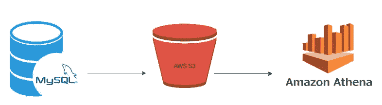

# Mysql 表到 aws S3 作为拼花文件和使用 aws 雅典娜查询

> 原文：<https://medium.com/geekculture/mysql-table-to-aws-s3-as-parquet-file-and-querying-using-aws-athena-bfaa809d2f53?source=collection_archive---------2----------------------->


Photo by [Luke Chesser](https://unsplash.com/@lukechesser?utm_source=unsplash&utm_medium=referral&utm_content=creditCopyText) on [Unsplash](https://unsplash.com/s/photos/graphs?utm_source=unsplash&utm_medium=referral&utm_content=creditCopyText)

对于分析大数据集和制作报告来说，mysql 并不是一个自然的选择，因为它的架构。由于数据在 mysql 中是以基于行的格式存储的，所以聚合和分组等常用函数在大型数据集上可能表现不佳。

像 Apache parquet([https://parquet.apache.org](https://parquet.apache.org/)/)这样的柱状存储系统来拯救我们了。但接下来的问题是，我们如何像 sql 一样使用基于文件的系统进行查询和报告。幸运的是，aws S3 和雅典娜在这种情况下非常有用。

# **架构**



figure 1: Transfer data from mysql to s3 as parquet file and build a querying engine with athena

在这里，我使用 python、sqlalchemy、pandas 和 pyarrow 来完成这项任务

我已经有了要运行的查询，因为我已经在 django rest-framework 中构建了一个元数据库类型的应用程序。现在，在查询之后，我希望将数据存储为一个 parquet 文件以供进一步处理，我没有显示查询构建器代码。

现在我有了要在下面代码中的`sql_quey`中运行的查询，引擎是 sqlalchemy 连接。

这里，organisation _ id 和 report.id 是 S3 位置的两个唯一标识符。

```
table = pa.Table.from_pandas(df,preserve_index=False)
```

上面的代码行将创建用于创建 athena 表的数据类型，但是我们仍然需要对它进行一些小的正则表达式处理来修复一些问题。

`create_athena_database`、`drop_athena_table`、`create_athena_table`的功能如下

因此，使用从查询中获得的数据类型，我们将使用`create_athena_table`函数在 athena 中创建一个表，这样 athena 就可以读取变量`s3_url`中的 parquet 文件。

与 S3 的连接是使用 sqlalchemy 完成的。如果查询发生变化，我不会修改表，而是使用 drop table 并创建一个新的表定义。