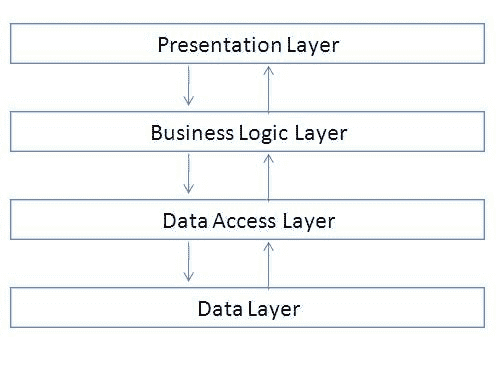
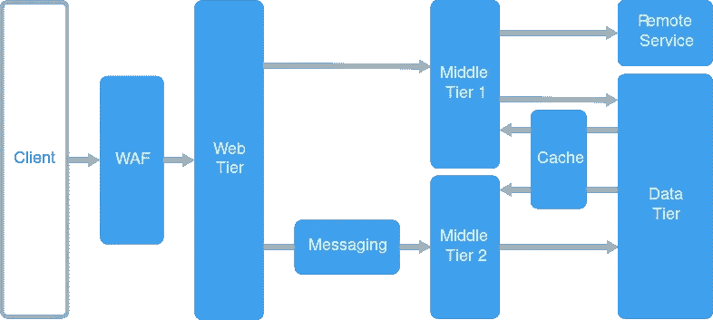
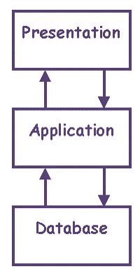
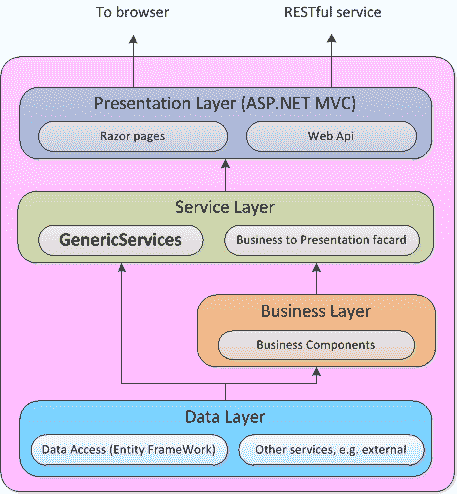

# 解释了 n 层架构

> 原文：<https://medium.com/geekculture/n-tier-architecture-explained-5d2e0246c354?source=collection_archive---------0----------------------->

Photo by [Katie Rainbow 🏳️‍🌈](https://unsplash.com/@katierainbow?utm_source=medium&utm_medium=referral) on [Unsplash](https://unsplash.com?utm_source=medium&utm_medium=referral)

在本文中，我们将探讨什么是 N 层架构，它为我们提供了什么，它与模型-视图-控制器模式有何不同，它为我们提供了什么，该架构的优点，以及它的缺点。

n 层架构也称为多层架构，因为软件处理、数据管理和表示层在逻辑和结构上是不同的。

Simple N-Tier Architecture Flow

好吧，但是你可能会问这些层给我们提供了什么？

分离各层是区分软件职责并相应管理依赖关系的一种方法。每一层都有不同的职责。虽然较高层可以使用较低层中的服务，但是，这对于其他情况是无效的，这意味着不能使用较高层中的服务。

层在逻辑上和物理上都是分离的，这是 N 层架构和 MVC(模型-视图-控制器)模式的主要区别，这意味着不同的层运行在不同的机器上(最好)。

N-Tier Architecture (Microsoft Docs)

N-tier 也叫多层或多层架构。这里的 N 代表像 2，3，4，5 这样的数字…最常见的是三层体系结构，它将表示层、逻辑层和数据层分开。

3-Tier Architecture

虽然多层架构的最广泛使用是 3 层架构，但在图书领域驱动设计中有 4 层，分别是表示层、应用层、业务层和数据访问层。

**表示层**是指 UI(用户界面)层或视图层。它可以用不同的技术构建，比如 Razor pages、Blazor，或者现代的 web 库和框架，比如 Angular、React、Vue、Svelte 等。

**应用层**也被称为服务层或 GRASP 控制器层。

**业务层**也称为业务逻辑层(BLL)或领域逻辑层。这是应用程序逻辑部分发生的地方，如计算、CRUD(创建-读取-更新-删除)操作、数据分析等。

**数据访问层**是实体所在的地方，它只是数据库的一个模型，类似于模型-视图-控制器模式。这实际上是我们称之为模型的原因，因为它是数据库的模型。

# N 层架构的优势

**可扩展性—** 您可以在不影响其他层的情况下分离各个层，然后适当地扩展每个层。

**数据完整性—** 防止了级联效应，维护变得更加容易。人们可以在不影响数据的情况下更改代码。

**可重用性—** 不同的层可以用在不同的项目中，或者在同一个项目中，你可以在不同的地方使用同一个层。例如，您可能想要为您的项目编写扩展，并且如果您想要在另一个项目中使用它们

**安全—** 您可以在不影响其他层的情况下保护这些层。

# N 层架构的缺点

**工作量的增加—** 给开发人员带来负担与其在一层或多层中编写软件，开发人员需要区分不同的层，并相应地引用其他项目(您的类库)。

**复杂性增加—** 如果想要使用 N 层架构，您必须在开始时根据 N 层逻辑构建您的项目。构建不同的层会带来复杂性，因为更多的层意味着将来要考虑更多的事情。

# 和 MVC(模型-视图-控制器)有什么区别？

在模型-视图-控制器中，项目的物理结构是抽象的，而在 n 层架构中，所有层都是可见的，并且可以按照开发人员想要的方式进行配置。模型-视图-控制器并没有给开发人员太多的自由。我不会详细讨论什么是模型-视图-控制器(那将是另一篇文章)，但是，在 MVC 中，我们使用模型、视图和控制器。

在 MVC 中，用户与控制器交互。在 N 层架构中，用户与表示层交互。在 MVC 模式中，用户看到的是视图部分。中的 cshtml 文件。NET MVC 项目。

总的来说，模型-视图-控制器是一种设计模式，N 层架构是一种定义应用程序物理结构的架构风格。

Another representation of N-Tier architecture

如果你喜欢这篇文章，想支持我读更多这样的文章，你可以给我买杯咖啡。

# **资源**

 [## 创建数据访问层

### 本系列教程将教你使用……构建一个 ASP.NET Web 窗体应用程序的基础

docs.microsoft.com](https://docs.microsoft.com/en-us/aspnet/web-forms/overview/getting-started/getting-started-with-aspnet-45-web-forms/create_the_data_access_layer)  [## 多层建筑-维基百科

### 在软件工程中，多层体系结构(通常称为 n 层体系结构)是一种客户机-服务器…

en.wikipedia.org](https://en.wikipedia.org/wiki/Multitier_architecture)  [## n 层(多层)、3 层、2 层架构及示例

### 一个 N 层应用程序是一个分布在三个或更多独立的计算机上的分布式应用程序…

www.guru99.com](https://www.guru99.com/n-tier-architecture-system-concepts-tips.html)  [## 什么是 N 层架构？-来自 Techopedia 的定义

### 多层体系结构是软件工程中的一个客户机-服务器体系结构概念，其中表示、处理…

www.techopedia.com](https://www.techopedia.com/definition/17185/n-tier-architecture)  [## 什么是 N 层架构？

### 在软件工程中，多层体系结构(通常称为 n 层体系结构)是一种客户机-服务器…

stackoverflow.com](https://stackoverflow.com/questions/312187/what-is-n-tier-architecture)  [## 什么是 N 层架构？它是如何工作的，例子，教程等等

### 伟大的产品通常是建立在多层架构之上的——或者通常所说的 n 层架构。在 Stackify…

stackify.com](https://stackify.com/n-tier-architecture/)