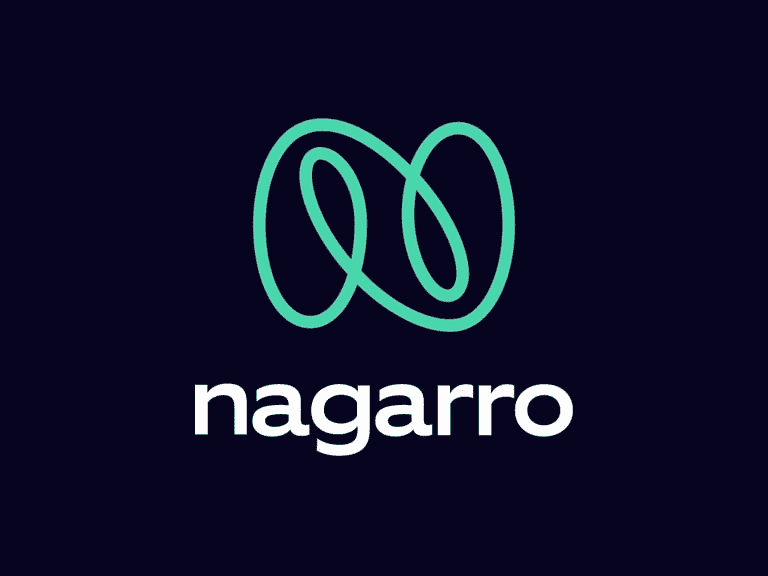

# 纳加罗面试体验 2021

> 原文：<https://medium.com/geekculture/nagarro-interview-experience-2021-82d1ebde1dc6?source=collection_archive---------1----------------------->

我最近参加了 Nagarro Gurgaon 公司助理工程师职位的面试。

整个过程很简单，我将指导您完成这个过程。由于这一流程于 2021 年 5 月开始，因此由于 COVID 的存在，所有流程都处于在线状态。

去年，我在纳加罗申请了一个类似的职位，我参加了考试，但没有通过。因此，最近一位来自纳加罗的招聘人员在我的电子邮件中向我咨询了这个职位。

基本上是 2 轮在线，2 轮面试。所以最初我被要求进行能力测试。这是第一轮在线投票。

这结合了数据结构和一般能力(主要是数量能力和语言能力)的 MCQs。这个困难很容易克服。只要稍作准备，任何人都可以轻松过关。

清算后，我收到了这一轮。我收到了下一轮在线比赛的链接。这是一轮编码。这个有三个问题。这个问题没有那么难。他们也有从容易到中等的困难。这些问题类似于以下内容。

1.  [https://www . geeks forgeeks . org/check-for-balanced-parents-in-an-expression/](https://www.geeksforgeeks.org/check-for-balanced-parentheses-in-an-expression/)

和这个类似，我只需要检查在给定的字符串中，所有的括号是否平衡。

2.[https://www . geeks forgeeks . org/program-to-find-the-n-prime-number/](https://www.geeksforgeeks.org/program-to-find-the-nth-prime-number/)

和这个问题一模一样。

3.[https://www . geeks forgeeks . org/count-derangements-permutation-so-than-no-element-appearance-in-its-original-position/](https://www.geeksforgeeks.org/count-derangements-permutation-such-that-no-element-appears-in-its-original-position/)

前两个很简单。第三个有中等难度。我能够通过所有给定的和隐藏的测试用例。

Photo by [Maranda Vandergriff](https://unsplash.com/@mkvandergriff?utm_source=medium&utm_medium=referral) on [Unsplash](https://unsplash.com?utm_source=medium&utm_medium=referral)

于是清完网上轮次，又有两次网上面试。我被要求在它们两个中打开我的网络摄像头。

他们的困难很容易。

第一次面试是技术性的，首先是一些一般性的问题，比如“告诉我一些关于你自己的情况”，“告诉我一些关于你的项目的情况”。问这些问题基本上是为了缓和气氛，让我感到舒服。主要部分是一个编码问题。

我不太记得问题了，但是很简单。我被要求共享我的屏幕并在我的本地 IDE 中编码。如果你能在面试前打开 IDE 就好了，幸运的是对我来说只花了 1 到 2 分钟，但有时会花更多的时间。这可能会很尴尬，也会减少你分配给代码的时间。每次面试的时间都是有限的，所以无论你浪费了多少时间，都会影响到你写代码的时间。所以明智地选择你说的话。不要只是开始说一个人生故事。

所以这次采访后大约两个小时。我接到招聘人员的电话，说我已经通过了第一轮面试，必须在 15 分钟后参加第二轮面试(所以要为这种情况做好准备，你可能不得不在同一天参加两个面试，没有太多时间准备)

第二轮是 HR 轮。这一轮与其说是采访，不如说是讨论。面试只是问了一些关于我和我家人的问题。并且问我最早什么时候可以加入，我现在的位置是什么之类的。这次采访大约只有 5 个龙敏。所以，如果你已经做到了这一点，请放松并保持自信。

你很有可能得到这份工作。万一你没拿到。这只是因为他们收到了比预期更多的优秀候选人。他们不可能雇佣所有人。但还是祝贺你，你是最好的候选人之一。

结果:得到了一份工作。虽然我因为一些其他原因拒绝了这份工作，但这是一次很棒的经历，Nagarro 确实是一个开始你职业生涯的好公司。

万事如意！