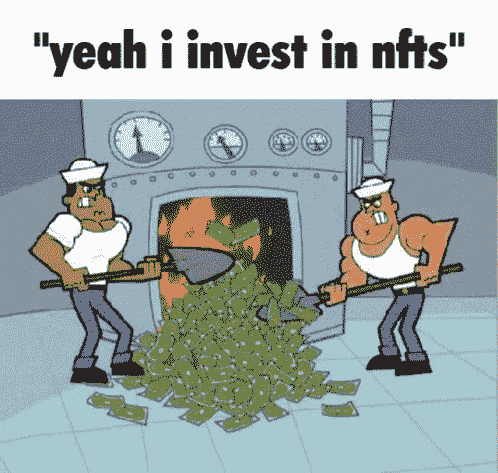

# 通过推出基础克隆产品来锁定 NFT 市场

> 原文：<https://medium.com/geekculture/nail-the-nft-market-by-launching-a-foundation-clone-80dbbaf90fa0?source=collection_archive---------17----------------------->

**Nail The NFT Market By Launching A Foundation Clone**

四年前，NFTs 引人注目地进入了数字资产的世界。你可能想知道这些 NFT 向个人保证了什么？NFTs 确保了数字资产的安全性和所有权。这就是为什么人们会蜂拥购买这些非功能性食物的原因。回顾 2021 年，它标志着 NFT 的最高销售额，并为千禧一代创造了巨额利润。作为企业家，你也可以拍拍自己，启动你诱人的 NFT 市场。克隆基金会是一个完美的解决方案，可以帮助你启动你的完美 NFT 创业。

由于 NFT 市场是 NFT 交易的脸面，他们应该满足所有的额外津贴，为用户提供无缝的体验。这篇文章旨在为你提供一些关于发展一个完美的 NFT 市场的真知灼见。

像基金会这样的 NFT 市场是怎样的？

[**基金会克隆脚本**](https://www.appdupe.com/foundation-clone) 是一个 NFT 市场，支持 NFT 的现场拍卖。此外，这是一个邻接点，创作者，买家和卖家将走到一起，抓住他们的 NFT 相关服务。像 NFT 市场这样的基础是建立在区块链技术之上的，这使得它对于持有 NFT 和交易来说是强大而安全的。该平台将收藏稀有的 NFT 藏品，创作者和用户可以有效地进行交易。

NFT 市场是创作者和用户都可以访问与 NFTs 相关的多种服务的目的地。我们一直在讨论的基础克隆是原始脚本的副本。这款 NFT 解决方案带有定制选项，您可以根据自己的想法对其进行个性化设置。

**平台式基础的功能模式**

像 NFT 平台这样的基金会为依赖 NFT 相关服务的个人提供了一个网络空间。这些人参与了一个像平台一样的基金会的运作，

**数字艺术家**

NFT 市场在三个维度上运作，从创建、令牌化、销售和购买 NFT。首先，数字艺术家将建立一个加密钱包，并将其与平台集成。然后，他们可以通过支付汽油费来继续铸造 NFT，并开始在平台上列出它们。艺术家可以决定是出售还是出价。他们可以固定他们的 NFT 的价格，并在上传文件时添加他们的描述。

**收藏家**

一旦创造者铸造了他们的 NFT，下一步就是开放交易平台。这里的 NFT 交易发生在买方和卖方之间。对于任何收藏家来说，无论是买家还是卖家，他们应该做的第一件事就是采用像 MetaMask 这样的加密钱包。对出售他们的非功能性交易感兴趣的卖家可以在平台上展示他们的非功能性交易，并为其定价。购买者将能够收到一份完整的 NFT 记录，记录了早先拥有这些 NFT 的城镇居民的所有信息。通过跟踪完整的历史，购买者可以继续购买这些非功能性食物。

**社区**

在现代术语中，社区指的是一群拥有相同兴趣和相似想法的人。像平台这样的基金会有几种参与方式。该平台应该支持建立一个对非功能性测试感兴趣的强大社区。个人可以通过 Discord、Telegram 和 Instagram 等数字文化加入该平台。然而，你必须通过在 NFTs 上发布有趣的事实和事件来让参与者保持活跃。例如，你可以更新关于即将在市场上的 NFT 下降。

**Nail The NFT Market By Launching A Foundation Clone**

**创办像 NFT 拍卖市场这样的基金会的额外津贴**

像基金会这样的 NFT 拍卖市场将为个人带来一系列好处。探索启动 NFT 拍卖市场可以带来的以下好处，

**丰富用户体验**

随着 NFT 交易成为个人喜爱的活动，他们需要一个完美的 NFT 市场。在这种情况下，当你推出自己的 NFT 市场时，人们将有机会访问你的交易平台。然而，这将增加您的 NFT 平台的网络流量，从而提高业务的知名度。

**侵蚀收入的多种方式**

NFT 市场是企业家创收的绝佳途径。通过您的 NFT 拍卖市场，您将适时地通过各种方式产生收入，如刊登费、汽油费、存储费等。随着几个成功的 NFT 下降，你将成为一个成功的市场关键人物。

**高流动性**

在推出 NFT 市场和拍卖平台的同时，他们为你的非交易市场提供高流动性，并将非交易市场外包给优秀的投资者。结果。你的 NFT 市场将获得更大的流动性。

**总结**

有什么想法来发起像 NFT 平台这样的基金会吗？抓住一个白色标签 [**基础克隆**](https://www.appdupe.com/foundation-clone) 并立即在市场上有效地推出您的 NFT 市场。联系一流的 NFT 市场开发人员来开发您自己的 NFT 市场。