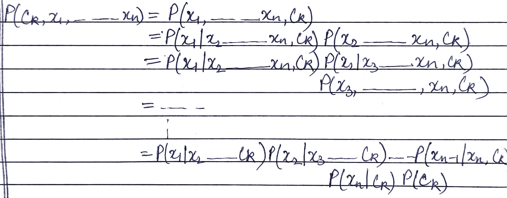
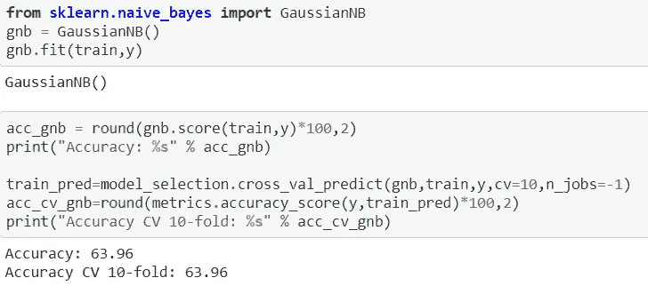

# 朴素贝叶斯

> 原文：<https://medium.com/geekculture/naive-bayes-4e21c771c260?source=collection_archive---------54----------------------->

Photo by [Riho Kroll](https://unsplash.com/@rihok?utm_source=medium&utm_medium=referral) on [Unsplash](https://unsplash.com?utm_source=medium&utm_medium=referral)

朴素贝叶斯是一种用于分类的监督机器学习算法。这是一种基于概率的技术，即返回对于特定记录具有最高概率的类。

在进一步讨论之前，让我们先看看理解朴素贝叶斯所需的概率基础。
**条件概率** 设 A 和 B 是两个随机变量那么，
**P(A|B)** 就是 A = a 时对于 B = b 的概率，这类概率称为条件概率。它被写成—

> P(A|B) = P(A∩B) / P(B)假设 P(B) ≠ 0

**独立&互斥事件** 若*P(A | B)= P(A)****P(B | A)= P(B)***两个事件被称为独立。** *若 P(A|B) = P(B|A) = 0* ，则 A 与 B 互斥。**

****贝叶斯定理****

> **P(A|B) = ( P(B|A) * P(A) )/ P(B)，P(B) ≠ 0**

**P(A|B) —后验概率
P(B|A) —似然性
P(A) —先验
P(B) —证据**

**朴素贝叶斯算法使用贝叶斯定理来计算每个类的概率。**

## **为什么叫朴素贝叶斯？**

**朴素贝叶斯之所以被称为朴素贝叶斯，是因为它基于这样一个假设:在给定类变量[(条件独立性)](https://en.wikipedia.org/wiki/Conditional_independence)的情况下，数据集中的所有要素相互独立；使用贝叶斯术语是因为它使用贝叶斯定理来计算类的概率。**

## ****概率模型和分类器****

**设 X : {x1，x2，x3，x4…………xn}，其中 n 是特征的数量
任务:-预测 x 的类。
K-可能的结果或类的数量 Ck。**

**利用贝叶斯定理，我们可以计算概率为—
P(Ck | X)=(P(Ck) * P(X|Ck))/P(X)
现在，在上面的等式中由于分母是常数，我们只对分子 P(Ck)* P(X | Ck)感兴趣。**

**我们知道，P(Ck)* P(X | Ck)= P(Ck∩X)
P(Ck∩X)也可以写成 P(Ck，X)反过来可以写成 P(Ck，x1，x2…………xn)。
P(Ck，x1，x2…………xn)被称为联合概率模型。**

**对于联合概率模型方程，我们将应用[链式规则(概率)](https://en.wikipedia.org/wiki/Chain_rule_(probability))，然后重复应用条件概率，并得到以下结果—**

****

**由于朴素贝叶斯假设特征是相互独立的，以类 Ck 为条件，人们可以说
P(xi | xi+1，……..xn，Ck) = P(xi|Ck)**

**于是，
P(Ck|X) **∝** P(Ck，x1，x2………..，xn)
P(Ck | X)**∧**P(Ck)P(x1 | Ck)…..P(xn | Ck)
P(Ck | X)**∧**P(Ck)**∏**P(Xi | CK)**

**在朴素贝叶斯中，概率最高的类将被分配给 x.
因此，**

> **y = argmax p(Ck) **∏** P(xi|Ck)，I 从 1 运行到 n，argmax 从 k = 1，2...n**

## **朴素贝叶斯及其在文本数据中的应用**

**朴素贝叶斯广泛应用于文本分类问题，如垃圾邮件检测、假新闻分类、情感分析等。
让我们看看这种工作是如何发生的。
假设给你一个文本数据文本，经过预处理(词干化、词汇化、标记化等。)看起来像:——
文本:{w1，w2，w3…………………………..wn}
我们是否可以说这里的单词可以被认为是不同的特征？是的。**

**所以，现在文本数据的朴素贝叶斯分类器可以写成—
**P(Ck | TEXT)∝P(Ck)∏P(wi | CK)****

**其中，
**P(wi | Ck)=(#带字 wi 和 Ck 类的数据点)/(#带 Ck 类的数据点)****

**但是上面的公式会在运行时产生问题。假设你有一个测试数据 Tq : { w1，w2，w6，w8，wq}
因此，P(Ck | Tq)**∝**P(Ck)* P(w1 | Ck)*……。*P(wq|Ck)**

**现在，这里的挑战是找到 P(wq|Ck)。由于 wq 在我们的训练数据中不存在，如果我们使用旧的公式，P(wq|Ck)将为 0，这会使整个方程为 0，从而导致不正确的结果。
为了避免这个问题，我们使用了**拉普拉斯平滑。****

**因此，我们关于 P(wq|Ck)的旧公式被修改为，
P(wq | Ck)=(#带 wq 和 Ck 的点数+**α**)**/**(#带 Ck 的点数+ **αK** )**

**α-超参数和 K-特征可以采用的不同值的数量。**

## **偏差-方差权衡**

**α = 0 = >高方差，过拟合
α =非常大的值= >高偏差，欠拟合**

## **不平衡数据上的朴素贝叶斯**

**如果数据不平衡，那么先验概率会受到影响，因为多数类显然具有高概率，因此会具有不公平的不适当优势。我们可以使用下面的技术来解决这个问题。对数据执行上采样或下采样，这将使得类别先验大致相同，并且它们将相互抵消。
2。去掉先验概率项。**

## **高斯朴素贝叶斯**

**它是适用于实值数据的朴素贝叶斯的变体。**

**考虑具有实值特征 F 的数据集 D:{ f1，f2，f3，f4}被分成两类+ve 和-ve。
设 xi : {xi1，xi2，xi3，xi4}为特征值。
现在，
P(yi =+ve | Xi)**∝**P(+ve)∏P(Xi |+ve)
计算 P(xij | +ve)，
1。绘制 D '中 fj 的所有值的 pdf，其中 D '包含属于+ve 类的记录。
2。从上面绘制的 pdf 中确定期望的可能性。**

**类似的过程将被重复，以获得其他类的可能性。**

**高斯朴素贝叶斯的一个假设是数字特征是正态/高斯的。**

## **朴素贝叶斯的实现**

**我们将使用具有各种特征的数据集，如 id、性别、年龄、驾照、地区代码、以前投保、车辆年龄、车辆损坏、年度保费、保单销售渠道和年份。在这里，我们必须预测这个人是否有兴趣投保。这用回答来表示，其中 0 表示否，1 表示是。
我们已经将数据预处理为训练和 y，并使用高斯朴素贝叶斯，因为这些特征是实值的。**

****

**关于这个数据集的详细工作，请参考我的工作[这里](https://github.com/guptaa98/Kaggle-Notebooks/blob/master/Learn%20ML%20insurance.ipynb)。**

**编码快乐！:)**